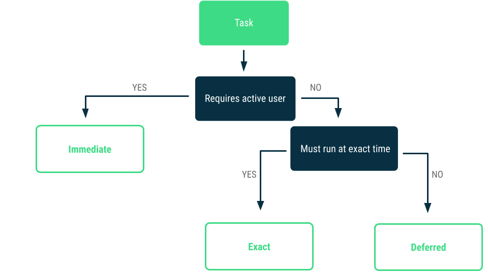
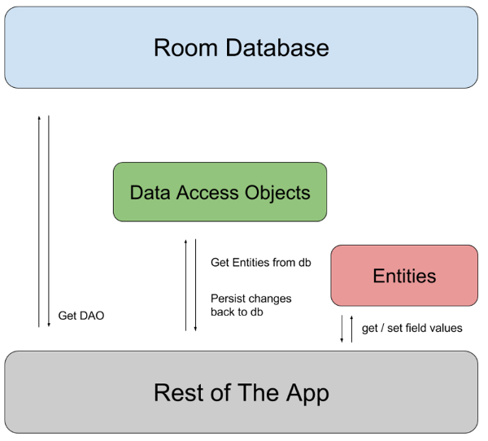
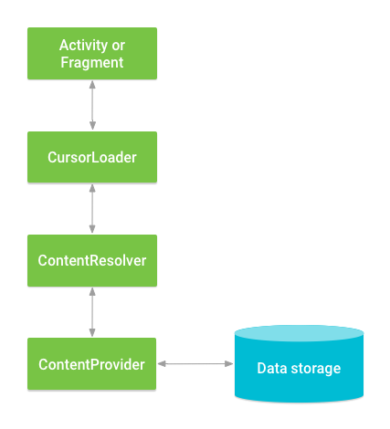
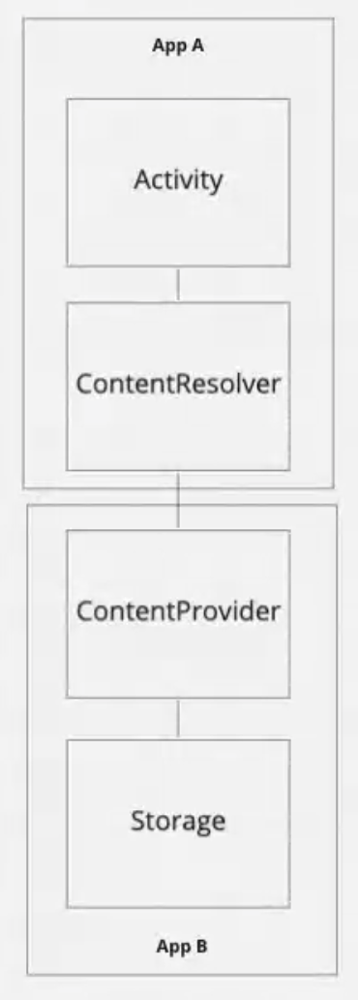

# ESA - Embedded Systems mit Android, INF-P-SE011, BE-Sa-1, FS21

- [ESA - Embedded Systems mit Android, INF-P-SE011, BE-Sa-1, FS21](#esa---embedded-systems-mit-android--inf-p-se011--be-sa-1--fs21)
  * [Lerninhalte](#lerninhalte)
    + [Folgende Themen werden bearbeitet](#folgende-themen-werden-bearbeitet)
    + [Ziele](#ziele)
    + [Projektablauf](#projektablauf)
  * [1 Einführung und Initialisierung des Projekts (~20h)](#1-einf-hrung-und-initialisierung-des-projekts---20h-)
    + [Lernziele](#lernziele)
    + [Vorbereitung](#vorbereitung)
      - [Fragen](#fragen)
        * [Wie ist es möglich mehrere Anwendungen in derselben Sandbox laufen zu lassen?](#wie-ist-es-m-glich-mehrere-anwendungen-in-derselben-sandbox-laufen-zu-lassen-)
        * [Wozu werden Zertifikate nicht verwendet?](#wozu-werden-zertifikate-nicht-verwendet-)
        * [Wozu dient die Sandbox?](#wozu-dient-die-sandbox-)
      - [Platform Architecture](#platform-architecture)
        * [The Linux Kernel](#the-linux-kernel)
        * [Hardware Abstraction Layer (HAL)](#hardware-abstraction-layer--hal-)
        * [Android Runtime](#android-runtime)
        * [Native C/C++ Libraries](#native-c-c---libraries)
        * [Java API Framework](#java-api-framework)
        * [System Apps](#system-apps)
    + [Präsenz](#pr-senz)
    + [Nachbearbeitung](#nachbearbeitung)
      - [Fragen](#fragen-1)
        * [Der Android System Stack besteht aus fünf Komponenten, welche der folgenden Aufzählung ist richtig?](#der-android-system-stack-besteht-aus-f-nf-komponenten--welche-der-folgenden-aufz-hlung-ist-richtig-)
          + [Welche der folgenden Funktionalitäten wird nicht durch den Linux-Kernel zur Verfügung gestellt?](#welche-der-folgenden-funktionalit-ten-wird-nicht-durch-den-linux-kernel-zur-verf-gung-gestellt-)
          + [Wodurch unterscheiden sich übliche Java - VM von ART (Ahead-of-time-Compiler Android Runtime)?](#wodurch-unterscheiden-sich--bliche-java---vm-von-art--ahead-of-time-compiler-android-runtime--)
      - [Application Fundamentals](#application-fundamentals)
        * [App components](#app-components)
        * [Activities](#activities)
        * [Services](#services)
        * [Broadcast receivers](#broadcast-receivers)
        * [Content providers](#content-providers)
        * [Activating components](#activating-components)
        * [The manifest file](#the-manifest-file)
        * [Declaring components](#declaring-components)
        * [Declaring component capabilities](#declaring-component-capabilities)
        * [Declaring app requirements](#declaring-app-requirements)
        * [App resources](#app-resources)
        * [Additional resources](#additional-resources)
  * [2 GUI-Prototyp und Entwürfe (~33h)](#2-gui-prototyp-und-entw-rfe---33h-)
    + [Lernziele](#lernziele-1)
    + [Vorbereitung](#vorbereitung-1)
      - [Was versteht man in Android unter dem Begriff "Ressource"?](#was-versteht-man-in-android-unter-dem-begriff--ressource--)
      - [Was bedeutet in der Zeile](#was-bedeutet-in-der-zeile)
      - [Wie werden Menüs in Android definiert?](#wie-werden-men-s-in-android-definiert-)
      - [Wofür steht das R in der folgenden Anweisung](#wof-r-steht-das-r-in-der-folgenden-anweisung)
      - [Wozu kann das Android-Manifest verwendet werden?](#wozu-kann-das-android-manifest-verwendet-werden-)
    + [Layout](#layout)
      - [Write the XML](#write-the-xml)
        * [Load the XML Resource](#load-the-xml-resource)
        * [Attributes](#attributes)
        * [Layout Parameters](#layout-parameters)
        * [Layout Position](#layout-position)
        * [Size, Padding and Margins](#size--padding-and-margins)
        * [Common Layouts](#common-layouts)
        * [Building Layouts with an Adapter](#building-layouts-with-an-adapter)
        * [Filling an adapter view with data](#filling-an-adapter-view-with-data)
        * [Handling click events](#handling-click-events)
      - [Introduction to Activities](#introduction-to-activities)
        * [The concept of activities](#the-concept-of-activities)
        * [Configuring the manifest](#configuring-the-manifest)
          + [Declare activities](#declare-activities)
          + [Declare intent filters](#declare-intent-filters)
          + [Declare permissions](#declare-permissions)
        * [Managing the activity lifecycle](#managing-the-activity-lifecycle)
          + [onCreate()](#oncreate--)
          + [onStart()](#onstart--)
          + [onResume()](#onresume--)
          + [onPause()](#onpause--)
          + [onStop()](#onstop--)
          + [onRestart()](#onrestart--)
          + [onDestroy()](#ondestroy--)
        * [Instance state](#instance-state)
          + [Save simple, lightweight UI state using onSaveInstanceState()](#save-simple--lightweight-ui-state-using-onsaveinstancestate--)
          + [Restore activity UI state using saved instance state](#restore-activity-ui-state-using-saved-instance-state)
      - [Understand Tasks and Back Stack](#understand-tasks-and-back-stack)
        * [Managing Tasks](#managing-tasks)
        * [Defining launch modes](#defining-launch-modes)
          + [Using the manifest file](#using-the-manifest-file)
          + [Using Intent flags](#using-intent-flags)
        * [Handling affinities](#handling-affinities)
        * [Clearing the back stack](#clearing-the-back-stack)
        * [Starting a task](#starting-a-task)
        * [More resources](#more-resources)
          + [Android Design: Navigation](#android-design--navigation)
          + [\<activity> manifest element](#--activity--manifest-element)
          + [Recents Screen](#recents-screen)
          + [Multitasking the Android Way](#multitasking-the-android-way)
      - [Start another activity](#start-another-activity)
        * [Respond to the Send button](#respond-to-the-send-button)
        * [Build an intent](#build-an-intent)
        * [Create the second activity](#create-the-second-activity)
        * [Add a text view](#add-a-text-view)
        * [Display the message](#display-the-message)
        * [Add upward navigation](#add-upward-navigation)
        * [Run the app](#run-the-app)
      - [Intents and Intent Filters](#intents-and-intent-filters)
        * [Intent types](#intent-types)
        * [Building an intent](#building-an-intent)
          + [Component name](#component-name)
          + [Action](#action)
          + [Data](#data)
          + [Category](#category)
          + [Extras](#extras)
          + [Flags](#flags)
        * [Example explicit intent](#example-explicit-intent)
        * [Example implicit intent](#example-implicit-intent)
        * [Forcing an app chooser](#forcing-an-app-chooser)
        * [Receiving an implicit intent](#receiving-an-implicit-intent)
          + [Example filters](#example-filters)
        * [Using a pending intent](#using-a-pending-intent)
        * [Intent resolution](#intent-resolution)
          + [Action test](#action-test)
          + [Category test](#category-test)
          + [Data test](#data-test)
        * [Intent matching](#intent-matching)
    + [Präsenz](#pr-senz-1)
    + [Nachbearbeitung](#nachbearbeitung-1)
  * [3 Systemarchitektur (~33h)](#3-systemarchitektur---33h-)
    + [Lernziele](#lernziele-2)
    + [Vorbereitung](#vorbereitung-2)
      - [Processes and Application Lifecycle](#processes-and-application-lifecycle)
      - [Understand the Activity Lifecycle](#understand-the-activity-lifecycle)
      - [Activity-lifecycle concepts](#activity-lifecycle-concepts)
      - [Lifecycle callbacks](#lifecycle-callbacks)
        * [onCreate()](#oncreate---1)
        * [onStart()](#onstart---1)
        * [onResume()](#onresume---1)
        * [onPause()](#onpause---1)
        * [onStop()](#onstop---1)
        * [onDestroy()](#ondestroy---1)
      - [Activity state and ejection from memory](#activity-state-and-ejection-from-memory)
      - [Saving and restoring transient UI state](#saving-and-restoring-transient-ui-state)
        * [Instance state](#instance-state-1)
        * [Save simple, lightweight UI state using onSaveInstanceState()](#save-simple--lightweight-ui-state-using-onsaveinstancestate---1)
        * [Restore activity UI state using saved instance state](#restore-activity-ui-state-using-saved-instance-state-1)
      - [Navigating between activities](#navigating-between-activities)
        * [Starting one activity from another](#starting-one-activity-from-another)
          + [startActivity()](#startactivity--)
          + [startActivityForResult()](#startactivityforresult--)
        * [Coordinating activities](#coordinating-activities)
      - [Handling Lifecycles with Lifecycle-Aware Components](#handling-lifecycles-with-lifecycle-aware-components)
        * [Lifecycle](#lifecycle)
          + [Event](#event)
          + [State](#state)
        * [LifecycleOwner](#lifecycleowner)
          + [Implementing a custom LifecycleOwner](#implementing-a-custom-lifecycleowner)
        * [Best practices for lifecycle-aware components](#best-practices-for-lifecycle-aware-components)
        * [Use cases for lifecycle-aware components](#use-cases-for-lifecycle-aware-components)
        * [Handling on stop events](#handling-on-stop-events)
      - [Guide to background processing](#guide-to-background-processing)
        * [Guiding principle](#guiding-principle)
        * [Definition of background work](#definition-of-background-work)
          + [Common background tasks](#common-background-tasks)
        * [Categories of background tasks](#categories-of-background-tasks)
        * [Recommended solutions](#recommended-solutions)
          + [Immediate tasks](#immediate-tasks)
          + [Deferred tasks](#deferred-tasks)
          + [Exact tasks](#exact-tasks)
      - [Running Android tasks in background threads](#running-android-tasks-in-background-threads)
        * [Examples overview](#examples-overview)
        * [Creating multiple threads](#creating-multiple-threads)
        * [Executing in a background thread](#executing-in-a-background-thread)
          + [Considerations](#considerations)
        * [Communicating with the main thread](#communicating-with-the-main-thread)
        * [Using handlers](#using-handlers)
        * [Configuring a thread pool](#configuring-a-thread-pool)
        * [Concurrency libraries](#concurrency-libraries)
      - [Services overview](#services-overview)
        * [Types of Services](#types-of-services)
          + [Foreground](#foreground)
          + [Background](#background)
          + [Bound](#bound)
        * [Choosing between a service and a thread](#choosing-between-a-service-and-a-thread)
        * [The basics](#the-basics)
          + [onStartCommand()](#onstartcommand--)
          + [onBind()](#onbind--)
          + [onCreate()](#oncreate---2)
          + [onDestroy()](#ondestroy---2)
          + [Declaring a service in the manifest](#declaring-a-service-in-the-manifest)
        * [Creating a started service](#creating-a-started-service)
          + [Extending the Service class](#extending-the-service-class)
          + [START_NOT_STICKY](#start-not-sticky)
          + [START_STICKY](#start-sticky)
          + [START_REDELIVER_INTENT](#start-redeliver-intent)
          + [Starting a service](#starting-a-service)
          + [Stopping a service](#stopping-a-service)
        * [Creating a bound service](#creating-a-bound-service)
        * [Sending notifications to the user](#sending-notifications-to-the-user)
        * [Managing the lifecycle of a service](#managing-the-lifecycle-of-a-service)
          + [Implementing the lifecycle callbacks](#implementing-the-lifecycle-callbacks)
      - [Broadcasts overview](#broadcasts-overview)
        * [About system broadcasts](#about-system-broadcasts)
          + [Changes to system broadcasts](#changes-to-system-broadcasts)
          + [Android 9](#android-9)
          + [Android 8.0](#android-80)
          + [Android 7.0](#android-70)
        * [Receiving broadcasts](#receiving-broadcasts)
          + [Manifest-declared receivers](#manifest-declared-receivers)
          + [Context-registered receivers](#context-registered-receivers)
          + [Effects on process state](#effects-on-process-state)
        * [Sending broadcasts](#sending-broadcasts)
        * [Restricting broadcasts with permissions](#restricting-broadcasts-with-permissions)
          + [Sending with permissions](#sending-with-permissions)
          + [Receiving with permissions](#receiving-with-permissions)
        * [Security considerations and best practices](#security-considerations-and-best-practices)
      - [Sensors Overview](#sensors-overview)
        * [Introduction to Sensors](#introduction-to-sensors)
        * [Sensor Framework](#sensor-framework)
          + [SensorManager](#sensormanager)
          + [Sensor](#sensor)
          + [SensorEvent](#sensorevent)
          + [SensorEventListener](#sensoreventlistener)
          + [Sensor Availability](#sensor-availability)
        * [Identifying Sensors and Sensor Capabilities](#identifying-sensors-and-sensor-capabilities)
        * [Monitoring Sensor Events](#monitoring-sensor-events)
        * [Handling Different Sensor Configurations](#handling-different-sensor-configurations)
          + [Detecting sensors at runtime](#detecting-sensors-at-runtime)
        * [Sensor Coordinate System](#sensor-coordinate-system)
        * [Best Practices for Accessing and Using Sensors](#best-practices-for-accessing-and-using-sensors)
          + [Only gather sensor data in the foreground](#only-gather-sensor-data-in-the-foreground)
          + [Unregister sensor listeners](#unregister-sensor-listeners)
          + [Test with the Android Emulator](#test-with-the-android-emulator)
          + [Don't block the onSensorChanged() method](#don-t-block-the-onsensorchanged---method)
          + [Avoid using deprecated methods or sensor types](#avoid-using-deprecated-methods-or-sensor-types)
          + [Verify sensors before you use them](#verify-sensors-before-you-use-them)
          + [Choose sensor delays carefully](#choose-sensor-delays-carefully)
      - [Motion sensors](#motion-sensors)
        * [Android Open Source Project sensors](#android-open-source-project-sensors)
        * [Use the gravity sensor](#use-the-gravity-sensor)
        * [Use the linear accelerometer](#use-the-linear-accelerometer)
        * [Use the rotation vector sensor](#use-the-rotation-vector-sensor)
        * [Use the significant motion sensor](#use-the-significant-motion-sensor)
        * [Use the step counter sensor](#use-the-step-counter-sensor)
        * [Use the step detector sensor](#use-the-step-detector-sensor)
        * [Work with raw data](#work-with-raw-data)
      - [Use the accelerometer](#use-the-accelerometer)
          + [Use the gyroscope](#use-the-gyroscope)
          + [Use the uncalibrated gyroscope](#use-the-uncalibrated-gyroscope)
      - [Position sensors](#position-sensors)
        * [Use the game rotation vector sensor](#use-the-game-rotation-vector-sensor)
        * [Use the geomagnetic rotation vector sensor](#use-the-geomagnetic-rotation-vector-sensor)
        * [Compute the device's orientation](#compute-the-device-s-orientation)
        * [Use the geomagnetic field sensor](#use-the-geomagnetic-field-sensor)
        * [Use the uncalibrated magnetometer](#use-the-uncalibrated-magnetometer)
        * [Use the proximity sensor](#use-the-proximity-sensor)
    + [Präsenz](#pr-senz-2)
      - [Background Processing](#background-processing)
      - [Threads, Handler und looper](#threads--handler-und-looper)
    + [Nachbearbeitung](#nachbearbeitung-2)
  * [4 Persistenz (~33h)](#4-persistenz---33h-)
    + [Lernziele](#lernziele-3)
    + [Vorbereitung](#vorbereitung-3)
      - [Save key-value](#save-key-value)
        * [Get a handle to shared preferences](#get-a-handle-to-shared-preferences)
        * [Write to shared preferences](#write-to-shared-preferences)
        * [Read from shared preferences](#read-from-shared-preferences)
      - [Save data in a local database using Room](#save-data-in-a-local-database-using-room)
        * [Setup](#setup)
        * [Primary components](#primary-components)
        * [Sample implementation](#sample-implementation)
          + [Data entity](#data-entity)
          + [Data access object (DAO)](#data-access-object--dao-)
          + [Database](#database)
        * [Data and file storage overview](#data-and-file-storage-overview)
          + [How much space does your data require?](#how-much-space-does-your-data-require-)
          + [How reliable does data access need to be?](#how-reliable-does-data-access-need-to-be-)
          + [What kind of data do you need to store?](#what-kind-of-data-do-you-need-to-store-)
          + [Should the data be private to your app?](#should-the-data-be-private-to-your-app-)
          + [Categories of storage locations](#categories-of-storage-locations)
        * [Permissions and access to external storage](#permissions-and-access-to-external-storage)
          + [Scoped storage](#scoped-storage)
      - [Content providers](#content-providers-1)
        * [Advantages of content providers](#advantages-of-content-providers)
          + [Content provider basics](#content-provider-basics)
          + [Creating a content provider](#creating-a-content-provider)
          + [Calendar provider](#calendar-provider)
          + [Contacts provider](#contacts-provider)
      - [Content provider basics](#content-provider-basics-1)
        * [Overview](#overview)
          + [Accessing a provider](#accessing-a-provider)
        * [Retrieving data from the provider](#retrieving-data-from-the-provider)
          + [Requesting read access permission](#requesting-read-access-permission)
          + [Constructing the query](#constructing-the-query)
          + [Protecting against malicious input](#protecting-against-malicious-input)
        * [Displaying query results](#displaying-query-results)
        * [Getting data from query results](#getting-data-from-query-results)
        * [Content provider permissions](#content-provider-permissions)
        * [Inserting, updating, and deleting data](#inserting--updating--and-deleting-data)
          + [Inserting data](#inserting-data)
          + [Updating data](#updating-data)
          + [Deleting data](#deleting-data)
        * [Provider Data Types](#provider-data-types)
        * [Alternative forms of provider access](#alternative-forms-of-provider-access)
          + [Batch access](#batch-access)
          + [Data access via intents](#data-access-via-intents)
          + [Using another application](#using-another-application)
          + [Displaying data using a helper app](#displaying-data-using-a-helper-app)
        * [Contract Classes](#contract-classes)
        * [MIME Type Reference](#mime-type-reference)
      - [Creating a content provider](#creating-a-content-provider-1)
        * [Before you start building](#before-you-start-building)
        * [Designing data storage](#designing-data-storage)
          + [Data design considerations](#data-design-considerations)
        * [Designing content URIs](#designing-content-uris)
          + [Designing an authority](#designing-an-authority)
          + [Designing a path structure](#designing-a-path-structure)
          + [Handling content URI IDs](#handling-content-uri-ids)
          + [Content URI patterns](#content-uri-patterns)
        * [Implementing the ContentProvider class](#implementing-the-contentprovider-class)
          + [Required methods](#required-methods)
          + [Implementing the query() method](#implementing-the-query---method)
          + [Implementing the insert() method](#implementing-the-insert---method)
          + [Implementing the delete() method](#implementing-the-delete---method)
          + [Implementing the update() method](#implementing-the-update---method)
          + [Implementing the onCreate() method](#implementing-the-oncreate---method)
        * [Implementing ContentProvider MIME Types](#implementing-contentprovider-mime-types)
          + [MIME types for tables](#mime-types-for-tables)
          + [MIME types for files](#mime-types-for-files)
        * [Implementing a contract class](#implementing-a-contract-class)
        * [Implementing content provider permissions](#implementing-content-provider-permissions)
          + [Implementing permissions](#implementing-permissions)
        * [The \<provider> element](#the---provider--element)
        * [Intents and data access](#intents-and-data-access)
      - [User location](#user-location)
        * [Get the last known location](#get-the-last-known-location)
        * [Set up Google Play services](#set-up-google-play-services)
        * [Specify app permissions](#specify-app-permissions)
        * [Create location services client](#create-location-services-client)
        * [Get the last known location](#get-the-last-known-location-1)
        * [Maintain a current best estimate](#maintain-a-current-best-estimate)
      - [Performance tips](#performance-tips)
        * [Avoid creating unnecessary objects](#avoid-creating-unnecessary-objects)
        * [Prefer static over virtual](#prefer-static-over-virtual)
        * [Use static final for constants](#use-static-final-for-constants)
        * [Use enhanced for loop syntax](#use-enhanced-for-loop-syntax)
        * [Consider package instead of private access with private inner classes](#consider-package-instead-of-private-access-with-private-inner-classes)
        * [Avoid using floating-point](#avoid-using-floating-point)
        * [Know and use the libraries](#know-and-use-the-libraries)
        * [Use native methods carefully](#use-native-methods-carefully)
        * [Performance myths](#performance-myths)
        * [Always measure](#always-measure)
      - [Background optimizations](#background-optimizations)
        * [User-initiated restrictions](#user-initiated-restrictions)
        * [Restrictions on receiving network activity broadcasts](#restrictions-on-receiving-network-activity-broadcasts)
          + [Schedule network jobs on unmetered connections](#schedule-network-jobs-on-unmetered-connections)
          + [Monitor network connectivity while the app is running](#monitor-network-connectivity-while-the-app-is-running)
        * [Restrictions on receiving image and video broadcasts](#restrictions-on-receiving-image-and-video-broadcasts)
          + [Trigger jobs on content URI changes](#trigger-jobs-on-content-uri-changes)
          + [Determine which content authorities triggered a job](#determine-which-content-authorities-triggered-a-job)
        * [Further optimize your app](#further-optimize-your-app)
      - [Optimize for battery life](#optimize-for-battery-life)
        * [Lazy First](#lazy-first)
        * [Platform features](#platform-features)
        * [Tooling](#tooling)
    + [Präsenz](#pr-senz-3)
    + [Nachbearbeitung](#nachbearbeitung-3)
  * [5 Projektabschluss und Netzwerkanbindung (~31h)](#5-projektabschluss-und-netzwerkanbindung---31h-)
    + [Lernziele](#lernziele-4)
    + [Vorbereitung](#vorbereitung-4)
      - [Perform network operations overview](#perform-network-operations-overview)
        * [Lessons](#lessons)
      - [Connect to the networkbookmark_border](#connect-to-the-networkbookmark-border)
        * [Best practices for secure network communication](#best-practices-for-secure-network-communication)
        * [Choose an HTTP client](#choose-an-http-client)
        * [Resolve DNS queries](#resolve-dns-queries)
        * [Encapsulate network operations with a repository](#encapsulate-network-operations-with-a-repository)
        * [Survive configuration changes](#survive-configuration-changes)
      - [Manage network usage](#manage-network-usage)
        * [Check a device's network connection](#check-a-device-s-network-connection)
        * [Manage network usage](#manage-network-usage-1)
        * [Implement a preference activity](#implement-a-preference-activity)
        * [Respond to preference changes](#respond-to-preference-changes)
        * [Detect connection changes](#detect-connection-changes)
      - [Reading network state](#reading-network-state)
        * [Getting instantaneous state](#getting-instantaneous-state)
        * [NetworkCapabilities and LinkProperties](#networkcapabilities-and-linkproperties)
        * [Listening to network events](#listening-to-network-events)
        * [Additional networks](#additional-networks)
        * [An example](#an-example)
        * [Restrictions on the use of the network for data transfer](#restrictions-on-the-use-of-the-network-for-data-transfer)
      - [Optimize network data usage](#optimize-network-data-usage)
        * [Check data saver preferences](#check-data-saver-preferences)
        * [Request data restriction permissions](#request-data-restriction-permissions)
        * [Monitor changes to data saver preferences](#monitor-changes-to-data-saver-preferences)
        * [Test with Android Debug Bridge commands](#test-with-android-debug-bridge-commands)
      - [Parse XML data](#parse-xml-data)
        * [Choose a parser](#choose-a-parser)
        * [Analyze the feed](#analyze-the-feed)
        * [Instantiate the parser](#instantiate-the-parser)
        * [Read the feed](#read-the-feed)
        * [Parse XML](#parse-xml)
        * [Skip tags you don't care about](#skip-tags-you-don-t-care-about)
        * [Consume XML data](#consume-xml-data)
      - [Test your app](#test-your-app)
        * [Test types and location](#test-types-and-location)
          + [Local unit tests](#local-unit-tests)
          + [Instrumented tests](#instrumented-tests)
        * [Add a new test](#add-a-new-test)
          + [Resolve conflicts between the app and test APK](#resolve-conflicts-between-the-app-and-test-apk)
          + [Create instrumented test for a build variant](#create-instrumented-test-for-a-build-variant)
          + [Configure instrumentation manifest settings](#configure-instrumentation-manifest-settings)
          + [Change the test build type](#change-the-test-build-type)
          + [Configure Gradle test options](#configure-gradle-test-options)
          + [Use separate test modules for instrumented tests](#use-separate-test-modules-for-instrumented-tests)
        * [Run a test](#run-a-test)
          + [View test coverage](#view-test-coverage)
        * [View the test results](#view-the-test-results)
          + [View inline statistics](#view-inline-statistics)
          + [Compare strings](#compare-strings)
          + [Export test results](#export-test-results)
          + [Import test results](#import-test-results)
      - [Create UI tests with Espresso Test Recorder](#create-ui-tests-with-espresso-test-recorder)
        * [Turn off animations on your test device](#turn-off-animations-on-your-test-device)
        * [Record an Espresso test](#record-an-espresso-test)
        * [Record UI interactions](#record-ui-interactions)
        * [Add assertions to verify UI elements](#add-assertions-to-verify-ui-elements)
        * [Save a recording](#save-a-recording)
        * [Run an Espresso test locally](#run-an-espresso-test-locally)
        * [Run an Espresso test with Firebase Test Lab for Android](#run-an-espresso-test-with-firebase-test-lab-for-android)
      - [Test your app's activities](#test-your-app-s-activities)
        * [Drive an activity's state](#drive-an-activity-s-state)
          + [Create an activity](#create-an-activity)
          + [Drive the activity to a new state](#drive-the-activity-to-a-new-state)
          + [Determine the current activity state](#determine-the-current-activity-state)
          + [Recreate the activity](#recreate-the-activity)
          + [Retrieve activity results](#retrieve-activity-results)
          + [Trigger actions in the activity](#trigger-actions-in-the-activity)
      - [Publish your app](#publish-your-app)
        * [Preparing your app for release](#preparing-your-app-for-release)
        * [Releasing your app to users](#releasing-your-app-to-users)
        * [Releasing through an app marketplace](#releasing-through-an-app-marketplace)
        * [Releasing your apps on Google Play](#releasing-your-apps-on-google-play)
        * [Releasing through a website](#releasing-through-a-website)
        * [User opt-in for unknown apps and sources](#user-opt-in-for-unknown-apps-and-sources)
          + [Install unknown apps](#install-unknown-apps)
          + [Unknown sources](#unknown-sources)
      - [Prepare for release](#prepare-for-release)
        * [Introduction](#introduction)
        * [Gathering materials and resources](#gathering-materials-and-resources)
          + [Cryptographic keys](#cryptographic-keys)
          + [Application icon](#application-icon)
          + [End-user license agreement](#end-user-license-agreement)
          + [Miscellaneous materials](#miscellaneous-materials)
        * [Configuring Your application for release](#configuring-your-application-for-release)
          + [Choose a good package name](#choose-a-good-package-name)
          + [Turn off logging and debugging](#turn-off-logging-and-debugging)
          + [Clean up your project directories](#clean-up-your-project-directories)
          + [Review and update your manifest and Gradle build settings](#review-and-update-your-manifest-and-gradle-build-settings)
          + [Address compatibility issues](#address-compatibility-issues)
          + [Update URLs for servers and services](#update-urls-for-servers-and-services)
          + [Implement licensing (if you are releasing on Google Play)](#implement-licensing--if-you-are-releasing-on-google-play-)
        * [Building Your application for release](#building-your-application-for-release)
          + [Building with Android Studio](#building-with-android-studio)
        * [Preparing external servers and resources](#preparing-external-servers-and-resources)
        * [Testing your application for release](#testing-your-application-for-release)
      - [Upload your app to the Play Console](#upload-your-app-to-the-play-console)
        * [Inspect APKs using bundle explorer](#inspect-apks-using-bundle-explorer)
        * [Test using the internal test track](#test-using-the-internal-test-track)
        * [Update your app bundle](#update-your-app-bundle)
    + [Präsenz](#pr-senz-4)
    + [Nachbearbeitung](#nachbearbeitung-4)


## Lerninhalte

Der Schwerpunkt des Moduls Embedded Systems mit Android liegt auf der Verbindung von Hard- und Soft- ware: Programmierbare Systeme bestehen immer aus Hard- und Software. Wir zeigen, wie die Programme die einzelnen Hardwarekomponenten nutzen können und welchen Einfluss dabei das Betriebssystem hat.
Ausserdem erarbeiten wir uns, dass Software auf mehrere Rechner verteilt sein kann, und wie verteilte Sys- teme zusammenarbeiten.

Der Unterricht basiert auf einem Demoprojekt und einer Semesterarbeit, welche schrittweise entwickelt wer- den. Die einzelnen Iterationen laufen wie folgt ab:

- Anhand des Demoprojekts werden die neuen Themen und Inhalte erarbeitet, Entwürfe und Ver- suche als Vorbereitung erstellt.
- Im Präsenzunterricht werden die behandelten Themen anhand des Demoprojekts diskutiert und vertieft.
- Im zweiten Teil der Präsenz (letzte Lektion) und als Nachbereitung werden die Themen mit einer Semesterarbeit umgesetzt. (Gruppenarbeit).
- Review und Feedback erfolgen via GitHub und Moodle oder in der folgenden Präsenzveranstal- tung.

Als System setzen wir ein Android-basierendes Gerät ein, sowie die Entwicklungsumgebung (Android-SDK) inkl. Emulator und Debugger von Android.

### Folgende Themen werden bearbeitet

- Eingebettete Systeme (am Beispiel Mobiler Computer, Mobilefons, Wearables, Things...) o Betriebssystem Android (Architektur, Bibliotheken, Frameworks...)
- Entwicklungsumgebung (Emulator, Debugger...)
- GUI-Design (Bedienkonzepte)
- Software-Architektur (Konzepte, Strukturen, Persistenz, Komponenten, Interaktionen...) o Es wird eine Applikation (Semesterarbeit) in vier

Iterationen bearbeitet:

- Oberflächenprototyp (Iterationen 1 und 2)
- Architektur (Realisieren der UI- und Hintergrundprozesse) (Iteration 3)
- Datenbankanbindung (Iteration 4)
- Netzwerk- und/oder Hardware-Anbindung, z.B. Kamera, GPS, Sensoren (Iteration 4)

- Testen von eingebetteten Systemen (Unit- und Integrationstests)
- Optimierung und Performance (Time is Akku!)

### Ziele

Die Studierenden sind in der Lage, ein Projekt von A bis Z zu bearbeiten. Sie können in einer kleinen Gruppe ein Programm (Android-App) erstellen und gehen dabei gemäss dem gewählten Vorgehensmodell vor. Die Studierenden wenden die Methoden und Werkzeuge, welche sie in den Fächern OOP, FTOOP sowie SWEM und SWEA kennen gelernt haben, an.

### Projektablauf

<https://moodle.ffhs.ch/mod/resource/view.php?id=3774105>

---

## 1 Einführung und Initialisierung des Projekts (~20h)

### Lernziele

Ich bin in der Lage einfache Programme für ein eingebettetes System zu erstellen und mittels Emulator zu testen.

Ich kenne die wichtigsten Möglichkeiten zum Debuggen und die Log-Funktion.

Ich kenne den Aufbau bzw. die Systemarchitektur von Android.

Ich kenne das Komponentensystem von Android.

Ich habe mehrere kleine Applikationen (nur Activities) analysiert und selbst erstellt.

Ich habe Projektteams gebildet und eine Projektidee definiert.

### Vorbereitung

Leseauftrag:

>Eine erste App (~4h) Aufgabe
><https://moodle.ffhs.ch/mod/assign/view.php?id=3730565>

>Grundlagen und Architektur (~2h) Aufgabe
><https://moodle.ffhs.ch/mod/assign/view.php?id=3730566>

- Ich kenne den Aufbau bzw. die Systemarchitektur von Android.
- Ich kenne das Komponentensystem von Android.

Studieren Sie die Themen Architektur (Übersicht) und Grundlagen:

- Plattform Architektur
- Applikations Grundlagen

#### Fragen

><https://moodle.ffhs.ch/mod/quiz/view.php?id=3730570>

##### Wie ist es möglich mehrere Anwendungen in derselben Sandbox laufen zu lassen?

Wählen Sie eine Antwort:

a. Keine der Antworten ist korrekt

b. Die Anwendungen haben eine gemeinsame sharedUserId
>Korrekt!

c. Die Anwendungen müssen von der Klasse Thread abgeleitet werden

d. Ein Main-Applikation erzeugt die andern durch fork()

Die richtige Antwort ist: Die Anwendungen haben eine gemeinsame sharedUserId

##### Wozu werden Zertifikate nicht verwendet?

Wählen Sie eine Antwort:

a. Um sicher zu stellen, dass nur Anwendungen in derselben Sandbox laufen, welche zusammen gehören.

b. Als Sicherheitsmerkmal bei der Installation übers Internet.

c. Zur Identifikation des Erstellers der Anwendung.

d. Als Lizenz für die Anwendung
>Korrekt!

Feedback
Die richtige Antwort ist: Als Lizenz für die Anwendung

##### Wozu dient die Sandbox?

Wählen Sie eine Antwort:

a. Als Container für Anwendungen mit beschränkter Lebensdauer, der sicherstellt, dass die belegten Ressourcen wieder freigegeben werden. !

b. Sie verwaltet die Anwendungen.

c. Als eingeschränkter Bereich des Gesamtsystems, in welchem eine Anwendung laufen darf.
>Korrekt!

d. Sie stellt die virtuelle Maschine zur Verfügung.

Feedback
Die richtige Antwort ist: Als eingeschränkter Bereich des Gesamtsystems, in welchem eine Anwendung laufen darf.

#### Platform Architecture

Android is an open source, Linux-based software stack created for a wide array of devices and form factors. The following diagram shows the major components of the Android platform.


Figure 1. The Android software stack.

##### The Linux Kernel

The foundation of the Android platform is the Linux kernel. For example, the Android Runtime (ART) relies on the Linux kernel for underlying functionalities such as threading and low-level memory management.

Using a Linux kernel allows Android to take advantage of key security features and allows device manufacturers to develop hardware drivers for a well-known kernel.

##### Hardware Abstraction Layer (HAL)

The hardware abstraction layer (HAL) provides standard interfaces that expose device hardware capabilities to the higher-level Java API framework. The HAL consists of multiple library modules, each of which implements an interface for a specific type of hardware component, such as the camera or bluetooth module. When a framework API makes a call to access device hardware, the Android system loads the library module for that hardware component.

##### Android Runtime

For devices running Android version 5.0 (API level 21) or higher, each app runs in its own process and with its own instance of the Android Runtime (ART). ART is written to run multiple virtual machines on low-memory devices by executing DEX files, a bytecode format designed specially for Android that's optimized for minimal memory footprint. Build toolchains, such as Jack, compile Java sources into DEX bytecode, which can run on the Android platform.

Some of the major features of ART include the following:

- Ahead-of-time (AOT) and just-in-time (JIT) compilation
- Optimized garbage collection (GC)
- On Android 9 (API level 28) and higher, conversion of an app package's Dalvik Executable format (DEX) files to more compact machine code.
- Better debugging support, including a dedicated sampling profiler, detailed diagnostic exceptions and crash reporting, and the ability to set watchpoints to monitor specific fields

Prior to Android version 5.0 (API level 21), Dalvik was the Android runtime. If your app runs well on ART, then it should work on Dalvik as well, but the reverse may not be true.

Android also includes a set of core runtime libraries that provide most of the functionality of the Java programming language, including some Java 8 language features, that the Java API framework uses.

##### Native C/C++ Libraries

Many core Android system components and services, such as ART and HAL, are built from native code that require native libraries written in C and C++. The Android platform provides Java framework APIs to expose the functionality of some of these native libraries to apps. For example, you can access OpenGL ES through the Android framework’s Java OpenGL API to add support for drawing and manipulating 2D and 3D graphics in your app.

If you are developing an app that requires C or C++ code, you can use the Android NDK to access some of these native platform libraries directly from your native code.

##### Java API Framework

The entire feature-set of the Android OS is available to you through APIs written in the Java language. These APIs form the building blocks you need to create Android apps by simplifying the reuse of core, modular system components and services, which include the following:

- A rich and extensible View System you can use to build an app’s UI, including lists, grids, text boxes, buttons, and even an embeddable web browser
- A Resource Manager, providing access to non-code resources such as localized strings, graphics, and layout files
- A Notification Manager that enables all apps to display custom alerts in the status bar
- An Activity Manager that manages the lifecycle of apps and provides a common navigation back stack
- Content Providers that enable apps to access data from other apps, such as the Contacts app, or to share their own data

Developers have full access to the same framework APIs that Android system apps use.

##### System Apps

Android comes with a set of core apps for email, SMS messaging, calendars, internet browsing, contacts, and more. Apps included with the platform have no special status among the apps the user chooses to install. So a third-party app can become the user's default web browser, SMS messenger, or even the default keyboard (some exceptions apply, such as the system's Settings app).

The system apps function both as apps for users and to provide key capabilities that developers can access from their own app. For example, if your app would like to deliver an SMS message, you don't need to build that functionality yourself—you can instead invoke whichever SMS app is already installed to deliver a message to the recipient you specify.

### Präsenz

- Aufbau und Ablauf des Moduls, Organisatorisches, Überblick
- Anwenden der Entwicklungsumgebung (Beispiele und Übungen)
- Projektstart (Projektauftrag, Terminplan nach einem inkrementellen Vorgehensmodell)

PDF:

Anleitung GitLab Release Datei 285.9KB

### Nachbearbeitung

PDF:

Auftrag Iteration 0 Datei 86KB

>Vertiefung: Erstellen einer einfache App (~3h) Aufgabe
>
><https://moodle.ffhs.ch/mod/assign/view.php?id=3730573>

#### Fragen

><https://moodle.ffhs.ch/mod/quiz/view.php?id=3730575>

##### Der Android System Stack besteht aus fünf Komponenten, welche der folgenden Aufzählung ist richtig?

Wählen Sie eine Antwort:

a. Linux Kernel, Java-Libraries, Android Runtime, GUI-Framework, Applications

b. Keine der Antworten ist korrekt

c. Linux Kernel, Java-Libraries, Sandbox, GUI-Framework, Applications

d. Linux Kernel, Libraries, Android Runtime, Application Framework, Applications
>Korrekt!

###### Welche der folgenden Funktionalitäten wird nicht durch den Linux-Kernel zur Verfügung gestellt?

Wählen Sie eine Antwort:

a. Prozessmanagement

b. Speichermanagement

c. Netzwerk-Schnittstelle

d. Sicherheitsmodell

e. Virtuelle Maschine
>Korrekt!

###### Wodurch unterscheiden sich übliche Java - VM von ART (Ahead-of-time-Compiler Android Runtime)?

Wählen Sie eine oder mehrere Antworten:

a. Die ARTverarbeitet nicht Java-Bytecode sondern DEX-Code
>Korrekt!

b. Die ART kann auch C++ Object-Code verarbeiten.

c. Keine der Antworten ist korrekt

d. Die ART nutzt die Register des Mikroprozessors
>Korrekt!

#### Application Fundamentals

Android apps can be written using Kotlin, Java, and C++ languages. The Android SDK tools compile your code along with any data and resource files into an APK, an Android package, which is an archive file with an .apk suffix. One APK file contains all the contents of an Android app and is the file that Android-powered devices use to install the app.

Each Android app lives in its own security sandbox, protected by the following Android security features:

- The Android operating system is a multi-user Linux system in which each app is a different user.
- By default, the system assigns each app a unique Linux user ID (the ID is used only by the system and is unknown to the app). The system sets permissions for all the files in an app so that only the user ID assigned to that app can access them.
- Each process has its own virtual machine (VM), so an app's code runs in isolation from other apps.
- By default, every app runs in its own Linux process. The Android system starts the process when any of the app's components need to be executed, and then shuts down the process when it's no longer needed or when the system must recover memory for other apps.

The Android system implements the principle of least privilege. That is, each app, by default, has access only to the components that it requires to do its work and no more. This creates a very secure environment in which an app cannot access parts of the system for which it is not given permission. However, there are ways for an app to share data with other apps and for an app to access system services:

- It's possible to arrange for two apps to share the same Linux user ID, in which case they are able to access each other's files. To conserve system resources, apps with the same user ID can also arrange to run in the same Linux process and share the same VM. The apps must also be signed with the same certificate.
- An app can request permission to access device data such as the device's location, camera, and Bluetooth connection. The user has to explicitly grant these permissions. For more information, see Working with System Permissions.

The rest of this document introduces the following concepts:

- The core framework components that define your app.
- The manifest file in which you declare the components and the required device features for your app.
- Resources that are separate from the app code and that allow your app to gracefully optimize its behavior for a variety of device configurations.

##### App components

App components are the essential building blocks of an Android app. Each component is an entry point through which the system or a user can enter your app. Some components depend on others.

There are four different types of app components:

- Activities
- Services
- Broadcast receivers
- Content providers

Each type serves a distinct purpose and has a distinct lifecycle that defines how the component is created and destroyed. The following sections describe the four types of app components.

##### Activities

An activity is the entry point for interacting with the user. It represents a single screen with a user interface. For example, an email app might have one activity that shows a list of new emails, another activity to compose an email, and another activity for reading emails. Although the activities work together to form a cohesive user experience in the email app, each one is independent of the others. As such, a different app can start any one of these activities if the email app allows it. For example, a camera app can start the activity in the email app that composes new mail to allow the user to share a picture. An activity facilitates the following key interactions between system and app:

- Keeping track of what the user currently cares about (what is on screen) to ensure that the system keeps running the process that is hosting the activity.
- Knowing that previously used processes contain things the user may return to (stopped activities), and thus more highly prioritize keeping those processes around.
- Helping the app handle having its process killed so the user can return to activities with their previous state restored.
- Providing a way for apps to implement user flows between each other, and for the system to coordinate these flows. (The most classic example here being share.)

You implement an activity as a subclass of the Activity class. For more information about the Activity class, see the Activities developer guide.

##### Services

A service is a general-purpose entry point for keeping an app running in the background for all kinds of reasons. It is a component that runs in the background to perform long-running operations or to perform work for remote processes. A service does not provide a user interface. For example, a service might play music in the background while the user is in a different app, or it might fetch data over the network without blocking user interaction with an activity. Another component, such as an activity, can start the service and let it run or bind to it in order to interact with it. There are actually two very distinct semantics services tell the system about how to manage an app: Started services tell the system to keep them running until their work is completed. This could be to sync some data in the background or play music even after the user leaves the app. Syncing data in the background or playing music also represent two different types of started services that modify how the system handles them:

- Music playback is something the user is directly aware of, so the app tells the system this by saying it wants to be foreground with a notification to tell the user about it; in this case the system knows that it should try really hard to keep that service's process running, because the user will be unhappy if it goes away.
- A regular background service is not something the user is directly aware as running, so the system has more freedom in managing its process. It may allow it to be killed (and then restarting the service sometime later) if it needs RAM for things that are of more immediate concern to the user.

Bound services run because some other app (or the system) has said that it wants to make use of the service. This is basically the service providing an API to another process. The system thus knows there is a dependency between these processes, so if process A is bound to a service in process B, it knows that it needs to keep process B (and its service) running for A. Further, if process A is something the user cares about, then it also knows to treat process B as something the user also cares about. Because of their flexibility (for better or worse), services have turned out to be a really useful building block for all kinds of higher-level system concepts. Live wallpapers, notification listeners, screen savers, input methods, accessibility services, and many other core system features are all built as services that applications implement and the system binds to when they should be running.

A service is implemented as a subclass of Service. For more information about the Service class, see the Services developer guide.

>Note: If your app targets Android 5.0 (API level 21) or later, use the JobScheduler class to schedule actions. JobScheduler has the advantage of conserving battery by optimally scheduling jobs to reduce power consumption, and by working with the Doze API. For more information about using this class, see the JobScheduler reference documentation.

##### Broadcast receivers

A broadcast receiver is a component that enables the system to deliver events to the app outside of a regular user flow, allowing the app to respond to system-wide broadcast announcements. Because broadcast receivers are another well-defined entry into the app, the system can deliver broadcasts even to apps that aren't currently running. So, for example, an app can schedule an alarm to post a notification to tell the user about an upcoming event... and by delivering that alarm to a BroadcastReceiver of the app, there is no need for the app to remain running until the alarm goes off. Many broadcasts originate from the system—for example, a broadcast announcing that the screen has turned off, the battery is low, or a picture was captured. Apps can also initiate broadcasts—for example, to let other apps know that some data has been downloaded to the device and is available for them to use. Although broadcast receivers don't display a user interface, they may create a status bar notification to alert the user when a broadcast event occurs. More commonly, though, a broadcast receiver is just a gateway to other components and is intended to do a very minimal amount of work. For instance, it might schedule a JobService to perform some work based on the event with JobScheduler

A broadcast receiver is implemented as a subclass of BroadcastReceiver and each broadcast is delivered as an Intent object. For more information, see the BroadcastReceiver class.

##### Content providers

A content provider manages a shared set of app data that you can store in the file system, in a SQLite database, on the web, or on any other persistent storage location that your app can access. Through the content provider, other apps can query or modify the data if the content provider allows it. For example, the Android system provides a content provider that manages the user's contact information. As such, any app with the proper permissions can query the content provider, such as ContactsContract.Data, to read and write information about a particular person. It is tempting to think of a content provider as an abstraction on a database, because there is a lot of API and support built in to them for that common case. However, they have a different core purpose from a system-design perspective. To the system, a content provider is an entry point into an app for publishing named data items, identified by a URI scheme. Thus an app can decide how it wants to map the data it contains to a URI namespace, handing out those URIs to other entities which can in turn use them to access the data. There are a few particular things this allows the system to do in managing an app:

- Assigning a URI doesn't require that the app remain running, so URIs can persist after their owning apps have exited. The system only needs to make sure that an owning app is still running when it has to retrieve the app's data from the corresponding URI.
- These URIs also provide an important fine-grained security model. For example, an app can place the URI for an image it has on the clipboard, but leave its content provider locked up so that other apps cannot freely access it. When a second app attempts to access that URI on the clipboard, the system can allow that app to access the data via a temporary URI permission grant so that it is allowed to access the data only behind that URI, but nothing else in the second app.

Content providers are also useful for reading and writing data that is private to your app and not shared.

A content provider is implemented as a subclass of ContentProvider and must implement a standard set of APIs that enable other apps to perform transactions. For more information, see the Content Providers developer guide.

A unique aspect of the Android system design is that any app can start another app’s component. For example, if you want the user to capture a photo with the device camera, there's probably another app that does that and your app can use it instead of developing an activity to capture a photo yourself. You don't need to incorporate or even link to the code from the camera app. Instead, you can simply start the activity in the camera app that captures a photo. When complete, the photo is even returned to your app so you can use it. To the user, it seems as if the camera is actually a part of your app.

When the system starts a component, it starts the process for that app if it's not already running and instantiates the classes needed for the component. For example, if your app starts the activity in the camera app that captures a photo, that activity runs in the process that belongs to the camera app, not in your app's process. Therefore, unlike apps on most other systems, Android apps don't have a single entry point (there's no main() function).

Because the system runs each app in a separate process with file permissions that restrict access to other apps, your app cannot directly activate a component from another app. However, the Android system can. To activate a component in another app, deliver a message to the system that specifies your intent to start a particular component. The system then activates the component for you.

##### Activating components

Three of the four component types—activities, services, and broadcast receivers—are activated by an asynchronous message called an intent. Intents bind individual components to each other at runtime. You can think of them as the messengers that request an action from other components, whether the component belongs to your app or another.

An intent is created with an Intent object, which defines a message to activate either a specific component (explicit intent) or a specific type of component (implicit intent).

For activities and services, an intent defines the action to perform (for example, to view or send something) and may specify the URI of the data to act on, among other things that the component being started might need to know. For example, an intent might convey a request for an activity to show an image or to open a web page. In some cases, you can start an activity to receive a result, in which case the activity also returns the result in an Intent. For example, you can issue an intent to let the user pick a personal contact and have it returned to you. The return intent includes a URI pointing to the chosen contact.

For broadcast receivers, the intent simply defines the announcement being broadcast. For example, a broadcast to indicate the device battery is low includes only a known action string that indicates battery is low.

Unlike activities, services, and broadcast receivers, content providers are not activated by intents. Rather, they are activated when targeted by a request from a ContentResolver. The content resolver handles all direct transactions with the content provider so that the component that's performing transactions with the provider doesn't need to and instead calls methods on the ContentResolver object. This leaves a layer of abstraction between the content provider and the component requesting information (for security).

There are separate methods for activating each type of component:

- You can start an activity or give it something new to do by passing an Intent to startActivity() or startActivityForResult() (when you want the activity to return a result).
- With Android 5.0 (API level 21) and later, you can use the JobScheduler class to schedule actions. For earlier Android versions, you can start a service (or give new instructions to an ongoing service) by passing an Intent to startService(). You can bind to the service by passing an Intent to bindService().
- You can initiate a broadcast by passing an Intent to methods such as sendBroadcast(), sendOrderedBroadcast(), or sendStickyBroadcast().
- You can perform a query to a content provider by calling query() on a ContentResolver.

For more information about using intents, see the Intents and Intent Filters document. The following documents provide more information about activating specific components: Activities, Services, BroadcastReceiver, and Content Providers.

##### The manifest file

Before the Android system can start an app component, the system must know that the component exists by reading the app's manifest file, AndroidManifest.xml. Your app must declare all its components in this file, which must be at the root of the app project directory.

The manifest does a number of things in addition to declaring the app's components, such as the following:

- Identifies any user permissions the app requires, such as Internet access or read-access to the user's contacts.
- Declares the minimum API Level required by the app, based on which APIs the app uses.
- Declares hardware and software features used or required by the app, such as a camera, bluetooth services, or a multitouch screen.
- Declares API libraries the app needs to be linked against (other than the Android framework APIs), such as the Google Maps library.

##### Declaring components

The primary task of the manifest is to inform the system about the app's components. For example, a manifest file can declare an activity as follows:

```{xml}
<?xml version="1.0" encoding="utf-8"?>
<manifest ... >
    <application android:icon="@drawable/app_icon.png" ... >
        <activity android:name="com.example.project.ExampleActivity"
                    android:label="@string/example_label" ... >
        </activity>
        ...
    </application>
</manifest>
```

In the \<application> element, the android:icon attribute points to resources for an icon that identifies the app.

In the \<activity> element, the android:name attribute specifies the fully qualified class name of the Activity subclass and the android:label attribute specifies a string to use as the user-visible label for the activity.

You must declare all app components using the following elements:

- \<activity> elements for activities.
- \<service> elements for services.
- \<receiver> elements for broadcast receivers.
- \<provider> elements for content providers.

Activities, services, and content providers that you include in your source but do not declare in the manifest are not visible to the system and, consequently, can never run. However, broadcast receivers can be either declared in the manifest or created dynamically in code as BroadcastReceiver objects and registered with the system by calling registerReceiver().

For more about how to structure the manifest file for your app, see The AndroidManifest.xml File documentation.

##### Declaring component capabilities

As discussed above, in Activating components, you can use an Intent to start activities, services, and broadcast receivers. You can use an Intent by explicitly naming the target component (using the component class name) in the intent. You can also use an implicit intent, which describes the type of action to perform and, optionally, the data upon which you’d like to perform the action. The implicit intent allows the system to find a component on the device that can perform the action and start it. If there are multiple components that can perform the action described by the intent, the user selects which one to use.

>Caution: If you use an intent to start a Service, ensure that your app is secure by using an explicit intent. Using an implicit intent to start a service is a security hazard because you cannot be certain what service will respond to the intent, and the user cannot see which service starts. Beginning with Android 5.0 (API level 21), the system throws an exception if you call bindService() with an implicit intent. Do not declare intent filters for your services.

The system identifies the components that can respond to an intent by comparing the intent received to the intent filters provided in the manifest file of other apps on the device.

When you declare an activity in your app's manifest, you can optionally include intent filters that declare the capabilities of the activity so it can respond to intents from other apps. You can declare an intent filter for your component by adding an \<intent-filter> element as a child of the component's declaration element.

For example, if you build an email app with an activity for composing a new email, you can declare an intent filter to respond to "send" intents (in order to send a new email), as shown in the following example:

```{xml}
<manifest ... >
    ...
    <application ... >
        <activity android:name="com.example.project.ComposeEmailActivity">
            <intent-filter>
                <action android:name="android.intent.action.SEND" />
                <data android:type="*/*" />
                <category android:name="android.intent.category.DEFAULT" />
            </intent-filter>
        </activity>
    </application>
</manifest>
```

If another app creates an intent with the ACTION_SEND action and passes it to startActivity(), the system may start your activity so the user can draft and send an email.

For more about creating intent filters, see the Intents and Intent Filters document.

##### Declaring app requirements

There are a variety of devices powered by Android and not all of them provide the same features and capabilities. To prevent your app from being installed on devices that lack features needed by your app, it's important that you clearly define a profile for the types of devices your app supports by declaring device and software requirements in your manifest file. Most of these declarations are informational only and the system does not read them, but external services such as Google Play do read them in order to provide filtering for users when they search for apps from their device.

For example, if your app requires a camera and uses APIs introduced in Android 8.0 (API Level 26), you must declare these requirements.

The values for minSdkVersion and targetSdkVersion are set in your app module's build.gradle file:

```{xml}
android {
    ...
    defaultConfig {
    ...
    minSdkVersion 26
    targetSdkVersion 29
    }
}
```

>Note: Don't set minSdkVersion and targetSdkVersion directly in the manifest file, since they will be overwritten by Gradle during the build process. For more information, see Specify API level requirements.

Declare the camera feature directly in your app's manifest file:

```{xml}
<manifest ... >
    <uses-feature android:name="android.hardware.camera.any"
                    android:required="true" />
    ...
</manifest>
```

With the declarations shown in these examples, devices that do not have a camera or have an Android version lower than 8.0 cannot install your app from Google Play. However, you can declare that your app uses the camera, but does not require it. In that case, your app must set the required attribute to false and check at runtime whether the device has a camera and disable any camera features as appropriate.

More information about how you can manage your app's compatibility with different devices is provided in the Device Compatibility document.

##### App resources

An Android app is composed of more than just code—it requires resources that are separate from the source code, such as images, audio files, and anything relating to the visual presentation of the app. For example, you can define animations, menus, styles, colors, and the layout of activity user interfaces with XML files. Using app resources makes it easy to update various characteristics of your app without modifying code. Providing sets of alternative resources enables you to optimize your app for a variety of device configurations, such as different languages and screen sizes.

For every resource that you include in your Android project, the SDK build tools define a unique integer ID, which you can use to reference the resource from your app code or from other resources defined in XML. For example, if your app contains an image file named logo.png (saved in the res/drawable/ directory), the SDK tools generate a resource ID named R.drawable.logo. This ID maps to an app-specific integer, which you can use to reference the image and insert it in your user interface.

One of the most important aspects of providing resources separate from your source code is the ability to provide alternative resources for different device configurations. For example, by defining UI strings in XML, you can translate the strings into other languages and save those strings in separate files. Then Android applies the appropriate language strings to your UI based on a language qualifier that you append to the resource directory's name (such as res/values-fr/ for French string values) and the user's language setting.

Android supports many different qualifiers for your alternative resources. The qualifier is a short string that you include in the name of your resource directories in order to define the device configuration for which those resources should be used. For example, you should create different layouts for your activities, depending on the device's screen orientation and size. When the device screen is in portrait orientation (tall), you might want a layout with buttons to be vertical, but when the screen is in landscape orientation (wide), the buttons could be aligned horizontally. To change the layout depending on the orientation, you can define two different layouts and apply the appropriate qualifier to each layout's directory name. Then, the system automatically applies the appropriate layout depending on the current device orientation.

For more about the different kinds of resources you can include in your application and how to create alternative resources for different device configurations, read Providing Resources. To learn more about best practices and designing robust, production-quality apps, see Guide to App Architecture.

##### Additional resources

If you like learning with videos and code tutorials, check out the Developing Android Apps with Kotlin Udacity course, or visit other pages in this online guide:

Continue reading about:

**Intents and Intent Filters**

<https://developer.android.com/guide/components/intents-filters>

How to use the Intent APIs to activate app components, such as activities and services, and how to make your app components available for use by other apps.

**Activities**

<https://developer.android.com/guide/components/activities/intro-activities>

How to create an instance of the Activity class, which provides a distinct screen in your application with a user interface.

**Providing Resources**

<https://developer.android.com/guide/topics/resources/providing-resources>

How Android apps are structured to separate app resources from the app code, including how you can provide alternative resources for specific device configurations.

You might also be interested in:

**Device Compatibility**

<https://developer.android.com/guide/practices/compatibility>

How Android works on different types of devices and an introduction to how you can optimize your app for each device or restrict your app's availability to different devices.

**System Permissions**

<https://developer.android.com/guide/topics/permissions>

How Android restricts app access to certain APIs with a permission system that requires the user's consent for your app to use those APIs.

---

## 2 GUI-Prototyp und Entwürfe (~33h)

### Lernziele

Ich bin in der Lage, grafische User-Interfaces zu entwerfen und diese mit Android umzusetzen.

Ich kenne den Aufbau und den Lebenszyklus einer Activity.

Ich kenne die wichtigsten UI-Elemente (verschiedene Views und ViewGroups) und habe diese mehrfach angewendet.

Ich habe mehrere Activities analysiert, welche Nutzerdaten einlesen, verarbeiten und ausgeben.

Ich bin in der Lage, einfache Applikationen, welche Nutzerdaten verarbeiten, selbständig zu erstellen.

Ich bin in der Lage, Android-Online-Dokumentation von Google zu verwenden.

### Vorbereitung

Leseauftrag:

>Oberflächengestaltung (~3h) Aufgabe
><https://moodle.ffhs.ch/mod/assign/view.php?id=3730578>

- Ich bin in der Lage, grafische User-Interfaces zu entwerfen und diese mit Android umzusetzen.
- Ich kenne den Aufbau und den Lebenszyklus einer Activity.
- Ich kenne die wichtigsten UI-Elemente (verschiedene Views und ViewGroups) und habe diese mehrfach angewendet.
- Ich bin in der Lage, einfache Applikationen, welche Nutzerdaten verarbeiten, selbständig zu erstellen.
- Ich bin in der Lage, Android-Online-Dokumentation von Google zu verwenden.

Studieren Sie die Themen Oberflächengestaltung (vor allem die Kapitel):

- Layouts
- Find Sample Code

>Activities (~3h) Aufgabe
><https://moodle.ffhs.ch/mod/assign/view.php?id=3730579>

- Ich kenne den Aufbau und den Lebenszyklus einer Activity.
- Ich kenne die wichtigsten UI-Elemente (verschiedene Views und ViewGroups) und habe diese mehrfach angewendet.
- Ich kann Bildschirmseiten, welche Listen beinhalten, erstellen.

Studieren Sie das Thema Activities :vor allem die Kapitel

- Activity Lifecycle
- Task and Back Stack

>Intents (~2h) Aufgabe
><https://moodle.ffhs.ch/mod/assign/view.php?id=3730580>

- Ich kenne den Aufbau und den Lebenszyklus einer Activity.
- Ich bin in der Lage, Applikationen, die aus mehreren Komponenten bestehen, zu entwerfen und zu realisieren.
- Ich kenne die Möglichkeiten, Activities mittels Intents zu starten.

Studieren Sie das Thema Intents : und das Kapitel

- Intents and Intent Filters.

Fragen:

><https://moodle.ffhs.ch/mod/quiz/view.php?id=3730582>

#### Was versteht man in Android unter dem Begriff "Ressource"?

Wählen Sie eine Antwort:

a. Programmierer

b. Texte und Grafiken (d.h. Nicht-Java-Elemente)
>Korrekt!

c. Alle Activities

d. Arbeitsspeicher, Touch Screen, allg. Hardwarebestandteile des Systems

#### Was bedeutet in der Zeile

android:text=“@string/startseite_anzeigen_titel“

das Zeichen @?

Wählen Sie eine Antwort:

a. concat: Das heisst der Text wird an den bereits vorhandenen Text angehängt.

b. Der auf @ folgende Bezeichner ist als Ressource zu verstehen.
>Korrekt!

c. Beim auf @ folgenden Datentyp handelt es sich um einen Adroid-Standardtyp.

d. add string: Der String muss zusammengesetzt werden.

#### Wie werden Menüs in Android definiert?

Wählen Sie eine oder mehrere Antworten:

a. Im Java-Code der Activity-Klassen z.B. mit der Methode onCreateOptionsMenus(....)
>Korrekt!

b. Im Java-Code jeder View-Klasse in der Methode onCreateMenu(....)

c. In XML-Files als \<menu xmlns:android= .... </menu>
>Korrekt!

d. Im Android-Manifest mittels \<manifest menu=list .... </manifest>

#### Wofür steht das R in der folgenden Anweisung

setTitle(R.string.startseiteanzeigen_titel);

Wählen Sie eine Antwort:

a. Für Root

b. Keine der Antworten ist korrekt.

c. Für eine generierte Java-Klasse, die die Ressourcen verwaltet.
>Korrekt!

d. Für Ressource

#### Wozu kann das Android-Manifest verwendet werden?

Wählen Sie eine oder mehrere Antworten:

a. Zum Definieren der Optionsmenüs

b. Zur Definition der Activity, mit welcher die Applikation gestartet wird.
>Korrekt!

c. Zur Definition der Kontextmenüs

d. Zur Bestimmung des Erscheinungsbildes der Bildschirmseiten (Themes)
>Korrekt!

### Layout

A layout defines the structure for a user interface in your app, such as in an activity. All elements in the layout are built using a hierarchy of View and ViewGroup objects. A View usually draws something the user can see and interact with. Whereas a ViewGroup is an invisible container that defines the layout structure for View and other ViewGroup objects, as shown in figure 1.


Figure 1. Illustration of a view hierarchy, which defines a UI layout

The View objects are usually called "widgets" and can be one of many subclasses, such as Button or TextView. The ViewGroup objects are usually called "layouts" can be one of many types that provide a different layout structure, such as LinearLayout or ConstraintLayout .

You can declare a layout in two ways:

- Declare UI elements in XML. Android provides a straightforward XML vocabulary that corresponds to the View classes and subclasses, such as those for widgets and layouts.

You can also use Android Studio's Layout Editor to build your XML layout using a drag-and-drop interface.

- Instantiate layout elements at runtime. Your app can create View and ViewGroup objects (and manipulate their properties) programmatically.

Declaring your UI in XML allows you to separate the presentation of your app from the code that controls its behavior. Using XML files also makes it easy to provide different layouts for different screen sizes and orientations (discussed further in Supporting Different Screen Sizes).

The Android framework gives you the flexibility to use either or both of these methods to build your app's UI. For example, you can declare your app's default layouts in XML, and then modify the layout at runtime.

>Tip:To debug your layout at runtime, use the Layout Inspector tool.

#### Write the XML

Using Android's XML vocabulary, you can quickly design UI layouts and the screen elements they contain, in the same way you create web pages in HTML — with a series of nested elements.

Each layout file must contain exactly one root element, which must be a View or ViewGroup object. Once you've defined the root element, you can add additional layout objects or widgets as child elements to gradually build a View hierarchy that defines your layout. For example, here's an XML layout that uses a vertical LinearLayout to hold a TextView and a Button:

```{xml}
<?xml version="1.0" encoding="utf-8"?>
<LinearLayout xmlns:android="http://schemas.android.com/apk/res/android"
                android:layout_width="match_parent"
                android:layout_height="match_parent"
                android:orientation="vertical" >
    <TextView android:id="@+id/text"
                android:layout_width="wrap_content"
                android:layout_height="wrap_content"
                android:text="Hello, I am a TextView" />
    <Button android:id="@+id/button"
            android:layout_width="wrap_content"
            android:layout_height="wrap_content"
            android:text="Hello, I am a Button" />
</LinearLayout>
```

After you've declared your layout in XML, save the file with the .xml extension, in your Android project's res/layout/ directory, so it will properly compile.

More information about the syntax for a layout XML file is available in the Layout Resources document.

##### Load the XML Resource

When you compile your app, each XML layout file is compiled into a View resource. You should load the layout resource from your app code, in your Activity.onCreate() callback implementation. Do so by calling setContentView(), passing it the reference to your layout resource in the form of: R.layout.layout_file_name. For example, if your XML layout is saved as main_layout.xml, you would load it for your Activity like so:

```{xml}
fun onCreate(savedInstanceState: Bundle) {
    super.onCreate(savedInstanceState)
    setContentView(R.layout.main_layout)
}
```

The onCreate() callback method in your Activity is called by the Android framework when your Activity is launched (see the discussion about lifecycles, in the Activities document).

##### Attributes

Every View and ViewGroup object supports their own variety of XML attributes. Some attributes are specific to a View object (for example, TextView supports the textSize attribute), but these attributes are also inherited by any View objects that may extend this class. Some are common to all View objects, because they are inherited from the root View class (like the id attribute). And, other attributes are considered "layout parameters," which are attributes that describe certain layout orientations of the View object, as defined by that object's parent ViewGroup object.

**ID**

Any View object may have an integer ID associated with it, to uniquely identify the View within the tree. When the app is compiled, this ID is referenced as an integer, but the ID is typically assigned in the layout XML file as a string, in the id attribute. This is an XML attribute common to all View objects (defined by the View class) and you will use it very often. The syntax for an ID, inside an XML tag is:

```{xml}
android:id="@+id/my_button"
```

The at-symbol (@) at the beginning of the string indicates that the XML parser should parse and expand the rest of the ID string and identify it as an ID resource. The plus-symbol (+) means that this is a new resource name that must be created and added to our resources (in the R.java file). There are a number of other ID resources that are offered by the Android framework. When referencing an Android resource ID, you do not need the plus-symbol, but must add the android package namespace, like so:

```{xml}
android:id="@android:id/empty"
```

With the android package namespace in place, we're now referencing an ID from the android.R resources class, rather than the local resources class.

In order to create views and reference them from the app, a common pattern is to:

- Define a view/widget in the layout file and assign it a unique ID:

```{xml}
<Button android:id="@+id/my_button"
        android:layout_width="wrap_content"
        android:layout_height="wrap_content"
        android:text="@string/my_button_text"/>
```

Then create an instance of the view object and capture it from the layout (typically in the onCreate() method):

```{xml}
val myButton: Button = findViewById(R.id.my_button)
```

Defining IDs for view objects is important when creating a RelativeLayout. In a relative layout, sibling views can define their layout relative to another sibling view, which is referenced by the unique ID.

An ID need not be unique throughout the entire tree, but it should be unique within the part of the tree you are searching (which may often be the entire tree, so it's best to be completely unique when possible).

>Note: With Android Studio 3.6 and higher, the view binding feature can replace findViewById() calls and provides compile-time type safety for code that interacts with views. Consider using view binding instead of findViewById().

##### Layout Parameters

XML layout attributes named layout_something define layout parameters for the View that are appropriate for the ViewGroup in which it resides.

Every ViewGroup class implements a nested class that extends ViewGroup.LayoutParams. This subclass contains property types that define the size and position for each child view, as appropriate for the view group. As you can see in figure 2, the parent view group defines layout parameters for each child view (including the child view group).


Figure 2. Visualization of a view hierarchy with layout parameters associated with each view

Note that every LayoutParams subclass has its own syntax for setting values. Each child element must define LayoutParams that are appropriate for its parent, though it may also define different LayoutParams for its own children.

All view groups include a width and height (layout_width and layout_height), and each view is required to define them. Many LayoutParams also include optional margins and borders.

You can specify width and height with exact measurements, though you probably won't want to do this often. More often, you will use one of these constants to set the width or height:

- wrap_content tells your view to size itself to the dimensions required by its content.
- match_parent tells your view to become as big as its parent view group will allow.

In general, specifying a layout width and height using absolute units such as pixels is not recommended. Instead, using relative measurements such as density-independent pixel units (dp), wrap_content, or match_parent, is a better approach, because it helps ensure that your app will display properly across a variety of device screen sizes. The accepted measurement types are defined in the Available Resources document.

##### Layout Position

The geometry of a view is that of a rectangle. A view has a location, expressed as a pair of left and top coordinates, and two dimensions, expressed as a width and a height. The unit for location and dimensions is the pixel.

It is possible to retrieve the location of a view by invoking the methods getLeft() and getTop(). The former returns the left, or X, coordinate of the rectangle representing the view. The latter returns the top, or Y, coordinate of the rectangle representing the view. These methods both return the location of the view relative to its parent. For instance, when getLeft() returns 20, that means the view is located 20 pixels to the right of the left edge of its direct parent.

In addition, several convenience methods are offered to avoid unnecessary computations, namely getRight() and getBottom(). These methods return the coordinates of the right and bottom edges of the rectangle representing the view. For instance, calling getRight() is similar to the following computation: getLeft() + getWidth().

##### Size, Padding and Margins

The size of a view is expressed with a width and a height. A view actually possesses two pairs of width and height values.

The first pair is known as measured width and measured height. These dimensions define how big a view wants to be within its parent. The measured dimensions can be obtained by calling getMeasuredWidth() and getMeasuredHeight().

The second pair is simply known as width and height, or sometimes drawing width and drawing height. These dimensions define the actual size of the view on screen, at drawing time and after layout. These values may, but do not have to, be different from the measured width and height. The width and height can be obtained by calling getWidth() and getHeight().

To measure its dimensions, a view takes into account its padding. The padding is expressed in pixels for the left, top, right and bottom parts of the view. Padding can be used to offset the content of the view by a specific number of pixels. For instance, a left padding of 2 will push the view's content by 2 pixels to the right of the left edge. Padding can be set using the setPadding(int, int, int, int) method and queried by calling getPaddingLeft(), getPaddingTop(), getPaddingRight() and getPaddingBottom().

Even though a view can define a padding, it does not provide any support for margins. However, view groups provide such a support. Refer to ViewGroup and ViewGroup.MarginLayoutParams for further information.

For more information about dimensions, see Dimension Values.

##### Common Layouts

Each subclass of the ViewGroup class provides a unique way to display the views you nest within it. Below are some of the more common layout types that are built into the Android platform.

Note: Although you can nest one or more layouts within another layout to achieve your UI design, you should strive to keep your layout hierarchy as shallow as possible. Your layout draws faster if it has fewer nested layouts (a wide view hierarchy is better than a deep view hierarchy).

**Linear Layout**


A layout that organizes its children into a single horizontal or vertical row. It creates a scrollbar if the length of the window exceeds the length of the screen.

**Relative Layout**


Enables you to specify the location of child objects relative to each other (child A to the left of child B) or to the parent (aligned to the top of the parent).

**Web View**


Displays web pages.

##### Building Layouts with an Adapter

When the content for your layout is dynamic or not pre-determined, you can use a layout that subclasses AdapterView to populate the layout with views at runtime. A subclass of the AdapterView class uses an Adapter to bind data to its layout. The Adapter behaves as a middleman between the data source and the AdapterView layout—the Adapter retrieves the data (from a source such as an array or a database query) and converts each entry into a view that can be added into the AdapterView layout.

Common layouts backed by an adapter include:

List View


Displays a scrolling single column list.

Grid View


Displays a scrolling grid of columns and rows.

##### Filling an adapter view with data

You can populate an AdapterView such as ListView or GridView by binding the AdapterView instance to an Adapter, which retrieves data from an external source and creates a View that represents each data entry.

Android provides several subclasses of Adapter that are useful for retrieving different kinds of data and building views for an AdapterView. The two most common adapters are:

**ArrayAdapter**

Use this adapter when your data source is an array. By default, ArrayAdapter creates a view for each array item by calling toString() on each item and placing the contents in a TextView.
For example, if you have an array of strings you want to display in a ListView, initialize a new ArrayAdapter using a constructor to specify the layout for each string and the string array:

```{xml}
val adapter = ArrayAdapter<String>(this, android.R.layout.simple_list_item_1, myStringArray)
```

The arguments for this constructor are:

- Your app Context
- The layout that contains a TextView for each string in the array
- The string array
- Then simply call setAdapter() on your ListView:

```{xml}
val listView: ListView = findViewById(R.id.listview)
listView.adapter = adapter
```

To customize the appearance of each item you can override the toString() method for the objects in your array. Or, to create a view for each item that's something other than a TextView (for example, if you want an ImageView for each array item), extend the ArrayAdapter class and override getView() to return the type of view you want for each item.

**SimpleCursorAdapter**

Use this adapter when your data comes from a Cursor. When using SimpleCursorAdapter, you must specify a layout to use for each row in the Cursor and which columns in the Cursor should be inserted into which views of the layout. For example, if you want to create a list of people's names and phone numbers, you can perform a query that returns a Cursor containing a row for each person and columns for the names and numbers. You then create a string array specifying which columns from the Cursor you want in the layout for each result and an integer array specifying the corresponding views that each column should be placed:

```{xml}
val fromColumns = arrayOf(ContactsContract.Data.DISPLAY_NAME,
                            ContactsContract.CommonDataKinds.Phone.NUMBER)
val toViews = intArrayOf(R.id.display_name, R.id.phone_number)
```

When you instantiate the SimpleCursorAdapter, pass the layout to use for each result, the Cursor containing the results, and these two arrays:

```{xml}
val adapter = SimpleCursorAdapter(this,
        R.layout.person_name_and_number, cursor, fromColumns, toViews, 0)
val listView = getListView()
listView.adapter = adapter
```

The SimpleCursorAdapter then creates a view for each row in the Cursor using the provided layout by inserting each fromColumns item into the corresponding toViews view.

If, during the course of your app's life, you change the underlying data that is read by your adapter, you should call notifyDataSetChanged(). This will notify the attached view that the data has been changed and it should refresh itself.

##### Handling click events

You can respond to click events on each item in an AdapterView by implementing the AdapterView.OnItemClickListener interface. For example:

```{xml}
listView.onItemClickListener = AdapterView.OnItemClickListener { parent, view, position, id ->
    // Do something in response to the click
}
```

#### Introduction to Activities

The Activity class is a crucial component of an Android app, and the way activities are launched and put together is a fundamental part of the platform's application model. Unlike programming paradigms in which apps are launched with a main() method, the Android system initiates code in an Activity instance by invoking specific callback methods that correspond to specific stages of its lifecycle.

This document introduces the concept of activities, and then provides some lightweight guidance about how to work with them. For additional information about best practices in architecting your app, see Guide to App Architecture.

##### The concept of activities

The mobile-app experience differs from its desktop counterpart in that a user's interaction with the app doesn't always begin in the same place. Instead, the user journey often begins non-deterministically. For instance, if you open an email app from your home screen, you might see a list of emails. By contrast, if you are using a social media app that then launches your email app, you might go directly to the email app's screen for composing an email.

The Activity class is designed to facilitate this paradigm. When one app invokes another, the calling app invokes an activity in the other app, rather than the app as an atomic whole. In this way, the activity serves as the entry point for an app's interaction with the user. You implement an activity as a subclass of the Activity class.

An activity provides the window in which the app draws its UI. This window typically fills the screen, but may be smaller than the screen and float on top of other windows. Generally, one activity implements one screen in an app. For instance, one of an app’s activities may implement a Preferences screen, while another activity implements a Select Photo screen.

Most apps contain multiple screens, which means they comprise multiple activities. Typically, one activity in an app is specified as the main activity, which is the first screen to appear when the user launches the app. Each activity can then start another activity in order to perform different actions. For example, the main activity in a simple e-mail app may provide the screen that shows an e-mail inbox. From there, the main activity might launch other activities that provide screens for tasks like writing e-mails and opening individual e-mails.

Although activities work together to form a cohesive user experience in an app, each activity is only loosely bound to the other activities; there are usually minimal dependencies among the activities in an app. In fact, activities often start up activities belonging to other apps. For example, a browser app might launch the Share activity of a social-media app.

To use activities in your app, you must register information about them in the app’s manifest, and you must manage activity lifecycles appropriately. The rest of this document introduces these subjects.

##### Configuring the manifest

For your app to be able to use activities, you must declare the activities, and certain of their attributes, in the manifest.

###### Declare activities

To declare your activity, open your manifest file and add an \<activity> element as a child of the \<application> element. For example:

```{xml}
<manifest ... >
    <application ... >
        <activity android:name=".ExampleActivity" />
        ...
    </application ... >
    ...
</manifest >
```

The only required attribute for this element is android:name, which specifies the class name of the activity. You can also add attributes that define activity characteristics such as label, icon, or UI theme. For more information about these and other attributes, see the \<activity> element reference documentation.

>Note: After you publish your app, you should not change activity names. If you do, you might break some functionality, such as app shortcuts. For more information on changes to avoid after publishing, see Things That Cannot Change.

###### Declare intent filters

Intent filters are a very powerful feature of the Android platform. They provide the ability to launch an activity based not only on an explicit request, but also an implicit one. For example, an explicit request might tell the system to “Start the Send Email activity in the Gmail app". By contrast, an implicit request tells the system to “Start a Send Email screen in any activity that can do the job." When the system UI asks a user which app to use in performing a task, that’s an intent filter at work.

You can take advantage of this feature by declaring an \<intent-filter> attribute in the \<activity> element. The definition of this element includes an \<action> element and, optionally, a \<category> element and/or a \<data> element. These elements combine to specify the type of intent to which your activity can respond. For example, the following code snippet shows how to configure an activity that sends text data, and receives requests from other activities to do so:

```{xml}
<activity android:name=".ExampleActivity" android:icon="@drawable/app_icon">
    <intent-filter>
        <action android:name="android.intent.action.SEND" />
        <category android:name="android.intent.category.DEFAULT" />
        <data android:mimeType="text/plain" />
    </intent-filter>
</activity>
```

In this example, the <action> element specifies that this activity sends data. Declaring the <category> element as DEFAULT enables the activity to receive launch requests. The <data> element specifies the type of data that this activity can send. The following code snippet shows how to call the activity described above:

```{xml}
val sendIntent = Intent().apply {
    action = Intent.ACTION_SEND
    type = "text/plain"
    putExtra(Intent.EXTRA_TEXT, textMessage)
}
startActivity(sendIntent)
```

If you intend for your app to be self-contained and not allow other apps to activate its activities, you don't need any other intent filters. Activities that you don't want to make available to other applications should have no intent filters, and you can start them yourself using explicit intents. For more information about how your activities can respond to intents, see Intents and Intent Filters.

###### Declare permissions

You can use the manifest's \<activity> tag to control which apps can start a particular activity. A parent activity cannot launch a child activity unless both activities have the same permissions in their manifest. If you declare a \<uses-permission> element for a parent activity, each child activity must have a matching \<uses-permission> element.

For example, if your app wants to use a hypothetical app named SocialApp to share a post on social media, SocialApp itself must define the permission that an app calling it must have:

```{xml}
<manifest>
<activity android:name="...."
    android:permission=”com.google.socialapp.permission.SHARE_POST”

/>
```

Then, to be allowed to call SocialApp, your app must match the permission set in SocialApp's manifest:

```{xml}
<manifest>
    <uses-permission android:name="com.google.socialapp.permission.SHARE_POST" />
</manifest>
```

For more information on permissions and security in general, see Security and Permissions.

##### Managing the activity lifecycle

Over the course of its lifetime, an activity goes through a number of states. You use a series of callbacks to handle transitions between states. The following sections introduce these callbacks.


###### onCreate()

You must implement this callback, which fires when the system creates your activity. Your implementation should initialize the essential components of your activity: For example, your app should create views and bind data to lists here. Most importantly, this is where you must call setContentView() to define the layout for the activity's user interface.

When onCreate() finishes, the next callback is always onStart().

###### onStart()

As onCreate() exits, the activity enters the Started state, and the activity becomes visible to the user. This callback contains what amounts to the activity’s final preparations for coming to the foreground and becoming interactive.

###### onResume()

The system invokes this callback just before the activity starts interacting with the user. At this point, the activity is at the top of the activity stack, and captures all user input. Most of an app’s core functionality is implemented in the onResume() method.

The onPause() callback always follows onResume().

###### onPause()

The system calls onPause() when the activity loses focus and enters a Paused state. This state occurs when, for example, the user taps the Back or Recents button. When the system calls onPause() for your activity, it technically means your activity is still partially visible, but most often is an indication that the user is leaving the activity, and the activity will soon enter the Stopped or Resumed state.

An activity in the Paused state may continue to update the UI if the user is expecting the UI to update. Examples of such an activity include one showing a navigation map screen or a media player playing. Even if such activities lose focus, the user expects their UI to continue updating.

You should not use onPause() to save application or user data, make network calls, or execute database transactions. For information about saving data, see Saving and restoring activity state.

Once onPause() finishes executing, the next callback is either onStop() or onResume(), depending on what happens after the activity enters the Paused state.

###### onStop()

The system calls onStop() when the activity is no longer visible to the user. This may happen because the activity is being destroyed, a new activity is starting, or an existing activity is entering a Resumed state and is covering the stopped activity. In all of these cases, the stopped activity is no longer visible at all.

The next callback that the system calls is either onRestart(), if the activity is coming back to interact with the user, or by onDestroy() if this activity is completely terminating.

###### onRestart()

The system invokes this callback when an activity in the Stopped state is about to restart. onRestart() restores the state of the activity from the time that it was stopped.

This callback is always followed by onStart().

###### onDestroy()

The system invokes this callback before an activity is destroyed.

This callback is the final one that the activity receives. onDestroy() is usually implemented to ensure that all of an activity’s resources are released when the activity, or the process containing it, is destroyed.

This section provides only an introduction to this topic. For a more detailed treatment of the activity lifecycle and its callbacks, see The Activity Lifecycle.

##### Instance state

There are a few scenarios in which your activity is destroyed due to normal app behavior, such as when the user presses the Back button or your activity signals its own destruction by calling the finish() method. When your activity is destroyed because the user presses Back or the activity finishes itself, both the system's and the user's concept of that Activity instance is gone forever. In these scenarios, the user's expectation matches the system's behavior and you do not have any extra work to do.

However, if the system destroys the activity due to system constraints (such as a configuration change or memory pressure), then although the actual Activity instance is gone, the system remembers that it existed. If the user attempts to navigate back to the activity, the system creates a new instance of that activity using a set of saved data that describes the state of the activity when it was destroyed.

The saved data that the system uses to restore the previous state is called the instance state and is a collection of key-value pairs stored in a Bundle object. By default, the system uses the Bundle instance state to save information about each View object in your activity layout (such as the text value entered into an EditText widget). So, if your activity instance is destroyed and recreated, the state of the layout is restored to its previous state with no code required by you. However, your activity might have more state information that you'd like to restore, such as member variables that track the user's progress in the activity.

>Note: In order for the Android system to restore the state of the views in your activity, each view must have a unique ID, supplied by the android:id attribute.

A Bundle object isn't appropriate for preserving more than a trivial amount of data because it requires serialization on the main thread and consumes system-process memory. To preserve more than a very small amount of data, you should take a combined approach to preserving data, using persistent local storage, the onSaveInstanceState() method, and the ViewModel class, as outlined in Saving UI States.

###### Save simple, lightweight UI state using onSaveInstanceState()

As your activity begins to stop, the system calls the onSaveInstanceState() method so your activity can save state information to an instance state bundle. The default implementation of this method saves transient information about the state of the activity's view hierarchy, such as the text in an EditText widget or the scroll position of a ListView widget.

To save additional instance state information for your activity, you must override onSaveInstanceState() and add key-value pairs to the Bundle object that is saved in the event that your activity is destroyed unexpectedly. If you override onSaveInstanceState(), you must call the superclass implementation if you want the default implementation to save the state of the view hierarchy.

For example:

```{xml}
override fun onSaveInstanceState(outState: Bundle?) {
    // Save the user's current game state
    outState?.run {
        putInt(STATE_SCORE, currentScore)
        putInt(STATE_LEVEL, currentLevel)
    }

    // Always call the superclass so it can save the view hierarchy state
    super.onSaveInstanceState(outState)
}

companion object {
    val STATE_SCORE = "playerScore"
    val STATE_LEVEL = "playerLevel"
}
```

>Note: onSaveInstanceState() is not called when the user explicitly closes the activity or in other cases when finish()is called.

To save persistent data, such as user preferences or data for a database, you should take appropriate opportunities when your activity is in the foreground. If no such opportunity arises, you should save such data during the onStop() method.

###### Restore activity UI state using saved instance state

When your activity is recreated after it was previously destroyed, you can recover your saved instance state from the Bundle that the system passes to your activity. Both the onCreate() and onRestoreInstanceState() callback methods receive the same Bundle that contains the instance state information.

Because the onCreate() method is called whether the system is creating a new instance of your activity or recreating a previous one, you must check whether the state Bundle is null before you attempt to read it. If it is null, then the system is creating a new instance of the activity, instead of restoring a previous one that was destroyed.

For example, the following code snippet shows how you can restore some state data in onCreate():

```{xml}
override fun onCreate(savedInstanceState: Bundle?) {
    super.onCreate(savedInstanceState) // Always call the superclass first

    // Check whether we're recreating a previously destroyed instance
    if (savedInstanceState != null) {
        with(savedInstanceState) {
            // Restore value of members from saved state
            currentScore = getInt(STATE_SCORE)
            currentLevel = getInt(STATE_LEVEL)
        }
    } else {
        // Probably initialize members with default values for a new instance
    }
    // ...
}
```

Instead of restoring the state during onCreate() you may choose to implement onRestoreInstanceState(), which the system calls after the onStart() method. The system calls onRestoreInstanceState() only if there is a saved state to restore, so you do not need to check whether the Bundle is null:

```{xml}
override fun onRestoreInstanceState(savedInstanceState: Bundle?) {
    // Always call the superclass so it can restore the view hierarchy
    super.onRestoreInstanceState(savedInstanceState)

    // Restore state members from saved instance
    savedInstanceState?.run {
        currentScore = getInt(STATE_SCORE)
        currentLevel = getInt(STATE_LEVEL)
    }
}
```

>Caution: Always call the superclass implementation of onRestoreInstanceState() so the default implementation can restore the state of the view hierarchy.

#### Understand Tasks and Back Stack

A task is a collection of activities that users interact with when performing a certain job. The activities are arranged in a stack—the back stack)—in the order in which each activity is opened. For example, an email app might have one activity to show a list of new messages. When the user selects a message, a new activity opens to view that message. This new activity is added to the back stack. If the user presses the Back button, that new activity is finished and popped off the stack. The following video provides a good overview of how the back stack works.

When apps are running simultaneously in a multi-windowed environment, supported in Android 7.0 (API level 24) and higher, the system manages tasks separately for each window; each window may have multiple tasks. The same holds true for Android apps running on Chromebooks: the system manages tasks, or groups of tasks, on a per-window basis.

The device Home screen is the starting place for most tasks. When the user touches an icon in the app launcher (or a shortcut on the Home screen), that app's task comes to the foreground. If no task exists for the app (the app has not been used recently), then a new task is created and the "main" activity for that app opens as the root activity in the stack.

When the current activity starts another, the new activity is pushed on the top of the stack and takes focus. The previous activity remains in the stack, but is stopped. When an activity stops, the system retains the current state of its user interface. When the user presses the Back button, the current activity is popped from the top of the stack (the activity is destroyed) and the previous activity resumes (the previous state of its UI is restored). Activities in the stack are never rearranged, only pushed and popped from the stack—pushed onto the stack when started by the current activity and popped off when the user leaves it using the Back button. As such, the back stack operates as a "last in, first out" object structure. Figure 1 visualizes this behavior with a timeline showing the progress between activities along with the current back stack at each point in time.


Figure 1. A representation of how each new activity in a task adds an item to the back stack. When the user presses the Back button, the current activity is destroyed and the previous activity resumes.

If the user continues to press Back, then each activity in the stack is popped off to reveal the previous one, until the user returns to the Home screen (or to whichever activity was running when the task began). When all activities are removed from the stack, the task no longer exists.


Figure 2. Two tasks: Task B receives user interaction in the foreground, while Task A is in the background, waiting to be resumed.

A task is a cohesive unit that can move to the "background" when users begin a new task or go to the Home screen, via the Home button. While in the background, all the activities in the task are stopped, but the back stack for the task remains intact—the task has simply lost focus while another task takes place, as shown in figure 2. A task can then return to the "foreground" so users can pick up where they left off. Suppose, for example, that the current task (Task A) has three activities in its stack—two under the current activity. The user presses the Home button, then starts a new app from the app launcher. When the Home screen appears, Task A goes into the background. When the new app starts, the system starts a task for that app (Task B) with its own stack of activities. After interacting with that app, the user returns Home again and selects the app that originally started Task A. Now, Task A comes to the foreground—all three activities in its stack are intact and the activity at the top of the stack resumes. At this point, the user can also switch back to Task B by going Home and selecting the app icon that started that task (or by selecting the app's task from the Recents screen). This is an example of multitasking on Android.

>Note: Multiple tasks can be held in the background at once. However, if the user is running many background tasks at the same time, the system might begin destroying background activities in order to recover memory, causing the activity states to be lost.


Figure 3. A single activity is instantiated multiple times.

Because the activities in the back stack are never rearranged, if your app allows users to start a particular activity from more than one activity, a new instance of that activity is created and pushed onto the stack (rather than bringing any previous instance of the activity to the top). As such, one activity in your app might be instantiated multiple times (even from different tasks), as shown in figure 3. As such, if the user navigates backward using the Back button, each instance of the activity is revealed in the order they were opened (each with their own UI state). However, you can modify this behavior if you do not want an activity to be instantiated more than once. How to do so is discussed in the later section about Managing Tasks.

To summarize the default behavior for activities and tasks:

- When Activity A starts Activity B, Activity A is stopped, but the system retains its state (such as scroll position and text entered into forms). If the user presses the Back button while in Activity B, Activity A resumes with its state restored.
- When the user leaves a task by pressing the Home button, the current activity is stopped and its task goes into the background. The system retains the state of every activity in the task. If the user later resumes the task by selecting the launcher icon that began the task, the task comes to the foreground and resumes the activity at the top of the stack.
- If the user presses the Back button, the current activity is popped from the stack and destroyed. The previous activity in the stack is resumed. When an activity is destroyed, the system does not retain the activity's state.
- Activities can be instantiated multiple times, even from other tasks.

>Navigation Design
>
>For more about how app navigation works on Android, read Android Design's Navigation guide.

##### Managing Tasks

The way Android manages tasks and the back stack, as described above—by placing all activities started in succession in the same task and in a "last in, first out" stack—works great for most apps and you shouldn't have to worry about how your activities are associated with tasks or how they exist in the back stack. However, you might decide that you want to interrupt the normal behavior. Perhaps you want an activity in your app to begin a new task when it is started (instead of being placed within the current task); or, when you start an activity, you want to bring forward an existing instance of it (instead of creating a new instance on top of the back stack); or, you want your back stack to be cleared of all activities except for the root activity when the user leaves the task.

You can do these things and more, with attributes in the \<activity> manifest element and with flags in the intent that you pass to startActivity().

In this regard, the principal \<activity> attributes you can use are:

- taskAffinity
- launchMode
- allowTaskReparenting
- clearTaskOnLaunch
- alwaysRetainTaskState
- finishOnTaskLaunch

And the principal intent flags you can use are:

- FLAG_ACTIVITY_NEW_TASK
- FLAG_ACTIVITY_CLEAR_TOP
- FLAG_ACTIVITY_SINGLE_TOP

In the following sections, you'll see how you can use these manifest attributes and intent flags to define how activities are associated with tasks and how they behave in the back stack.

Also, discussed separately are the considerations for how tasks and activities may be represented and managed in the Recents screen. See Recents Screen for more information. Normally you should allow the system to define how your task and activities are represented in the Recents screen, and you don't need to modify this behavior.

>Caution: Most apps should not interrupt the default behavior for activities and tasks. If you determine that it's necessary for your activity to modify the default behaviors, use caution and be sure to test the usability of the activity during launch and when navigating back to it from other activities and tasks with the Back button. Be sure to test for navigation behaviors that might conflict with the user's expected behavior.

##### Defining launch modes

Launch modes allow you to define how a new instance of an activity is associated with the current task. You can define different launch modes in two ways:

- Using the manifest file
  - When you declare an activity in your manifest file, you can specify how the activity should associate with tasks when it starts.

- Using Intent flags
  - When you call startActivity(), you can include a flag in the Intent that declares how (or whether) the new activity should associate with the current task.

As such, if Activity A starts Activity B, Activity B can define in its manifest how it should associate with the current task (if at all) and Activity A can also request how Activity B should associate with current task. If both activities define how Activity B should associate with a task, then Activity A's request (as defined in the intent) is honored over Activity B's request (as defined in its manifest).

>Note: Some launch modes available for the manifest file are not available as flags for an intent and, likewise, some launch modes available as flags for an intent cannot be defined in the manifest.

###### Using the manifest file

When declaring an activity in your manifest file, you can specify how the activity should associate with a task using the \<activity> element's launchMode attribute.

The launchMode attribute specifies an instruction on how the activity should be launched into a task. There are four different launch modes you can assign to the launchMode attribute:

**"standard"** (the default mode)

Default. The system creates a new instance of the activity in the task from which it was started and routes the intent to it. The activity can be instantiated multiple times, each instance can belong to different tasks, and one task can have multiple instances.

**"singleTop"**

If an instance of the activity already exists at the top of the current task, the system routes the intent to that instance through a call to its onNewIntent() method, rather than creating a new instance of the activity. The activity can be instantiated multiple times, each instance can belong to different tasks, and one task can have multiple instances (but only if the activity at the top of the back stack is not an existing instance of the activity).

For example, suppose a task's back stack consists of root activity A with activities B, C, and D on top (the stack is A-B-C-D; D is on top). An intent arrives for an activity of type D. If D has the default "standard" launch mode, a new instance of the class is launched and the stack becomes A-B-C-D-D. However, if D's launch mode is "singleTop", the existing instance of D receives the intent through onNewIntent(), because it's at the top of the stack—the stack remains A-B-C-D. However, if an intent arrives for an activity of type B, then a new instance of B is added to the stack, even if its launch mode is "singleTop".

>Note: When a new instance of an activity is created, the user can press the Back button to return to the previous activity. But when an existing instance of an activity handles a new intent, the user cannot press the Back button to return to the state of the activity before the new intent arrived in onNewIntent().

**"singleTask"**

The system creates a new task and instantiates the activity at the root of the new task. However, if an instance of the activity already exists in a separate task, the system routes the intent to the existing instance through a call to its onNewIntent() method, rather than creating a new instance. Only one instance of the activity can exist at a time.

>Note: Although the activity starts in a new task, the Back button still returns the user to the previous activity.

**"singleInstance"**

Same as "singleTask", except that the system doesn't launch any other activities into the task holding the instance. The activity is always the single and only member of its task; any activities started by this one open in a separate task.

As another example, the Android Browser app declares that the web browser activity should always open in its own task—by specifying the singleTask launch mode in the \<activity> element. This means that if your app issues an intent to open the Android Browser, its activity is not placed in the same task as your app. Instead, either a new task starts for the Browser or, if the Browser already has a task running in the background, that task is brought forward to handle the new intent.

Regardless of whether an activity starts in a new task or in the same task as the activity that started it, the Back button always takes the user to the previous activity. However, if you start an activity that specifies the singleTask launch mode, then if an instance of that activity exists in a background task, that whole task is brought to the foreground. At this point, the back stack now includes all activities from the task brought forward, at the top of the stack. Figure 4 illustrates this type of scenario.


Figure 4. A representation of how an activity with launch mode "singleTask" is added to the back stack. If the activity is already a part of a background task with its own back stack, then the entire back stack also comes forward, on top of the current task.

For more information about using launch modes in the manifest file, see the \<activity> element documentation, where the launchMode attribute and the accepted values are discussed more.

>Note: The behaviors that you specify for your activity with the launchMode attribute can be overridden by flags included with the intent that start your activity, as discussed in the next section.

###### Using Intent flags

When starting an activity, you can modify the default association of an activity to its task by including flags in the intent that you deliver to startActivity(). The flags you can use to modify the default behavior are:

- FLAG_ACTIVITY_NEW_TASK
  - Start the activity in a new task. If a task is already running for the activity you are now starting, that task is brought to the foreground with its last state restored and the activity receives the new intent in onNewIntent().
  - This produces the same behavior as the "singleTask" launchMode value, discussed in the previous section.
- FLAG_ACTIVITY_SINGLE_TOP
  - If the activity being started is the current activity (at the top of the back stack), then the existing instance receives a call to onNewIntent(), instead of creating a new instance of the activity.
  - This produces the same behavior as the "singleTop" launchMode value, discussed in the previous section.
- FLAG_ACTIVITY_CLEAR_TOP
  - If the activity being started is already running in the current task, then instead of launching a new instance of that activity, all of the other activities on top of it are destroyed and this intent is delivered to the resumed instance of the activity (now on top), through onNewIntent()).
  - There is no value for the launchMode attribute that produces this behavior.
  - FLAG_ACTIVITY_CLEAR_TOP is most often used in conjunction with FLAG_ACTIVITY_NEW_TASK. When used together, these flags are a way of locating an existing activity in another task and putting it in a position where it can respond to the intent.

>Note: If the launch mode of the designated activity is "standard", it too is removed from the stack and a new instance is launched in its place to handle the incoming intent. That's because a new instance is always created for a new intent when the launch mode is "standard".

##### Handling affinities

The affinity indicates which task an activity prefers to belong to. By default, all the activities from the same app have an affinity for each other. So, by default, all activities in the same app prefer to be in the same task. However, you can modify the default affinity for an activity. Activities defined in different apps can share an affinity, or activities defined in the same app can be assigned different task affinities.

You can modify the affinity for any given activity with the taskAffinity attribute of the \<activity> element.

The taskAffinity attribute takes a string value, which must be unique from the default package name declared in the \<manifest> element, because the system uses that name to identify the default task affinity for the app.

The affinity comes into play in two circumstances:

- When the intent that launches an activity contains the FLAG_ACTIVITY_NEW_TASK flag.
  - A new activity is, by default, launched into the task of the activity that called startActivity(). It's pushed onto the same back stack as the caller. However, if the intent passed to startActivity() contains the FLAG_ACTIVITY_NEW_TASK flag, the system looks for a different task to house the new activity. Often, it's a new task. However, it doesn't have to be. If there's already an existing task with the same affinity as the new activity, the activity is launched into that task. If not, it begins a new task.
  - If this flag causes an activity to begin a new task and the user presses the Home button to leave it, there must be some way for the user to navigate back to the task. Some entities (such as the notification manager) always start activities in an external task, never as part of their own, so they always put FLAG_ACTIVITY_NEW_TASK in the intents they pass to startActivity(). If you have an activity that can be invoked by an external entity that might use this flag, take care that the user has a independent way to get back to the task that's started, such as with a launcher icon (the root activity of the task has a CATEGORY_LAUNCHER intent filter; see the Starting a task section below).

- When an activity has its allowTaskReparenting attribute set to "true".
  - In this case, the activity can move from the task it starts to the task it has an affinity for, when that task comes to the foreground.
  - For example, suppose that an activity that reports weather conditions in selected cities is defined as part of a travel app. It has the same affinity as other activities in the same app (the default app affinity) and it allows re-parenting with this attribute. When one of your activities starts the weather reporter activity, it initially belongs to the same task as your activity. However, when the travel app's task comes to the foreground, the weather reporter activity is reassigned to that task and displayed within it.

>Tip: If an APK file contains more than one "app" from the user's point of view, you probably want to use the taskAffinity attribute to assign different affinities to the activities associated with each "app".

##### Clearing the back stack

If the user leaves a task for a long time, the system clears the task of all activities except the root activity. When the user returns to the task again, only the root activity is restored. The system behaves this way, because, after an extended amount of time, users likely have abandoned what they were doing before and are returning to the task to begin something new.

There are some activity attributes that you can use to modify this behavior:

- alwaysRetainTaskState
  - If this attribute is set to "true" in the root activity of a task, the default behavior just described does not happen. The task retains all activities in its stack even after a long period.
- clearTaskOnLaunch
  - If this attribute is set to "true" in the root activity of a task, the stack is cleared down to the root activity whenever the user leaves the task and returns to it. In other words, it's the opposite of alwaysRetainTaskState. The user always returns to the task in its initial state, even after a leaving the task for only a moment.
- finishOnTaskLaunch
  - This attribute is like clearTaskOnLaunch, but it operates on a single activity, not an entire task. It can also cause any activity to go away, including the root activity. When it's set to "true", the activity remains part of the task only for the current session. If the user leaves and then returns to the task, it is no longer present.

##### Starting a task

You can set up an activity as the entry point for a task by giving it an intent filter with "android.intent.action.MAIN" as the specified action and "android.intent.category.LAUNCHER" as the specified category. For example:

```{xml}
<activity ... >
    <intent-filter ... >
        <action android:name="android.intent.action.MAIN" />
        <category android:name="android.intent.category.LAUNCHER" />
    </intent-filter>
    ...
</activity>
```

An intent filter of this kind causes an icon and label for the activity to be displayed in the app launcher, giving users a way to launch the activity and to return to the task that it creates any time after it has been launched.

This second ability is important: Users must be able to leave a task and then come back to it later using this activity launcher. For this reason, the two launch modes that mark activities as always initiating a task, "singleTask" and "singleInstance", should be used only when the activity has an ACTION_MAIN and a CATEGORY_LAUNCHER filter. Imagine, for example, what could happen if the filter is missing: An intent launches a "singleTask" activity, initiating a new task, and the user spends some time working in that task. The user then presses the Home button. The task is now sent to the background and is not visible. Now the user has no way to return to the task, because it is not represented in the app launcher.

For those cases where you don't want the user to be able to return to an activity, set the \<activity> element's finishOnTaskLaunch to "true" (see Clearing the back stack).

Further information about how tasks and activities are represented and managed in the Overview screen is available in Recents Screen.

##### More resources

###### Android Design: Navigation

<https://developer.android.com/design/patterns/navigation>

###### \<activity> manifest element

<https://developer.android.com/guide/topics/manifest/activity-element>

###### Recents Screen

<https://developer.android.com/guide/components/recents>

###### Multitasking the Android Way

<http://android-developers.blogspot.com/2010/04/multitasking-android-way.html>

#### Start another activity

When you complete the previous lesson, you have an app that shows an activity that consists of a single screen with a text field and a Send button. In this lesson, you add some code to the MainActivity that starts a new activity to display a message when the user taps the Send button.

>Note: This lesson assumes that you use Android Studio v3.0 or higher.

##### Respond to the Send button

Follow these steps to add a method to the MainActivity class that's called when the Send button is tapped:

- In the file app > java > com.example.myfirstapp > MainActivity, add the following sendMessage() method stub:

```{xml}
class MainActivity : AppCompatActivity() {
    override fun onCreate(savedInstanceState: Bundle?) {
        super.onCreate(savedInstanceState)
        setContentView(R.layout.activity_main)
    }

    /** Called when the user taps the Send button */
    fun sendMessage(view: View) {
        // Do something in response to button
    }
}
```

You might see an error because Android Studio cannot resolve the View class used as the method argument. To clear the error, click the View declaration, place your cursor on it, and then press Alt+Enter, or Option+Enter on a Mac, to perform a Quick Fix. If a menu appears, select Import class.

- Return to the activity_main.xml file to call the method from the button:
  - Select the button in the Layout Editor.
  - In the Attributes window, locate the onClick property and select sendMessage \[MainActivity] from its drop-down list.

  - Now when the button is tapped, the system calls the sendMessage() method.

  - Take note of the details in this method. They're required for the system to recognize the method as compatible with the android:onClick attribute. Specifically, the method has the following characteristics:

    - Public access.
    - A void or, in Kotlin, an implicit unit return value.
    - A View as the only parameter. This is the View object you clicked at the end of Step 1.

- Next, fill in this method to read the contents of the text field and deliver that text to another activity.

##### Build an intent

An Intent is an object that provides runtime binding between separate components, such as two activities. The Intent represents an app’s intent to do something. You can use intents for a wide variety of tasks, but in this lesson, your intent starts another activity.

In MainActivity, add the EXTRA_MESSAGE constant and the sendMessage() code, as shown:

```{xml}
const val EXTRA_MESSAGE = "com.example.myfirstapp.MESSAGE"

class MainActivity : AppCompatActivity() {
    override fun onCreate(savedInstanceState: Bundle?) {
        super.onCreate(savedInstanceState)
        setContentView(R.layout.activity_main)
    }

    /** Called when the user taps the Send button */
    fun sendMessage(view: View) {
        val editText = findViewById<EditText>(R.id.editText)
        val message = editText.text.toString()
        val intent = Intent(this, DisplayMessageActivity::class.java).apply {
            putExtra(EXTRA_MESSAGE, message)
        }
        startActivity(intent)
    }
}
```

Expect Android Studio to encounter Cannot resolve symbol errors again. To clear the errors, press Alt+Enter, or Option+Return on a Mac. Your should end up with the following imports:

```{xml}
import androidx.appcompat.app.AppCompatActivity
import android.content.Intent
import android.os.Bundle
import android.view.View
import android.widget.EditText
```

An error still remains for DisplayMessageActivity, but that's okay. You fix it in the next section.

Here's what's going on in sendMessage():

- The Intent constructor takes two parameters, a Context and a Class.
  - The Context parameter is used first because the Activity class is a subclass of Context.
  - The Class parameter of the app component, to which the system delivers the Intent, is, in this case, the activity to start.

- The putExtra() method adds the value of EditText to the intent. An Intent can carry data types as key-value pairs called extras.
  - Your key is a public constant EXTRA_MESSAGE because the next activity uses the key to retrieve the text value. It's a good practice to define keys for intent extras with your app's package name as a prefix. This ensures that the keys are unique, in case your app interacts with other apps.
- The startActivity() method starts an instance of the DisplayMessageActivity that's specified by the Intent. Next, you need to create that class.

>Note: The Navigation Architecture Component allows you to use the Navigation Editor to associate one activity with another. Once the relationship is made, you can use the API to start the second activity when the user triggers the associated action, such as when the user clicks a button. To learn more, see Navigation.

##### Create the second activity

To create the second activity, follow these steps:

- In the Project window, right-click the app folder and select New > Activity > Empty Activity.
- In the Configure Activity window, enter "DisplayMessageActivity" for Activity Name. Leave all other properties set to their defaults and click Finish.

Android Studio automatically does three things:

- Creates the DisplayMessageActivity file.
- Creates the layout file activity_display_message.xml, which corresponds with the DisplayMessageActivity file.
- Adds the required <activity> element in AndroidManifest.xml.

If you run the app and tap the button on the first activity, the second activity starts but is empty. This is because the second activity uses the empty layout provided by the template.

##### Add a text view


Figure 1. The text view centered at the top of the layout.

The new activity includes a blank layout file. Follow these steps to add a text view to where the message appears:

- Open the file app > res > layout > activity_display_message.xml.
- Click Enable Autoconnection to Parent   in the toolbar. This enables Autoconnect. See figure 1.
- In the Palette panel, click Text, drag a TextView into the layout, and drop it near the top-center of the layout so that it snaps to the vertical line that appears. Autoconnect adds left and right constraints in order to place the view in the horizontal center.
- Create one more constraint from the top of the text view to the top of the layout, so that it appears as shown in figure 1.

Optionally, you can make some adjustments to the text style if you expand textAppearance in the Common Attributes panel of the Attributes window, and change attributes such as textSize and textColor.

##### Display the message

In this step, you modify the second activity to display the message that was passed by the first activity.

In DisplayMessageActivity, add the following code to the onCreate() method:

```{xml}
override fun onCreate(savedInstanceState: Bundle?) {
    super.onCreate(savedInstanceState)
    setContentView(R.layout.activity_display_message)
    
    // Get the Intent that started this activity and extract the string
    val message = intent.getStringExtra(EXTRA_MESSAGE)

    // Capture the layout's TextView and set the string as its text
    val textView = findViewById<TextView>(R.id.textView).apply {
        text = message
    }
}
```

Press Alt+Enter, or Option+Return on a Mac, to import these other needed classes:

```{xml}
import androidx.appcompat.app.AppCompatActivity
import android.content.Intent
import android.os.Bundle
import android.widget.TextView
```

##### Add upward navigation

Each screen in your app that's not the main entry point, which are all the screens that aren't the home screen, must provide navigation that directs the user to the logical parent screen in the app's hierarchy. To do this, add an Up button in the app bar.

To add an Up button, you need to declare which activity is the logical parent in the AndroidManifest.xml file. Open the file at app > manifests > AndroidManifest.xml, locate the \<activity> tag for DisplayMessageActivity, and replace it with the following:

```{xml}
<activity android:name=".DisplayMessageActivity"
            android:parentActivityName=".MainActivity">
    <!-- The meta-data tag is required if you support API level 15 and lower -->
    <meta-data
        android:name="android.support.PARENT_ACTIVITY"
        android:value=".MainActivity" />
</activity>
```

The Android system now automatically adds the Up button to the app bar.

##### Run the app

Click Apply Changes   in the toolbar to run the app. When it opens, type a message in the text field and tap Send to see the message appear in the second activity.


Figure 2. App opened, with text entered on the left screen and displayed on the right.

That's it, you've built your first Android app!

To continue to learn the basics about Android app development, go back to Build your first app and follow the other links provided there.

#### Intents and Intent Filters

An Intent is a messaging object you can use to request an action from another app component. Although intents facilitate communication between components in several ways, there are three fundamental use cases:

- Starting an activity
  - An Activity represents a single screen in an app. You can start a new instance of an Activity by passing an Intent to startActivity(). The Intent describes the activity to start and carries any necessary data.

  - If you want to receive a result from the activity when it finishes, call startActivityForResult(). Your activity receives the result as a separate Intent object in your activity's onActivityResult() callback. For more information, see the Activities guide.

- Starting a service
  - A Service is a component that performs operations in the background without a user interface. With Android 5.0 (API level 21) and later, you can start a service with JobScheduler. For more information about JobScheduler, see its API-reference documentation.

  - For versions earlier than Android 5.0 (API level 21), you can start a service by using methods of the Service class. You can start a service to perform a one-time operation (such as downloading a file) by passing an Intent to startService(). The Intent describes the service to start and carries any necessary data.

  - If the service is designed with a client-server interface, you can bind to the service from another component by passing an Intent to bindService(). For more information, see the Services guide.

- Delivering a broadcast
  - A broadcast is a message that any app can receive. The system delivers various broadcasts for system events, such as when the system boots up or the device starts charging. You can deliver a broadcast to other apps by passing an Intent to sendBroadcast() or sendOrderedBroadcast().
  - The rest of this page explains how intents work and how to use them. For related information, see Interacting with Other Apps and Sharing Content.

##### Intent types

There are two types of intents:

- Explicit intents specify which application will satisfy the intent, by supplying either the target app's package name or a fully-qualified component class name. You'll typically use an explicit intent to start a component in your own app, because you know the class name of the activity or service you want to start. For example, you might start a new activity within your app in response to a user action, or start a service to download a file in the background.
- Implicit intents do not name a specific component, but instead declare a general action to perform, which allows a component from another app to handle it. For example, if you want to show the user a location on a map, you can use an implicit intent to request that another capable app show a specified location on a map.

Figure 1 shows how an intent is used when starting an activity. When the Intent object names a specific activity component explicitly, the system immediately starts that component.


Figure 1. How an implicit intent is delivered through the system to start another activity:  
\[1\] Activity A creates an Intent with an action description and passes it to startActivity().  
\[2\] The Android System searches all apps for an intent filter that matches the intent. When a match is found,  
\[3\] the system starts the matching activity (Activity B) by invoking its onCreate() method and passing it the Intent.

When you use an implicit intent, the Android system finds the appropriate component to start by comparing the contents of the intent to the intent filters declared in the manifest file of other apps on the device. If the intent matches an intent filter, the system starts that component and delivers it the Intent object. If multiple intent filters are compatible, the system displays a dialog so the user can pick which app to use.

An intent filter is an expression in an app's manifest file that specifies the type of intents that the component would like to receive. For instance, by declaring an intent filter for an activity, you make it possible for other apps to directly start your activity with a certain kind of intent. Likewise, if you do not declare any intent filters for an activity, then it can be started only with an explicit intent.

>Caution: To ensure that your app is secure, always use an explicit intent when starting a Service and do not declare intent filters for your services. Using an implicit intent to start a service is a security hazard because you can't be certain what service will respond to the intent, and the user can't see which service starts. Beginning with Android 5.0 (API level 21), the system throws an exception if you call bindService() with an implicit intent.

##### Building an intent

An Intent object carries information that the Android system uses to determine which component to start (such as the exact component name or component category that should receive the intent), plus information that the recipient component uses in order to properly perform the action (such as the action to take and the data to act upon).

The primary information contained in an Intent is the following:

###### Component name

- The name of the component to start.
- This is optional, but it's the critical piece of information that makes an intent explicit, meaning that the intent should be delivered only to the app component defined by the component name. Without a component name, the intent is implicit and the system decides which component should receive the intent based on the other intent information (such as the action, data, and category—described below). If you need to start a specific component in your app, you should specify the component name.

>Note: When starting a Service, always specify the component name. Otherwise, you cannot be certain what service will respond to the intent, and the user cannot see which service starts.

- This field of the Intent is a ComponentName object, which you can specify using a fully qualified class name of the target component, including the package name of the app, for example, com.example.ExampleActivity. You can set the component name with setComponent(), setClass(), setClassName(), or with the Intent constructor.

###### Action

- A string that specifies the generic action to perform (such as view or pick).
- In the case of a broadcast intent, this is the action that took place and is being reported. The action largely determines how the rest of the intent is structured—particularly the information that is contained in the data and extras.
- You can specify your own actions for use by intents within your app (or for use by other apps to invoke components in your app), but you usually specify action constants defined by the Intent class or other framework classes. Here are some common actions for starting an activity:

**ACTION_VIEW**

- Use this action in an intent with startActivity() when you have some information that an activity can show to the user, such as a photo to view in a gallery app, or an address to view in a map app.

**ACTION_SEND**

- Also known as the share intent, you should use this in an intent with startActivity() when you have some data that the user can share through another app, such as an email app or social sharing app.

- See the Intent class reference for more constants that define generic actions. Other actions are defined elsewhere in the Android framework, such as in Settings for actions that open specific screens in the system's Settings app.

- You can specify the action for an intent with setAction() or with an Intent constructor.

- If you define your own actions, be sure to include your app's package name as a prefix, as shown in the following example:

    const val ACTION_TIMETRAVEL = "com.example.action.TIMETRAVEL"

###### Data

- The URI (a Uri object) that references the data to be acted on and/or the MIME type of that data. The type of data supplied is generally dictated by the intent's action. For example, if the action is ACTION_EDIT, the data should contain the URI of the document to edit.
- When creating an intent, it's often important to specify the type of data (its MIME type) in addition to its URI. For example, an activity that's able to display images probably won't be able to play an audio file, even though the URI formats could be similar. Specifying the MIME type of your data helps the Android system find the best component to receive your intent. However, the MIME type can sometimes be inferred from the URI—particularly when the data is a content: URI. A content: URI indicates the data is located on the device and controlled by a ContentProvider, which makes the data MIME type visible to the system.
- To set only the data URI, call setData(). To set only the MIME type, call setType(). If necessary, you can set both explicitly with setDataAndType().

>Caution: If you want to set both the URI and MIME type, don't call setData() and setType() because they each nullify the value of the other. Always use setDataAndType() to set both URI and MIME type.

###### Category

- A string containing additional information about the kind of component that should handle the intent. Any number of category descriptions can be placed in an intent, but most intents do not require a category. Here are some common categories:

**CATEGORY_BROWSABLE**

- The target activity allows itself to be started by a web browser to display data referenced by a link, such as an image or an e-mail message.

**CATEGORY_LAUNCHER**

- The activity is the initial activity of a task and is listed in the system's application launcher.

- See the Intent class description for the full list of categories.

- You can specify a category with addCategory().

- These properties listed above (component name, action, data, and category) represent the defining characteristics of an intent. By reading these properties, the Android system is able to resolve which app component it should start. However, an intent can carry additional information that does not affect how it is resolved to an app component. An intent can also supply the following information:

###### Extras

- Key-value pairs that carry additional information required to accomplish the requested action. Just as some actions use particular kinds of data URIs, some actions also use particular extras.
- You can add extra data with various putExtra() methods, each accepting two parameters: the key name and the value. You can also create a Bundle object with all the extra data, then insert the Bundle in the Intent with putExtras().

- For example, when creating an intent to send an email with ACTION_SEND, you can specify the to recipient with the EXTRA_EMAIL key, and specify the subject with the EXTRA_SUBJECT key.

- The Intent class specifies many EXTRA_* constants for standardized data types. If you need to declare your own extra keys (for intents that your app receives), be sure to include your app's package name as a prefix, as shown in the following example:

    const val EXTRA_GIGAWATTS = "com.example.EXTRA_GIGAWATTS"

>Caution: Do not use Parcelable or Serializable data when sending an intent that you expect another app to receive. If an app attempts to access data in a Bundle object but does not have access to the parceled or serialized class, the system raises a RuntimeException.

###### Flags

- Flags are defined in the Intent class that function as metadata for the intent. The flags may instruct the Android system how to launch an activity (for example, which task the activity should belong to) and how to treat it after it's launched (for example, whether it belongs in the list of recent activities).
- For more information, see the setFlags() method.

##### Example explicit intent

An explicit intent is one that you use to launch a specific app component, such as a particular activity or service in your app. To create an explicit intent, define the component name for the Intent object—all other intent properties are optional.

For example, if you built a service in your app, named DownloadService, designed to download a file from the web, you can start it with the following code:

```{xml}
// Executed in an Activity, so 'this' is the Context
// The fileUrl is a string URL, such as "http://www.example.com/image.png"
val downloadIntent = Intent(this, DownloadService::class.java).apply {
    data = Uri.parse(fileUrl)
}
startService(downloadIntent)
```

The Intent(Context, Class) constructor supplies the app Context and the component a Class object. As such, this intent explicitly starts the DownloadService class in the app.

For more information about building and starting a service, see the Services guide.

##### Example implicit intent

An implicit intent specifies an action that can invoke any app on the device able to perform the action. Using an implicit intent is useful when your app cannot perform the action, but other apps probably can and you'd like the user to pick which app to use.

For example, if you have content that you want the user to share with other people, create an intent with the ACTION_SEND action and add extras that specify the content to share. When you call startActivity() with that intent, the user can pick an app through which to share the content.

```{xml}
// Create the text message with a string.
val sendIntent = Intent().apply {
    action = Intent.ACTION_SEND
    putExtra(Intent.EXTRA_TEXT, textMessage)
    type = "text/plain"
}

// Try to invoke the intent.
try {
    startActivity(sendIntent)
} catch (e: ActivityNotFoundException) {
    // Define what your app should do if no activity can handle the intent.
}
```

When startActivity() is called, the system examines all of the installed apps to determine which ones can handle this kind of intent (an intent with the ACTION_SEND action and that carries "text/plain" data). If there's only one app that can handle it, that app opens immediately and is given the intent. If no other apps can handle it, your app can catch the ActivityNotFoundException that occurs. If multiple activities accept the intent, the system displays a dialog such as the one shown in Figure 2, so the user can pick which app to use.

More information about launching other apps is also provided in the guide about sending the user to another app.

##### Forcing an app chooser

When there is more than one app that responds to your implicit intent, the user can select which app to use and make that app the default choice for the action. The ability to select a default is helpful when performing an action for which the user probably wants to use the same app every time, such as when opening a web page (users often prefer just one web browser).

However, if multiple apps can respond to the intent and the user might want to use a different app each time, you should explicitly show a chooser dialog. The chooser dialog asks the user to select which app to use for the action (the user cannot select a default app for the action). For example, when your app performs "share" with the ACTION_SEND action, users may want to share using a different app depending on their current situation, so you should always use the chooser dialog, as shown in Figure 2.

To show the chooser, create an Intent using createChooser() and pass it to startActivity(), as shown in the following example. This example displays a dialog with a list of apps that respond to the intent passed to the createChooser() method and uses the supplied text as the dialog title.

```{xml}
val sendIntent = Intent(Intent.ACTION_SEND)
...

// Always use string resources for UI text.
// This says something like "Share this photo with"
val title: String = resources.getString(R.string.chooser_title)
// Create intent to show the chooser dialog
val chooser: Intent = Intent.createChooser(sendIntent, title)

// Verify the original intent will resolve to at least one activity
if (sendIntent.resolveActivity(packageManager) != null) {
    startActivity(chooser)
}
```

##### Receiving an implicit intent

To advertise which implicit intents your app can receive, declare one or more intent filters for each of your app components with an \<intent-filter> element in your manifest file. Each intent filter specifies the type of intents it accepts based on the intent's action, data, and category. The system delivers an implicit intent to your app component only if the intent can pass through one of your intent filters.

>Note: An explicit intent is always delivered to its target, regardless of any intent filters the component declares.

An app component should declare separate filters for each unique job it can do. For example, one activity in an image gallery app may have two filters: one filter to view an image, and another filter to edit an image. When the activity starts, it inspects the Intent and decides how to behave based on the information in the Intent (such as to show the editor controls or not).

Each intent filter is defined by an \<intent-filter> element in the app's manifest file, nested in the corresponding app component (such as an \<activity> element). Inside the \<intent-filter>, you can specify the type of intents to accept using one or more of these three elements:

```{xml}
<action>
```

Declares the intent action accepted, in the name attribute. The value must be the literal string value of an action, not the class constant.

```{xml}
<data>
```

Declares the type of data accepted, using one or more attributes that specify various aspects of the data URI (scheme, host, port, path) and MIME type.

```{xml}
<category>
```

Declares the intent category accepted, in the name attribute. The value must be the literal string value of an action, not the class constant.

>Note: To receive implicit intents, you must include the CATEGORY_DEFAULT category in the intent filter. The methods startActivity() and startActivityForResult() treat all intents as if they declared the CATEGORY_DEFAULT category. If you do not declare this category in your intent filter, no implicit intents will resolve to your activity.

For example, here's an activity declaration with an intent filter to receive an ACTION_SEND intent when the data type is text:

```{xml}
<activity android:name="ShareActivity">
    <intent-filter>
        <action android:name="android.intent.action.SEND"/>
        <category android:name="android.intent.category.DEFAULT"/>
        <data android:mimeType="text/plain"/>
    </intent-filter>
</activity>
```

You can create a filter that includes more than one instance of \<action>, \<data>, or \<category>. If you do, you need to be certain that the component can handle any and all combinations of those filter elements.

When you want to handle multiple kinds of intents, but only in specific combinations of action, data, and category type, then you need to create multiple intent filters.

An implicit intent is tested against a filter by comparing the intent to each of the three elements. To be delivered to the component, the intent must pass all three tests. If it fails to match even one of them, the Android system won't deliver the intent to the component. However, because a component may have multiple intent filters, an intent that does not pass through one of a component's filters might make it through on another filter. More information about how the system resolves intents is provided in the section below about Intent Resolution.

>Caution: Using an intent filter isn't a secure way to prevent other apps from starting your components. Although intent filters restrict a component to respond to only certain kinds of implicit intents, another app can potentially start your app component by using an explicit intent if the developer determines your component names. If it's important that only your own app is able to start one of your components, do not declare intent filters in your manifest. Instead, set the exported attribute to "false" for that component.
>
>Similarly, to avoid inadvertently running a different app's Service, always use an explicit intent to start your own service.

>Note: For all activities, you must declare your intent filters in the manifest file. However, filters for broadcast receivers can be registered dynamically by calling registerReceiver(). You can then unregister the receiver with unregisterReceiver(). Doing so allows your app to listen for specific broadcasts during only a specified period of time while your app is running.

###### Example filters

To demonstrate some of the intent filter behaviors, here is an example from the manifest file of a social-sharing app:

```{xml}
<activity android:name="MainActivity">
    <!-- This activity is the main entry, should appear in app launcher -->
    <intent-filter>
        <action android:name="android.intent.action.MAIN" />
        <category android:name="android.intent.category.LAUNCHER" />
    </intent-filter>
</activity>

<activity android:name="ShareActivity">
    <!-- This activity handles "SEND" actions with text data -->
    <intent-filter>
        <action android:name="android.intent.action.SEND"/>
        <category android:name="android.intent.category.DEFAULT"/>
        <data android:mimeType="text/plain"/>
    </intent-filter>
    <!-- This activity also handles "SEND" and "SEND_MULTIPLE" with media data -->
    <intent-filter>
        <action android:name="android.intent.action.SEND"/>
        <action android:name="android.intent.action.SEND_MULTIPLE"/>
        <category android:name="android.intent.category.DEFAULT"/>
        <data android:mimeType="application/vnd.google.panorama360+jpg"/>
        <data android:mimeType="image/*"/>
        <data android:mimeType="video/*"/>
    </intent-filter>
</activity>
```

The first activity, MainActivity, is the app's main entry point—the activity that opens when the user initially launches the app with the launcher icon:

- The ACTION_MAIN action indicates this is the main entry point and does not expect any intent data.
- The CATEGORY_LAUNCHER category indicates that this activity's icon should be placed in the system's app launcher. If the \<activity> element does not specify an icon with icon, then the system uses the icon from the \<application> element.

These two must be paired together in order for the activity to appear in the app launcher.

The second activity, ShareActivity, is intended to facilitate sharing text and media content. Although users might enter this activity by navigating to it from MainActivity, they can also enter ShareActivity directly from another app that issues an implicit intent matching one of the two intent filters.

>Note: The MIME type, application/vnd.google.panorama360+jpg, is a special data type that specifies panoramic photos, which you can handle with the Google panorama APIs.

##### Using a pending intent

A PendingIntent object is a wrapper around an Intent object. The primary purpose of a PendingIntent is to grant permission to a foreign application to use the contained Intent as if it were executed from your app's own process.

Major use cases for a pending intent include the following:

- Declaring an intent to be executed when the user performs an action with your Notification (the Android system's NotificationManager executes the Intent).
- Declaring an intent to be executed when the user performs an action with your App Widget (the Home screen app executes the Intent).
- Declaring an intent to be executed at a specified future time (the Android system's AlarmManager executes the Intent).

Just as each Intent object is designed to be handled by a specific type of app component (either an Activity, a Service, or a BroadcastReceiver), so too must a PendingIntent be created with the same consideration. When using a pending intent, your app doesn't execute the intent with a call such as startActivity(). Instead, you must declare the intended component type when you create the PendingIntent by calling the respective creator method:

- PendingIntent.getActivity() for an Intent that starts an Activity.
- PendingIntent.getService() for an Intent that starts a Service.
- PendingIntent.getBroadcast() for an Intent that starts a BroadcastReceiver.

Unless your app is receiving pending intents from other apps, the above methods to create a PendingIntent are probably the only PendingIntent methods you'll ever need.

Each method takes the current app Context, the Intent you want to wrap, and one or more flags that specify how the intent should be used (such as whether the intent can be used more than once).

For more information about using pending intents, see the documentation for each of the respective use cases, such as in the Notifications and App Widgets API guides.

##### Intent resolution

When the system receives an implicit intent to start an activity, it searches for the best activity for the intent by comparing it to intent filters based on three aspects:

- Action.
- Data (both URI and data type).
- Category.

The following sections describe how intents are matched to the appropriate components according to the intent filter declaration in an app's manifest file.

###### Action test

To specify accepted intent actions, an intent filter can declare zero or more \<action> elements, as shown in the following example:

```{xml}
<intent-filter>
    <action android:name="android.intent.action.EDIT" />
    <action android:name="android.intent.action.VIEW" />
    ...
</intent-filter>
```

To pass this filter, the action specified in the Intent must match one of the actions listed in the filter.

If the filter does not list any actions, there is nothing for an intent to match, so all intents fail the test. However, if an Intent does not specify an action, it passes the test as long as the filter contains at least one action.

###### Category test

To specify accepted intent categories, an intent filter can declare zero or more \<category> elements, as shown in the following example:

```{xml}
<intent-filter>
    <category android:name="android.intent.category.DEFAULT" />
    <category android:name="android.intent.category.BROWSABLE" />
    ...
</intent-filter>
```

For an intent to pass the category test, every category in the Intent must match a category in the filter. The reverse is not necessary—the intent filter may declare more categories than are specified in the Intent and the Intent still passes. Therefore, an intent with no categories always passes this test, regardless of what categories are declared in the filter.

>Note: Android automatically applies the CATEGORY_DEFAULT category to all implicit intents passed to startActivity() and startActivityForResult(). If you want your activity to receive implicit intents, it must include a category for "android.intent.category.DEFAULT" in its intent filters, as shown in the previous \<intent-filter> example.

###### Data test

To specify accepted intent data, an intent filter can declare zero or more \<data> elements, as shown in the following example:

```{xml}
<intent-filter>
    <data android:mimeType="video/mpeg" android:scheme="http" ... />
    <data android:mimeType="audio/mpeg" android:scheme="http" ... />
    ...
</intent-filter>
```

Each \<data> element can specify a URI structure and a data type (MIME media type). Each part of the URI is a separate attribute: scheme, host, port, and path:

```{xml}
<scheme>://<host>:<port>/<path>
```

The following example shows possible values for these attributes:

```{xml}
content://com.example.project:200/folder/subfolder/etc
```

In this URI, the scheme is content, the host is com.example.project, the port is 200, and the path is folder/subfolder/etc.

Each of these attributes is optional in a \<data> element, but there are linear dependencies:

- If a scheme is not specified, the host is ignored.
- If a host is not specified, the port is ignored.
- If both the scheme and host are not specified, the path is ignored.

When the URI in an intent is compared to a URI specification in a filter, it's compared only to the parts of the URI included in the filter. For example:

- If a filter specifies only a scheme, all URIs with that scheme match the filter.
- If a filter specifies a scheme and an authority but no path, all URIs with the same scheme and authority pass the filter, regardless of their paths.
- If a filter specifies a scheme, an authority, and a path, only URIs with the same scheme, authority, and path pass the filter.

>Note: A path specification can contain a wildcard asterisk (*) to require only a partial match of the path name.

The data test compares both the URI and the MIME type in the intent to a URI and MIME type specified in the filter. The rules are as follows:

- An intent that contains neither a URI nor a MIME type passes the test only if the filter does not specify any URIs or MIME types.
- An intent that contains a URI but no MIME type (neither explicit nor inferable from the URI) passes the test only if its URI matches the filter's URI format and the filter likewise does not specify a MIME type.
- An intent that contains a MIME type but not a URI passes the test only if the filter lists the same MIME type and does not specify a URI format.
- An intent that contains both a URI and a MIME type (either explicit or inferable from the URI) passes the MIME type part of the test only if that type matches a type listed in the filter. It passes the URI part of the test either if its URI matches a URI in the filter or if it has a content: or file: URI and the filter does not specify a URI. In other words, a component is presumed to support content: and file: data if its filter lists only a MIME type.

>Note: If an intent specifies a URI or MIME type, the data test will fail if there are no \<data> elements in the \<intent-filter>.

This last rule, rule (d), reflects the expectation that components are able to get local data from a file or content provider. Therefore, their filters can list just a data type and don't need to explicitly name the content: and file: schemes. The following example shows a typical case in which a \<data> element tells Android that the component can get image data from a content provider and display it:

```{xml}
<intent-filter>
    <data android:mimeType="image/*" />
    ...
</intent-filter>
```

Filters that specify a data type but not a URI are perhaps the most common because most available data is dispensed by content providers.

Another common configuration is a filter with a scheme and a data type. For example, a \<data> element like the following tells Android that the component can retrieve video data from the network in order to perform the action:

```{xml}
<intent-filter>
    <data android:scheme="http" android:mimeType="video/*" />
    ...
</intent-filter>
```

##### Intent matching

Intents are matched against intent filters not only to discover a target component to activate, but also to discover something about the set of components on the device. For example, the Home app populates the app launcher by finding all the activities with intent filters that specify the ACTION_MAIN action and CATEGORY_LAUNCHER category. A match is only successful if the actions and categories in the Intent match against the filter, as described in the documentation for the IntentFilter class.

Your application can use intent matching in a manner similar to what the Home app does. The PackageManager has a set of query...() methods that return all components that can accept a particular intent and a similar series of resolve...() methods that determine the best component to respond to an intent. For example, queryIntentActivities() returns a list of all activities that can perform the intent passed as an argument, and queryIntentServices() returns a similar list of services. Neither method activates the components; they just list the ones that can respond. There's a similar method, queryBroadcastReceivers(), for broadcast receivers.

### Präsenz

- Zwischentest I (Inhalt Block 1 und Block 2)
- Besprechen der Resultate
- Analyse und Diskussion von Beispielen
- Vergleich mit der eigenen Lösung
- Stärken und Schwächen bewerten
- Weiteres Vorgehen


### Nachbearbeitung

---

## 3 Systemarchitektur (~33h)

### Lernziele

Ich bin in der Lage, Applikationen, die aus mehreren Komponenten bestehen, zu entwerfen und zu realisieren.

Ich kenne die speziellen Anforderungen von eingebetteten Systemen in Bezug auf Antwortzeiten und wende in diesem Zusammenhang Threads korrekt an.

Ich bin in der Lage, eine Applikation in mehrere Threads zu teilen, und wende die Synchronisationskonzepte und die Konzepte der Interprozesskommunikation sinnvoll an.

Ich kenne die Komponente Service und setze Services für Hintergrundaufgaben sinnvoll ein.

Ich kenne die Verwaltung von Prozessen unter Android.

Ich kann die Werte der verschiedenen Hardware-Sensoren auswerten.

### Vorbereitung

Leseauftrag:

>Life Cycle (~2h) Aufgabe
>
><https://moodle.ffhs.ch/mod/assign/view.php?id=3730588>

>Hintergrundprozesse (~5h) Aufgabe
>
><https://moodle.ffhs.ch/mod/assign/view.php?id=3730589>

>Sensoren (~4h) Aufgabe
>
><https://moodle.ffhs.ch/mod/assign/view.php?id=3730590>

Fragen:

><https://moodle.ffhs.ch/mod/quiz/view.php?id=3730591>

#### Processes and Application Lifecycle

In most cases, every Android application runs in its own Linux process. This process is created for the application when some of its code needs to be run, and will remain running until it is no longer needed and the system needs to reclaim its memory for use by other applications.

An unusual and fundamental feature of Android is that an application process's lifetime is not directly controlled by the application itself. Instead, it is determined by the system through a combination of the parts of the application that the system knows are running, how important these things are to the user, and how much overall memory is available in the system.

It is important that application developers understand how different application components (in particular Activity, Service, and BroadcastReceiver) impact the lifetime of the application's process. Not using these components correctly can result in the system killing the application's process while it is doing important work.

A common example of a process life-cycle bug is a BroadcastReceiver that starts a thread when it receives an Intent in its BroadcastReceiver.onReceive() method, and then returns from the function. Once it returns, the system considers the BroadcastReceiver to be no longer active, and thus, its hosting process no longer needed (unless other application components are active in it). So, the system may kill the process at any time to reclaim memory, and in doing so, it terminates the spawned thread running in the process. The solution to this problem is typically to schedule a JobService from the BroadcastReceiver, so the system knows that there is still active work being done in the process.

To determine which processes should be killed when low on memory, Android places each process into an "importance hierarchy" based on the components running in them and the state of those components. These process types are (in order of importance):

1. A foreground process is one that is required for what the user is currently doing. Various application components can cause its containing process to be considered foreground in different ways. A process is considered to be in the foreground if any of the following conditions hold:

- It is running an Activity at the top of the screen that the user is interacting with (its onResume() method has been called).
- It has a BroadcastReceiver that is currently running (its BroadcastReceiver.onReceive() method is executing).
- It has a Service that is currently executing code in one of its callbacks (Service.onCreate(), Service.onStart(), or Service.onDestroy()).

There will only ever be a few such processes in the system, and these will only be killed as a last resort if memory is so low that not even these processes can continue to run. Generally, at this point, the device has reached a memory paging state, so this action is required in order to keep the user interface responsive.

2. A visible process is doing work that the user is currently aware of, so killing it would have a noticeable negative impact on the user experience. A process is considered visible in the following conditions:

- It is running an Activity that is visible to the user on-screen but not in the foreground (its onPause() method has been called). This may occur, for example, if the foreground Activity is displayed as a dialog that allows the previous Activity to be seen behind it.
- It has a Service that is running as a foreground service, through Service.startForeground() (which is asking the system to treat the service as something the user is aware of, or essentially visible to them).
- It is hosting a service that the system is using for a particular feature that the user is aware, such as a live wallpaper, input method service, etc.

The number of these processes running in the system is less bounded than foreground processes, but still relatively controlled. These processes are considered extremely important and will not be killed unless doing so is required to keep all foreground processes running.

3. A service process is one holding a Service that has been started with the startService() method. Though these processes are not directly visible to the user, they are generally doing things that the user cares about (such as background network data upload or download), so the system will always keep such processes running unless there is not enough memory to retain all foreground and visible processes.
Services that have been running for a long time (such as 30 minutes or more) may be demoted in importance to allow their process to drop to the cached list described next. This helps avoid situations where long running services that use excessive resources (for example, by leaking memory) prevent the system from delivering a good user experience.

4. A cached process is one that is not currently needed, so the system is free to kill it as desired when resources like memory are needed elsewhere. In a normally behaving system, these are the only processes involved in resource management: a well running system will have multiple cached processes always available (for more efficient switching between applications) and regularly kill the oldest ones as needed. Only in very critical (and undesireable) situations will the system get to a point where all cached processes are killed and it must start killing service processes.
These processes often hold one or more Activity instances that are not currently visible to the user (the onStop() method has been called and returned). Provided they implement their Activity life-cycle correctly (see Activity for more details), when the system kills such processes it will not impact the user's experience when returning to that app: it can restore the previously saved state when the associated activity is recreated in a new process.

These processes are kept in a list. The exact policy of ordering on this list is an implementation detail of the platform, but generally it will try to keep more useful processes (one hosting the user's home application, the last activity they saw, etc) before other types of processes. Other policies for killing processes may also be applied: hard limits on the number of processes allowed, limits on the amount of time a process can stay continually cached, etc.
When deciding how to classify a process, the system will base its decision on the most important level found among all the components currently active in the process. See the Activity, Service, and BroadcastReceiver documentation for more detail on how each of these components contribute to the overall life-cycle of a process. The documentation for each of these classes describes in more detail how they impact the overall life-cycle of their application.

A process's priority may also be increased based on other dependencies a process has to it. For example, if process A has bound to a Service with the Context.BIND_AUTO_CREATE flag or is using a ContentProvider in process B, then process B's classification will always be at least as important as process A's.

#### Understand the Activity Lifecycle

As a user navigates through, out of, and back to your app, the Activity instances in your app transition through different states in their lifecycle. The Activity class provides a number of callbacks that allow the activity to know that a state has changed: that the system is creating, stopping, or resuming an activity, or destroying the process in which the activity resides.

Within the lifecycle callback methods, you can declare how your activity behaves when the user leaves and re-enters the activity. For example, if you're building a streaming video player, you might pause the video and terminate the network connection when the user switches to another app. When the user returns, you can reconnect to the network and allow the user to resume the video from the same spot. In other words, each callback allows you to perform specific work that's appropriate to a given change of state. Doing the right work at the right time and handling transitions properly make your app more robust and performant. For example, good implementation of the lifecycle callbacks can help ensure that your app avoids:

- Crashing if the user receives a phone call or switches to another app while using your app.
- Consuming valuable system resources when the user is not actively using it.
- Losing the user's progress if they leave your app and return to it at a later time.
- Crashing or losing the user's progress when the screen rotates between landscape and portrait orientation.

This document explains the activity lifecycle in detail. The document begins by describing the lifecycle paradigm. Next, it explains each of the callbacks: what happens internally while they execute, and what you should implement during them. It then briefly introduces the relationship between activity state and a process’s vulnerability to being killed by the system. Last, it discusses several topics related to transitions between activity states.

For information about handling lifecycles, including guidance about best practices, see Handling Lifecycles with Lifecycle-Aware Components and Saving UI States. To learn how to architect a robust, production-quality app using activities in combination with architecture components, see Guide to App Architecture.

#### Activity-lifecycle concepts

To navigate transitions between stages of the activity lifecycle, the Activity class provides a core set of six callbacks: onCreate(), onStart(), onResume(), onPause(), onStop(), and onDestroy(). The system invokes each of these callbacks as an activity enters a new state.


Figure 1. A simplified illustration of the activity lifecycle.

As the user begins to leave the activity, the system calls methods to dismantle the activity. In some cases, this dismantlement is only partial; the activity still resides in memory (such as when the user switches to another app), and can still come back to the foreground. If the user returns to that activity, the activity resumes from where the user left off. With a few exceptions, apps are restricted from starting activities when running in the background.

The system’s likelihood of killing a given process—along with the activities in it—depends on the state of the activity at the time. Activity state and ejection from memory provides more information on the relationship between state and vulnerability to ejection.

Depending on the complexity of your activity, you probably don't need to implement all the lifecycle methods. However, it's important that you understand each one and implement those that ensure your app behaves the way users expect.

The next section of this document provides detail on the callbacks that you use to handle transitions between states.

#### Lifecycle callbacks

This section provides conceptual and implementation information about the callback methods used during the activity lifecycle.

Some actions, such as calling setContentView(), belong in the activity lifecycle methods themselves. However, the code implementing the actions of a dependent component should be placed in the component itself. To achieve this, you must make the dependent component lifecycle-aware. See Handling Lifecycles with Lifecycle-Aware Components to learn how to make your dependent components lifecycle-aware.

##### onCreate()

You must implement this callback, which fires when the system first creates the activity. On activity creation, the activity enters the Created state. In the onCreate() method, you perform basic application startup logic that should happen only once for the entire life of the activity. For example, your implementation of onCreate() might bind data to lists, associate the activity with a ViewModel, and instantiate some class-scope variables. This method receives the parameter savedInstanceState, which is a Bundle object containing the activity's previously saved state. If the activity has never existed before, the value of the Bundle object is null.

If you have a lifecycle-aware component that is hooked up to the lifecycle of your activity it will receive the ON_CREATE event. The method annotated with @OnLifecycleEvent will be called so your lifecycle-aware component can perform any setup code it needs for the created state.

The following example of the onCreate() method shows fundamental setup for the activity, such as declaring the user interface (defined in an XML layout file), defining member variables, and configuring some of the UI. In this example, the XML layout file is specified by passing file’s resource ID R.layout.main_activity to setContentView().

```{xml}
lateinit var textView: TextView

// some transient state for the activity instance
var gameState: String? = null

override fun onCreate(savedInstanceState: Bundle?) {
    // call the super class onCreate to complete the creation of activity like
    // the view hierarchy
    super.onCreate(savedInstanceState)

    // recovering the instance state
    gameState = savedInstanceState?.getString(GAME_STATE_KEY)

    // set the user interface layout for this activity
    // the layout file is defined in the project res/layout/main_activity.xml file
    setContentView(R.layout.main_activity)

    // initialize member TextView so we can manipulate it later
    textView = findViewById(R.id.text_view)
}

// This callback is called only when there is a saved instance that is previously saved by using
// onSaveInstanceState(). We restore some state in onCreate(), while we can optionally restore
// other state here, possibly usable after onStart() has completed.
// The savedInstanceState Bundle is same as the one used in onCreate().
override fun onRestoreInstanceState(savedInstanceState: Bundle?) {
    textView.text = savedInstanceState?.getString(TEXT_VIEW_KEY)
}

// invoked when the activity may be temporarily destroyed, save the instance state here
override fun onSaveInstanceState(outState: Bundle?) {
    outState?.run {
        putString(GAME_STATE_KEY, gameState)
        putString(TEXT_VIEW_KEY, textView.text.toString())
    }
    // call superclass to save any view hierarchy
    super.onSaveInstanceState(outState)
}
```

As an alternative to defining the XML file and passing it to setContentView(), you can create new View objects in your activity code and build a view hierarchy by inserting new Views into a ViewGroup. You then use that layout by passing the root ViewGroup to setContentView(). For more information about creating a user interface, see the User Interface documentation.

Your activity does not reside in the Created state. After the onCreate() method finishes execution, the activity enters the Started state, and the system calls the onStart() and onResume() methods in quick succession. The next section explains the onStart() callback.

##### onStart()

When the activity enters the Started state, the system invokes this callback. The onStart() call makes the activity visible to the user, as the app prepares for the activity to enter the foreground and become interactive. For example, this method is where the app initializes the code that maintains the UI.

When the activity moves to the started state, any lifecycle-aware component tied to the activity's lifecycle will receive the ON_START event.

The onStart() method completes very quickly and, as with the Created state, the activity does not stay resident in the Started state. Once this callback finishes, the activity enters the Resumed state, and the system invokes the onResume() method.

##### onResume()

When the activity enters the Resumed state, it comes to the foreground, and then the system invokes the onResume() callback. This is the state in which the app interacts with the user. The app stays in this state until something happens to take focus away from the app. Such an event might be, for instance, receiving a phone call, the user’s navigating to another activity, or the device screen’s turning off.

When the activity moves to the resumed state, any lifecycle-aware component tied to the activity's lifecycle will receive the ON_RESUME event. This is where the lifecycle components can enable any functionality that needs to run while the component is visible and in the foreground, such as starting a camera preview.

When an interruptive event occurs, the activity enters the Paused state, and the system invokes the onPause() callback.

If the activity returns to the Resumed state from the Paused state, the system once again calls onResume() method. For this reason, you should implement onResume() to initialize components that you release during onPause(), and perform any other initializations that must occur each time the activity enters the Resumed state.

Here is an example of a lifecycle-aware component that accesses the camera when the component receives the ON_RESUME event:

```{xml}
class CameraComponent : LifecycleObserver {

    ...

    @OnLifecycleEvent(Lifecycle.Event.ON_RESUME)
    fun initializeCamera() {
        if (camera == null) {
            getCamera()
        }
    }

    ...
}
```

The code above initializes the camera once the LifecycleObserver receives the ON_RESUME event. In multi-window mode, however, your activity may be fully visible even when it is in the Paused state. For example, when the user is in multi-window mode and taps the other window that does not contain your activity, your activity will move to the Paused state. If you want the camera active only when the app is Resumed (visible and active in the foreground), then initialize the camera after the ON_RESUME event demonstrated above. If you want to keep the camera active while the activity is Paused but visible (e.g. in multi-window mode) then you should instead initialize the camera after the ON_START event. Note, however, that having the camera active while your activity is Paused may deny access to the camera to another Resumed app in multi-window mode. Sometimes it may be necessary to keep the camera active while your activity is Paused, but it may actually degrade the overall user experience if you do. Think carefully about where in the lifecycle it is more appropriate to take control of shared system resources in the context of multi-window. To learn more about supporting multi-window mode, see Multi-Window Support.

Regardless of which build-up event you choose to perform an initialization operation in, make sure to use the corresponding lifecycle event to release the resource. If you initialize something after the ON_START event, release or terminate it after the ON_STOP event. If you initialize after the ON_RESUME event, release after the ON_PAUSE event.

Note, the code snippet above places camera initialization code in a lifecycle aware component. You can instead put this code directly into the activity lifecycle callbacks such as onStart() and onStop() but this isn't recommended. Adding this logic into an independent, lifecycle-aware component allows you to reuse the component across multiple activities without having to duplicate code. See Handling Lifecycles with Lifecycle-Aware Components to learn how to create a lifecycle-aware component.

##### onPause()

The system calls this method as the first indication that the user is leaving your activity (though it does not always mean the activity is being destroyed); it indicates that the activity is no longer in the foreground (though it may still be visible if the user is in multi-window mode). Use the onPause() method to pause or adjust operations that should not continue (or should continue in moderation) while the Activity is in the Paused state, and that you expect to resume shortly.

There are several reasons why an activity may enter this state. For example:

- Some event interrupts app execution, as described in the onResume() section. This is the most common case.
- In Android 7.0 (API level 24) or higher, multiple apps run in multi-window mode. Because only one of the apps (windows) has focus at any time, the system pauses all of the other apps.
- A new, semi-transparent activity (such as a dialog) opens. As long as the activity is still partially visible but not in focus, it remains paused.

When the activity moves to the paused state, any lifecycle-aware component tied to the activity's lifecycle will receive the ON_PAUSE event. This is where the lifecycle components can stop any functionality that does not need to run while the component is not in the foreground, such as stopping a camera preview.

You can also use the onPause() method to release system resources, handles to sensors (like GPS), or any resources that may affect battery life while your activity is paused and the user does not need them. However, as mentioned above in the onResume() section, a Paused activity may still be fully visible if in multi-window mode. As such, you should consider using onStop() instead of onPause() to fully release or adjust UI-related resources and operations to better support multi-window mode.

The following example of a LifecycleObserver reacting to the ON_PAUSE event is the counterpart to the ON_RESUME event example above, releasing the camera that was initialized after the ON_RESUME event was received:

```{xml}
class CameraComponent : LifecycleObserver {

    ...

    @OnLifecycleEvent(Lifecycle.Event.ON_PAUSE)
    fun releaseCamera() {
        camera?.release()
        camera = null
    }

    ...
}
```

Note, the code snippet above places camera release code after the ON_PAUSE event is received by the LifecycleObserver. As previously mentioned, see Handling Lifecycles with Lifecycle-Aware Components to learn how to create a lifecycle-aware component.

onPause() execution is very brief, and does not necessarily afford enough time to perform save operations. For this reason, you should not use onPause() to save application or user data, make network calls, or execute database transactions; such work may not complete before the method completes. Instead, you should perform heavy-load shutdown operations during onStop(). For more information about suitable operations to perform during onStop(), see onStop(). For more information about saving data, see Saving and restoring activity state.

Completion of the onPause() method does not mean that the activity leaves the Paused state. Rather, the activity remains in this state until either the activity resumes or becomes completely invisible to the user. If the activity resumes, the system once again invokes the onResume() callback. If the activity returns from the Paused state to the Resumed state, the system keeps the Activity instance resident in memory, recalling that instance when the system invokes onResume(). In this scenario, you don’t need to re-initialize components that were created during any of the callback methods leading up to the Resumed state. If the activity becomes completely invisible, the system calls onStop(). The next section discusses the onStop() callback.

##### onStop()

When your activity is no longer visible to the user, it has entered the Stopped state, and the system invokes the onStop() callback. This may occur, for example, when a newly launched activity covers the entire screen. The system may also call onStop() when the activity has finished running, and is about to be terminated.

When the activity moves to the stopped state, any lifecycle-aware component tied to the activity's lifecycle will receive the ON_STOP event. This is where the lifecycle components can stop any functionality that does not need to run while the component is not visible on the screen.

In the onStop() method, the app should release or adjust resources that are not needed while the app is not visible to the user. For example, your app might pause animations or switch from fine-grained to coarse-grained location updates. Using onStop() instead of onPause() ensures that UI-related work continues, even when the user is viewing your activity in multi-window mode.

You should also use onStop() to perform relatively CPU-intensive shutdown operations. For example, if you can't find a more opportune time to save information to a database, you might do so during onStop(). The following example shows an implementation of onStop() that saves the contents of a draft note to persistent storage:

```{xml}
override fun onStop() {
    // call the superclass method first
    super.onStop()

    // save the note's current draft, because the activity is stopping
    // and we want to be sure the current note progress isn't lost.
    val values = ContentValues().apply {
        put(NotePad.Notes.COLUMN_NAME_NOTE, getCurrentNoteText())
        put(NotePad.Notes.COLUMN_NAME_TITLE, getCurrentNoteTitle())
    }

    // do this update in background on an AsyncQueryHandler or equivalent
    asyncQueryHandler.startUpdate(
            token,     // int token to correlate calls
            null,      // cookie, not used here
            uri,       // The URI for the note to update.
            values,    // The map of column names and new values to apply to them.
            null,      // No SELECT criteria are used.
            null       // No WHERE columns are used.
    )
}
```

Note, the code sample above uses SQLite directly. You should instead use Room, a persistence library that provides an abstraction layer over SQLite. To learn more about the benefits of using Room, and how to implement Room in your app, see the Room Persistence Library guide.

When your activity enters the Stopped state, the Activity object is kept resident in memory: It maintains all state and member information, but is not attached to the window manager. When the activity resumes, the activity recalls this information. You don’t need to re-initialize components that were created during any of the callback methods leading up to the Resumed state. The system also keeps track of the current state for each View object in the layout, so if the user entered text into an EditText widget, that content is retained so you don't need to save and restore it.

>Note: Once your activity is stopped, the system might destroy the process that contains the activity if the system needs to recover memory. Even if the system destroys the process while the activity is stopped, the system still retains the state of the View objects (such as text in an EditText widget) in a Bundle (a blob of key-value pairs) and restores them if the user navigates back to the activity. For more information about restoring an activity to which a user returns, see Saving and restoring activity state.

From the Stopped state, the activity either comes back to interact with the user, or the activity is finished running and goes away. If the activity comes back, the system invokes onRestart(). If the Activity is finished running, the system calls onDestroy(). The next section explains the onDestroy() callback.

##### onDestroy()

onDestroy() is called before the activity is destroyed. The system invokes this callback either because:

1. the activity is finishing (due to the user completely dismissing the activity or due to finish() being called on the activity), or
2. the system is temporarily destroying the activity due to a configuration change (such as device rotation or multi-window mode)

When the activity moves to the destroyed state, any lifecycle-aware component tied to the activity's lifecycle will receive the ON_DESTROY event. This is where the lifecycle components can clean up anything it needs to before the Activity is destroyed.

Instead of putting logic in your Activity to determine why it is being destroyed you should use a ViewModel object to contain the relevant view data for your Activity. If the Activity is going to be recreated due to a configuration change the ViewModel does not have to do anything since it will be preserved and given to the next Activity instance. If the Activity is not going to be recreated then the ViewModel will have the onCleared() method called where it can clean up any data it needs to before being destroyed.

You can distinguish between these two scenarios with the isFinishing() method.

If the activity is finishing, onDestroy() is the final lifecycle callback the activity receives. If onDestroy() is called as the result of a configuration change, the system immediately creates a new activity instance and then calls onCreate() on that new instance in the new configuration.

The onDestroy() callback should release all resources that have not yet been released by earlier callbacks such as onStop().

#### Activity state and ejection from memory

The system kills processes when it needs to free up RAM; the likelihood of the system killing a given process depends on the state of the process at the time. Process state, in turn, depends on the state of the activity running in the process. Table 1 shows the correlation among process state, activity state, and likelihood of the system’s killing the process.

|Likelihood of being killed | Process state |Activity state|
|---|---|---|
|Least| Foreground (having or about to get focus)| Created, Started, Resumed|
|More| Background (lost focus)| Paused|
|Most| Background (not visible)| Stopped|
| |Empty| Destroyed|

Table 1. Relationship between process lifecycle and activity state

The system never kills an activity directly to free up memory. Instead, it kills the process in which the activity runs, destroying not only the activity but everything else running in the process, as well. To learn how to preserve and restore your activity's UI state when system-initiated process death occurs, see Saving and restoring activity state.

A user can also kill a process by using the Application Manager under Settings to kill the corresponding app.

For more information about processes in general, see Processes and Threads. For more information about how the lifecycle of a process is tied to the states of the activities in it, see the Process Lifecycle section of that page.

#### Saving and restoring transient UI state

A user expects an activity’s UI state to remain the same throughout a configuration change, such as rotation or switching into multi-window mode. However, the system destroys the activity by default when such a configuration change occurs, wiping away any UI state stored in the activity instance. Similarly, a user expects UI state to remain the same if they temporarily switch away from your app to a different app and then come back to your app later. However, the system may destroy your application’s process while the user is away and your activity is stopped.

When the activity is destroyed due to system constraints, you should preserve the user’s transient UI state using a combination of ViewModel, onSaveInstanceState(), and/or local storage. To learn more about user expectations versus system behavior, and how to best preserve complex UI state data across system-initiated activity and process death, see Saving UI State.

This section outlines what instance state is and how to implement the onSaveInstance() method, which is a callback on the activity itself. If your UI data is simple and lightweight, such as a primitive data type or a simple object (like String), you can use onSaveInstanceState() alone to persist the UI state across both configuration changes and system-initiated process death. In most cases, though, you should use both ViewModel and onSaveInstanceState() (as outlined in Saving UI State) since onSaveInstanceState() incurs serialization/deserialization costs.

##### Instance state

There are a few scenarios in which your activity is destroyed due to normal app behavior, such as when the user presses the Back button or your activity signals its own destruction by calling the finish() method. When your activity is destroyed because the user presses Back or the activity finishes itself, both the system's and the user's concept of that Activity instance is gone forever. In these scenarios, the user's expectation matches the system's behavior and you do not have any extra work to do.

However, if the system destroys the activity due to system constraints (such as a configuration change or memory pressure), then although the actual Activity instance is gone, the system remembers that it existed. If the user attempts to navigate back to the activity, the system creates a new instance of that activity using a set of saved data that describes the state of the activity when it was destroyed.

The saved data that the system uses to restore the previous state is called the instance state and is a collection of key-value pairs stored in a Bundle object. By default, the system uses the Bundle instance state to save information about each View object in your activity layout (such as the text value entered into an EditText widget). So, if your activity instance is destroyed and recreated, the state of the layout is restored to its previous state with no code required by you. However, your activity might have more state information that you'd like to restore, such as member variables that track the user's progress in the activity.

>Note: In order for the Android system to restore the state of the views in your activity, each view must have a unique ID, supplied by the android:id attribute.

A Bundle object isn't appropriate for preserving more than a trivial amount of data because it requires serialization on the main thread and consumes system-process memory. To preserve more than a very small amount of data, you should take a combined approach to preserving data, using persistent local storage, the onSaveInstanceState() method, and the ViewModel class, as outlined in Saving UI States.

##### Save simple, lightweight UI state using onSaveInstanceState()

As your activity begins to stop, the system calls the onSaveInstanceState() method so your activity can save state information to an instance state bundle. The default implementation of this method saves transient information about the state of the activity's view hierarchy, such as the text in an EditText widget or the scroll position of a ListView widget.

To save additional instance state information for your activity, you must override onSaveInstanceState() and add key-value pairs to the Bundle object that is saved in the event that your activity is destroyed unexpectedly. If you override onSaveInstanceState(), you must call the superclass implementation if you want the default implementation to save the state of the view hierarchy. For example:

```{xml}
override fun onSaveInstanceState(outState: Bundle?) {
    // Save the user's current game state
    outState?.run {
        putInt(STATE_SCORE, currentScore)
        putInt(STATE_LEVEL, currentLevel)
    }

    // Always call the superclass so it can save the view hierarchy state
    super.onSaveInstanceState(outState)
}

companion object {
    val STATE_SCORE = "playerScore"
    val STATE_LEVEL = "playerLevel"
}
```

>Note: onSaveInstanceState() is not called when the user explicitly closes the activity or in other cases when finish()is called.

To save persistent data, such as user preferences or data for a database, you should take appropriate opportunities when your activity is in the foreground. If no such opportunity arises, you should save such data during the onStop() method.

##### Restore activity UI state using saved instance state

When your activity is recreated after it was previously destroyed, you can recover your saved instance state from the Bundle that the system passes to your activity. Both the onCreate() and onRestoreInstanceState() callback methods receive the same Bundle that contains the instance state information.

Because the onCreate() method is called whether the system is creating a new instance of your activity or recreating a previous one, you must check whether the state Bundle is null before you attempt to read it. If it is null, then the system is creating a new instance of the activity, instead of restoring a previous one that was destroyed.

For example, the following code snippet shows how you can restore some state data in onCreate():

```{xml}
override fun onCreate(savedInstanceState: Bundle?) {
    super.onCreate(savedInstanceState) // Always call the superclass first

    // Check whether we're recreating a previously destroyed instance
    if (savedInstanceState != null) {
        with(savedInstanceState) {
            // Restore value of members from saved state
            currentScore = getInt(STATE_SCORE)
            currentLevel = getInt(STATE_LEVEL)
        }
    } else {
        // Probably initialize members with default values for a new instance
    }
    // ...
}
```

Instead of restoring the state during onCreate() you may choose to implement onRestoreInstanceState(), which the system calls after the onStart() method. The system calls onRestoreInstanceState() only if there is a saved state to restore, so you do not need to check whether the Bundle is null:

```{xml}
override fun onRestoreInstanceState(savedInstanceState: Bundle?) {
    // Always call the superclass so it can restore the view hierarchy
    super.onRestoreInstanceState(savedInstanceState)

    // Restore state members from saved instance
    savedInstanceState?.run {
        currentScore = getInt(STATE_SCORE)
        currentLevel = getInt(STATE_LEVEL)
    }
}
```

>Caution: Always call the superclass implementation of onRestoreInstanceState() so the default implementation can restore the state of the view hierarchy.

#### Navigating between activities

An app is likely to enter and exit an activity, perhaps many times, during the app’s lifetime. For example, the user may tap the device’s Back button, or the activity may need to launch a different activity. This section covers topics you need to know to implement successful activity transitions. These topics include starting an activity from another activity, saving activity state, and restoring activity state.

##### Starting one activity from another

An activity often needs to start another activity at some point. This need arises, for instance, when an app needs to move from the current screen to a new one.

Depending on whether your activity wants a result back from the new activity it’s about to start, you start the new activity using either the startActivity() or the startActivityForResult() method. In either case, you pass in an Intent object.

The Intent object specifies either the exact activity you want to start or describes the type of action you want to perform (and the system selects the appropriate activity for you, which can even be from a different application). An Intent object can also carry small amounts of data to be used by the activity that is started. For more information about the Intent class, see Intents and Intent Filters.

###### startActivity()

If the newly started activity does not need to return a result, the current activity can start it by calling the startActivity() method.

When working within your own application, you often need to simply launch a known activity. For example, the following code snippet shows how to launch an activity called SignInActivity.

val intent = Intent(this, SignInActivity::class.java)
startActivity(intent)
Your application might also want to perform some action, such as send an email, text message, or status update, using data from your activity. In this case, your application might not have its own activities to perform such actions, so you can instead leverage the activities provided by other applications on the device, which can perform the actions for you. This is where intents are really valuable: You can create an intent that describes an action you want to perform and the system launches the appropriate activity from another application. If there are multiple activities that can handle the intent, then the user can select which one to use. For example, if you want to allow the user to send an email message, you can create the following intent:

```{xml}
val intent = Intent(Intent.ACTION_SEND).apply {
    putExtra(Intent.EXTRA_EMAIL, recipientArray)
}
startActivity(intent)
```

The EXTRA_EMAIL extra added to the intent is a string array of email addresses to which the email should be sent. When an email application responds to this intent, it reads the string array provided in the extra and places them in the "to" field of the email composition form. In this situation, the email application's activity starts and when the user is done, your activity resumes.

###### startActivityForResult()

Sometimes you want to get a result back from an activity when it ends. For example, you may start an activity that lets the user pick a person in a list of contacts; when it ends, it returns the person that was selected. To do this, you call the startActivityForResult(Intent, int) method, where the integer parameter identifies the call. This identifier is meant to disambiguate between multiple calls to startActivityForResult(Intent, int) from the same activity. It's not global identifier and is not at risk of conflicting with other apps or activities.The result comes back through your onActivityResult(int, int, Intent) method.

When a child activity exits, it can call setResult(int) to return data to its parent. The child activity must always supply a result code, which can be the standard results RESULT_CANCELED, RESULT_OK, or any custom values starting at RESULT_FIRST_USER. In addition, the child activity can optionally return an Intent object containing any additional data it wants. The parent activity uses the onActivityResult(int, int, Intent) method, along with the integer identifier the parent activity originally supplied, to receive the information.

If a child activity fails for any reason, such as crashing, the parent activity receives a result with the code RESULT_CANCELED.

```{xml}
class MyActivity : Activity() {
    // ...

    override fun onKeyDown(keyCode: Int, event: KeyEvent?): Boolean {
        if (keyCode == KeyEvent.KEYCODE_DPAD_CENTER) {
            // When the user center presses, let them pick a contact.
            startActivityForResult(
                    Intent(Intent.ACTION_PICK,Uri.parse("content://contacts")),
                    PICK_CONTACT_REQUEST)
            return true
        }
        return false
    }

    override fun onActivityResult(requestCode: Int, resultCode: Int, intent: Intent?) {
        when (requestCode) {
            PICK_CONTACT_REQUEST ->
                if (resultCode == RESULT_OK) {
                    startActivity(Intent(Intent.ACTION_VIEW, intent?.data))
                }
        }
    }

    companion object {
        internal val PICK_CONTACT_REQUEST = 0
    }
}
```

##### Coordinating activities

When one activity starts another, they both experience lifecycle transitions. The first activity stops operating and enters the Paused or Stopped state, while the other activity is created. In case these activities share data saved to disc or elsewhere, it's important to understand that the first activity is not completely stopped before the second one is created. Rather, the process of starting the second one overlaps with the process of stopping the first one.

The order of lifecycle callbacks is well defined, particularly when the two activities are in the same process (app) and one is starting the other. Here's the order of operations that occur when Activity A starts Activity B:

Activity A's onPause() method executes.
Activity B's onCreate(), onStart(), and onResume() methods execute in sequence. (Activity B now has user focus.)
Then, if Activity A is no longer visible on screen, its onStop() method executes.
This predictable sequence of lifecycle callbacks allows you to manage the transition of information from one activity to another.

#### Handling Lifecycles with Lifecycle-Aware Components

Lifecycle-aware components perform actions in response to a change in the lifecycle status of another component, such as activities and fragments. These components help you produce better-organized, and often lighter-weight code, that is easier to maintain.

A common pattern is to implement the actions of the dependent components in the lifecycle methods of activities and fragments. However, this pattern leads to a poor organization of the code and to the proliferation of errors. By using lifecycle-aware components, you can move the code of dependent components out of the lifecycle methods and into the components themselves.

The androidx.lifecycle package provides classes and interfaces that let you build lifecycle-aware components—which are components that can automatically adjust their behavior based on the current lifecycle state of an activity or fragment.

>Note: To import androidx.lifecycle into your Android project, see the instructions for declaring dependencies in the Lifecycle release notes.

> Most of the app components that are defined in the Android Framework have lifecycles attached to them. Lifecycles are managed by the operating system or the framework code running in your process. They are core to how Android works and your application must respect them. Not doing so may trigger memory leaks or even application crashes.

Imagine we have an activity that shows the device location on the screen. A common implementation might be like the following:

```{xml}
internal class MyLocationListener(
        private val context: Context,
        private val callback: (Location) -> Unit
) {

    fun start() {
        // connect to system location service
    }

    fun stop() {
        // disconnect from system location service
    }
}

class MyActivity : AppCompatActivity() {
    private lateinit var myLocationListener: MyLocationListener

    override fun onCreate(...) {
        myLocationListener = MyLocationListener(this) { location ->
            // update UI
        }
    }

    public override fun onStart() {
        super.onStart()
        myLocationListener.start()
        // manage other components that need to respond
        // to the activity lifecycle
    }

    public override fun onStop() {
        super.onStop()
        myLocationListener.stop()
        // manage other components that need to respond
        // to the activity lifecycle
    }
}
```

Even though this sample looks fine, in a real app, you end up having too many calls that manage the UI and other components in response to the current state of the lifecycle. Managing multiple components places a considerable amount of code in lifecycle methods, such as onStart() and onStop(), which makes them difficult to maintain.

Moreover, there's no guarantee that the component starts before the activity or fragment is stopped. This is especially true if we need to perform a long-running operation, such as some configuration check in onStart(). This can cause a race condition where the onStop() method finishes before the onStart(), keeping the component alive longer than it's needed.

```{xml}
class MyActivity : AppCompatActivity() {
    private lateinit var myLocationListener: MyLocationListener

    override fun onCreate(...) {
        myLocationListener = MyLocationListener(this) { location ->
            // update UI
        }
    }

    public override fun onStart() {
        super.onStart()
        Util.checkUserStatus { result ->
            // what if this callback is invoked AFTER activity is stopped?
            if (result) {
                myLocationListener.start()
            }
        }
    }

    public override fun onStop() {
        super.onStop()
        myLocationListener.stop()
    }

}
```

The androidx.lifecycle package provides classes and interfaces that help you tackle these problems in a resilient and isolated way.

##### Lifecycle

Lifecycle is a class that holds the information about the lifecycle state of a component (like an activity or a fragment) and allows other objects to observe this state.

Lifecycle uses two main enumerations to track the lifecycle status for its associated component:

###### Event

The lifecycle events that are dispatched from the framework and the Lifecycle class. These events map to the callback events in activities and fragments.

###### State

The current state of the component tracked by the Lifecycle object.


Figure 1. States and events that comprise the Android activity lifecycle

Think of the states as nodes of a graph and events as the edges between these nodes.

A class can monitor the component's lifecycle status by adding annotations to its methods. Then you can add an observer by calling the addObserver() method of the Lifecycle class and passing an instance of your observer, as shown in the following example:

```{xml}
class MyObserver : LifecycleObserver {

    @OnLifecycleEvent(Lifecycle.Event.ON_RESUME)
    fun connectListener() {
        ...
    }

    @OnLifecycleEvent(Lifecycle.Event.ON_PAUSE)
    fun disconnectListener() {
        ...
    }
}

myLifecycleOwner.getLifecycle().addObserver(MyObserver())
```

In the example above, the myLifecycleOwner object implements the LifecycleOwner interface, which is explained in the following section.

##### LifecycleOwner

LifecycleOwner is a single method interface that denotes that the class has a Lifecycle. It has one method, getLifecycle(), which must be implemented by the class. If you're trying to manage the lifecycle of a whole application process instead, see ProcessLifecycleOwner.

This interface abstracts the ownership of a Lifecycle from individual classes, such as Fragment and AppCompatActivity, and allows writing components that work with them. Any custom application class can implement the LifecycleOwner interface.

Components that implement LifecycleObserver work seamlessly with components that implement LifecycleOwner because an owner can provide a lifecycle, which an observer can register to watch.

For the location tracking example, we can make the MyLocationListener class implement LifecycleObserver and then initialize it with the activity's Lifecycle in the onCreate() method. This allows the MyLocationListener class to be self-sufficient, meaning that the logic to react to changes in lifecycle status is declared in MyLocationListener instead of the activity. Having the individual components store their own logic makes the activities and fragments logic easier to manage.

```{xml}
class MyActivity : AppCompatActivity() {
    private lateinit var myLocationListener: MyLocationListener

    override fun onCreate(...) {
        myLocationListener = MyLocationListener(this, lifecycle) { location ->
            // update UI
        }
        Util.checkUserStatus { result ->
            if (result) {
                myLocationListener.enable()
            }
        }
    }
}
```

A common use case is to avoid invoking certain callbacks if the Lifecycle isn't in a good state right now. For example, if the callback runs a fragment transaction after the activity state is saved, it would trigger a crash, so we would never want to invoke that callback.

To make this use case easy, the Lifecycle class allows other objects to query the current state.

```{xml}
internal class MyLocationListener(
        private val context: Context,
        private val lifecycle: Lifecycle,
        private val callback: (Location) -> Unit
): LifecycleObserver {

    private var enabled = false

    @OnLifecycleEvent(Lifecycle.Event.ON_START)
    fun start() {
        if (enabled) {
            // connect
        }
    }

    fun enable() {
        enabled = true
        if (lifecycle.currentState.isAtLeast(Lifecycle.State.STARTED)) {
            // connect if not connected
        }
    }

    @OnLifecycleEvent(Lifecycle.Event.ON_STOP)
    fun stop() {
        // disconnect if connected
    }
}
```

With this implementation, our LocationListener class is completely lifecycle-aware. If we need to use our LocationListener from another activity or fragment, we just need to initialize it. All of the setup and teardown operations are managed by the class itself.

If a library provides classes that need to work with the Android lifecycle, we recommend that you use lifecycle-aware components. Your library clients can easily integrate those components without manual lifecycle management on the client side.

###### Implementing a custom LifecycleOwner

Fragments and Activities in Support Library 26.1.0 and later already implement the LifecycleOwner interface.

If you have a custom class that you would like to make a LifecycleOwner, you can use the LifecycleRegistry class, but you need to forward events into that class, as shown in the following code example:

```{xml}
class MyActivity : Activity(), LifecycleOwner {

    private lateinit var lifecycleRegistry: LifecycleRegistry

    override fun onCreate(savedInstanceState: Bundle?) {
        super.onCreate(savedInstanceState)

        lifecycleRegistry = LifecycleRegistry(this)
        lifecycleRegistry.markState(Lifecycle.State.CREATED)
    }

    public override fun onStart() {
        super.onStart()
        lifecycleRegistry.markState(Lifecycle.State.STARTED)
    }

    override fun getLifecycle(): Lifecycle {
        return lifecycleRegistry
    }
}
```

##### Best practices for lifecycle-aware components

- Keep your UI controllers (activities and fragments) as lean as possible. They should not try to acquire their own data; instead, use a ViewModel to do that, and observe a LiveData object to reflect the changes back to the views.
- Try to write data-driven UIs where your UI controller’s responsibility is to update the views as data changes, or notify user actions back to the ViewModel.
- Put your data logic in your ViewModel class. ViewModel should serve as the connector between your UI controller and the rest of your app. Be careful though, it isn't ViewModel's responsibility to fetch data (for example, from a network). Instead, ViewModel should call the appropriate component to fetch the data, then provide the result back to the UI controller.
- Use Data Binding to maintain a clean interface between your views and the UI controller. This allows you to make your views more declarative and minimize the update code you need to write in your activities and fragments. If you prefer to do this in the Java programming language, use a library like Butter Knife to avoid boilerplate code and have a better abstraction.
- If your UI is complex, consider creating a presenter class to handle UI modifications. This might be a laborious task, but it can make your UI components easier to test.
- Avoid referencing a View or Activity context in your ViewModel. If the ViewModel outlives the activity (in case of configuration changes), your activity leaks and isn't properly disposed by the garbage collector.
- Use Kotlin coroutines to manage long-running tasks and other operations that can run asynchronously.

##### Use cases for lifecycle-aware components

Lifecycle-aware components can make it much easier for you to manage lifecycles in a variety of cases. A few examples are:

- Switching between coarse and fine-grained location updates. Use lifecycle-aware components to enable fine-grained location updates while your location app is visible and switch to coarse-grained updates when the app is in the background. LiveData, a lifecycle-aware component, allows your app to automatically update the UI when your user changes locations.
- Stopping and starting video buffering. Use lifecycle-aware components to start video buffering as soon as possible, but defer playback until app is fully started. You can also use lifecycle-aware components to terminate buffering when your app is destroyed.
- Starting and stopping network connectivity. Use lifecycle-aware components to enable live updating (streaming) of network data while an app is in the foreground and also to automatically pause when the app goes into the background.
- Pausing and resuming animated drawables. Use lifecycle-aware components to handle pausing animated drawables when while app is in the background and resume drawables after the app is in the foreground.

##### Handling on stop events

When a Lifecycle belongs to an AppCompatActivity or Fragment, the Lifecycle's state changes to CREATED and the ON_STOP event is dispatched when the AppCompatActivity or Fragment's onSaveInstanceState() is called.

When a Fragment or AppCompatActivity's state is saved via onSaveInstanceState(), it's UI is considered immutable until ON_START is called. Trying to modify the UI after the state is saved is likely to cause inconsistencies in the navigation state of your application which is why FragmentManager throws an exception if the app runs a FragmentTransaction after state is saved. See commit() for details.

LiveData prevents this edge case out of the box by refraining from calling its observer if the observer's associated Lifecycle isn't at least STARTED. Behind the scenes, it calls isAtLeast() before deciding to invoke its observer.

Unfortunately, AppCompatActivity's onStop() method is called after onSaveInstanceState(), which leaves a gap where UI state changes are not allowed but the Lifecycle has not yet been moved to the CREATED state.

To prevent this issue, the Lifecycle class in version beta2 and lower mark the state as CREATED without dispatching the event so that any code that checks the current state gets the real value even though the event isn't dispatched until onStop() is called by the system.

Unfortunately, this solution has two major problems:

- On API level 23 and lower, the Android system actually saves the state of an activity even if it is partially covered by another activity. In other words, the Android system calls onSaveInstanceState() but it doesn't necessarily call onStop(). This creates a potentially long interval where the observer still thinks that the lifecycle is active even though its UI state can't be modified.
- Any class that wants to expose a similar behavior to the LiveData class has to implement the workaround provided by Lifecycle version beta 2 and lower.

>Note: To make this flow simpler and provide better compatibility with older versions, starting at version 1.0.0-rc1, Lifecycle objects are marked as CREATED and ON_STOP is dispatched when onSaveInstanceState() is called without waiting for a call to the onStop() method. This is unlikely to impact your code but it is something you need to be aware of as it doesn't match the call order in the Activity class in API level 26 and lower.

#### Guide to background processing

Processing data in the background is an important part of creating an Android application that is both responsive for your users as well as a good citizen on the Android platform. This guide explains what qualifies as background work, defines background task categories, provides you with criteria to categorize your tasks, and recommends APIs that you should use to execute them.

##### Guiding principle

In general, any task that takes more than a few milliseconds should be delegated to a background thread. Common long-running tasks include things like decoding a bitmap, accessing storage, working on a machine learning (ML) model, or performing network requests.

##### Definition of background work

An app is considered to be running in the background as long as each of the following conditions are satisfied:

1. None of the app's activities are currently visible to the user.
2. The app isn't running any foreground services that started while an activity from the app was visible to the user.

Otherwise, the app is considered to be running in the foreground.

>Note: Sometimes, after a foreground service starts while an activity from the app is visible to the user, the user navigates away from the app, such as returning to the home screen. In this situation, the app is considered to be running in the foreground even after the user navigates away from the app.

###### Common background tasks

The following list shows common tasks that an app manages while it runs in the background:

- Your app registers a broadcast receiver in the manifest file.
- Your app schedules a repeating alarm using Alarm Manager.
- Your app schedules a background task, either as a worker using Work Manager or a job using Job Scheduler.

##### Categories of background tasks

Background tasks fall into one of the following main categories:

- Immediate
- Deferred
- Exact

To categorize a task, answer the following questions, and traverse the corresponding decision tree in figure 1:

Does the task need to complete while the user is interacting with the application?

- If so, this task should be categorized for immediate execution. If not, proceed to the second question.

Does the task need to run at an exact time?

- If you do need to run a task at an exact time, categorize the task as exact.

Most tasks don't need to be run at an exact time. Tasks generally allow for slight variations in when they run that are based on conditions such as network availability and remaining battery. Tasks that don't need to be run at an exact time should be categorized as deferred.



Figure 1. This decision tree helps you decide which category is best for your background task.

##### Recommended solutions

The following sections describe recommended solutions for each background task type.

###### Immediate tasks

We recommend Kotlin coroutines for tasks that should end when the user leaves a certain scope or finishes an interaction. Many Android KTX libraries contain ready-to-use coroutine scopes for common app components like **ViewModel** and common application lifecycles.

For Java programming language users, see Threading on Android for recommended options.

For tasks that should be executed immediately and need continued processing, even if the user puts the application in background or the device restarts, we recommend using WorkManager and its support for long-running tasks.

In specific cases, such as with media playback or active navigation, you might want to use foreground Services directly.

###### Deferred tasks

Every task that is not directly connected to a user interaction and can run at any time in the future can be deferred. The recommended solution for deferred tasks is **WorkManager**.

WorkManager makes it easy to schedule deferrable, asynchronous tasks that are expected to run even if the app exits or the device restarts. See the documentation for WorkManager to learn how to schedule these types of tasks.

###### Exact tasks

A task that needs to be executed at an exact point in time can use **AlarmManager**.

To learn more about AlarmManager, see Schedule repeating alarms.

#### Running Android tasks in background threads

All Android apps use a main thread to handle UI operations. Calling long-running operations from this main thread can lead to freezes and unresponsiveness. For example, if your app makes a network request from the main thread, your app's UI is frozen until it receives the network response. You can create additional background threads to handle long-running operations while the main thread continues to handle UI updates.

>Note: If you're writing your app in Kotlin, we strongly recommend coroutines as a lightweight solution for background tasks. Coroutines include features such as structured concurrency, built-in cancellation support, Jetpack integration, and more.

This guide shows both Kotlin and Java Programming Language developers how to use a thread pool to set up and use multiple threads in an Android app. This guide also shows you how to define code to run on a thread and how to communicate between one of these threads and the main thread.

##### Examples overview

Based on the Guide to app architecture, the examples in this topic make a network request and return the result to the main thread, where the app then might display that result on the screen.

Specifically, the ViewModel calls the repository layer on the main thread to trigger the network request. The repository layer is in charge of moving the execution of the network request off the main thread and posting the result back to the main thread using a callback.

To move the execution of the network request off the main thread, we need to create other threads in our app.

##### Creating multiple threads

A thread pool is a managed collection of threads that runs tasks in parallel from a queue. New tasks are executed on existing threads as those threads become idle. To send a task to a thread pool, use the ExecutorService interface. Note that ExecutorService has nothing to do with Services, the Android application component.

Creating threads is expensive, so you should create a thread pool only once as your app initializes. Be sure to save the instance of the ExecutorService either in your Application class or in a dependency injection container. The following example creates a thread pool of four threads that we can use to run background tasks.

```{xml}
class MyApplication : Application() {
    val executorService: ExecutorService = Executors.newFixedThreadPool(4)
}
```

There are other ways you can configure a thread pool depending on expected workload. See Configuring a thread pool for more information.

##### Executing in a background thread

Making a network request on the main thread causes the thread to wait, or block, until it receives a response. Since the thread is blocked, the OS can't call onDraw(), and your app freezes, potentially leading to an Application Not Responding (ANR) dialog. Instead, let's run this operation on a background thread.

First, let's take a look at our Repository class and see how it's making the network request:

```{xml}
sealed class Result<out R> {
    data class Success<out T>(val data: T) : Result<T>()
    data class Error(val exception: Exception) : Result<Nothing>()
}

class LoginRepository(private val responseParser: LoginResponseParser) {
    private const val loginUrl = "https://example.com/login"

    // Function that makes the network request, blocking the current thread
    fun makeLoginRequest(
        jsonBody: String
    ): Result<LoginResponse> {
        val url = URL(loginUrl)
        (url.openConnection() as? HttpURLConnection)?.run {
            requestMethod = "POST"
            setRequestProperty("Content-Type", "application/json; charset=utf-8")
            setRequestProperty("Accept", "application/json")
            doOutput = true
            outputStream.write(jsonBody.toByteArray())

            return Result.Success(responseParser.parse(inputStream))
        }
        return Result.Error(Exception("Cannot open HttpURLConnection"))
    }
}
```

makeLoginRequest() is synchronous and blocks the calling thread. To model the response of the network request, we have our own Result class.

The ViewModel triggers the network request when the user taps, for example, on a button:

```{xml}
class LoginViewModel(
    private val loginRepository: LoginRepository
) {
    fun makeLoginRequest(username: String, token: String) {
        val jsonBody = "{ username: \"$username\", token: \"$token\"}"
        loginRepository.makeLoginRequest(jsonBody)
    }
}
```

With the previous code, LoginViewModel is blocking the main thread when making the network request. We can use the thread pool that we've instantiated to move the execution to a background thread. First, following the principles of dependency injection, LoginRepository takes an instance of Executor as opposed to ExecutorService because it's executing code and not managing threads:

```{xml}
class LoginRepository(
    private val responseParser: LoginResponseParser
    private val executor: Executor
) { ... }
```

The Executor's execute() method takes a Runnable. A Runnable is a Single Abstract Method (SAM) interface with a run() method that is executed in a thread when invoked.

Let's create another function called makeLoginRequest() that moves the execution to the background thread and ignores the response for now:

```{xml}
class LoginRepository(
    private val responseParser: LoginResponseParser
    private val executor: Executor
) {

    fun makeLoginRequest(jsonBody: String) {
        executor.execute {
            val ignoredResponse = makeSynchronousLoginRequest(url, jsonBody)
        }
    }

    private fun makeSynchronousLoginRequest(
        jsonBody: String
    ): Result<LoginResponse> {
        ... // HttpURLConnection logic
    }
}
```

Inside the execute() method, we create a new Runnable with the block of code we want to execute in the background thread—in our case, the synchronous network request method. Internally, the ExecutorService manages the Runnable and executes it in an available thread.

>Note: In Kotlin, you can use a lambda expression to create an anonymous class that implements the SAM interface.

###### Considerations

Any thread in your app can run in parallel to other threads, including the main thread, so you should ensure that your code is thread-safe. Notice that in our example that we avoid writing to variables shared between threads, passing immutable data instead. This is a good practice, because each thread works with its own instance of data, and we avoid the complexity of synchronization.

If you need to share state between threads, you must be careful to manage access from threads using synchronization mechanisms such as locks. This is outside of the scope of this guide. In general you should avoid sharing mutable state between threads whenever possible.

##### Communicating with the main thread

In the previous step, we ignored the network request response. To display the result on the screen, LoginViewModel needs to know about it. We can do that by using callbacks.

The function makeLoginRequest() should take a callback as a parameter so that it can return a value asynchronously. The callback with the result is called whenever the network request completes or a failure occurs. In Kotlin, we can use a higher-order function. However, in Java, we have to create a new callback interface to have the same functionality:

```{xml}
class LoginRepository(
    private val responseParser: LoginResponseParser
    private val executor: Executor
) {

    fun makeLoginRequest(
        jsonBody: String,
        callback: (Result<LoginResponse>) -> Unit
    ) {
        executor.execute {
            try {
                val response = makeSynchronousLoginRequest(jsonBody)
                callback(response)
            } catch (e: Exception) {
                val errorResult = Result.Error(e)
                callback(errorResult)
            }
        }
    }
    ...
}
```

The ViewModel needs to implement the callback now. It can perform different logic depending on the result:

```{xml}
class LoginViewModel(
    private val loginRepository: LoginRepository
) {
    fun makeLoginRequest(username: String, token: String) {
        val jsonBody = "{ username: \"$username\", token: \"$token\"}"
        loginRepository.makeLoginRequest(jsonBody) { result ->
            when(result) {
                is Result.Success<LoginResponse> -> // Happy path
                else -> // Show error in UI
            }
        }
    }
}
```

In this example, the callback is executed in the calling thread, which is a background thread. This means that you cannot modify or communicate directly with the UI layer until you switch back to the main thread.

>Note: To communicate with the View from the ViewModel layer, use LiveData as recommended in the Guide to app architecture. If the code is being executed on a background thread, you can call MutableLiveData.postValue() to communicate with the UI layer.

##### Using handlers

You can use a Handler to enqueue an action to be performed on a different thread. To specify the thread on which to run the action, construct the Handler using a Looper for the thread. A Looper is an object that runs the message loop for an associated thread. Once you've created a Handler, you can then use the post(Runnable) method to run a block of code in the corresponding thread.

Looper includes a helper function, getMainLooper(), which retrieves the Looper of the main thread. You can run code in the main thread by using this Looper to create a Handler. As this is something you might do quite often, you can also save an instance of the Handler in the same place you saved the ExecutorService:

```{xml}
class MyApplication : Application() {
    val executorService: ExecutorService = Executors.newFixedThreadPool(4)
    val mainThreadHandler: Handler = HandlerCompat.createAsync(Looper.getMainLooper())
}
```

It's a good practice to inject the handler to the Repository, as it gives you more flexibility. For example, in the future you might want to pass in a different Handler to schedule tasks on a separate thread. If you're always communicating back to the same thread, you can pass the Handler into the Repository constructor, as shown in the following example.

```{xml}
class LoginRepository(
    ...
    private val resultHandler: Handler
) {

    fun makeLoginRequest(
        jsonBody: String,
        callback: (Result<LoginResponse>) -> Unit
    ) {
            executor.execute {
                try {
                    val response = makeSynchronousLoginRequest(jsonBody)
                    resultHandler.post { callback(response) }
                } catch (e: Exception) {
                    val errorResult = Result.Error(e)
                    resultHandler.post { callback(errorResult) }
                }
            }
    }
    ...
}
```

Alternatively, if you want more flexibility, you can pass in a Handler to each function:

```{xml}
class LoginRepository(...) {
    ...
    fun makeLoginRequest(
        jsonBody: String,
        resultHandler: Handler,
        callback: (Result<LoginResponse>) -> Unit
    ) {
        executor.execute {
            try {
                val response = makeSynchronousLoginRequest(jsonBody)
                resultHandler.post { callback(response) }
            } catch (e: Exception) {
                val errorResult = Result.Error(e)
                resultHandler.post { callback(errorResult) }
            }
        }
    }
}
```

In this example, the callback passed into the Repository's makeLoginRequest call is executed on the main thread. That means you can directly modify the UI from the callback or use LiveData.setValue() to communicate with the UI.

##### Configuring a thread pool

You can create a thread pool using one of the Executor helper functions with predefined settings, as shown in the previous example code. Alternatively, if you want to customize the details of the thread pool, you can create an instance using ThreadPoolExecutor directly. You can configure the following details:

- Initial and maximum pool size.
- Keep alive time and time unit. Keep alive time is the maximum duration that a thread can remain idle before it shuts down.
- An input queue that holds Runnable tasks. This queue must implement the BlockingQueue interface. To match the requirements of your app, you can choose from the available queue implementations. To learn more, see the class overview for ThreadPoolExecutor.

Here's an example that specifies thread pool size based on the total number of processor cores, a keep alive time of one second, and an input queue.

```{xml}
class MyApplication : Application() {
    /*
        * Gets the number of available cores
        * (not always the same as the maximum number of cores)
        */
    private val NUMBER_OF_CORES = Runtime.getRuntime().availableProcessors()

    // Instantiates the queue of Runnables as a LinkedBlockingQueue
    private val workQueue: BlockingQueue<Runnable> =
            LinkedBlockingQueue<Runnable>()

    // Sets the amount of time an idle thread waits before terminating
    private const val KEEP_ALIVE_TIME = 1L
    // Sets the Time Unit to seconds
    private val KEEP_ALIVE_TIME_UNIT = TimeUnit.SECONDS
    // Creates a thread pool manager
    private val threadPoolExecutor: ThreadPoolExecutor = ThreadPoolExecutor(
            NUMBER_OF_CORES,       // Initial pool size
            NUMBER_OF_CORES,       // Max pool size
            KEEP_ALIVE_TIME,
            KEEP_ALIVE_TIME_UNIT,
            workQueue
    )
}
```

##### Concurrency libraries

It's important to understand the basics of threading and its underlying mechanisms. There are, however, many popular libraries that offer higher-level abstractions over these concepts and ready-to-use utilities for passing data between threads. These libraries include Guava and RxJava for the Java Programming Language users and coroutines, which we recommend for Kotlin users.

In practice, you should pick the one that works best for your app and your development team, though the rules of threading remain the same.

#### Services overview

A Service is an application component that can perform long-running operations in the background. It does not provide a user interface. Once started, a service might continue running for some time, even after the user switches to another application. Additionally, a component can bind to a service to interact with it and even perform interprocess communication (IPC). For example, a service can handle network transactions, play music, perform file I/O, or interact with a content provider, all from the background.

>Caution: A service runs in the main thread of its hosting process; the service does not create its own thread and does not run in a separate process unless you specify otherwise. You should run any blocking operations on a separate thread within the service to avoid Application Not Responding (ANR) errors.

##### Types of Services

These are the three different types of services:

###### Foreground

A foreground service performs some operation that is noticeable to the user. For example, an audio app would use a foreground service to play an audio track. Foreground services must display a Notification. Foreground services continue running even when the user isn't interacting with the app.

When you use a foreground service, you must display a notification so that users are actively aware that the service is running. This notification cannot be dismissed unless the service is either stopped or removed from the foreground.

Learn more about how to configure foreground services in your app.

Note: The WorkManager API offers a flexible way of scheduling tasks, and is able to run these jobs as foreground services if needed. In many cases, using WorkManager is preferable to using foreground services directly.

###### Background

A background service performs an operation that isn't directly noticed by the user. For example, if an app used a service to compact its storage, that would usually be a background service.
Note: If your app targets API level 26 or higher, the system imposes restrictions on running background services when the app itself isn't in the foreground. In most situations, for example, you shouldn't access location information from the background. Instead, schedule tasks using WorkManager.

###### Bound

A service is bound when an application component binds to it by calling bindService(). A bound service offers a client-server interface that allows components to interact with the service, send requests, receive results, and even do so across processes with interprocess communication (IPC). A bound service runs only as long as another application component is bound to it. Multiple components can bind to the service at once, but when all of them unbind, the service is destroyed.
Although this documentation generally discusses started and bound services separately, your service can work both ways—it can be started (to run indefinitely) and also allow binding. It's simply a matter of whether you implement a couple of callback methods: onStartCommand() to allow components to start it and onBind() to allow binding.

Regardless of whether your service is started, bound, or both, any application component can use the service (even from a separate application) in the same way that any component can use an activity—by starting it with an Intent. However, you can declare the service as private in the manifest file and block access from other applications. This is discussed more in the section about Declaring the service in the manifest.

##### Choosing between a service and a thread

A service is simply a component that can run in the background, even when the user is not interacting with your application, so you should create a service only if that is what you need.

If you must perform work outside of your main thread, but only while the user is interacting with your application, you should instead create a new thread in the context of another application component. For example, if you want to play some music, but only while your activity is running, you might create a thread in onCreate(), start running it in onStart(), and stop it in onStop(). Also consider using thread pools and executors from the java.util.concurrent package or Kotlin coroutines instead of the traditional Thread class. See the Threading on Android document for more information about moving execution to background threads.

Remember that if you do use a service, it still runs in your application's main thread by default, so you should still create a new thread within the service if it performs intensive or blocking operations.

##### The basics

To create a service, you must create a subclass of Service or use one of its existing subclasses. In your implementation, you must override some callback methods that handle key aspects of the service lifecycle and provide a mechanism that allows the components to bind to the service, if appropriate. These are the most important callback methods that you should override:

###### onStartCommand()

The system invokes this method by calling startService() when another component (such as an activity) requests that the service be started. When this method executes, the service is started and can run in the background indefinitely. If you implement this, it is your responsibility to stop the service when its work is complete by calling stopSelf() or stopService(). If you only want to provide binding, you don't need to implement this method.

###### onBind()

The system invokes this method by calling bindService() when another component wants to bind with the service (such as to perform RPC). In your implementation of this method, you must provide an interface that clients use to communicate with the service by returning an IBinder. You must always implement this method; however, if you don't want to allow binding, you should return null.

###### onCreate()

The system invokes this method to perform one-time setup procedures when the service is initially created (before it calls either onStartCommand() or onBind()). If the service is already running, this method is not called.

###### onDestroy()

The system invokes this method when the service is no longer used and is being destroyed. Your service should implement this to clean up any resources such as threads, registered listeners, or receivers. This is the last call that the service receives.

If a component starts the service by calling startService() (which results in a call to onStartCommand()), the service continues to run until it stops itself with stopSelf() or another component stops it by calling stopService().

If a component calls bindService() to create the service and onStartCommand() is not called, the service runs only as long as the component is bound to it. After the service is unbound from all of its clients, the system destroys it.

The Android system stops a service only when memory is low and it must recover system resources for the activity that has user focus. If the service is bound to an activity that has user focus, it's less likely to be killed; if the service is declared to run in the foreground, it's rarely killed. If the service is started and is long-running, the system lowers its position in the list of background tasks over time, and the service becomes highly susceptible to killing—if your service is started, you must design it to gracefully handle restarts by the system. If the system kills your service, it restarts it as soon as resources become available, but this also depends on the value that you return from onStartCommand(). For more information about when the system might destroy a service, see the Processes and Threading document.

In the following sections, you'll see how you can create the startService() and bindService() service methods, as well as how to use them from other application components.

###### Declaring a service in the manifest

You must declare all services in your application's manifest file, just as you do for activities and other components.

To declare your service, add a \<service> element as a child of the \<application> element. Here is an example:

```{xml}
<manifest ... >
    ...
    <application ... >
        <service android:name=".ExampleService" />
        ...
    </application>
</manifest>
```

See the \<service> element reference for more information about declaring your service in the manifest.

There are other attributes that you can include in the \<service> element to define properties such as the permissions that are required to start the service and the process in which the service should run. The android:name attribute is the only required attribute—it specifies the class name of the service. After you publish your application, leave this name unchanged to avoid the risk of breaking code due to dependence on explicit intents to start or bind the service (read the blog post, Things That Cannot Change).

>Caution: To ensure that your app is secure, always use an explicit intent when starting a Service and don't declare intent filters for your services. Using an implicit intent to start a service is a security hazard because you cannot be certain of the service that responds to the intent, and the user cannot see which service starts. Beginning with Android 5.0 (API level 21), the system throws an exception if you call bindService() with an implicit intent.

You can ensure that your service is available to only your app by including the android:exported attribute and setting it to false. This effectively stops other apps from starting your service, even when using an explicit intent.

>Note: Users can see what services are running on their device. If they see a service that they don't recognize or trust, they can stop the service. In order to avoid having your service stopped accidentally by users, you need to add the android:description attribute to the \<service> element in your app manifest. In the description, provide a short sentence explaining what the service does and what benefits it provides.

##### Creating a started service

A started service is one that another component starts by calling startService(), which results in a call to the service's onStartCommand() method.

When a service is started, it has a lifecycle that's independent of the component that started it. The service can run in the background indefinitely, even if the component that started it is destroyed. As such, the service should stop itself when its job is complete by calling stopSelf(), or another component can stop it by calling stopService().

An application component such as an activity can start the service by calling startService() and passing an Intent that specifies the service and includes any data for the service to use. The service receives this Intent in the onStartCommand() method.

For instance, suppose an activity needs to save some data to an online database. The activity can start a companion service and deliver it the data to save by passing an intent to startService(). The service receives the intent in onStartCommand(), connects to the Internet, and performs the database transaction. When the transaction is complete, the service stops itself and is destroyed.

Caution: A service runs in the same process as the application in which it is declared and in the main thread of that application by default. If your service performs intensive or blocking operations while the user interacts with an activity from the same application, the service slows down activity performance. To avoid impacting application performance, start a new thread inside the service.

The Service class is the base class for all services. When you extend this class, it's important to create a new thread in which the service can complete all of its work; the service uses your application's main thread by default, which can slow the performance of any activity that your application is running.

The Android framework also provides the IntentService subclass of Service that uses a worker thread to handle all of the start requests, one at a time. Using this class is not recommended for new apps as it will not work well starting with Android 8 Oreo, due to the introduction of Background execution limits. Moreover, it's deprecated starting with Android 11. You can use JobIntentService as a replacement for IntentService that is compatible with newer versions of Android.

The following sections describe how you can implement your own custom service, however you should strongly consider using WorkManager instead for most use cases. Consult the guide to background processing on Android to see if there is a solution that fits your needs.

###### Extending the Service class

You can extend the Service class to handle each incoming intent. Here's how a basic implementation might look:

The example code handles all incoming calls in onStartCommand() and posts the work to a Handler running on a background thread. It works just like an IntentService and processes all requests serially, one after another. You could change the code to run the work on a thread pool, for example, if you'd like to run multiple requests simultaneously.

Notice that the onStartCommand() method must return an integer. The integer is a value that describes how the system should continue the service in the event that the system kills it. The return value from onStartCommand() must be one of the following constants:

###### START_NOT_STICKY

If the system kills the service after onStartCommand() returns, do not recreate the service unless there are pending intents to deliver. This is the safest option to avoid running your service when not necessary and when your application can simply restart any unfinished jobs.

###### START_STICKY

If the system kills the service after onStartCommand() returns, recreate the service and call onStartCommand(), but do not redeliver the last intent. Instead, the system calls onStartCommand() with a null intent unless there are pending intents to start the service. In that case, those intents are delivered. This is suitable for media players (or similar services) that are not executing commands but are running indefinitely and waiting for a job.

###### START_REDELIVER_INTENT

If the system kills the service after onStartCommand() returns, recreate the service and call onStartCommand() with the last intent that was delivered to the service. Any pending intents are delivered in turn. This is suitable for services that are actively performing a job that should be immediately resumed, such as downloading a file.
For more details about these return values, see the linked reference documentation for each constant.

###### Starting a service

You can start a service from an activity or other application component by passing an Intent to startService() or startForegroundService(). The Android system calls the service's onStartCommand() method and passes it the Intent, which specifies which service to start.

>Note: If your app targets API level 26 or higher, the system imposes restrictions on using or creating background services unless the app itself is in the foreground. If an app needs to create a foreground service, the app should call startForegroundService(). That method creates a background service, but the method signals to the system that the service will promote itself to the foreground. Once the service has been created, the service must call its startForeground() method within five seconds.

For example, an activity can start the example service in the previous section (HelloService) using an explicit intent with startService(), as shown here:

The startService() method returns immediately, and the Android system calls the service's onStartCommand() method. If the service isn't already running, the system first calls onCreate(), and then it calls onStartCommand().

If the service doesn't also provide binding, the intent that is delivered with startService() is the only mode of communication between the application component and the service. However, if you want the service to send a result back, the client that starts the service can create a PendingIntent for a broadcast (with getBroadcast()) and deliver it to the service in the Intent that starts the service. The service can then use the broadcast to deliver a result.

Multiple requests to start the service result in multiple corresponding calls to the service's onStartCommand(). However, only one request to stop the service (with stopSelf() or stopService()) is required to stop it.

###### Stopping a service

A started service must manage its own lifecycle. That is, the system doesn't stop or destroy the service unless it must recover system memory and the service continues to run after onStartCommand() returns. The service must stop itself by calling stopSelf(), or another component can stop it by calling stopService().

Once requested to stop with stopSelf() or stopService(), the system destroys the service as soon as possible.

If your service handles multiple requests to onStartCommand() concurrently, you shouldn't stop the service when you're done processing a start request, as you might have received a new start request (stopping at the end of the first request would terminate the second one). To avoid this problem, you can use stopSelf(int) to ensure that your request to stop the service is always based on the most recent start request. That is, when you call stopSelf(int), you pass the ID of the start request (the startId delivered to onStartCommand()) to which your stop request corresponds. Then, if the service receives a new start request before you are able to call stopSelf(int), the ID doesn't match and the service doesn't stop.

Caution: To avoid wasting system resources and consuming battery power, ensure that your application stops its services when it's done working. If necessary, other components can stop the service by calling stopService(). Even if you enable binding for the service, you must always stop the service yourself if it ever receives a call to onStartCommand().

For more information about the lifecycle of a service, see the section below about Managing the Lifecycle of a Service.

##### Creating a bound service

A bound service is one that allows application components to bind to it by calling bindService() to create a long-standing connection. It generally doesn't allow components to start it by calling startService().

Create a bound service when you want to interact with the service from activities and other components in your application or to expose some of your application's functionality to other applications through interprocess communication (IPC).

To create a bound service, implement the onBind() callback method to return an IBinder that defines the interface for communication with the service. Other application components can then call bindService() to retrieve the interface and begin calling methods on the service. The service lives only to serve the application component that is bound to it, so when there are no components bound to the service, the system destroys it. You do not need to stop a bound service in the same way that you must when the service is started through onStartCommand().

To create a bound service, you must define the interface that specifies how a client can communicate with the service. This interface between the service and a client must be an implementation of IBinder and is what your service must return from the onBind() callback method. After the client receives the IBinder, it can begin interacting with the service through that interface.

Multiple clients can bind to the service simultaneously. When a client is done interacting with the service, it calls unbindService() to unbind. When there are no clients bound to the service, the system destroys the service.

There are multiple ways to implement a bound service, and the implementation is more complicated than a started service. For these reasons, the bound service discussion appears in a separate document about Bound Services.

##### Sending notifications to the user

When a service is running, it can notify the user of events using Toast Notifications or Status Bar Notifications.

A toast notification is a message that appears on the surface of the current window for only a moment before disappearing. A status bar notification provides an icon in the status bar with a message, which the user can select in order to take an action (such as start an activity).

Usually, a status bar notification is the best technique to use when background work such as a file download has completed, and the user can now act on it. When the user selects the notification from the expanded view, the notification can start an activity (such as to display the downloaded file).

See the Toast Notifications or Status Bar Notifications developer guides for more information.

##### Managing the lifecycle of a service

The lifecycle of a service is much simpler than that of an activity. However, it's even more important that you pay close attention to how your service is created and destroyed because a service can run in the background without the user being aware.

The service lifecycle—from when it's created to when it's destroyed—can follow either of these two paths:

- A started service

  - The service is created when another component calls startService(). The service then runs indefinitely and must stop itself by calling stopSelf(). Another component can also stop the service by calling stopService(). When the service is stopped, the system destroys it.

- A bound service
  - The service is created when another component (a client) calls bindService(). The client then communicates with the service through an IBinder interface. The client can close the connection by calling unbindService(). Multiple clients can bind to the same service and when all of them unbind, the system destroys the service. The service does not need to stop itself.

These two paths aren't entirely separate. You can bind to a service that is already started with startService(). For example, you can start a background music service by calling startService() with an Intent that identifies the music to play. Later, possibly when the user wants to exercise some control over the player or get information about the current song, an activity can bind to the service by calling bindService(). In cases such as this, stopService() or stopSelf() doesn't actually stop the service until all of the clients unbind.

###### Implementing the lifecycle callbacks

Like an activity, a service has lifecycle callback methods that you can implement to monitor changes in the service's state and perform work at the appropriate times. The following skeleton service demonstrates each of the lifecycle methods:

>Note: Unlike the activity lifecycle callback methods, you are not required to call the superclass implementation of these callback methods.


Figure 2. The service lifecycle. The diagram on the left shows the lifecycle when the service is created with startService() and the diagram on the right shows the lifecycle when the service is created with bindService().

Figure 2 illustrates the typical callback methods for a service. Although the figure separates services that are created by startService() from those created by bindService(), keep in mind that any service, no matter how it's started, can potentially allow clients to bind to it. A service that was initially started with onStartCommand() (by a client calling startService()) can still receive a call to onBind() (when a client calls bindService()).

By implementing these methods, you can monitor these two nested loops of the service's lifecycle:

- The entire lifetime of a service occurs between the time that onCreate() is called and the time that onDestroy() returns. Like an activity, a service does its initial setup in onCreate() and releases all remaining resources in onDestroy(). For example, a music playback service can create the thread where the music is played in onCreate(), and then it can stop the thread in onDestroy().

>Note: The onCreate() and onDestroy() methods are called for all services, whether they're created by startService() or bindService().

- The active lifetime of a service begins with a call to either onStartCommand() or onBind(). Each method is handed the Intent that was passed to either startService() or bindService().
If the service is started, the active lifetime ends at the same time that the entire lifetime ends (the service is still active even after onStartCommand() returns). If the service is bound, the active lifetime ends when onUnbind() returns.

>Note: Although a started service is stopped by a call to either stopSelf() or stopService(), there isn't a respective callback for the service (there's no onStop() callback). Unless the service is bound to a client, the system destroys it when the service is stopped—onDestroy() is the only callback received.

For more information about creating a service that provides binding, see the Bound Services document, which includes more information about the onRebind() callback method in the section about Managing the lifecycle of a bound service.

#### Broadcasts overview

Android apps can send or receive broadcast messages from the Android system and other Android apps, similar to the publish-subscribe design pattern. These broadcasts are sent when an event of interest occurs. For example, the Android system sends broadcasts when various system events occur, such as when the system boots up or the device starts charging. Apps can also send custom broadcasts, for example, to notify other apps of something that they might be interested in (for example, some new data has been downloaded).

Apps can register to receive specific broadcasts. When a broadcast is sent, the system automatically routes broadcasts to apps that have subscribed to receive that particular type of broadcast.

Generally speaking, broadcasts can be used as a messaging system across apps and outside of the normal user flow. However, you must be careful not to abuse the opportunity to respond to broadcasts and run jobs in the background that can contribute to a slow system performance, as described in the following video.

[Background Optimization](https://youtu.be/vBjTXKpaFj8)

##### About system broadcasts

The system automatically sends broadcasts when various system events occur, such as when the system switches in and out of airplane mode. System broadcasts are sent to all apps that are subscribed to receive the event.

The broadcast message itself is wrapped in an Intent object whose action string identifies the event that occurred (for example android.intent.action.AIRPLANE_MODE). The intent may also include additional information bundled into its extra field. For example, the airplane mode intent includes a boolean extra that indicates whether or not Airplane Mode is on.

For more information about how to read intents and get the action string from an intent, see Intents and Intent Filters.

For a complete list of system broadcast actions, see the BROADCAST_ACTIONS.TXT file in the Android SDK. Each broadcast action has a constant field associated with it. For example, the value of the constant ACTION_AIRPLANE_MODE_CHANGED is android.intent.action.AIRPLANE_MODE. Documentation for each broadcast action is available in its associated constant field.

###### Changes to system broadcasts

As the Android platform evolves, it periodically changes how system broadcasts behave. Keep the following changes in mind if your app targets Android 7.0 (API level 24) or higher, or if it's installed on devices running Android 7.0 or higher.

###### Android 9

Beginning with Android 9 (API level 28), The NETWORK_STATE_CHANGED_ACTION broadcast doesn't receive information about the user's location or personally identifiable data.

In addition, if your app is installed on a device running Android 9 or higher, system broadcasts from Wi-Fi don't contain SSIDs, BSSIDs, connection information, or scan results. To get this information, call getConnectionInfo() instead.

###### Android 8.0

Beginning with Android 8.0 (API level 26), the system imposes additional restrictions on manifest-declared receivers.

If your app targets Android 8.0 or higher, you cannot use the manifest to declare a receiver for most implicit broadcasts (broadcasts that don't target your app specifically). You can still use a context-registered receiver when the user is actively using your app.

###### Android 7.0

Android 7.0 (API level 24) and higher don't send the following system broadcasts:

- ACTION_NEW_PICTURE
- ACTION_NEW_VIDEO

Also, apps targeting Android 7.0 and higher must register the CONNECTIVITY_ACTION broadcast using registerReceiver(BroadcastReceiver, IntentFilter). Declaring a receiver in the manifest doesn't work.

##### Receiving broadcasts

Apps can receive broadcasts in two ways: through manifest-declared receivers and context-registered receivers.

###### Manifest-declared receivers

If you declare a broadcast receiver in your manifest, the system launches your app (if the app is not already running) when the broadcast is sent.

>Note: If your app targets API level 26 or higher, you cannot use the manifest to declare a receiver for implicit broadcasts (broadcasts that do not target your app specifically), except for a few implicit broadcasts that are exempted from that restriction. In most cases, you can use scheduled jobs instead.

To declare a broadcast receiver in the manifest, perform the following steps:

1. Specify the \<receiver> element in your app's manifest.

```{xml}
<receiver android:name=".MyBroadcastReceiver"  android:exported="true">
    <intent-filter>
        <action android:name="android.intent.action.BOOT_COMPLETED"/>
        <action android:name="android.intent.action.INPUT_METHOD_CHANGED" />
    </intent-filter>
</receiver>
```

The intent filters specify the broadcast actions your receiver subscribes to.

2.Subclass BroadcastReceiver and implement onReceive(Context, Intent). The broadcast receiver in the following example logs and displays the contents of the broadcast:

```{xml}
private const val TAG = "MyBroadcastReceiver"

class MyBroadcastReceiver : BroadcastReceiver() {

    override fun onReceive(context: Context, intent: Intent) {
        StringBuilder().apply {
            append("Action: ${intent.action}\n")
            append("URI: ${intent.toUri(Intent.URI_INTENT_SCHEME)}\n")
            toString().also { log ->
                Log.d(TAG, log)
                Toast.makeText(context, log, Toast.LENGTH_LONG).show()
            }
        }
    }
}
```

The system package manager registers the receiver when the app is installed. The receiver then becomes a separate entry point into your app which means that the system can start the app and deliver the broadcast if the app is not currently running.

The system creates a new BroadcastReceiver component object to handle each broadcast that it receives. This object is valid only for the duration of the call to onReceive(Context, Intent). Once your code returns from this method, the system considers the component no longer active.

###### Context-registered receivers

To register a receiver with a context, perform the following steps:

1. Create an instance of BroadcastReceiver.

```{xml}
val br: BroadcastReceiver = MyBroadcastReceiver()
```

2. Create an IntentFilter and register the receiver by calling registerReceiver(BroadcastReceiver, IntentFilter):

    val filter = IntentFilter(ConnectivityManager.CONNECTIVITY_ACTION).apply {
        addAction(Intent.ACTION_AIRPLANE_MODE_CHANGED)
    }
    registerReceiver(br, filter)

>Note: To register for local broadcasts, call LocalBroadcastManager.registerReceiver(BroadcastReceiver, IntentFilter) instead.

Context-registered receivers receive broadcasts as long as their registering context is valid. For an example, if you register within an Activity context, you receive broadcasts as long as the activity is not destroyed. If you register with the Application context, you receive broadcasts as long as the app is running.

3. To stop receiving broadcasts, call unregisterReceiver(android.content.BroadcastReceiver). Be sure to unregister the receiver when you no longer need it or the context is no longer valid.

Be mindful of where you register and unregister the receiver, for example, if you register a receiver in onCreate(Bundle) using the activity's context, you should unregister it in onDestroy() to prevent leaking the receiver out of the activity context. If you register a receiver in onResume(), you should unregister it in onPause() to prevent registering it multiple times (If you don't want to receive broadcasts when paused, and this can cut down on unnecessary system overhead). Do not unregister in onSaveInstanceState(Bundle), because this isn't called if the user moves back in the history stack.

###### Effects on process state

The state of your BroadcastReceiver (whether it is running or not) affects the state of its containing process, which can in turn affect its likelihood of being killed by the system. For example, when a process executes a receiver (that is, currently running the code in its onReceive() method), it is considered to be a foreground process. The system keeps the process running except under cases of extreme memory pressure.

However, once your code returns from onReceive(), the BroadcastReceiver is no longer active. The receiver's host process becomes only as important as the other app components that are running in it. If that process hosts only a manifest-declared receiver (a common case for apps that the user has never or not recently interacted with), then upon returning from onReceive(), the system considers its process to be a low-priority process and may kill it to make resources available for other more important processes.

For this reason, you should not start long running background threads from a broadcast receiver. After onReceive(), the system can kill the process at any time to reclaim memory, and in doing so, it terminates the spawned thread running in the process. To avoid this, you should either call goAsync() (if you want a little more time to process the broadcast in a background thread) or schedule a JobService from the receiver using the JobScheduler, so the system knows that the process continues to perform active work. For more information, see Processes and Application Life Cycle.

The following snippet shows a BroadcastReceiver that uses goAsync() to flag that it needs more time to finish after onReceive() is complete. This is especially useful if the work you want to complete in your onReceive() is long enough to cause the UI thread to miss a frame (>16ms), making it better suited for a background thread.

private const val TAG = "MyBroadcastReceiver"

```{xml}
class MyBroadcastReceiver : BroadcastReceiver() {

    override fun onReceive(context: Context, intent: Intent) {
        val pendingResult: PendingResult = goAsync()
        val asyncTask = Task(pendingResult, intent)
        asyncTask.execute()
    }

    private class Task(
            private val pendingResult: PendingResult,
            private val intent: Intent
    ) : AsyncTask<String, Int, String>() {

        override fun doInBackground(vararg params: String?): String {
            val sb = StringBuilder()
            sb.append("Action: ${intent.action}\n")
            sb.append("URI: ${intent.toUri(Intent.URI_INTENT_SCHEME)}\n")
            return toString().also { log ->
                Log.d(TAG, log)
            }
        }

        override fun onPostExecute(result: String?) {
            super.onPostExecute(result)
            // Must call finish() so the BroadcastReceiver can be recycled.
            pendingResult.finish()
        }
    }
}
```

##### Sending broadcasts

Android provides three ways for apps to send broadcast:

- The sendOrderedBroadcast(Intent, String) method sends broadcasts to one receiver at a time. As each receiver executes in turn, it can propagate a result to the next receiver, or it can completely abort the broadcast so that it won't be passed to other receivers. The order receivers run in can be controlled with the android:priority attribute of the matching intent-filter; receivers with the same priority will be run in an arbitrary order.
- The sendBroadcast(Intent) method sends broadcasts to all receivers in an undefined order. This is called a Normal Broadcast. This is more efficient, but means that receivers cannot read results from other receivers, propagate data received from the broadcast, or abort the broadcast.
- The LocalBroadcastManager.sendBroadcast method sends broadcasts to receivers that are in the same app as the sender. If you don't need to send broadcasts across apps, use local broadcasts. The implementation is much more efficient (no interprocess communication needed) and you don't need to worry about any security issues related to other apps being able to receive or send your broadcasts.

The following code snippet demonstrates how to send a broadcast by creating an Intent and calling sendBroadcast(Intent).

```{xml}
Intent().also { intent ->
    intent.setAction("com.example.broadcast.MY_NOTIFICATION")
    intent.putExtra("data", "Nothing to see here, move along.")
    sendBroadcast(intent)
}
```

The broadcast message is wrapped in an Intent object. The intent's action string must provide the app's Java package name syntax and uniquely identify the broadcast event. You can attach additional information to the intent with putExtra(String, Bundle). You can also limit a broadcast to a set of apps in the same organization by calling setPackage(String) on the intent.

>Note: Although intents are used for both sending broadcasts and starting activities with startActivity(Intent), these actions are completely unrelated. Broadcast receivers can't see or capture intents used to start an activity; likewise, when you broadcast an intent, you can't find or start an activity.

##### Restricting broadcasts with permissions

Permissions allow you to restrict broadcasts to the set of apps that hold certain permissions. You can enforce restrictions on either the sender or receiver of a broadcast.

###### Sending with permissions

When you call sendBroadcast(Intent, String) or sendOrderedBroadcast(Intent, String, BroadcastReceiver, Handler, int, String, Bundle), you can specify a permission parameter. Only receivers who have requested that permission with the tag in their manifest (and subsequently been granted the permission if it is dangerous) can receive the broadcast. For example, the following code sends a broadcast:

```{xml}
sendBroadcast(Intent("com.example.NOTIFY"), Manifest.permission.SEND_SMS)
```

To receive the broadcast, the receiving app must request the permission as shown below:

```{xml}
<uses-permission android:name="android.permission.SEND_SMS"/>
```

You can specify either an existing system permission like SEND_SMS or define a custom permission with the \<permission> element. For information on permissions and security in general, see the System Permissions.

>Note: Custom permissions are registered when the app is installed. The app that defines the custom permission must be installed before the app that uses it.

###### Receiving with permissions

If you specify a permission parameter when registering a broadcast receiver (either with registerReceiver(BroadcastReceiver, IntentFilter, String, Handler) or in \<receiver> tag in your manifest), then only broadcasters who have requested the permission with the \<uses-permission> tag in their manifest (and subsequently been granted the permission if it is dangerous) can send an Intent to the receiver.

For example, assume your receiving app has a manifest-declared receiver as shown below:

```{xml}
<receiver android:name=".MyBroadcastReceiver"
            android:permission="android.permission.SEND_SMS">
    <intent-filter>
        <action android:name="android.intent.action.AIRPLANE_MODE"/>
    </intent-filter>
</receiver>
```

Or your receiving app has a context-registered receiver as shown below:

```{xml}
var filter = IntentFilter(Intent.ACTION_AIRPLANE_MODE_CHANGED)
registerReceiver(receiver, filter, Manifest.permission.SEND_SMS, null )
```

Then, to be able to send broadcasts to those receivers, the sending app must request the permission as shown below:

```{xml}
<uses-permission android:name="android.permission.SEND_SMS"/>
```

##### Security considerations and best practices

Here are some security considerations and best practices for sending and receiving broadcasts:

- If you don't need to send broadcasts to components outside of your app, then send and receive local broadcasts with the LocalBroadcastManager which is available in the Support Library. The LocalBroadcastManager is much more efficient (no interprocess communication needed) and allows you to avoid thinking about any security issues related to other apps being able to receive or send your broadcasts. Local Broadcasts can be used as a general purpose pub/sub event bus in your app without any overheads of system wide broadcasts.

- If many apps have registered to receive the same broadcast in their manifest, it can cause the system to launch a lot of apps, causing a substantial impact on both device performance and user experience. To avoid this, prefer using context registration over manifest declaration. Sometimes, the Android system itself enforces the use of context-registered receivers. For example, the CONNECTIVITY_ACTION broadcast is delivered only to context-registered receivers.

- Do not broadcast sensitive information using an implicit intent. The information can be read by any app that registers to receive the broadcast. There are three ways to control who can receive your broadcasts:

  - You can specify a permission when sending a broadcast.
  - In Android 4.0 and higher, you can specify a package with setPackage(String) when sending a broadcast. The system restricts the broadcast to the set of apps that match the package.
  - You can send local broadcasts with LocalBroadcastManager.

- When you register a receiver, any app can send potentially malicious broadcasts to your app's receiver. There are three ways to limit the broadcasts that your app receives:
  - You can specify a permission when registering a broadcast receiver.
  - For manifest-declared receivers, you can set the android:exported attribute to "false" in the manifest. The receiver does not receive broadcasts from sources outside of the app.
  - You can limit yourself to only local broadcasts with LocalBroadcastManager.

- The namespace for broadcast actions is global. Make sure that action names and other strings are written in a namespace you own, or else you may inadvertently conflict with other apps.

- Because a receiver's onReceive(Context, Intent) method runs on the main thread, it should execute and return quickly. If you need to perform long running work, be careful about spawning threads or starting background services because the system can kill the entire process after onReceive() returns. For more information, see Effect on process state To perform long running work, we recommend:
  - Calling goAsync() in your receiver's onReceive() method and passing the BroadcastReceiver.PendingResult to a background thread. This keeps the broadcast active after returning from onReceive(). However, even with this approach the system expects you to finish with the broadcast very quickly (under 10 seconds). It does allow you to move work to another thread to avoid glitching the main thread.
  - Scheduling a job with the JobScheduler. For more information, see Intelligent Job Scheduling.

- Do not start activities from broadcast receivers because the user experience is jarring; especially if there is more than one receiver. Instead, consider displaying a notification.

#### Sensors Overview

Most Android-powered devices have built-in sensors that measure motion, orientation, and various environmental conditions. These sensors are capable of providing raw data with high precision and accuracy, and are useful if you want to monitor three-dimensional device movement or positioning, or you want to monitor changes in the ambient environment near a device. For example, a game might track readings from a device's gravity sensor to infer complex user gestures and motions, such as tilt, shake, rotation, or swing. Likewise, a weather application might use a device's temperature sensor and humidity sensor to calculate and report the dewpoint, or a travel application might use the geomagnetic field sensor and accelerometer to report a compass bearing.

Refer to the following related resources:

- Sensors
- Motion Sensors
- Position Sensors
- Environment Sensors
- API Demos (OS - RotationVectorDemo)

The Android platform supports three broad categories of sensors:

- Motion sensors
  - These sensors measure acceleration forces and rotational forces along three axes. This category includes accelerometers, gravity sensors, gyroscopes, and rotational vector sensors.
- Environmental sensors
  - These sensors measure various environmental parameters, such as ambient air temperature and pressure, illumination, and humidity. This category includes barometers, photometers, and thermometers.
- Position sensors
  - These sensors measure the physical position of a device. This category includes orientation sensors and magnetometers.

You can access sensors available on the device and acquire raw sensor data by using the Android sensor framework. The sensor framework provides several classes and interfaces that help you perform a wide variety of sensor-related tasks. For example, you can use the sensor framework to do the following:

- Determine which sensors are available on a device.
- Determine an individual sensor's capabilities, such as its maximum range, manufacturer, power requirements, and resolution.
- Acquire raw sensor data and define the minimum rate at which you acquire sensor data.
- Register and unregister sensor event listeners that monitor sensor changes.

This topic provides an overview of the sensors that are available on the Android platform. It also provides an introduction to the sensor framework.

##### Introduction to Sensors

The Android sensor framework lets you access many types of sensors. Some of these sensors are hardware-based and some are software-based. Hardware-based sensors are physical components built into a handset or tablet device. They derive their data by directly measuring specific environmental properties, such as acceleration, geomagnetic field strength, or angular change. Software-based sensors are not physical devices, although they mimic hardware-based sensors. Software-based sensors derive their data from one or more of the hardware-based sensors and are sometimes called virtual sensors or synthetic sensors. The linear acceleration sensor and the gravity sensor are examples of software-based sensors. Table 1 summarizes the sensors that are supported by the Android platform.

Few Android-powered devices have every type of sensor. For example, most handset devices and tablets have an accelerometer and a magnetometer, but fewer devices have barometers or thermometers. Also, a device can have more than one sensor of a given type. For example, a device can have two gravity sensors, each one having a different range.

Table 1. Sensor types supported by the Android platform.
|Sensor|Type|Description|Common Uses|
|---|---|---|---|
|TYPE_ACCELEROMETER|Hardware|Measures the acceleration force in m/s2 that is applied to a device on all three physical axes (x, y, and z), including the force of gravity.|Motion detection (shake, tilt, etc.).|
|TYPE_AMBIENT_TEMPERATURE|Hardware|Measures the ambient room temperature in degrees Celsius (°C). See note below.|Monitoring air temperatures.|
|TYPE_GRAVITY|Software or Hardware|Measures the force of gravity in m/s2 that is applied to a device on all three physical axes (x, y, z).|Motion detection (shake, tilt, etc.).|
|TYPE_GYROSCOPE|Hardware|Measures a device's rate of rotation in rad/s around each of the three physical axes (x, y, and z).|Rotation detection (spin, turn, etc.).|
|TYPE_LIGHT Hardware|Measures the ambient light level (illumination) in lx.|Controlling screen brightness.|
|TYPE_LINEAR_ACCELERATION|Software or Hardware|Measures the acceleration force in m/s2 that is applied to a device on all three physical axes (x, y, and z), excluding the force of gravity.|Monitoring acceleration along a single axis.|
|TYPE_MAGNETIC_FIELD|Hardware|Measures the ambient geomagnetic field for all three physical axes (x, y, z) in μT.|Creating a compass.|
|TYPE_ORIENTATION|Software|Measures degrees of rotation that a device makes around all three physical axes (x, y, z). As of API level 3 you can obtain the inclination matrix and rotation matrix for a device by using the gravity sensor and the geomagnetic field sensor in conjunction with the getRotationMatrix() method. Determining device position.|
|TYPE_PRESSURE|Hardware|Measures the ambient air pressure in hPa or mbar.|Monitoring air pressure changes.|
|TYPE_PROXIMITY|Hardware|Measures the proximity of an object in cm relative to the view screen of a device. This sensor is typically used to determine whether a handset is being held up to a person's ear.|Phone position during a call.|
|TYPE_RELATIVE_HUMIDITY|Hardware|Measures the relative ambient humidity in percent (%).|Monitoring dewpoint, absolute, and relative humidity.|
|TYPE_ROTATION_VECTOR|Software or Hardware|Measures the orientation of a device by providing the three elements of the device's rotation vector.|Motion detection and rotation detection.|
|TYPE_TEMPERATURE|Hardware|Measures the temperature of the device in degrees Celsius (°C). This sensor implementation varies across devices and this sensor was replaced with the TYPE_AMBIENT_TEMPERATURE sensor in API Level 14|Monitoring temperatures.|

##### Sensor Framework

You can access these sensors and acquire raw sensor data by using the Android sensor framework. The sensor framework is part of the android.hardware package and includes the following classes and interfaces:

###### SensorManager

You can use this class to create an instance of the sensor service. This class provides various methods for accessing and listing sensors, registering and unregistering sensor event listeners, and acquiring orientation information. This class also provides several sensor constants that are used to report sensor accuracy, set data acquisition rates, and calibrate sensors.

###### Sensor

You can use this class to create an instance of a specific sensor. This class provides various methods that let you determine a sensor's capabilities.

###### SensorEvent

The system uses this class to create a sensor event object, which provides information about a sensor event. A sensor event object includes the following information: the raw sensor data, the type of sensor that generated the event, the accuracy of the data, and the timestamp for the event.

###### SensorEventListener

You can use this interface to create two callback methods that receive notifications (sensor events) when sensor values change or when sensor accuracy changes.

In a typical application you use these sensor-related APIs to perform two basic tasks:

- Identifying sensors and sensor capabilities

Identifying sensors and sensor capabilities at runtime is useful if your application has features that rely on specific sensor types or capabilities. For example, you may want to identify all of the sensors that are present on a device and disable any application features that rely on sensors that are not present. Likewise, you may want to identify all of the sensors of a given type so you can choose the sensor implementation that has the optimum performance for your application.

- Monitor sensor events

Monitoring sensor events is how you acquire raw sensor data. A sensor event occurs every time a sensor detects a change in the parameters it is measuring. A sensor event provides you with four pieces of information: the name of the sensor that triggered the event, the timestamp for the event, the accuracy of the event, and the raw sensor data that triggered the event.

###### Sensor Availability

While sensor availability varies from device to device, it can also vary between Android versions. This is because the Android sensors have been introduced over the course of several platform releases. For example, many sensors were introduced in Android 1.5 (API Level 3), but some were not implemented and were not available for use until Android 2.3 (API Level 9). Likewise, several sensors were introduced in Android 2.3 (API Level 9) and Android 4.0 (API Level 14). Two sensors have been deprecated and replaced by newer, better sensors.

Table 2 summarizes the availability of each sensor on a platform-by-platform basis. Only four platforms are listed because those are the platforms that involved sensor changes. Sensors that are listed as deprecated are still available on subsequent platforms (provided the sensor is present on a device), which is in line with Android's forward compatibility policy.

Table 2. Sensor availability by platform.

|Sensor|Android 4.0(API Level 14)|Android 2.3(API Level 9)|Android 2.2(API Level 8)|Android 1.5(API Level 3)|
|---|---|---|---|---|
|TYPE_ACCELEROMETER|Yes|Yes|Yes|Yes|
|TYPE_AMBIENT_TEMPERATURE| Yes| n/a| n/a| n/a|
|TYPE_GRAVITY| Yes| Yes| n/a| n/a|
|TYPE_GYROSCOPE| Yes| Yes| n/a1| n/a1|
|TYPE_LIGHT| Yes| Yes| Yes| Yes|
|TYPE_LINEAR_ACCELERATION| Yes| Yes| n/a| n/a|
|TYPE_MAGNETIC_FIELD| Yes| Yes| Yes| Yes|
|TYPE_ORIENTATION| Yes2| Yes2| Yes2| Yes|
|TYPE_PRESSURE| Yes| Yes| n/a1| n/a1|
|TYPE_PROXIMITY| Yes| Yes| Yes| Yes|
|TYPE_RELATIVE_HUMIDITY| Yes| n/a| n/a| n/a|
|TYPE_ROTATION_VECTOR| Yes| Yes| n/a| n/a|
|TYPE_TEMPERATURE| Yes2| Yes| Yes| Yes|

>1 This sensor type was added in Android 1.5 (API Level 3), but it was not available for use until Android 2.3 (API Level 9).

>2 This sensor is available, but it has been deprecated.

##### Identifying Sensors and Sensor Capabilities

The Android sensor framework provides several methods that make it easy for you to determine at runtime which sensors are on a device. The API also provides methods that let you determine the capabilities of each sensor, such as its maximum range, its resolution, and its power requirements.

To identify the sensors that are on a device you first need to get a reference to the sensor service. To do this, you create an instance of the SensorManager class by calling the getSystemService() method and passing in the SENSOR_SERVICE argument. For example:

```{xml}
private lateinit var sensorManager: SensorManager
...
sensorManager = getSystemService(Context.SENSOR_SERVICE) as SensorManager
```

Next, you can get a listing of every sensor on a device by calling the getSensorList() method and using the TYPE_ALL constant. For example:

```{xml}
val deviceSensors: List<Sensor> = sensorManager.getSensorList(Sensor.TYPE_ALL)
```

If you want to list all of the sensors of a given type, you could use another constant instead of TYPE_ALL such as TYPE_GYROSCOPE, TYPE_LINEAR_ACCELERATION, or TYPE_GRAVITY.

You can also determine whether a specific type of sensor exists on a device by using the getDefaultSensor() method and passing in the type constant for a specific sensor. If a device has more than one sensor of a given type, one of the sensors must be designated as the default sensor. If a default sensor does not exist for a given type of sensor, the method call returns null, which means the device does not have that type of sensor. For example, the following code checks whether there's a magnetometer on a device:

```{xml}
private lateinit var sensorManager: SensorManager
...
sensorManager = getSystemService(Context.SENSOR_SERVICE) as SensorManager
if (sensorManager.getDefaultSensor(Sensor.TYPE_MAGNETIC_FIELD) != null) {
    // Success! There's a magnetometer.
} else {
    // Failure! No magnetometer.
}
```

>Note: Android does not require device manufacturers to build any particular types of sensors into their Android-powered devices, so devices can have a wide range of sensor configurations.

In addition to listing the sensors that are on a device, you can use the public methods of the Sensor class to determine the capabilities and attributes of individual sensors. This is useful if you want your application to behave differently based on which sensors or sensor capabilities are available on a device. For example, you can use the getResolution() and getMaximumRange() methods to obtain a sensor's resolution and maximum range of measurement. You can also use the getPower() method to obtain a sensor's power requirements.

Two of the public methods are particularly useful if you want to optimize your application for different manufacturer's sensors or different versions of a sensor. For example, if your application needs to monitor user gestures such as tilt and shake, you could create one set of data filtering rules and optimizations for newer devices that have a specific vendor's gravity sensor, and another set of data filtering rules and optimizations for devices that do not have a gravity sensor and have only an accelerometer. The following code sample shows you how you can use the getVendor() and getVersion() methods to do this. In this sample, we're looking for a gravity sensor that lists Google LLC as the vendor and has a version number of 3. If that particular sensor is not present on the device, we try to use the accelerometer.

```{xml}
private lateinit var sensorManager: SensorManager
private var mSensor: Sensor? = null

...

sensorManager = getSystemService(Context.SENSOR_SERVICE) as SensorManager

if (sensorManager.getDefaultSensor(Sensor.TYPE_GRAVITY) != null) {
    val gravSensors: List<Sensor> = sensorManager.getSensorList(Sensor.TYPE_GRAVITY)
    // Use the version 3 gravity sensor.
    mSensor = gravSensors.firstOrNull { it.vendor.contains("Google LLC") && it.version == 3 }
}
if (mSensor == null) {
    // Use the accelerometer.
    mSensor = if (sensorManager.getDefaultSensor(Sensor.TYPE_ACCELEROMETER) != null) {
        sensorManager.getDefaultSensor(Sensor.TYPE_ACCELEROMETER)
    } else {
        // Sorry, there are no accelerometers on your device.
        // You can't play this game.
        null
    }
}
```

Another useful method is the getMinDelay() method, which returns the minimum time interval (in microseconds) a sensor can use to sense data. Any sensor that returns a non-zero value for the getMinDelay() method is a streaming sensor. Streaming sensors sense data at regular intervals and were introduced in Android 2.3 (API Level 9). If a sensor returns zero when you call the getMinDelay() method, it means the sensor is not a streaming sensor because it reports data only when there is a change in the parameters it is sensing.

The getMinDelay() method is useful because it lets you determine the maximum rate at which a sensor can acquire data. If certain features in your application require high data acquisition rates or a streaming sensor, you can use this method to determine whether a sensor meets those requirements and then enable or disable the relevant features in your application accordingly.

>Caution: A sensor's maximum data acquisition rate is not necessarily the rate at which the sensor framework delivers sensor data to your application. The sensor framework reports data through sensor events, and several factors influence the rate at which your application receives sensor events. For more information, see Monitoring Sensor Events.

##### Monitoring Sensor Events

To monitor raw sensor data you need to implement two callback methods that are exposed through the SensorEventListener interface: onAccuracyChanged() and onSensorChanged(). The Android system calls these methods whenever the following occurs:

- A sensor's accuracy changes.
  - In this case the system invokes the onAccuracyChanged() method, providing you with a reference to the Sensor object that changed and the new accuracy of the sensor. Accuracy is represented by one of four status constants: SENSOR_STATUS_ACCURACY_LOW, SENSOR_STATUS_ACCURACY_MEDIUM, SENSOR_STATUS_ACCURACY_HIGH, or SENSOR_STATUS_UNRELIABLE.

- A sensor reports a new value.
  - In this case the system invokes the onSensorChanged() method, providing you with a SensorEvent object. A SensorEvent object contains information about the new sensor data, including: the accuracy of the data, the sensor that generated the data, the timestamp at which the data was generated, and the new data that the sensor recorded.

The following code shows how to use the onSensorChanged() method to monitor data from the light sensor. This example displays the raw sensor data in a TextView that is defined in the main.xml file as sensor_data.

```{xml}
class SensorActivity : Activity(), SensorEventListener {
    private lateinit var sensorManager: SensorManager
    private var mLight: Sensor? = null

    public override fun onCreate(savedInstanceState: Bundle?) {
        super.onCreate(savedInstanceState)
        setContentView(R.layout.main)

        sensorManager = getSystemService(Context.SENSOR_SERVICE) as SensorManager
        mLight = sensorManager.getDefaultSensor(Sensor.TYPE_LIGHT)
    }

    override fun onAccuracyChanged(sensor: Sensor, accuracy: Int) {
        // Do something here if sensor accuracy changes.
    }

    override fun onSensorChanged(event: SensorEvent) {
        // The light sensor returns a single value.
        // Many sensors return 3 values, one for each axis.
        val lux = event.values[0]
        // Do something with this sensor value.
    }

    override fun onResume() {
        super.onResume()
        mLight?.also { light ->
            sensorManager.registerListener(this, light, SensorManager.SENSOR_DELAY_NORMAL)
        }
    }

    override fun onPause() {
        super.onPause()
        sensorManager.unregisterListener(this)
    }
}
```

In this example, the default data delay (SENSOR_DELAY_NORMAL) is specified when the registerListener() method is invoked. The data delay (or sampling rate) controls the interval at which sensor events are sent to your application via the onSensorChanged() callback method. The default data delay is suitable for monitoring typical screen orientation changes and uses a delay of 200,000 microseconds. You can specify other data delays, such as SENSOR_DELAY_GAME (20,000 microsecond delay), SENSOR_DELAY_UI (60,000 microsecond delay), or SENSOR_DELAY_FASTEST (0 microsecond delay). As of Android 3.0 (API Level 11) you can also specify the delay as an absolute value (in microseconds).

The delay that you specify is only a suggested delay. The Android system and other applications can alter this delay. As a best practice, you should specify the largest delay that you can because the system typically uses a smaller delay than the one you specify (that is, you should choose the slowest sampling rate that still meets the needs of your application). Using a larger delay imposes a lower load on the processor and therefore uses less power.

There is no public method for determining the rate at which the sensor framework is sending sensor events to your application; however, you can use the timestamps that are associated with each sensor event to calculate the sampling rate over several events. You should not have to change the sampling rate (delay) once you set it. If for some reason you do need to change the delay, you will have to unregister and reregister the sensor listener.

It's also important to note that this example uses the onResume() and onPause() callback methods to register and unregister the sensor event listener. As a best practice you should always disable sensors you don't need, especially when your activity is paused. Failing to do so can drain the battery in just a few hours because some sensors have substantial power requirements and can use up battery power quickly. The system will not disable sensors automatically when the screen turns off.

##### Handling Different Sensor Configurations

Android does not specify a standard sensor configuration for devices, which means device manufacturers can incorporate any sensor configuration that they want into their Android-powered devices. As a result, devices can include a variety of sensors in a wide range of configurations. If your application relies on a specific type of sensor, you have to ensure that the sensor is present on a device so your app can run successfully.

You have two options for ensuring that a given sensor is present on a device:

- Detect sensors at runtime and enable or disable application features as appropriate.
- Use Google Play filters to target devices with specific sensor configurations.

Each option is discussed in the following sections.

###### Detecting sensors at runtime

If your application uses a specific type of sensor, but doesn't rely on it, you can use the sensor framework to detect the sensor at runtime and then disable or enable application features as appropriate. For example, a navigation application might use the temperature sensor, pressure sensor, GPS sensor, and geomagnetic field sensor to display the temperature, barometric pressure, location, and compass bearing. If a device doesn't have a pressure sensor, you can use the sensor framework to detect the absence of the pressure sensor at runtime and then disable the portion of your application's UI that displays pressure. For example, the following code checks whether there's a pressure sensor on a device:

```{xml}
private lateinit var sensorManager: SensorManager
...
sensorManager = getSystemService(Context.SENSOR_SERVICE) as SensorManager

if (sensorManager.getDefaultSensor(Sensor.TYPE_PRESSURE) != null) {
    // Success! There's a pressure sensor.
} else {
    // Failure! No pressure sensor.
}
```

Using Google Play filters to target specific sensor configurations

If you are publishing your application on Google Play you can use the <uses-feature> element in your manifest file to filter your application from devices that do not have the appropriate sensor configuration for your application. The <uses-feature> element has several hardware descriptors that let you filter applications based on the presence of specific sensors. The sensors you can list include: accelerometer, barometer, compass (geomagnetic field), gyroscope, light, and proximity. The following is an example manifest entry that filters apps that do not have an accelerometer:

```{xml}
<uses-feature android:name="android.hardware.sensor.accelerometer"
                android:required="true" />
```

If you add this element and descriptor to your application's manifest, users will see your application on Google Play only if their device has an accelerometer.

You should set the descriptor to android:required="true" only if your application relies entirely on a specific sensor. If your application uses a sensor for some functionality, but still runs without the sensor, you should list the sensor in the <uses-feature> element, but set the descriptor to android:required="false". This helps ensure that devices can install your app even if they do not have that particular sensor. This is also a project management best practice that helps you keep track of the features your application uses. Keep in mind, if your application uses a particular sensor, but still runs without the sensor, then you should detect the sensor at runtime and disable or enable application features as appropriate.

##### Sensor Coordinate System

In general, the sensor framework uses a standard 3-axis coordinate system to express data values. For most sensors, the coordinate system is defined relative to the device's screen when the device is held in its default orientation (see figure 1). When a device is held in its default orientation, the X axis is horizontal and points to the right, the Y axis is vertical and points up, and the Z axis points toward the outside of the screen face. In this system, coordinates behind the screen have negative Z values. This coordinate system is used by the following sensors:


Figure 1. Coordinate system (relative to a device) that's used by the Sensor API.

- Acceleration sensor
- Gravity sensor
- Gyroscope
- Linear acceleration sensor
- Geomagnetic field sensor

The most important point to understand about this coordinate system is that the axes are not swapped when the device's screen orientation changes—that is, the sensor's coordinate system never changes as the device moves. This behavior is the same as the behavior of the OpenGL coordinate system.

Another point to understand is that your application must not assume that a device's natural (default) orientation is portrait. The natural orientation for many tablet devices is landscape. And the sensor coordinate system is always based on the natural orientation of a device.

Finally, if your application matches sensor data to the on-screen display, you need to use the getRotation() method to determine screen rotation, and then use the remapCoordinateSystem() method to map sensor coordinates to screen coordinates. You need to do this even if your manifest specifies portrait-only display.

>Note: Some sensors and methods use a coordinate system that is relative to the world's frame of reference (as opposed to the device's frame of reference). These sensors and methods return data that represent device motion or device position relative to the earth. For more information, see the getOrientation() method, the getRotationMatrix() method, Orientation Sensor, and Rotation Vector Sensor.

##### Best Practices for Accessing and Using Sensors

As you design your sensor implementation, be sure to follow the guidelines that are discussed in this section. These guidelines are recommended best practices for anyone who is using the sensor framework to access sensors and acquire sensor data.

###### Only gather sensor data in the foreground

On devices running Android 9 (API level 28) or higher, apps running in the background have the following restrictions:

- Sensors that use the continuous reporting mode, such as accelerometers and gyroscopes, don't receive events.
- Sensors that use the on-change or one-shot reporting modes don't receive events.

Given these restrictions, it's best to detect sensor events either when your app is in the foreground or as part of a foreground service.

###### Unregister sensor listeners

Be sure to unregister a sensor's listener when you are done using the sensor or when the sensor activity pauses. If a sensor listener is registered and its activity is paused, the sensor will continue to acquire data and use battery resources unless you unregister the sensor. The following code shows how to use the onPause() method to unregister a listener:

```{xml}
private lateinit var sensorManager: SensorManager
...
override fun onPause() {
    super.onPause()
    sensorManager.unregisterListener(this)
}
```

For more information, see unregisterListener(SensorEventListener).

###### Test with the Android Emulator

The Android Emulator includes a set of virtual sensor controls that allow you to test sensors such as accelerometer, ambient temperature, magnetometer, proximity, light, and more.


The emulator uses a connection with an Android device that is running the SdkControllerSensor app. Note that this app is available only on devices running Android 4.0 (API level 14) or higher. (If the device is running Android 4.0, it must have Revision 2 installed.) The SdkControllerSensor app monitors changes in the sensors on the device and transmits them to the emulator. The emulator is then transformed based on the new values that it receives from the sensors on your device.

You can view the source code for the SdkControllerSensor app in the following location:

```{xml}
your-android-sdk-directory/tools/apps/SdkController
```

To transfer data between your device and the emulator, follow these steps:

1. Check that USB debugging is enabled on your device.
2. Connect your device to your development machine using a USB cable.
3. Start the SdkControllerSensor app on your device.
4. In the app, select the sensors that you want to emulate.
5. Run the following adb command:

```{xml}
$ adb forward tcp:1968 tcp:1968
```

6. Start the emulator. You should now be able to apply transformations to the emulator by moving your device.

>Note: If the movements that you make to your physical device aren't transforming the emulator, try running the adb command from step 5 again.

For more information, see the Android Emulator guide.

###### Don't block the onSensorChanged() method

Sensor data can change at a high rate, which means the system may call the onSensorChanged(SensorEvent) method quite often. As a best practice, you should do as little as possible within the onSensorChanged(SensorEvent) method so you don't block it. If your application requires you to do any data filtering or reduction of sensor data, you should perform that work outside of the onSensorChanged(SensorEvent) method.

###### Avoid using deprecated methods or sensor types

Several methods and constants have been deprecated. In particular, the TYPE_ORIENTATION sensor type has been deprecated. To get orientation data you should use the getOrientation() method instead. Likewise, the TYPE_TEMPERATURE sensor type has been deprecated. You should use the TYPE_AMBIENT_TEMPERATURE sensor type instead on devices that are running Android 4.0.

###### Verify sensors before you use them

Always verify that a sensor exists on a device before you attempt to acquire data from it. Don't assume that a sensor exists simply because it's a frequently-used sensor. Device manufacturers are not required to provide any particular sensors in their devices.

###### Choose sensor delays carefully

When you register a sensor with the registerListener() method, be sure you choose a delivery rate that is suitable for your application or use-case. Sensors can provide data at very high rates. Allowing the system to send extra data that you don't need wastes system resources and uses battery power.

#### Motion sensors

The Android platform provides several sensors that let you monitor the motion of a device.

The sensors' possible architectures vary by sensor type:

- The gravity, linear acceleration, rotation vector, significant motion, step counter, and step detector sensors are either hardware-based or software-based.
- The accelerometer and gyroscope sensors are always hardware-based.

Most Android-powered devices have an accelerometer, and many now include a gyroscope. The availability of the software-based sensors is more variable because they often rely on one or more hardware sensors to derive their data. Depending on the device, these software-based sensors can derive their data either from the accelerometer and magnetometer or from the gyroscope.

Motion sensors are useful for monitoring device movement, such as tilt, shake, rotation, or swing. The movement is usually a reflection of direct user input (for example, a user steering a car in a game or a user controlling a ball in a game), but it can also be a reflection of the physical environment in which the device is sitting (for example, moving with you while you drive your car). In the first case, you are monitoring motion relative to the device's frame of reference or your application's frame of reference; in the second case you are monitoring motion relative to the world's frame of reference. Motion sensors by themselves are not typically used to monitor device position, but they can be used with other sensors, such as the geomagnetic field sensor, to determine a device's position relative to the world's frame of reference (see Position Sensors for more information).

All of the motion sensors return multi-dimensional arrays of sensor values for each SensorEvent. For example, during a single sensor event the accelerometer returns acceleration force data for the three coordinate axes, and the gyroscope returns rate of rotation data for the three coordinate axes. These data values are returned in a float array (values) along with other SensorEvent parameters. Table 1 summarizes the motion sensors that are available on the Android platform.

Table 1. Motion sensors that are supported on the Android platform.
Sensor Sensor event data Description Units of measure
TYPE_ACCELEROMETER SensorEvent.values\[0] Acceleration force along the x axis (including gravity). m/s2
SensorEvent.values\[1] Acceleration force along the y axis (including gravity).
SensorEvent.values\[2] Acceleration force along the z axis (including gravity).
TYPE_ACCELEROMETER_UNCALIBRATED SensorEvent.values\[0] Measured acceleration along the X axis without any bias compensation. m/s2
SensorEvent.values\[1] Measured acceleration along the Y axis without any bias compensation.
SensorEvent.values\[2] Measured acceleration along the Z axis without any bias compensation.
SensorEvent.values\[3] Measured acceleration along the X axis with estimated bias compensation.
SensorEvent.values\[4] Measured acceleration along the Y axis with estimated bias compensation.
SensorEvent.values\[5] Measured acceleration along the Z axis with estimated bias compensation.
TYPE_GRAVITY SensorEvent.values\[0] Force of gravity along the x axis. m/s2
SensorEvent.values\[1] Force of gravity along the y axis.
SensorEvent.values\[2] Force of gravity along the z axis.
TYPE_GYROSCOPE SensorEvent.values\[0] Rate of rotation around the x axis. rad/s
SensorEvent.values\[1] Rate of rotation around the y axis.
SensorEvent.values\[2] Rate of rotation around the z axis.
TYPE_GYROSCOPE_UNCALIBRATED SensorEvent.values\[0] Rate of rotation (without drift compensation) around the x axis. rad/s
SensorEvent.values\[1] Rate of rotation (without drift compensation) around the y axis.
SensorEvent.values\[2] Rate of rotation (without drift compensation) around the z axis.
SensorEvent.values\[3] Estimated drift around the x axis.
SensorEvent.values\[4] Estimated drift around the y axis.
SensorEvent.values\[5] Estimated drift around the z axis.
TYPE_LINEAR_ACCELERATION SensorEvent.values\[0] Acceleration force along the x axis (excluding gravity). m/s2
SensorEvent.values\[1] Acceleration force along the y axis (excluding gravity).
SensorEvent.values\[2] Acceleration force along the z axis (excluding gravity).
TYPE_ROTATION_VECTOR SensorEvent.values\[0] Rotation vector component along the x axis (x * sin(θ/2)). Unitless
SensorEvent.values\[1] Rotation vector component along the y axis (y * sin(θ/2)).
SensorEvent.values\[2] Rotation vector component along the z axis (z * sin(θ/2)).
SensorEvent.values\[3] Scalar component of the rotation vector ((cos(θ/2)).1
TYPE_SIGNIFICANT_MOTION N/A N/A N/A
TYPE_STEP_COUNTER SensorEvent.values\[0] Number of steps taken by the user since the last reboot while the sensor was activated. Steps
TYPE_STEP_DETECTOR N/A N/A N/A

>1 The scalar component is an optional value.

The rotation vector sensor and the gravity sensor are the most frequently used sensors for motion detection and monitoring. The rotational vector sensor is particularly versatile and can be used for a wide range of motion-related tasks, such as detecting gestures, monitoring angular change, and monitoring relative orientation changes. For example, the rotational vector sensor is ideal if you are developing a game, an augmented reality application, a 2-dimensional or 3-dimensional compass, or a camera stabilization app. In most cases, using these sensors is a better choice than using the accelerometer and geomagnetic field sensor or the orientation sensor.

##### Android Open Source Project sensors

The Android Open Source Project (AOSP) provides three software-based motion sensors: a gravity sensor, a linear acceleration sensor, and a rotation vector sensor. These sensors were updated in Android 4.0 and now use a device's gyroscope (in addition to other sensors) to improve stability and performance. If you want to try these sensors, you can identify them by using the getVendor() method and the getVersion() method (the vendor is Google LLC; the version number is 3). Identifying these sensors by vendor and version number is necessary because the Android system considers these three sensors to be secondary sensors. For example, if a device manufacturer provides their own gravity sensor, then the AOSP gravity sensor shows up as a secondary gravity sensor. All three of these sensors rely on a gyroscope: if a device does not have a gyroscope, these sensors do not show up and are not available for use.

##### Use the gravity sensor

The gravity sensor provides a three dimensional vector indicating the direction and magnitude of gravity. Typically, this sensor is used to determine the device's relative orientation in space. The following code shows you how to get an instance of the default gravity sensor:

```{xml}
val sensorManager = getSystemService(Context.SENSOR_SERVICE) as SensorManager
val sensor: Sensor? = sensorManager.getDefaultSensor(Sensor.TYPE_GRAVITY)
```

The units are the same as those used by the acceleration sensor (m/s2), and the coordinate system is the same as the one used by the acceleration sensor.

>Note: When a device is at rest, the output of the gravity sensor should be identical to that of the accelerometer.

##### Use the linear accelerometer

The linear acceleration sensor provides you with a three-dimensional vector representing acceleration along each device axis, excluding gravity. You can use this value to perform gesture detection. The value can also serve as input to an inertial navigation system, which uses dead reckoning. The following code shows you how to get an instance of the default linear acceleration sensor:

```{xml}
val sensorManager = getSystemService(Context.SENSOR_SERVICE) as SensorManager
val sensor: Sensor? = sensorManager.getDefaultSensor(Sensor.TYPE_LINEAR_ACCELERATION)
```

Conceptually, this sensor provides you with acceleration data according to the following relationship:

```{xml}
linear acceleration = acceleration - acceleration due to gravity
```

You typically use this sensor when you want to obtain acceleration data without the influence of gravity. For example, you could use this sensor to see how fast your car is going. The linear acceleration sensor always has an offset, which you need to remove. The simplest way to do this is to build a calibration step into your application. During calibration you can ask the user to set the device on a table, and then read the offsets for all three axes. You can then subtract that offset from the acceleration sensor's direct readings to get the actual linear acceleration.

The sensor coordinate system is the same as the one used by the acceleration sensor, as are the units of measure (m/s2).

##### Use the rotation vector sensor

The rotation vector represents the orientation of the device as a combination of an angle and an axis, in which the device has rotated through an angle θ around an axis (x, y, or z). The following code shows you how to get an instance of the default rotation vector sensor:

```{xml}
val sensorManager = getSystemService(Context.SENSOR_SERVICE) as SensorManager
val sensor: Sensor? = sensorManager.getDefaultSensor(Sensor.TYPE_ROTATION_VECTOR)
```

The three elements of the rotation vector are expressed as follows:


Where the magnitude of the rotation vector is equal to sin(θ/2), and the direction of the rotation vector is equal to the direction of the axis of rotation.


Figure 1. Coordinate system used by the rotation vector sensor.

The three elements of the rotation vector are equal to the last three components of a unit quaternion (cos(θ/2), x*sin(θ/2), y*sin(θ/2), z*sin(θ/2)). Elements of the rotation vector are unitless. The x, y, and z axes are defined in the same way as the acceleration sensor. The reference coordinate system is defined as a direct orthonormal basis (see figure 1). This coordinate system has the following characteristics:

- X is defined as the vector product Y x Z. It is tangential to the ground at the device's current location and points approximately East.
- Y is tangential to the ground at the device's current location and points toward the geomagnetic North Pole.
- Z points toward the sky and is perpendicular to the ground plane.

For a sample application that shows how to use the rotation vector sensor, see RotationVectorDemo.java.

##### Use the significant motion sensor

The significant motion sensor triggers an event each time significant motion is detected and then it disables itself. A significant motion is a motion that might lead to a change in the user's location; for example walking, biking, or sitting in a moving car. The following code shows you how to get an instance of the default significant motion sensor and how to register an event listener:

```{xml}
val sensorManager = getSystemService(Context.SENSOR_SERVICE) as SensorManager
val mSensor: Sensor? = sensorManager.getDefaultSensor(Sensor.TYPE_SIGNIFICANT_MOTION)
val triggerEventListener = object : TriggerEventListener() {
    override fun onTrigger(event: TriggerEvent?) {
        // Do work
    }
}
mSensor?.also { sensor ->
    sensorManager.requestTriggerSensor(triggerEventListener, sensor)
}
```

For more information, see TriggerEventListener.

##### Use the step counter sensor

The step counter sensor provides the number of steps taken by the user since the last reboot while the sensor was activated. The step counter has more latency (up to 10 seconds) but more accuracy than the step detector sensor.

>Note: You must declare the ACTIVITY_RECOGNITION permission in order for your app to use this sensor on devices running Android 10 (API level 29) or higher.

The following code shows you how to get an instance of the default step counter sensor:

```{xml}
val sensorManager = getSystemService(Context.SENSOR_SERVICE) as SensorManager
val sensor: Sensor? = sensorManager.getDefaultSensor(Sensor.TYPE_STEP_COUNTER)
```

To preserve the battery on devices running your app, you should use the JobScheduler class to retrieve the current value from the step counter sensor at a specific interval. Although different types of apps require different sensor-reading intervals, you should make this interval as long as possible unless your app requires real-time data from the sensor.

##### Use the step detector sensor

The step detector sensor triggers an event each time the user takes a step. The latency is expected to be below 2 seconds.

Note: You must declare the ACTIVITY_RECOGNITION permission in order for your app to use this sensor on devices running Android 10 (API level 29) or higher.

The following code shows you how to get an instance of the default step detector sensor:

```{xml}
val sensorManager = getSystemService(Context.SENSOR_SERVICE) as SensorManager
val sensor: Sensor? = sensorManager.getDefaultSensor(Sensor.TYPE_STEP_DETECTOR)
```

##### Work with raw data

The following sensors provide your app with raw data about the linear and rotational forces being applied to the device. In order to use the values from these sensors effectively, you need to filter out factors from the environment, such as gravity. You might also need to apply a smoothing algorithm to the trend of values to reduce noise.

#### Use the accelerometer

An acceleration sensor measures the acceleration applied to the device, including the force of gravity. The following code shows you how to get an instance of the default acceleration sensor:

```{xml}
val sensorManager = getSystemService(Context.SENSOR_SERVICE) as SensorManager
val sensor: Sensor? = sensorManager.getDefaultSensor(Sensor.TYPE_ACCELEROMETER)
```

Conceptually, an acceleration sensor determines the acceleration that is applied to a device (Ad) by measuring the forces that are applied to the sensor itself (Fs) using the following relationship:


However, the force of gravity is always influencing the measured acceleration according to the following relationship:


For this reason, when the device is sitting on a table (and not accelerating), the accelerometer reads a magnitude of g = 9.81 m/s2. Similarly, when the device is in free fall and therefore rapidly accelerating toward the ground at 9.81 m/s2, its accelerometer reads a magnitude of g = 0 m/s2. Therefore, to measure the real acceleration of the device, the contribution of the force of gravity must be removed from the accelerometer data. This can be achieved by applying a high-pass filter. Conversely, a low-pass filter can be used to isolate the force of gravity. The following example shows how you can do this:

```{xml}
override fun onSensorChanged(event: SensorEvent) {
    // In this example, alpha is calculated as t / (t + dT),
    // where t is the low-pass filter's time-constant and
    // dT is the event delivery rate.

    val alpha: Float = 0.8f

    // Isolate the force of gravity with the low-pass filter.
    gravity[0] = alpha * gravity[0] + (1 - alpha) * event.values[0]
    gravity[1] = alpha * gravity[1] + (1 - alpha) * event.values[1]
    gravity[2] = alpha * gravity[2] + (1 - alpha) * event.values[2]

    // Remove the gravity contribution with the high-pass filter.
    linear_acceleration[0] = event.values[0] - gravity[0]
    linear_acceleration[1] = event.values[1] - gravity[1]
    linear_acceleration[2] = event.values[2] - gravity[2]
}
```

>Note: You can use many different techniques to filter sensor data. The code sample above uses a simple filter constant (alpha) to create a low-pass filter. This filter constant is derived from a time constant (t), which is a rough representation of the latency that the filter adds to the sensor events, and the sensor's event delivery rate (dt). The code sample uses an alpha value of 0.8 for demonstration purposes. If you use this filtering method you may need to choose a different alpha value.

Accelerometers use the standard sensor coordinate system. In practice, this means that the following conditions apply when a device is laying flat on a table in its natural orientation:

- If you push the device on the left side (so it moves to the right), the x acceleration value is positive.
- If you push the device on the bottom (so it moves away from you), the y acceleration value is positive.
- If you push the device toward the sky with an acceleration of A m/s2, the z acceleration value is equal to A + 9.81, which corresponds to the acceleration of the device (+A m/s2) minus the force of gravity (-9.81 m/s2).
- The stationary device will have an acceleration value of +9.81, which corresponds to the acceleration of the device (0 m/s2 minus the force of gravity, which is -9.81 m/s2).

In general, the accelerometer is a good sensor to use if you are monitoring device motion. Almost every Android-powered handset and tablet has an accelerometer, and it uses about 10 times less power than the other motion sensors. One drawback is that you might have to implement low-pass and high-pass filters to eliminate gravitational forces and reduce noise.

###### Use the gyroscope

The gyroscope measures the rate of rotation in rad/s around a device's x, y, and z axis. The following code shows you how to get an instance of the default gyroscope:

```{xml}
val sensorManager = getSystemService(Context.SENSOR_SERVICE) as SensorManager
val sensor: Sensor? = sensorManager.getDefaultSensor(Sensor.TYPE_GYROSCOPE)
```

The sensor's coordinate system is the same as the one used for the acceleration sensor. Rotation is positive in the counter-clockwise direction; that is, an observer looking from some positive location on the x, y or z axis at a device positioned on the origin would report positive rotation if the device appeared to be rotating counter clockwise. This is the standard mathematical definition of positive rotation and is not the same as the definition for roll that is used by the orientation sensor.

Usually, the output of the gyroscope is integrated over time to calculate a rotation describing the change of angles over the timestep. For example:

```{xml}
// Create a constant to convert nanoseconds to seconds.
private val NS2S = 1.0f / 1000000000.0f
private val deltaRotationVector = FloatArray(4) { 0f }
private var timestamp: Float = 0f

override fun onSensorChanged(event: SensorEvent?) {
    // This timestep's delta rotation to be multiplied by the current rotation
    // after computing it from the gyro sample data.
    if (timestamp != 0f && event != null) {
        val dT = (event.timestamp - timestamp) * NS2S
        // Axis of the rotation sample, not normalized yet.
        var axisX: Float = event.values[0]
        var axisY: Float = event.values[1]
        var axisZ: Float = event.values[2]

        // Calculate the angular speed of the sample
        val omegaMagnitude: Float = sqrt(axisX * axisX + axisY * axisY + axisZ * axisZ)

        // Normalize the rotation vector if it's big enough to get the axis
        // (that is, EPSILON should represent your maximum allowable margin of error)
        if (omegaMagnitude > EPSILON) {
            axisX /= omegaMagnitude
            axisY /= omegaMagnitude
            axisZ /= omegaMagnitude
        }

        // Integrate around this axis with the angular speed by the timestep
        // in order to get a delta rotation from this sample over the timestep
        // We will convert this axis-angle representation of the delta rotation
        // into a quaternion before turning it into the rotation matrix.
        val thetaOverTwo: Float = omegaMagnitude * dT / 2.0f
        val sinThetaOverTwo: Float = sin(thetaOverTwo)
        val cosThetaOverTwo: Float = cos(thetaOverTwo)
        deltaRotationVector[0] = sinThetaOverTwo * axisX
        deltaRotationVector[1] = sinThetaOverTwo * axisY
        deltaRotationVector[2] = sinThetaOverTwo * axisZ
        deltaRotationVector[3] = cosThetaOverTwo
    }
    timestamp = event?.timestamp?.toFloat() ?: 0f
    val deltaRotationMatrix = FloatArray(9) { 0f }
    SensorManager.getRotationMatrixFromVector(deltaRotationMatrix, deltaRotationVector);
    // User code should concatenate the delta rotation we computed with the current rotation
    // in order to get the updated rotation.
    // rotationCurrent = rotationCurrent * deltaRotationMatrix;
}
```

Standard gyroscopes provide raw rotational data without any filtering or correction for noise and drift (bias). In practice, gyroscope noise and drift will introduce errors that need to be compensated for. You usually determine the drift (bias) and noise by monitoring other sensors, such as the gravity sensor or accelerometer.

###### Use the uncalibrated gyroscope

The uncalibrated gyroscope is similar to the gyroscope, except that no gyro-drift compensation is applied to the rate of rotation. Factory calibration and temperature compensation are still applied to the rate of rotation. The uncalibrated gyroscope is useful for post-processing and melding orientation data. In general, gyroscope_event.values\[0] will be close to uncalibrated_gyroscope_event.values\[0] - uncalibrated_gyroscope_event.values\[3]. That is,

```{xml}
calibrated_x ~= uncalibrated_x - bias_estimate_x
```

>Note: Uncalibrated sensors provide more raw results and may include some bias, but their measurements contain fewer jumps from corrections applied through calibration. Some applications may prefer these uncalibrated results as smoother and more reliable. For instance, if an application is attempting to conduct its own sensor fusion, introducing calibrations can actually distort results.

In addition to the rates of rotation, the uncalibrated gyroscope also provides the estimated drift around each axis. The following code shows you how to get an instance of the default uncalibrated gyroscope:

```{xml}
val sensorManager = getSystemService(Context.SENSOR_SERVICE) as SensorManager
val sensor: Sensor? = sensorManager.getDefaultSensor(Sensor.TYPE_GYROSCOPE_UNCALIBRATED)
```

#### Position sensors

The Android platform provides two sensors that let you determine the position of a device: the geomagnetic field sensor and the accelerometer. The Android platform also provides a sensor that lets you determine how close the face of a device is to an object (known as the proximity sensor). The geomagnetic field sensor and the proximity sensor are hardware-based. Most handset and tablet manufacturers include a geomagnetic field sensor. Likewise, handset manufacturers usually include a proximity sensor to determine when a handset is being held close to a user's face (for example, during a phone call). For determining a device's orientation, you can use the readings from the device's accelerometer and the geomagnetic field sensor.

>Note: The orientation sensor was deprecated in Android 2.2 (API level 8), and the orientation sensor type was deprecated in Android 4.4W (API level 20).

Position sensors are useful for determining a device's physical position in the world's frame of reference. For example, you can use the geomagnetic field sensor in combination with the accelerometer to determine a device's position relative to the magnetic north pole. You can also use these sensors to determine a device's orientation in your application's frame of reference. Position sensors are not typically used to monitor device movement or motion, such as shake, tilt, or thrust (for more information, see Motion sensors).

The geomagnetic field sensor and accelerometer return multi-dimensional arrays of sensor values for each SensorEvent. For example, the geomagnetic field sensor provides geomagnetic field strength values for each of the three coordinate axes during a single sensor event. Likewise, the accelerometer sensor measures the acceleration applied to the device during a sensor event. For more information about the coordinate systems that are used by sensors, see Sensor coordinate systems. The proximity sensor provides a single value for each sensor event. Table 1 summarizes the position sensors that are supported on the Android platform.

Table 1. Position sensors that are supported on the Android platform.
Sensor Sensor event data Description Units of measure
TYPE_GAME_ROTATION_VECTOR SensorEvent.values\[0] Rotation vector component along the x axis (x * sin(θ/2)). Unitless
SensorEvent.values\[1] Rotation vector component along the y axis (y * sin(θ/2)).
SensorEvent.values\[2] Rotation vector component along the z axis (z * sin(θ/2)).
TYPE_GEOMAGNETIC_ROTATION_VECTOR SensorEvent.values\[0] Rotation vector component along the x axis (x * sin(θ/2)). Unitless
SensorEvent.values\[1] Rotation vector component along the y axis (y * sin(θ/2)).
SensorEvent.values\[2] Rotation vector component along the z axis (z * sin(θ/2)).
TYPE_MAGNETIC_FIELD SensorEvent.values\[0] Geomagnetic field strength along the x axis. μT
SensorEvent.values\[1] Geomagnetic field strength along the y axis.
SensorEvent.values\[2] Geomagnetic field strength along the z axis.
TYPE_MAGNETIC_FIELD_UNCALIBRATED SensorEvent.values\[0] Geomagnetic field strength (without hard iron calibration) along the x axis. μT
SensorEvent.values\[1] Geomagnetic field strength (without hard iron calibration) along the y axis.
SensorEvent.values\[2] Geomagnetic field strength (without hard iron calibration) along the z axis.
SensorEvent.values\[3] Iron bias estimation along the x axis.
SensorEvent.values\[4] Iron bias estimation along the y axis.
SensorEvent.values\[5] Iron bias estimation along the z axis.
TYPE_ORIENTATION1 SensorEvent.values\[0] Azimuth (angle around the z-axis). Degrees
SensorEvent.values\[1] Pitch (angle around the x-axis).
SensorEvent.values\[2] Roll (angle around the y-axis).
TYPE_PROXIMITY SensorEvent.values\[0] Distance from object.2 cm
1This sensor was deprecated in Android 2.2 (API level 8), and this sensor type was deprecated in Android 4.4W (API level 20). The sensor framework provides alternate methods for acquiring device orientation, which are discussed in Compute the device's orientation.

>2 Some proximity sensors provide only binary values representing near and far.

##### Use the game rotation vector sensor

The game rotation vector sensor is identical to the Rotation vector sensor, except it does not use the geomagnetic field. Therefore the Y axis does not point north but instead to some other reference. That reference is allowed to drift by the same order of magnitude as the gyroscope drifts around the Z axis.

Because the game rotation vector sensor does not use the magnetic field, relative rotations are more accurate, and not impacted by magnetic field changes. Use this sensor in a game if you do not care about where north is, and the normal rotation vector does not fit your needs because of its reliance on the magnetic field.

The following code shows you how to get an instance of the default game rotation vector sensor:

```{xml}
private lateinit var sensorManager: SensorManager
private var sensor: Sensor? = null
...
sensorManager = getSystemService(Context.SENSOR_SERVICE) as SensorManager
sensor = sensorManager.getDefaultSensor(Sensor.TYPE_GAME_ROTATION_VECTOR)
```

##### Use the geomagnetic rotation vector sensor

The geomagnetic rotation vector sensor is similar to the rotation vector sensor, but it doesn't use the gyroscope. The accuracy of this sensor is lower than the normal rotation vector sensor, but the power consumption is reduced. Use this sensor only if you want to collect rotation information in the background without using too much battery. This sensor is most useful when used in conjunction with batching.

The following code shows you how to get an instance of the default geomagnetic rotation vector sensor:

```{xml}
private lateinit var sensorManager: SensorManager
private var sensor: Sensor? = null
...
sensorManager = getSystemService(Context.SENSOR_SERVICE) as SensorManager
sensor = sensorManager.getDefaultSensor(Sensor.TYPE_GEOMAGNETIC_ROTATION_VECTOR)
```

##### Compute the device's orientation

By computing a device's orientation, you can monitor the position of the device relative to the earth's frame of reference (specifically, the magnetic north pole). The following code shows you how to compute a device's orientation:

```{xml}
private lateinit var sensorManager: SensorManager
...
// Rotation matrix based on current readings from accelerometer and magnetometer.
val rotationMatrix = FloatArray(9)
SensorManager.getRotationMatrix(rotationMatrix, null, accelerometerReading, magnetometerReading)

// Express the updated rotation matrix as three orientation angles.
val orientationAngles = FloatArray(3)
SensorManager.getOrientation(rotationMatrix, orientationAngles)
```

The system computes the orientation angles by using a device's geomagnetic field sensor in combination with the device's accelerometer. Using these two hardware sensors, the system provides data for the following three orientation angles:

- Azimuth (degrees of rotation about the -z axis). This is the angle between the device's current compass direction and magnetic north. If the top edge of the device faces magnetic north, the azimuth is 0 degrees; if the top edge faces south, the azimuth is 180 degrees. Similarly, if the top edge faces east, the azimuth is 90 degrees, and if the top edge faces west, the azimuth is 270 degrees.
- Pitch (degrees of rotation about the x axis). This is the angle between a plane parallel to the device's screen and a plane parallel to the ground. If you hold the device parallel to the ground with the bottom edge closest to you and tilt the top edge of the device toward the ground, the pitch angle becomes positive. Tilting in the opposite direction— moving the top edge of the device away from the ground—causes the pitch angle to become negative. The range of values is -180 degrees to 180 degrees.
- Roll (degrees of rotation about the y axis). This is the angle between a plane perpendicular to the device's screen and a plane perpendicular to the ground. If you hold the device parallel to the ground with the bottom edge closest to you and tilt the left edge of the device toward the ground, the roll angle becomes positive. Tilting in the opposite direction—moving the right edge of the device toward the ground— causes the roll angle to become negative. The range of values is -90 degrees to 90 degrees.

>Note:The sensor's roll definition has changed to reflect the vast majority of implementations in the geosensor ecosystem.

>Note that these angles work off of a different coordinate system than the one used in aviation (for yaw, pitch, and roll). In the aviation system, the x axis is along the long side of the plane, from tail to nose.

The orientation sensor derives its data by processing the raw sensor data from the accelerometer and the geomagnetic field sensor. Because of the heavy processing that is involved, the accuracy and precision of the orientation sensor is diminished. Specifically, this sensor is reliable only when the roll angle is 0. As a result, the orientation sensor was deprecated in Android 2.2 (API level 8), and the orientation sensor type was deprecated in Android 4.4W (API level 20). Instead of using raw data from the orientation sensor, we recommend that you use the getRotationMatrix() method in conjunction with the getOrientation() method to compute orientation values, as shown in the following code sample. As part of this process, you can use the remapCoordinateSystem() method to translate the orientation values to your application's frame of reference.

```{xml}
class SensorActivity : Activity(), SensorEventListener {

    private lateinit var sensorManager: SensorManager
    private val accelerometerReading = FloatArray(3)
    private val magnetometerReading = FloatArray(3)

    private val rotationMatrix = FloatArray(9)
    private val orientationAngles = FloatArray(3)

    public override fun onCreate(savedInstanceState: Bundle?) {
        super.onCreate(savedInstanceState)
        setContentView(R.layout.main)
        sensorManager = getSystemService(Context.SENSOR_SERVICE) as SensorManager
    }

    override fun onAccuracyChanged(sensor: Sensor, accuracy: Int) {
        // Do something here if sensor accuracy changes.
        // You must implement this callback in your code.
    }

    override fun onResume() {
        super.onResume()

        // Get updates from the accelerometer and magnetometer at a constant rate.
        // To make batch operations more efficient and reduce power consumption,
        // provide support for delaying updates to the application.
        //
        // In this example, the sensor reporting delay is small enough such that
        // the application receives an update before the system checks the sensor
        // readings again.
        sensorManager.getDefaultSensor(Sensor.TYPE_ACCELEROMETER)?.also { accelerometer ->
            sensorManager.registerListener(
                    this,
                    accelerometer,
                    SensorManager.SENSOR_DELAY_NORMAL,
                    SensorManager.SENSOR_DELAY_UI
            )
        }
        sensorManager.getDefaultSensor(Sensor.TYPE_MAGNETIC_FIELD)?.also { magneticField ->
            sensorManager.registerListener(
                    this,
                    magneticField,
                    SensorManager.SENSOR_DELAY_NORMAL,
                    SensorManager.SENSOR_DELAY_UI
            )
        }
    }

    override fun onPause() {
        super.onPause()

        // Don't receive any more updates from either sensor.
        sensorManager.unregisterListener(this)
    }

    // Get readings from accelerometer and magnetometer. To simplify calculations,
    // consider storing these readings as unit vectors.
    override fun onSensorChanged(event: SensorEvent) {
        if (event.sensor.type == Sensor.TYPE_ACCELEROMETER) {
            System.arraycopy(event.values, 0, accelerometerReading, 0, accelerometerReading.size)
        } else if (event.sensor.type == Sensor.TYPE_MAGNETIC_FIELD) {
            System.arraycopy(event.values, 0, magnetometerReading, 0, magnetometerReading.size)
        }
    }

    // Compute the three orientation angles based on the most recent readings from
    // the device's accelerometer and magnetometer.
    fun updateOrientationAngles() {
        // Update rotation matrix, which is needed to update orientation angles.
        SensorManager.getRotationMatrix(
                rotationMatrix,
                null,
                accelerometerReading,
                magnetometerReading
        )

        // "rotationMatrix" now has up-to-date information.

        SensorManager.getOrientation(rotationMatrix, orientationAngles)

        // "orientationAngles" now has up-to-date information.
    }
}
```

You don't usually need to perform any data processing or filtering of the device's raw orientation angles other than translating the sensor's coordinate system to your application's frame of reference.

##### Use the geomagnetic field sensor

The geomagnetic field sensor lets you monitor changes in the earth's magnetic field. The following code shows you how to get an instance of the default geomagnetic field sensor:

```{xml}
private lateinit var sensorManager: SensorManager
private var sensor: Sensor? = null
...
sensorManager = getSystemService(Context.SENSOR_SERVICE) as SensorManager
sensor = sensorManager.getDefaultSensor(Sensor.TYPE_MAGNETIC_FIELD)
```

This sensor provides raw field strength data (in μT) for each of the three coordinate axes. Usually, you do not need to use this sensor directly. Instead, you can use the rotation vector sensor to determine raw rotational movement or you can use the accelerometer and geomagnetic field sensor in conjunction with the getRotationMatrix() method to obtain the rotation matrix and the inclination matrix. You can then use these matrices with the getOrientation() and getInclination() methods to obtain azimuth and geomagnetic inclination data.

>Note: When testing your app, you can improve the sensor's accuracy by waving the device in a figure-8 pattern.

##### Use the uncalibrated magnetometer

The uncalibrated magnetometer is similar to the geomagnetic field sensor, except that no hard iron calibration is applied to the magnetic field. Factory calibration and temperature compensation are still applied to the magnetic field. The uncalibrated magnetometer is useful to handle bad hard iron estimations. In general, geomagneticsensor_event.values\[0] will be close to uncalibrated_magnetometer_event.values\[0] - uncalibrated_magnetometer_event.values\[3]. That is,

```{xml}
        calibrated_x ~= uncalibrated_x - bias_estimate_x
```

>Note: Uncalibrated sensors provide more raw results and may include some bias, but their measurements contain fewer jumps from corrections applied through calibration. Some applications may prefer these uncalibrated results as smoother and more reliable. For instance, if an application is attempting to conduct its own sensor fusion, introducing calibrations can actually distort results.

In addition to the magnetic field, the uncalibrated magnetometer also provides the estimated hard iron bias in each axis. The following code shows you how to get an instance of the default uncalibrated magnetometer:

```{xml}
private lateinit var sensorManager: SensorManager
private var sensor: Sensor? = null
...
sensorManager = getSystemService(Context.SENSOR_SERVICE) as SensorManager
sensor = sensorManager.getDefaultSensor(Sensor.TYPE_MAGNETIC_FIELD_UNCALIBRATED)
```

##### Use the proximity sensor

The proximity sensor lets you determine how far away an object is from a device. The following code shows you how to get an instance of the default proximity sensor:

```{xml}
private lateinit var sensorManager: SensorManager
private var sensor: Sensor? = null
...
sensorManager = getSystemService(Context.SENSOR_SERVICE) as SensorManager
sensor = sensorManager.getDefaultSensor(Sensor.TYPE_PROXIMITY)
```

The proximity sensor is usually used to determine how far away a person's head is from the face of a handset device (for example, when a user is making or receiving a phone call). Most proximity sensors return the absolute distance, in cm, but some return only near and far values.

>Note: On some device models, the proximity sensor is located underneath the screen, which can cause a blinking dot to appear on the screen if enabled while the screen is on.

The following code shows you how to use the proximity sensor:

```{xml}
class SensorActivity : Activity(), SensorEventListener {

    private lateinit var sensorManager: SensorManager
    private var proximity: Sensor? = null

    public override fun onCreate(savedInstanceState: Bundle?) {
        super.onCreate(savedInstanceState)
        setContentView(R.layout.main)

        // Get an instance of the sensor service, and use that to get an instance of
        // a particular sensor.
        sensorManager = getSystemService(Context.SENSOR_SERVICE) as SensorManager
        proximity = sensorManager.getDefaultSensor(Sensor.TYPE_PROXIMITY)
    }

    override fun onAccuracyChanged(sensor: Sensor, accuracy: Int) {
        // Do something here if sensor accuracy changes.
    }

    override fun onSensorChanged(event: SensorEvent) {
        val distance = event.values[0]
        // Do something with this sensor data.
    }

    override fun onResume() {
        // Register a listener for the sensor.
        super.onResume()

        proximity?.also { proximity ->
            sensorManager.registerListener(this, proximity, SensorManager.SENSOR_DELAY_NORMAL)
        }
    }

    override fun onPause() {
        // Be sure to unregister the sensor when the activity pauses.
        super.onPause()
        sensorManager.unregisterListener(this)
    }
}
```

>Note: Some proximity sensors return binary values that represent "near" or "far." In this case, the sensor usually reports its maximum range value in the far state and a lesser value in the near state. Typically, the far value is a value > 5 cm, but this can vary from sensor to sensor. You can determine a sensor's maximum range by using the getMaximumRange() method.

### Präsenz

- Zwischentest II (Inhalt Block 1 .. Block 3)
- Threads und Prozesse
- Interprozesskommunikation
- Besprechen der Systemarchitektur des Staumelders bzw. Amando
- Spezifikation des Staumelders bzw. Amando und Gliederung des Projektes in Teilprojekte

#### Background Processing


#### Threads, Handler und looper


### Nachbearbeitung

---

## 4 Persistenz (~33h)

### Lernziele

Ich kenne Möglichkeiten, die Android vorsieht, um Anwendungseinstellungen zu verwalten.

Ich kenne das Filesystem von Android-Geräten und kann Files schreiben und lesen.

Ich kenne die verschiedenen Zugriffsrechte, sowie die Lebensdauern der Daten.

Ich bin in der Lage, aus einer Applikation eine Datenbank zu erstellen und auf die Daten zuzugreifen.

Ich bin in der Lage, Applikationen zu erstellen, welche auf zentral verwaltete Daten, wie z.B. die Kontakte, zugreifen.

Ich kenne das Tools sqlite3 zum Debuggen der Datenbank.

Ich kenne die verschiedenen Verfahren zum Bestimmen der Position (GPS, Lokalisierungs­dienste …).

Ich kann Google Maps  in eine Applikation einbinden.

Ich kenne die Möglichkeiten zur Optimierung der Performance von Anwendungen.

### Vorbereitung

Leseauftrag:

>Datenspeicherung (~4h) Aufgabe
>
><https://moodle.ffhs.ch/mod/assign/view.php?id=3730597>

>Content Provider (~4h) Aufgabe
>
><https://moodle.ffhs.ch/mod/assign/view.php?id=3730598>

>Location and Map (~2h) Aufgabe
>
><https://moodle.ffhs.ch/mod/assign/view.php?id=3730599>

>Optimierung von Apps (~1h) Aufgabe
>
><https://moodle.ffhs.ch/mod/assign/view.php?id=3730600>

#### Data and file storage overview

Android uses a file system that's similar to disk-based file systems on other platforms. The system provides several options for you to save your app data:

- App-specific storage: Store files that are meant for your app's use only, either in dedicated directories within an internal storage volume or different dedicated directories within external storage. Use the directories within internal storage to save sensitive information that other apps shouldn't access.
- Shared storage: Store files that your app intends to share with other apps, including media, documents, and other files.
- Preferences: Store private, primitive data in key-value pairs.
- Databases: Store structured data in a private database using the Room persistence library.

The characteristics of these options are summarized in the following table:

|                           | Type of content                                              | Access method                                                                                                                 | Permissions needed                                                                                                                                                                                                                                                                        | Can other apps access?                                               | Files removed on app uninstall? |
|:--------------------------|:-------------------------------------------------------------|:------------------------------------------------------------------------------------------------------------------------------|:------------------------------------------------------------------------------------------------------------------------------------------------------------------------------------------------------------------------------------------------------------------------------------------|:---------------------------------------------------------------------|:--------------------------------|
| App-specific files        | Files meant for your app's use only                          | From internal storage, getFilesDir() or getCacheDir() - From external storage, getExternalFilesDir() or getExternalCacheDir() | Never needed for internal storage. Not needed for external storage when your app is used on devices that run Android 4.4 (API level 19) or higher                                                                                                                                         | No                                                                   | Yes                             |
| Media                     | Shareable media files (images, audio files, videos)          | MediaStore API                                                                                                                | READ_EXTERNAL_STORAGE when accessing other apps' files on Android 11 (API level 30) or higher. READ_EXTERNAL_STORAGE or WRITE_EXTERNAL_STORAGE when accessing other apps' files on Android 10 (API level 29). Permissions are required for all files on Android 9 (API level 28) or lower | Yes, though the other app needs the READ_EXTERNAL_STORAGE permission | No                              |
| Documents and other files | Other types of shareable content, including downloaded files | Storage Access Framework                                                                                                      | None                                                                                                                                                                                                                                                                                      | Yes, through the system file picker                                  | No                              |
| App preferences           | Key-value pairs                                              | Jetpack Preferences library                                                                                                   | None                                                                                                                                                                                                                                                                                      | No                                                                   | Yes                             |
| Database                  | Structured data                                              | Room persistence library                                                                                                      | None                                                                                                                                                                                                                                                                                      | No                                                                   | Yes                             |

The solution you choose depends on your specific needs:

###### How much space does your data require?
Internal storage has limited space for app-specific data. Use other types of storage if you need to save a substantial amount of data.

###### How reliable does data access need to be?
If your app's basic functionality requires certain data, such as when your app is starting up, place the data within internal storage directory or a database. App-specific files that are stored in external storage aren't always accessible because some devices allow users to remove a physical device that corresponds to external storage.

###### What kind of data do you need to store?
If you have data that's only meaningful for your app, use app-specific storage. For shareable media content, use shared storage so that other apps can access the content. For structured data, use either preferences (for key-value data) or a database (for data that contains more than 2 columns).

###### Should the data be private to your app?
When storing sensitive data—data that shouldn't be accessible from any other app—use internal storage, preferences, or a database. Internal storage has the added benefit of the data being hidden from users.

#### Categories of storage locations
Android provides two types of physical storage locations: internal storage and external storage. On most devices, internal storage is smaller than external storage. However, internal storage is always available on all devices, making it a more reliable place to put data on which your app depends.

Removable volumes, such as an SD card, appear in the file system as part of external storage. Android represents these devices using a path, such as /sdcard.

>Caution: The exact location of where your files can be saved might vary across devices. For this reason, don't use hard-coded file paths.

Apps themselves are stored within internal storage by default. If your APK size is very large, however, you can indicate a preference within your app's manifest file to install your app on external storage instead:

```{xml}
<manifest ...
  android:installLocation="preferExternal">
  ...
</manifest>
```

##### Permissions and access to external storage

Android defines the following storage-related permissions: READ_EXTERNAL_STORAGE, WRITE_EXTERNAL_STORAGE, and MANAGE_EXTERNAL_STORAGE.

On earlier versions of Android, apps needed to declare the READ_EXTERNAL_STORAGE permission to access any file outside the app-specific directories on external storage. Also, apps needed to declare the WRITE_EXTERNAL_STORAGE permission to write to any file outside the app-specific directory.

More recent versions of Android rely more on a file's purpose than its location for determining an app's ability to access, and write to, a given file. In particular, if your app targets Android 11 (API level 30) or higher, the WRITE_EXTERNAL_STORAGE permission doesn't have any effect on your app's access to storage. This purpose-based storage model improves user privacy because apps are given access only to the areas of the device's file system that they actually use.

Android 11 introduces the MANAGE_EXTERNAL_STORAGE permission, which provides write access to files outside the app-specific directory and MediaStore. To learn more about this permission, and why most apps don't need to declare it to fulfill their use cases, see the guide on how to manage all files on a storage device.

###### Scoped storageTo give users more control over their files and to limit file clutter, apps that target Android 10 (API level 29) and higher are given scoped access into external storage, or scoped storage, by default. Such apps have access only to the app-specific directory on external storage, as well as specific types of media that the app has created.

>Note: If your app requests a storage-related permission at runtime, the user-facing dialog indicates that your app is requesting broad access to external storage, even when scoped storage is enabled.

Use scoped storage unless your app needs access to a file that's stored outside of an app-specific directory and outside of a directory that the MediaStore APIs can access. If you store app-specific files on external storage, you can make it easier to adopt scoped storage by placing these files in an app-specific directory on external storage. That way, your app maintains access to these files when scoped storage is enabled.

To prepare your app for scoped storage, view the storage use cases and best practices guide. If your app has another use case that isn't covered by scoped storage, file a feature request. You can temporarily opt-out of using scoped storage.

##### View files on a device

To view the files stored on a device, use Android Studio's Device File Explorer.

#### Access app-specific files

In many cases, your app creates files that other apps don't need to access, or shouldn't access. The system provides the following locations for storing such app-specific files:

- Internal storage directories: These directories include both a dedicated location for storing persistent files, and another location for storing cache data. The system prevents other apps from accessing these locations, and on Android 10 (API level 29) and higher, these locations are encrypted. These characteristics make these locations a good place to store sensitive data that only your app itself can access.
- External storage directories: These directories include both a dedicated location for storing persistent files, and another location for storing cache data. Although it's possible for another app to access these directories if that app has the proper permissions, the files stored in these directories are meant for use only by your app. If you specifically intend to create files that other apps should be able to access, your app should store these files in the shared storage part of external storage instead.

When the user uninstalls your app, the files saved in app-specific storage are removed. Because of this behavior, you shouldn't use this storage to save anything that the user expects to persist independently of your app. For example, if your app allows users to capture photos, the user would expect that they can access those photos even after they uninstall your app. So you should instead use shared storage to save those types of files to the appropriate media collection.

>Note: To further protect app-specific files, use the Security library that's part of Android Jetpack to encrypt these files at rest. The encryption key is specific to your app.

The following sections describe how to store and access files within app-specific directories.

##### Access from internal storage
For each app, the system provides directories within internal storage where an app can organize its files. One directory is designed for your app's persistent files, and another contains your app's cached files. Your app doesn't require any system permissions to read and write to files in these directories.

Other apps cannot access files stored within internal storage. This makes internal storage a good place for app data that other apps shouldn't access.

Keep in mind, however, that these directories tend to be small. Before writing app-specific files to internal storage, your app should query the free space on the device.

###### Access persistent files
Your app's ordinary, persistent files reside in a directory that you can access using the filesDir property of a context object. The framework provides several methods to help you access and store files in this directory.

###### Access and store files
You can use the File API to access and store files.

To help maintain your app's performance, don't open and close the same file multiple times.

The following code snippet demonstrates how to use the File API:
```{xml}
val file = File(context.filesDir, filename)
```

####### Store a file using a stream
As an alternative to using the File API, you can call openFileOutput() to get a FileOutputStream that writes to a file within the filesDir directory.

The following code snippet shows how to write some text to a file:
```{xml}
val filename = "myfile"
val fileContents = "Hello world!"
context.openFileOutput(filename, Context.MODE_PRIVATE).use {
        it.write(fileContents.toByteArray())
}
```

>Caution: On devices that run Android 7.0 (API level 24) or higher, unless you pass the Context.MODE_PRIVATE file mode into openFileOutput(), a SecurityException occurs.

To allow other apps to access files stored in this directory within internal storage, use a FileProvider with the FLAG_GRANT_READ_URI_PERMISSION attribute.

###### Access a file using a stream
To read a file as a stream, use openFileInput():
```{xml}
context.openFileInput(filename).bufferedReader().useLines { lines ->
    lines.fold("") { some, text ->
        "$some\n$text"
    }
}
```

>Note: If you need to access a file as a stream at install time, save the file in your project's /res/raw directory. You can open these files with openRawResource(), passing in the filename prefixed with R.raw as the resource ID. This method returns an InputStream that you can use to read the file. You cannot write to the original file.

###### View list of files
You can get an array containing the names of all files within the filesDir directory by calling fileList(), as shown in the following code snippet:
```{xml}
var files: Array<String> = context.fileList()
```

###### Create nested directories
You can also create nested directories, or open an inner directory, by calling getDir() in Kotlin-based code or by passing the root directory and a new directory name into a File constructor in Java-based code:
```{xml}
context.getDir(dirName, Context.MODE_PRIVATE)
```

>Note: filesDir is always an ancestor directory of this new directory.

##### Create cache files
If you need to store sensitive data only temporarily, you should use the app's designated cache directory within internal storage to save the data. As is the case for all app-specific storage, the files stored in this directory are removed when the user uninstalls your app, although the files in this directory might be removed sooner.

>Note: This cache directory is designed to store a small amount of your app's sensitive data. To determine how much cache space is currently available for your app, call getCacheQuotaBytes().

To create a cached file, call File.createTempFile():
```{xml}
File.createTempFile(filename, null, context.cacheDir)
```

Your app accesses a file in this directory using the cacheDir property of a context object and the File API:
```{xml}
val cacheFile = File(context.cacheDir, filename)
```

>Caution: When the device is low on internal storage space, Android may delete these cache files to recover space. So check for the existence of your cache files before reading them.

##### Remove cache files
Even though Android sometimes deletes cache files on its own, you shouldn't rely on the system to clean up these files for you. You should always maintain your app's cache files within internal storage.

To remove a file from the cache directory within internal storage, use one of the following methods:

The delete() method on a File object that represents the file:
```{xml}
cacheFile.delete()
```
The deleteFile() method of the app's context, passing in the name of the file:
```{xml}
context.deleteFile(cacheFileName)
```
##### Access from external storage
If internal storage doesn't provide enough space to store app-specific files, consider using external storage instead. The system provides directories within external storage where an app can organize files that provide value to the user only within your app. One directory is designed for your app's persistent files, and another contains your app's cached files.

On Android 4.4 (API level 19) or higher, your app doesn't need to request any storage-related permissions to access app-specific directories within external storage. The files stored in these directories are removed when your app is uninstalled.

>Caution: The files in these directories aren't guaranteed to be accessible, such as when a removable SD card is taken out of the device. If your app's functionality depends on these files, you should instead store the files within internal storage.

On devices that run Android 9 (API level 28) or lower, your app can access the app-specific files that belong to other apps, provided that your app has the appropriate storage permissions. To give users more control over their files and to limit file clutter, apps that target Android 10 (API level 29) and higher are given scoped access into external storage, or scoped storage, by default. When scoped storage is enabled, apps cannot access the app-specific directories that belong to other apps.

###### Verify that storage is available
Because external storage resides on a physical volume that the user might be able to remove, verify that the volume is accessible before trying to read app-specific data from, or write app-specific data to, external storage.

You can query the volume's state by calling Environment.getExternalStorageState(). If the returned state is MEDIA_MOUNTED, then you can read and write app-specific files within external storage. If it's MEDIA_MOUNTED_READ_ONLY, you can only read these files.

For example, the following methods are useful to determine the storage availability:
```{xml}
// Checks if a volume containing external storage is available
// for read and write.
fun isExternalStorageWritable(): Boolean {
    return Environment.getExternalStorageState() == Environment.MEDIA_MOUNTED
}

// Checks if a volume containing external storage is available to at least read.
fun isExternalStorageReadable(): Boolean {
     return Environment.getExternalStorageState() in
        setOf(Environment.MEDIA_MOUNTED, Environment.MEDIA_MOUNTED_READ_ONLY)
}
```
On devices without removable external storage, use the following command to enable a virtual volume for testing your external storage availability logic:

```{xml}
adb shell sm set-virtual-disk true
```

###### Select a physical storage location
Sometimes, a device that allocates a partition of its internal memory as external storage also provides an SD card slot. This means that the device has multiple physical volumes that could contain external storage, so you need to select which one to use for your app-specific storage.

To access the different locations, call ContextCompat.getExternalFilesDirs(). As shown in the code snippet, the first element in the returned array is considered the primary external storage volume. Use this volume unless it's full or unavailable.
```{xml}
val externalStorageVolumes: Array<out File> =
        ContextCompat.getExternalFilesDirs(applicationContext, null)
val primaryExternalStorage = externalStorageVolumes[0]
```

>Note: If your app is used on a device that runs Android 4.3 (API level 18) or lower, then the array contains just one element, which represents the primary external storage volume.

###### Access persistent files
To access app-specific files from external storage, call getExternalFilesDir().

To help maintain your app's performance, don't open and close the same file multiple times.

The following code snippet demonstrates how to call getExternalFilesDir():
```{xml}
val appSpecificExternalDir = File(context.getExternalFilesDir(null), filename)
```

>Note: On Android 11 (API level 30) and higher, apps cannot create their own app-specific directory on external storage.

###### Create cache files
To add an app-specific file to the cache within external storage, get a reference to the externalCacheDir:
```{xml}
val externalCacheFile = File(context.externalCacheDir, filename)
```

###### Remove cache files
To remove a file from the external cache directory, use the delete() method on a File object that represents the file:
```{xml}
externalCacheFile.delete()
```

###### Media content
If your app works with media files that provide value to the user only within your app, it's best to store them in app-specific directories within external storage, as demonstrated in the following code snippet:
```{xml}
fun getAppSpecificAlbumStorageDir(context: Context, albumName: String): File? {
    // Get the pictures directory that's inside the app-specific directory on
    // external storage.
    val file = File(context.getExternalFilesDir(
            Environment.DIRECTORY_PICTURES), albumName)
    if (!file?.mkdirs()) {
        Log.e(LOG_TAG, "Directory not created")
    }
    return file
}
```

It's important that you use directory names provided by API constants like DIRECTORY_PICTURES. These directory names ensure that the files are treated properly by the system. If none of the pre-defined sub-directory names suit your files, you can instead pass null into getExternalFilesDir(). This returns the root app-specific directory within external storage.

##### Query free space
Many users don't have much storage space available on their devices, so your app should consume space thoughtfully.

If you know ahead of time how much data you're storing, you can find out how much space the device can provide your app by calling getAllocatableBytes(). The return value of getAllocatableBytes() might be larger than the current amount of free space on the device. This is because the system has identified files that it can remove from other apps' cache directories.

If there's enough space to save your app's data, call allocateBytes(). Otherwise, your app can request the user to remove some files from the device or remove all cache files from the device.

The following code snippet shows an example of how your app can query free space on the device:
```{xml}
// App needs 10 MB within internal storage.
const val NUM_BYTES_NEEDED_FOR_MY_APP = 1024 * 1024 * 10L;

val storageManager = applicationContext.getSystemService<StorageManager>()!!
val appSpecificInternalDirUuid: UUID = storageManager.getUuidForPath(filesDir)
val availableBytes: Long =
        storageManager.getAllocatableBytes(appSpecificInternalDirUuid)
if (availableBytes >= NUM_BYTES_NEEDED_FOR_MY_APP) {
    storageManager.allocateBytes(
        appSpecificInternalDirUuid, NUM_BYTES_NEEDED_FOR_MY_APP)
} else {
    val storageIntent = Intent().apply {
        // To request that the user remove all app cache files instead, set
        // "action" to ACTION_CLEAR_APP_CACHE.
        action = ACTION_MANAGE_STORAGE
    }
}
```

>Note: You aren't required to check the amount of available space before you save your file. You can instead try writing the file right away, then catch an IOException if one occurs. You may need to do this if you don't know exactly how much space you need. For example, if you change the file's encoding before you save it by converting a PNG image to JPEG, you don't know the file's size beforehand.

###### Ask user to remove some device files
To request that the user choose files on the device to remove, invoke an intent that includes the ACTION_MANAGE_STORAGE action. This intent displays a prompt to the user. If desired, this prompt can show the amount of free space available on the device. To show this user-friendly information, use the result of the following calculation:

```{xml}
StorageStatsManager.getFreeBytes() / StorageStatsManager.getTotalBytes()
```

###### Ask user to remove all cache files
Alternatively, you can request that the user clear the cache files from all apps on the device. To do so, invoke an intent that includes the ACTION_CLEAR_APP_CACHE intent action.

>Caution: The ACTION_CLEAR_APP_CACHE intent action can substantially affect device battery life and might remove a large number of files from the device.

#### Overview of shared storage

Use shared storage for user data that can or should be accessible to other apps and saved even if the user uninstalls your app.

Android provides APIs for storing and accessing the following types of shareable data:

- Media content: The system provides standard public directories for these kinds of files, so the user has a common location for all their photos, another common location for all their music and audio files, and so on. Your app can access this content using the platform's MediaStore API.
- Documents and other files: The system has a special directory for containing other file types, such as PDF documents and books that use the EPUB format. Your app can access these files using the platform's Storage Access Framework.
- Datasets: On Android 11 (API level 30) and higher, the system caches large datasets that multiple apps might use. These datasets can support use cases like machine learning and media playback. Apps can access these shared datasets using the BlobStoreManager API.

For more information about these APIs, see the following guides:

[Media content](https://developer.android.com/training/data-storage/shared/media)
[Documents and other files](https://developer.android.com/training/data-storage/shared/documents-files)
[Datasets](https://developer.android.com/training/data-storage/shared/datasets)

#### Manage all files on a storage device

The majority of apps that require shared storage access can follow the best practices for sharing media files and sharing non-media files. However, some apps have a core use case that requires broad access of files on a device, but cannot do so efficiently using the privacy-friendly storage best practices. Android provides a special app access called All files access for these situations.

For example, an anti-virus app's primary use case might require regular scanning of many files across different directories. If this scanning requires repeated user interactions to select directories using the system file picker, it may provide a poor user experience. Other use cases—such as file manager apps, backup and restore apps, and document management apps—may require similar considerations.

##### Request All files access
An app can request All files access from the user by doing the following:

1. Declare the MANAGE_EXTERNAL_STORAGE permission in the manifest.
2. Use the ACTION_MANAGE_ALL_FILES_ACCESS_PERMISSION intent action to direct users to a system settings page where they can enable the following option for your app: Allow access to manage all files.

To determine whether your app has been granted the MANAGE_EXTERNAL_STORAGE permission, call Environment.isExternalStorageManager().

##### Operations that MANAGE_EXTERNAL_STORAGE allows
The MANAGE_EXTERNAL_STORAGE permission grants the following:

- Read and write access to all files within shared storage.

>Note: The /sdcard/Android/media⁠ directory is part of shared storage.

- Access to the contents of the MediaStore.Files table.

- Access to the root directory of both the USB on-the-go (OTG) drive and the SD card.

- Write access to all internal storage directories⁠, except for /Android/data/, /sdcard/Android, and most subdirectories of /sdcard/Android. This write access includes direct file path access. Apps that are granted this permission still cannot access the app-specific directories that belong to other apps because these directories appear as subdirectories of Android/data/ on a storage volume.

When an app has the MANAGE_EXTERNAL_STORAGE permission, it can access these additional files and directories using either the MediaStore API or direct file paths. When you use the Storage Access Framework, however, you can only access a file or directory if you could do so without having the MANAGE_EXTERNAL_STORAGE permission.

##### Enable MANAGE_EXTERNAL_STORAGE for testing
To explore how the MANAGE_EXTERNAL_STORAGE permission affects your app, you can enable the permission for testing purposes. To do so, run the following command on the machine that's connected to your test device:

```{xml}
adb shell appops set --uid PACKAGE_NAME MANAGE_EXTERNAL_STORAGE allow
```

##### Google Play notice
This section provides a notice for developers who publish apps on Google Play.

To limit broad access to shared storage, the Google Play store has updated its policy to evaluate apps that target Android 11 (API level 30) or higher and request "All files access" through the MANAGE_EXTERNAL_STORAGE permission. This policy takes effect in May 2021.

When your app targets Android 11 or higher, and it declares the MANAGE_EXTERNAL_STORAGE permission, Android Studio shows the lint warning that appears in figure 1. This warning reminds you that "the Google Play store has a policy that limits usage of" the permission.


Figure 1. Lint warning in Android Studio that reminds you about the Google Play policy regarding the MANAGE_EXTERNAL_STORAGE permission.

You should request the MANAGE_EXTERNAL_STORAGE permission only when your app cannot effectively make use of the more privacy-friendly APIs, such as Storage Access Framework or the Media Store API. Additionally, the app's usage of the permission must fall within permitted uses, and must be directly tied to the core functionality of the app. If your app includes a use case that's similar to the following examples, it's likely to be allowed to request the MANAGE_EXTERNAL_STORAGE permission:

- File managers
- Backup and restore apps
- Anti-virus apps
- Document management apps
- On-device file search
- Disk and file encryption
- Device-to-device data migration

#### Save key-value

If you have a relatively small collection of key-values that you'd like to save, you should use the SharedPreferences APIs. A SharedPreferences object points to a file containing key-value pairs and provides simple methods to read and write them. Each SharedPreferences file is managed by the framework and can be private or shared.

This page shows you how to use the SharedPreferences APIs to store and retrieve simple values.

>Note: The SharedPreferences APIs are for reading and writing key-value pairs, and you should not confuse them with the Preference APIs, which help you build a user interface for your app settings (although they also use SharedPreferences to save the user's settings). For information about the Preference APIs, see the Settings developer guide.

##### Get a handle to shared preferences
You can create a new shared preference file or access an existing one by calling one of these methods:

- getSharedPreferences() — Use this if you need multiple shared preference files identified by name, which you specify with the first parameter. You can call this from any Context in your app.
- getPreferences() — Use this from an Activity if you need to use only one shared preference file for the activity. Because this retrieves a default shared preference file that belongs to the activity, you don't need to supply a name.

For example, the following code accesses the shared preferences file that's identified by the resource string R.string.preference_file_key and opens it using the private mode so the file is accessible by only your app:

```{xml}
val sharedPref = activity?.getSharedPreferences(
        getString(R.string.preference_file_key), Context.MODE_PRIVATE)
```

When naming your shared preference files, you should use a name that's uniquely identifiable to your app. An easy way to do this is prefix the file name with your application ID. For example: "com.example.myapp.PREFERENCE_FILE_KEY"

Alternatively, if you need just one shared preference file for your activity, you can use the getPreferences() method:

```{xml}
val sharedPref = activity?.getPreferences(Context.MODE_PRIVATE)
```

>Caution: The MODE_WORLD_READABLE and MODE_WORLD_WRITEABLE modes have been deprecated since API level 17. Starting with Android 7.0 (API level 24), Android throws a SecurityException if you use them. If your app needs to share private files with other apps, it may use a FileProvider with the FLAG_GRANT_READ_URI_PERMISSION. For more information, also see Sharing Files.

If you're using the SharedPreferences API to save app settings, you should instead use getDefaultSharedPreferences() to get the default shared preference file for your entire app. For more information, see the Settings developer guide.

##### Write to shared preferences

To write to a shared preferences file, create a SharedPreferences.Editor by calling edit() on your SharedPreferences.

>Note: You can edit shared preferences in a more secure way by calling the edit() method on an EncryptedSharedPreferences object instead of on a SharedPreferences object. To learn more, see the guide on how to work with data more securely.

Pass the keys and values you want to write with methods such as putInt() and putString(). Then call apply() or commit() to save the changes. For example:

```{xml}
val sharedPref = activity?.getPreferences(Context.MODE_PRIVATE) ?: return
with (sharedPref.edit()) {
    putInt(getString(R.string.saved_high_score_key), newHighScore)
    apply()
}
```

apply() changes the in-memory SharedPreferences object immediately but writes the updates to disk asynchronously. Alternatively, you can use commit() to write the data to disk synchronously. But because commit() is synchronous, you should avoid calling it from your main thread because it could pause your UI rendering.

##### Read from shared preferences

To retrieve values from a shared preferences file, call methods such as getInt() and getString(), providing the key for the value you want, and optionally a default value to return if the key isn't present. For example:

```{xml}
val sharedPref = activity?.getPreferences(Context.MODE_PRIVATE) ?: return
val defaultValue = resources.getInteger(R.integer.saved_high_score_default_key)
val highScore = sharedPref.getInt(getString(R.string.saved_high_score_key), defaultValue)
```

#### Save data in a local database using Room

Apps that handle non-trivial amounts of structured data can benefit greatly from persisting that data locally. The most common use case is to cache relevant pieces of data so that when the device cannot access the network, the user can still browse that content while they are offline.

The Room persistence library provides an abstraction layer over SQLite to allow fluent database access while harnessing the full power of SQLite. In particular, Room provides the following benefits:

- Compile-time verification of SQL queries.
- Convenience annotations that minimize repetitive and error-prone boilerplate code.
- Streamlined database migration paths.

Because of these considerations, we highly recommend that you use Room instead of using the SQLite APIs directly.

##### Setup

To use Room in your app, add the following dependencies to your app's build.gradle file:

```{xml}
dependencies {
  def room_version = "2.3.0"

  implementation "androidx.room:room-runtime:$room_version"
  kapt "androidx.room:room-compiler:$room_version"

  // optional - Kotlin Extensions and Coroutines support for Room
  implementation "androidx.room:room-ktx:$room_version"

  // optional - Test helpers
  testImplementation "androidx.room:room-testing:$room_version"
}
```

##### Primary components

There are three major components in Room:

The database class that holds the database and serves as the main access point for the underlying connection to your app's persisted data.
Data entities that represent tables in your app's database.
Data access objects (DAOs) that provide methods that your app can use to query, update, insert, and delete data in the database.
The database class provides your app with instances of the DAOs associated with that database. In turn, the app can use the DAOs to retrieve data from the database as instances of the associated data entity objects. The app can also use the defined data entities to update rows from the corresponding tables, or to create new rows for insertion. Figure 1 illustrates the relationship between the different components of Room.



Figure 1. Diagram of Room library architecture.

##### Sample implementation

This section presents an example implementation of a Room database with a single data entity and a single DAO.

###### Data entity
The following code defines a User data entity. Each instance of User represents a row in a user table in the app's database.

```{xml}
@Entity
data class User(
    @PrimaryKey val uid: Int,
    @ColumnInfo(name = "first_name") val firstName: String?,
    @ColumnInfo(name = "last_name") val lastName: String?
)
```

To learn more about data entities in Room, see Defining data using Room entities.

###### Data access object (DAO)

The following code defines a DAO called UserDao. UserDao provides the methods that the rest of the app uses to interact with data in the user table.


```{xml}
@Dao
interface UserDao {
    @Query("SELECT * FROM user")
    fun getAll(): List<User>

    @Query("SELECT * FROM user WHERE uid IN (:userIds)")
    fun loadAllByIds(userIds: IntArray): List<User>

    @Query("SELECT * FROM user WHERE first_name LIKE :first AND " +
           "last_name LIKE :last LIMIT 1")
    fun findByName(first: String, last: String): User

    @Insert
    fun insertAll(vararg users: User)

    @Delete
    fun delete(user: User)
}
```

To learn more about DAOs, see Accessing data using Room DAOs.

###### Database
The following code defines an AppDatabase class to hold the database. AppDatabase defines the database configuration and serves as the app's main access point to the persisted data. The database class must satisfy the following conditions:

The class must be annotated with a @Database annotation that includes an entities array that lists all of the data entities associated with the database.
The class must be an abstract class that extends RoomDatabase.
For each DAO class that is associated with the database, the database class must define an abstract method that has zero arguments and returns an instance of the DAO class.

```{xml}
@Database(entities = arrayOf(User::class), version = 1)
abstract class AppDatabase : RoomDatabase() {
    abstract fun userDao(): UserDao
}
```

>Note: If your app runs in a single process, you should follow the singleton design pattern when instantiating an AppDatabase object. Each RoomDatabase instance is fairly expensive, and you rarely need access to multiple instances within a single process.

If your app runs in multiple processes, include enableMultiInstanceInvalidation() in your database builder invocation. That way, when you have an instance of AppDatabase in each process, you can invalidate the shared database file in one process, and this invalidation automatically propagates to the instances of AppDatabase within other processes.
Usage

After you have defined the data entity, the DAO, and the database object, you can use the following code to create an instance of the database:

```{xml}
val db = Room.databaseBuilder(
            applicationContext,
            AppDatabase::class.java, "database-name"
        ).build()
```

You can then use the abstract methods from the AppDatabase to get an instance of the DAO. In turn, you can use the methods from the DAO instance to interact with the database:

```{xml}
val userDao = db.userDao()
val users: List<User> = userDao.getAll()
```

##### Data and file storage overview

Android uses a file system that's similar to disk-based file systems on other platforms. The system provides several options for you to save your app data:

- App-specific storage: Store files that are meant for your app's use only, either in dedicated directories within an internal storage volume or different dedicated directories within external storage. Use the directories within internal storage to save sensitive information that other apps shouldn't access.
- Shared storage: Store files that your app intends to share with other apps, including media, documents, and other files.
- Preferences: Store private, primitive data in key-value pairs.
- Databases: Store structured data in a private database using the Room persistence library.

The characteristics of these options are summarized in the following table:

| Type of content           | Access method                                                | Permissions needed                                                                                                           | Can other apps access?                                                                                                                                                                                                                                                                    | Files removed on app uninstall?                                      |     |
|:--------------------------|:-------------------------------------------------------------|:-----------------------------------------------------------------------------------------------------------------------------|:------------------------------------------------------------------------------------------------------------------------------------------------------------------------------------------------------------------------------------------------------------------------------------------|:---------------------------------------------------------------------|:----|
| App-specific files        | Files meant for your app's use only                          | From internal storage, getFilesDir() or getCacheDir(), From external storage, getExternalFilesDir() or getExternalCacheDir() | Never needed for internal storage, Not needed for external storage when your app is used on devices that run Android 4.4 (API level 19) or higher                                                                                                                                         | No                                                                   | Yes |
| Media                     | Shareable media files (images, audio files, videos)          | MediaStore API                                                                                                               | READ_EXTERNAL_STORAGE when accessing other apps' files on Android 11 (API level 30) or higher, READ_EXTERNAL_STORAGE or WRITE_EXTERNAL_STORAGE when accessing other apps' files on Android 10 (API level 29), Permissions are required for all files on Android 9 (API level 28) or lower | Yes, though the other app needs the READ_EXTERNAL_STORAGE permission | No  |
| Documents and other files | Other types of shareable content, including downloaded files | Storage Access Framework                                                                                                     | None                                                                                                                                                                                                                                                                                      | Yes, through the system file picker                                  | No  |
| App preferences           | Key-value pairs                                              | Jetpack Preferences library                                                                                                  | None                                                                                                                                                                                                                                                                                      | No                                                                   | Yes |
| Database                  | Structured data                                              | Room persistence library                                                                                                     | None                                                                                                                                                                                                                                                                                      | No                                                                   | Yes |

The solution you choose depends on your specific needs:

###### How much space does your data require?
Internal storage has limited space for app-specific data. Use other types of storage if you need to save a substantial amount of data.

###### How reliable does data access need to be?
If your app's basic functionality requires certain data, such as when your app is starting up, place the data within internal storage directory or a database. App-specific files that are stored in external storage aren't always accessible because some devices allow users to remove a physical device that corresponds to external storage.

###### What kind of data do you need to store?
If you have data that's only meaningful for your app, use app-specific storage. For shareable media content, use shared storage so that other apps can access the content. For structured data, use either preferences (for key-value data) or a database (for data that contains more than 2 columns).

###### Should the data be private to your app?
When storing sensitive data—data that shouldn't be accessible from any other app—use internal storage, preferences, or a database. Internal storage has the added benefit of the data being hidden from users.

###### Categories of storage locations
Android provides two types of physical storage locations: internal storage and external storage. On most devices, internal storage is smaller than external storage. However, internal storage is always available on all devices, making it a more reliable place to put data on which your app depends.

Removable volumes, such as an SD card, appear in the file system as part of external storage. Android represents these devices using a path, such as /sdcard.

>Caution: The exact location of where your files can be saved might vary across devices. For this reason, don't use hard-coded file paths.

Apps themselves are stored within internal storage by default. If your APK size is very large, however, you can indicate a preference within your app's manifest file to install your app on external storage instead:

```{xml}
<manifest ...
  android:installLocation="preferExternal">
  ...
</manifest>
```

##### Permissions and access to external storage
Android defines the following storage-related permissions: READ_EXTERNAL_STORAGE, WRITE_EXTERNAL_STORAGE, and MANAGE_EXTERNAL_STORAGE.

On earlier versions of Android, apps needed to declare the READ_EXTERNAL_STORAGE permission to access any file outside the app-specific directories on external storage. Also, apps needed to declare the WRITE_EXTERNAL_STORAGE permission to write to any file outside the app-specific directory.

More recent versions of Android rely more on a file's purpose than its location for determining an app's ability to access, and write to, a given file. In particular, if your app targets Android 11 (API level 30) or higher, the WRITE_EXTERNAL_STORAGE permission doesn't have any effect on your app's access to storage. This purpose-based storage model improves user privacy because apps are given access only to the areas of the device's file system that they actually use.

Android 11 introduces the MANAGE_EXTERNAL_STORAGE permission, which provides write access to files outside the app-specific directory and MediaStore. To learn more about this permission, and why most apps don't need to declare it to fulfill their use cases, see the guide on how to manage all files on a storage device.

###### Scoped storage
To give users more control over their files and to limit file clutter, apps that target Android 10 (API level 29) and higher are given scoped access into external storage, or scoped storage, by default. Such apps have access only to the app-specific directory on external storage, as well as specific types of media that the app has created.

Note: If your app requests a storage-related permission at runtime, the user-facing dialog indicates that your app is requesting broad access to external storage, even when scoped storage is enabled.
Use scoped storage unless your app needs access to a file that's stored outside of an app-specific directory and outside of a directory that the MediaStore APIs can access. If you store app-specific files on external storage, you can make it easier to adopt scoped storage by placing these files in an app-specific directory on external storage. That way, your app maintains access to these files when scoped storage is enabled.

To prepare your app for scoped storage, view the storage use cases and best practices guide. If your app has another use case that isn't covered by scoped storage, file a feature request. You can temporarily opt-out of using scoped storage.


#### Content providers
Content providers can help an application manage access to data stored by itself, stored by other apps, and provide a way to share data with other apps. They encapsulate the data, and provide mechanisms for defining data security. Content providers are the standard interface that connects data in one process with code running in another process. Implementing a content provider has many advantages. Most importantly you can configure a content provider to allow other applications to securely access and modify your app data as illustrated in figure 1.


Figure 1. Overview diagram of how content providers manage access to storage.

Use content providers if you plan to share data. If you don’t plan to share data, you may still use them because they provide a nice abstraction, but you don’t have to. This abstraction allows you to make modifications to your application data storage implementation without affecting other existing applications that rely on access to your data. In this scenario only your content provider is affected and not the applications that access it. For example, you might swap out a SQLite database for alternative storage as illustrated in figure 2.


Figure 2. Illustration of migrating content provider storage.

A number of other classes rely on the ContentProvider class:

- AbstractThreadedSyncAdapter
- CursorAdapter
- CursorLoader

If you are making use of any of these classes you also need to implement a content provider in your application. Note that when working with the sync adapter framework you can also create a stub content provider as an alternative. For more information about this topic, see Creating a stub content provider. In addition, you need your own content provider in the following cases:

- You want to implement custom search suggestions in your application
- You need to use a content provider to expose your application data to widgets
- You want to copy and paste complex data or files from your application to other applications

The Android framework includes content providers that manage data such as audio, video, images, and personal contact information. You can see some of them listed in the reference documentation for the android.provider package. With some restrictions, these providers are accessible to any Android application.

A content provider can be used to manage access to a variety of data storage sources, including both structured data, such as a SQLite relational database, or unstructured data such as image files. For more information on the types of storage available on Android, see Storage options, as well as Designing data storage.

##### Advantages of content providers
Content providers offer granular control over the permissions for accessing data. You can choose to restrict access to a content provider from solely within your application, grant blanket permission to access data from other applications, or configure different permissions for reading and writing data. For more information on using content providers securely, see Security tips for storing data, as well as Content provider permissions.

You can use a content provider to abstract away the details for accessing different data sources in your application. For example, your application might store structured records in a SQLite database, as well as video and audio files. You can use a content provider to access all of this data, if you implement this development pattern in your application.

Also note that CursorLoader objects rely on content providers to run asynchronous queries and then return the results to the UI layer in your application. For more information on using a CursorLoader to load data in the background, see Running a query with a CursorLoader.

The following topics describe content providers in more detail:

###### Content provider basics
How to access and update data using an existing content provider.

###### Creating a content provider
How to design and implement your own content provider.
###### Calendar provider
How to access the Calendar provider that is part of the Android platform.
###### Contacts provider
How to access the Contacts provider that is part of the Android platform.


#### Content provider basics
A content provider manages access to a central repository of data. A provider is part of an Android application, which often provides its own UI for working with the data. However, content providers are primarily intended to be used by other applications, which access the provider using a provider client object. Together, providers and provider clients offer a consistent, standard interface to data that also handles inter-process communication and secure data access.

Typically you work with content providers in one of two scenarios; you may want to implement code to access an existing content provider in another application, or you may want to create a new content provider in your application to share data with other applications. This topic covers the basics of working with existing content providers. To learn more about implementing content providers in your own applications, see Creating a content provider.

This topic describes the following:

- How content providers work.
- The API you use to retrieve data from a content provider.
- The API you use to insert, update, or delete data in a content provider.
- Other API features that facilitate working with providers.

##### Overview
A content provider presents data to external applications as one or more tables that are similar to the tables found in a relational database. A row represents an instance of some type of data the provider collects, and each column in the row represents an individual piece of data collected for an instance.

A content provider coordinates access to the data storage layer in your application for a number of different APIs and components as illustrated in figure 1, these include:

- Sharing access to your application data with other applications
- Sending data to a widget
- Returning custom search suggestions for your application through the search framework using SearchRecentSuggestionsProvider
- Synchronizing application data with your server using an implementation of AbstractThreadedSyncAdapter
- Loading data in your UI using a CursorLoader


Figure 1. Relationship between content provider and other components.

###### Accessing a provider
When you want to access data in a content provider, you use the ContentResolver object in your application's Context to communicate with the provider as a client. The ContentResolver object communicates with the provider object, an instance of a class that implements ContentProvider. The provider object receives data requests from clients, performs the requested action, and returns the results. This object has methods that call identically-named methods in the provider object, an instance of one of the concrete subclasses of ContentProvider. The ContentResolver methods provide the basic "CRUD" (create, retrieve, update, and delete) functions of persistent storage.

A common pattern for accessing a ContentProvider from your UI uses a CursorLoader to run an asynchronous query in the background. The Activity or Fragment in your UI call a CursorLoader to the query, which in turn gets the ContentProvider using the ContentResolver. This allows the UI to continue to be available to the user while the query is running. This pattern involves the interaction of a number of different objects, as well as the underlying storage mechanism, as illustrated in figure 2.



Figure 2. Interaction between ContentProvider, other classes, and storage.

>Note: To access a provider, your application usually has to request specific permissions in its manifest file. This development pattern is described in more detail in the section Content Provider Permissions.

One of the built-in providers in the Android platform is the user dictionary, which stores the spellings of non-standard words that the user wants to keep. Table 1 illustrates what the data might look like in this provider's table:

| word        | app id | frequency | locale | _ID |
|:------------|:-------|:----------|:-------|:----|
| mapreduce   | user1  | 100       | en_US  | 1   |
| precompiler | user14 | 200       | fr_FR  | 2   |
| applet      | user2  | 225       | fr_CA  | 3   |
| const       | user1  | 255       | pt_BR  | 4   |
| int         | user5  | 100       | en_UK  | 5   |

Table 1: Sample user dictionary table.

In table 1, each row represents an instance of a word that might not be found in a standard dictionary. Each column represents some data for that word, such as the locale in which it was first encountered. The column headers are column names that are stored in the provider. To refer to a row's locale, you refer to its locale column. For this provider, the _ID column serves as a "primary key" column that the provider automatically maintains.

To get a list of the words and their locales from the User Dictionary Provider, you call ContentResolver.query(). The query() method calls the ContentProvider.query() method defined by the User Dictionary Provider. The following lines of code show a ContentResolver.query() call:

```{xml}
// Queries the user dictionary and returns results
cursor = contentResolver.query(
        UserDictionary.Words.CONTENT_URI,   // The content URI of the words table
        projection,                        // The columns to return for each row
        selectionClause,                   // Selection criteria
        selectionArgs.toTypedArray(),      // Selection criteria
        sortOrder                          // The sort order for the returned rows
)
```


Table 2 shows how the arguments to query(Uri,projection,selection,selectionArgs,sortOrder) match an SQL SELECT statement:

| query() argument | SELECT keyword/parameter                                                                   | Notes                                                                             |
|:-----------------|:-------------------------------------------------------------------------------------------|:----------------------------------------------------------------------------------|
| Uri              | FROM table_name                                                                            | Uri maps to the table in the provider named table_name.                           |
| projection       | col,col,col,...                                                                            | projection is an array of columns that should be included for each row retrieved. |
| selection        | WHERE col = value                                                                          | selection specifies the criteria for selecting rows.                              |
| selectionArgs    | (No exact equivalent. Selection arguments replace ? placeholders in the selection clause.) |                                                                                   |
| sortOrder        | ORDER BY col,col,...                                                                       | sortOrder specifies the order in which rows appear in the returned Cursor.        |
	
		

###### Content URIs
A content URI is a URI that identifies data in a provider. Content URIs include the symbolic name of the entire provider (its authority) and a name that points to a table (a path). When you call a client method to access a table in a provider, the content URI for the table is one of the arguments.

In the preceding lines of code, the constant CONTENT_URI contains the content URI of the user dictionary's "words" table. The ContentResolver object parses out the URI's authority, and uses it to "resolve" the provider by comparing the authority to a system table of known providers. The ContentResolver can then dispatch the query arguments to the correct provider.

The ContentProvider uses the path part of the content URI to choose the table to access. A provider usually has a path for each table it exposes.

In the previous lines of code, the full URI for the "words" table is:

```{xml}
content://user_dictionary/words
```

where the user_dictionary string is the provider's authority, and the words string is the table's path. The string content:// (the scheme) is always present, and identifies this as a content URI.

Many providers allow you to access a single row in a table by appending an ID value to the end of the URI. For example, to retrieve a row whose _ID is 4 from user dictionary, you can use this content URI:

```{xml}
val singleUri: Uri = ContentUris.withAppendedId(UserDictionary.Words.CONTENT_URI, 4)
```

You often use id values when you've retrieved a set of rows and then want to update or delete one of them.

>Note: The Uri and Uri.Builder classes contain convenience methods for constructing well-formed URI objects from strings. The ContentUris class contains convenience methods for appending id values to a URI. The previous snippet uses withAppendedId() to append an id to the UserDictionary content URI.

##### Retrieving data from the provider
This section describes how to retrieve data from a provider, using the User Dictionary Provider as an example.

>For the sake of clarity, the code snippets in this section call ContentResolver.query() on the "UI thread"". In actual code, however, you should do queries asynchronously on a separate thread. One way to do this is to use the CursorLoader class, which is described in more detail in the Loaders guide. Also, the lines of code are snippets only; they don't show a complete application.

To retrieve data from a provider, follow these basic steps:

1. Request the read access permission for the provider.
2. Define the code that sends a query to the provider.

###### Requesting read access permission
To retrieve data from a provider, your application needs "read access permission" for the provider. You can't request this permission at run-time; instead, you have to specify that you need this permission in your manifest, using the <uses-permission> element and the exact permission name defined by the provider. When you specify this element in your manifest, you are in effect "requesting" this permission for your application. When users install your application, they implicitly grant this request.

To find the exact name of the read access permission for the provider you're using, as well as the names for other access permissions used by the provider, look in the provider's documentation.

The role of permissions in accessing providers is described in more detail in the section Content provider permissions.

The User Dictionary Provider defines the permission android.permission.READ_USER_DICTIONARY in its manifest file, so an application that wants to read from the provider must request this permission.

###### Constructing the query
The next step in retrieving data from a provider is to construct a query. This first snippet defines some variables for accessing the User Dictionary Provider:

```{xml}
// A "projection" defines the columns that will be returned for each row
private val mProjection: Array<String> = arrayOf(
        UserDictionary.Words._ID,    // Contract class constant for the _ID column name
        UserDictionary.Words.WORD,   // Contract class constant for the word column name
        UserDictionary.Words.LOCALE  // Contract class constant for the locale column name
)

// Defines a string to contain the selection clause
private var selectionClause: String? = null

// Declares an array to contain selection arguments
private lateinit var selectionArgs: Array<String>
```

The next snippet shows how to use ContentResolver.query(), using the User Dictionary Provider as an example. A provider client query is similar to an SQL query, and it contains a set of columns to return, a set of selection criteria, and a sort order.

The set of columns that the query should return is called a projection (the variable mProjection).

The expression that specifies the rows to retrieve is split into a selection clause and selection arguments. The selection clause is a combination of logical and Boolean expressions, column names, and values (the variable mSelectionClause). If you specify the replaceable parameter ? instead of a value, the query method retrieves the value from the selection arguments array (the variable mSelectionArgs).

In the next snippet, if the user doesn't enter a word, the selection clause is set to null, and the query returns all the words in the provider. If the user enters a word, the selection clause is set to UserDictionary.Words.WORD + " = ?" and the first element of selection arguments array is set to the word the user enters.

```{xml}
/*
 * This declares String array to contain the selection arguments.
 */
private lateinit var selectionArgs: Array<String>

// Gets a word from the UI
searchString = searchWord.text.toString()

// Remember to insert code here to check for invalid or malicious input.

// If the word is the empty string, gets everything
selectionArgs = searchString?.takeIf { it.isNotEmpty() }?.let {
    selectionClause = "${UserDictionary.Words.WORD} = ?"
    arrayOf(it)
} ?: run {
    selectionClause = null
    emptyArray<String>()
}

// Does a query against the table and returns a Cursor object
mCursor = contentResolver.query(
        UserDictionary.Words.CONTENT_URI,  // The content URI of the words table
        projection,                       // The columns to return for each row
        selectionClause,                  // Either null, or the word the user entered
        selectionArgs,                    // Either empty, or the string the user entered
        sortOrder                         // The sort order for the returned rows
)

// Some providers return null if an error occurs, others throw an exception
when (mCursor?.count) {
    null -> {
        /*
         * Insert code here to handle the error. Be sure not to use the cursor!
         * You may want to call android.util.Log.e() to log this error.
         *
         */
    }
    0 -> {
        /*
         * Insert code here to notify the user that the search was unsuccessful. This isn't
         * necessarily an error. You may want to offer the user the option to insert a new
         * row, or re-type the search term.
         */
    }
    else -> {
        // Insert code here to do something with the results
    }
}
```

This query is analogous to the SQL statement:

```{xml}
SELECT _ID, word, locale FROM words WHERE word = <userinput> ORDER BY word ASC;
```

In this SQL statement, the actual column names are used instead of contract class constants.

###### Protecting against malicious input
If the data managed by the content provider is in an SQL database, including external untrusted data into raw SQL statements can lead to SQL injection.

Consider this selection clause:

```{xml}
// Constructs a selection clause by concatenating the user's input to the column name
var selectionClause = "var = $mUserInput"
```

If you do this, you're allowing the user to concatenate malicious SQL onto your SQL statement. For example, the user could enter "nothing; DROP TABLE *;" for mUserInput, which would result in the selection clause var = nothing; DROP TABLE *;. Since the selection clause is treated as an SQL statement, this might cause the provider to erase all of the tables in the underlying SQLite database (unless the provider is set up to catch SQL injection attempts).

To avoid this problem, use a selection clause that uses ? as a replaceable parameter and a separate array of selection arguments. When you do this, the user input is bound directly to the query rather than being interpreted as part of an SQL statement. Because it's not treated as SQL, the user input can't inject malicious SQL. Instead of using concatenation to include the user input, use this selection clause:

```{xml}
// Constructs a selection clause with a replaceable parameter
var selectionClause = "var = ?"
```

Set up the array of selection arguments like this:

```{xml}
// Defines a mutable list to contain the selection arguments
var selectionArgs: MutableList<String> = mutableListOf()
```

Put a value in the selection arguments array like this:

```{xml}
// Adds the user's input to the selection argument
selectionArgs += userInput
```

A selection clause that uses ? as a replaceable parameter and an array of selection arguments array are preferred way to specify a selection, even if the provider isn't based on an SQL database.

##### Displaying query results
The ContentResolver.query() client method always returns a Cursor containing the columns specified by the query's projection for the rows that match the query's selection criteria. A Cursor object provides random read access to the rows and columns it contains. Using Cursor methods, you can iterate over the rows in the results, determine the data type of each column, get the data out of a column, and examine other properties of the results. Some Cursor implementations automatically update the object when the provider's data changes, or trigger methods in an observer object when the Cursor changes, or both.

>Note: A provider may restrict access to columns based on the nature of the object making the query. For example, the Contacts Provider restricts access for some columns to sync adapters, so it won't return them to an activity or service.

If no rows match the selection criteria, the provider returns a Cursor object for which Cursor.getCount() is 0 (an empty cursor).

If an internal error occurs, the results of the query depend on the particular provider. It may choose to return null, or it may throw an Exception.

Since a Cursor is a "list" of rows, a good way to display the contents of a Cursor is to link it to a ListView via a SimpleCursorAdapter.

The following snippet continues the code from the previous snippet. It creates a SimpleCursorAdapter object containing the Cursor retrieved by the query, and sets this object to be the adapter for a ListView:

```{xml}
// Defines a list of columns to retrieve from the Cursor and load into an output row
val wordListColumns : Array<String> = arrayOf(
        UserDictionary.Words.WORD,      // Contract class constant containing the word column name
        UserDictionary.Words.LOCALE     // Contract class constant containing the locale column name
)

// Defines a list of View IDs that will receive the Cursor columns for each row
val wordListItems = intArrayOf(R.id.dictWord, R.id.locale)

// Creates a new SimpleCursorAdapter
cursorAdapter = SimpleCursorAdapter(
        applicationContext,             // The application's Context object
        R.layout.wordlistrow,           // A layout in XML for one row in the ListView
        mCursor,                        // The result from the query
        wordListColumns,               // A string array of column names in the cursor
        wordListItems,                 // An integer array of view IDs in the row layout
        0                               // Flags (usually none are needed)
)

// Sets the adapter for the ListView
wordList.setAdapter(cursorAdapter)
```

>Note: To back a ListView with a Cursor, the cursor must contain a column named _ID. Because of this, the query shown previously retrieves the _ID column for the "words" table, even though the ListView doesn't display it. This restriction also explains why most providers have a _ID column for each of their tables.

##### Getting data from query results
Rather than simply displaying query results, you can use them for other tasks. For example, you can retrieve spellings from the user dictionary and then look them up in other providers. To do this, you iterate over the rows in the Cursor:

```{xml}
/*
* Only executes if the cursor is valid. The User Dictionary Provider returns null if
* an internal error occurs. Other providers may throw an Exception instead of returning null.
*/
mCursor?.apply {
    // Determine the column index of the column named "word"
    val index: Int = getColumnIndex(UserDictionary.Words.WORD)

    /*
     * Moves to the next row in the cursor. Before the first movement in the cursor, the
     * "row pointer" is -1, and if you try to retrieve data at that position you will get an
     * exception.
     */
    while (moveToNext()) {
        // Gets the value from the column.
        newWord = getString(index)

        // Insert code here to process the retrieved word.

        ...

        // end of while loop
    }
}
```

Cursor implementations contain several "get" methods for retrieving different types of data from the object. For example, the previous snippet uses getString(). They also have a getType() method that returns a value indicating the data type of the column.

##### Content provider permissions
A provider's application can specify permissions that other applications must have in order to access the provider's data. These permissions ensure that the user knows what data an application will try to access. Based on the provider's requirements, other applications request the permissions they need in order to access the provider. End users see the requested permissions when they install the application.

If a provider's application doesn't specify any permissions, then other applications have no access to the provider's data, unless the provider is exported. Additionally, components in the provider's application always have full read and write access, regardless of the specified permissions.

As noted previously, the User Dictionary Provider requires the android.permission.READ_USER_DICTIONARY permission to retrieve data from it. The provider has the separate android.permission.WRITE_USER_DICTIONARY permission for inserting, updating, or deleting data.

To get the permissions needed to access a provider, an application requests them with a <uses-permission> element in its manifest file. When the Android Package Manager installs the application, a user must approve all of the permissions the application requests. If the user approves all of them, Package Manager continues the installation; if the user doesn't approve them, Package Manager aborts the installation.

The following <uses-permission> element requests read access to the User Dictionary Provider:

```{xml}
<uses-permission android:name="android.permission.READ_USER_DICTIONARY">
```

The impact of permissions on provider access is explained in more detail in the Security and permissions guide.

##### Inserting, updating, and deleting data
In the same way that you retrieve data from a provider, you also use the interaction between a provider client and the provider's ContentProvider to modify data. You call a method of ContentResolver with arguments that are passed to the corresponding method of ContentProvider. The provider and provider client automatically handle security and inter-process communication.

###### Inserting data
To insert data into a provider, you call the ContentResolver.insert() method. This method inserts a new row into the provider and returns a content URI for that row. This snippet shows how to insert a new word into the User Dictionary Provider:

```{xml}
// Defines a new Uri object that receives the result of the insertion
lateinit var newUri: Uri

...

// Defines an object to contain the new values to insert
val newValues = ContentValues().apply {
    /*
     * Sets the values of each column and inserts the word. The arguments to the "put"
     * method are "column name" and "value"
     */
    put(UserDictionary.Words.APP_ID, "example.user")
    put(UserDictionary.Words.LOCALE, "en_US")
    put(UserDictionary.Words.WORD, "insert")
    put(UserDictionary.Words.FREQUENCY, "100")

}

newUri = contentResolver.insert(
        UserDictionary.Words.CONTENT_URI,   // the user dictionary content URI
        newValues                          // the values to insert
)
```

The data for the new row goes into a single ContentValues object, which is similar in form to a one-row cursor. The columns in this object don't need to have the same data type, and if you don't want to specify a value at all, you can set a column to null using ContentValues.putNull().

The snippet doesn't add the _ID column, because this column is maintained automatically. The provider assigns a unique value of _ID to every row that is added. Providers usually use this value as the table's primary key.

The content URI returned in newUri identifies the newly-added row, with the following format:

```{xml}
content://user_dictionary/words/<id_value>
```

The <id_value> is the contents of _ID for the new row. Most providers can detect this form of content URI automatically and then perform the requested operation on that particular row.

To get the value of _ID from the returned Uri, call ContentUris.parseId().

###### Updating data
To update a row, you use a ContentValues object with the updated values just as you do with an insertion, and selection criteria just as you do with a query. The client method you use is ContentResolver.update(). You only need to add values to the ContentValues object for columns you're updating. If you want to clear the contents of a column, set the value to null.

The following snippet changes all the rows whose locale has the language "en" to a have a locale of null. The return value is the number of rows that were updated:

```{xml}
// Defines an object to contain the updated values
val updateValues = ContentValues().apply {
    /*
     * Sets the updated value and updates the selected words.
     */
    putNull(UserDictionary.Words.LOCALE)
}

// Defines selection criteria for the rows you want to update
val selectionClause: String = UserDictionary.Words.LOCALE + "LIKE ?"
val selectionArgs: Array<String> = arrayOf("en_%")

// Defines a variable to contain the number of updated rows
var rowsUpdated: Int = 0

...

rowsUpdated = contentResolver.update(
        UserDictionary.Words.CONTENT_URI,   // the user dictionary content URI
        updateValues,                      // the columns to update
        selectionClause,                   // the column to select on
        selectionArgs                      // the value to compare to
)
```

You should also sanitize user input when you call ContentResolver.update(). To learn more about this, read the section Protecting against malicious input.

###### Deleting data
Deleting rows is similar to retrieving row data: you specify selection criteria for the rows you want to delete and the client method returns the number of deleted rows. The following snippet deletes rows whose appid matches "user". The method returns the number of deleted rows.

```{xml}
// Defines selection criteria for the rows you want to delete
val selectionClause = "${UserDictionary.Words.LOCALE} LIKE ?"
val selectionArgs: Array<String> = arrayOf("user")

// Defines a variable to contain the number of rows deleted
var rowsDeleted: Int = 0

...

// Deletes the words that match the selection criteria
rowsDeleted = contentResolver.delete(
        UserDictionary.Words.CONTENT_URI,   // the user dictionary content URI
        selectionClause,                   // the column to select on
        selectionArgs                      // the value to compare to
)
```

You should also sanitize user input when you call ContentResolver.delete(). To learn more about this, read the section Protecting against malicious input.

##### Provider Data Types
Content providers can offer many different data types. The User Dictionary Provider offers only text, but providers can also offer the following formats:

- integer
- long integer (long)
- floating point
- long floating point (double)

Another data type that providers often use is Binary Large OBject (BLOB) implemented as a 64KB byte array. You can see the available data types by looking at the Cursor class "get" methods.

The data type for each column in a provider is usually listed in its documentation. The data types for the User Dictionary Provider are listed in the reference documentation for its contract class UserDictionary.Words (contract classes are described in the section Contract Classes). You can also determine the data type by calling Cursor.getType().

Providers also maintain MIME data type information for each content URI they define. You can use the MIME type information to find out if your application can handle data that the provider offers, or to choose a type of handling based on the MIME type. You usually need the MIME type when you are working with a provider that contains complex data structures or files. For example, the ContactsContract.Data table in the Contacts Provider uses MIME types to label the type of contact data stored in each row. To get the MIME type corresponding to a content URI, call ContentResolver.getType().

The section MIME type reference describes the syntax of both standard and custom MIME types.

##### Alternative forms of provider access
Three alternative forms of provider access are important in application development:

- Batch access: You can create a batch of access calls with methods in the ContentProviderOperation class, and then apply them with ContentResolver.applyBatch().
- Asynchronous queries: You should do queries in a separate thread. One way to do this is to use a CursorLoader object. The examples in the Loaders guide demonstrate how to do this.
- Data access via intents: Although you can't send an intent directly to a provider, you can send an intent to the provider's application, which is usually the best-equipped to modify the provider's data.

Batch access and modification via intents are described in the following sections.

###### Batch access
Batch access to a provider is useful for inserting a large number of rows, or for inserting rows in multiple tables in the same method call, or in general for performing a set of operations across process boundaries as a transaction (an atomic operation).

To access a provider in "batch mode", you create an array of ContentProviderOperation objects and then dispatch them to a content provider with ContentResolver.applyBatch(). You pass the content provider's authority to this method, rather than a particular content URI. This allows each ContentProviderOperation object in the array to work against a different table. A call to ContentResolver.applyBatch() returns an array of results.

The description of the ContactsContract.RawContacts contract class includes a code snippet that demonstrates batch insertion. The Contact Manager sample application contains an example of batch access in its ContactAdder.java source file.

###### Data access via intents
Intents can provide indirect access to a content provider. You allow the user to access data in a provider even if your application doesn't have access permissions, either by getting a result intent back from an application that has permissions, or by activating an application that has permissions and letting the user do work in it.

Getting access with temporary permissions

You can access data in a content provider, even if you don't have the proper access permissions, by sending an intent to an application that does have the permissions and receiving back a result intent containing "URI" permissions. These are permissions for a specific content URI that last until the activity that receives them is finished. The application that has permanent permissions grants temporary permissions by setting a flag in the result intent:

- Read permission: FLAG_GRANT_READ_URI_PERMISSION
- Write permission: FLAG_GRANT_WRITE_URI_PERMISSION

>Note: These flags don't give general read or write access to the provider whose authority is contained in the content URI. The access is only for the URI itself.

When you send content URIs to another app, include at least one of these flags. The flags provide the following capabilities to any app that receives an intent and targets Android 11 (API level 30) or higher:

- Read from, or write to, the data that the content URI represents, depending on the flag included in the intent.
- Gain package visibility into the app containing the content provider that matches the URI authority. Note that the app that sends the intent and the app that contains the content provider might be two different apps.

A provider defines URI permissions for content URIs in its manifest, using the android:grantUriPermission attribute of the <provider> element, as well as the <grant-uri-permission> child element of the <provider> element. The URI permissions mechanism is explained in more detail in the Permissions overview guide.

For example, you can retrieve data for a contact in the Contacts Provider, even if you don't have the READ_CONTACTS permission. You might want to do this in an application that sends e-greetings to a contact on their birthday. Instead of requesting READ_CONTACTS, which gives you access to all of the user's contacts and all of their information, you prefer to let the user control which contacts are used by your application. To do this, you use the following process:

1. Your application sends an intent containing the action ACTION_PICK and the "contacts" MIME type CONTENT_ITEM_TYPE, using the method startActivityForResult().
2. Because this intent matches the intent filter for the People app's "selection" activity, the activity will come to the foreground.
3. In the selection activity, the user selects a contact to update. When this happens, the selection activity calls setResult(resultcode, intent) to set up an intent to give back to your application. The intent contains the content URI of the contact the user selected, and the "extras" flags FLAG_GRANT_READ_URI_PERMISSION. These flags grant URI permission to your app to read data for the contact pointed to by the content URI. The selection activity then calls finish() to return control to your application.
4. Your activity returns to the foreground, and the system calls your activity's onActivityResult() method. This method receives the result intent created by the selection activity in the People app.
5. With the content URI from the result intent, you can read the contact's data from the Contacts Provider, even though you didn't request permanent read access permission to the provider in your manifest. You can then get the contact's birthday information or their email address and then send the e-greeting.

###### Using another application
A simple way to allow the user to modify data to which you don't have access permissions is to activate an application that has permissions and let the user do the work there.

For example, the Calendar application accepts an ACTION_INSERT intent, which allows you to activate the application's insert UI. You can pass "extras" data in this intent, which the application uses to pre-populate the UI. Because recurring events have a complex syntax, the preferred way of inserting events into the Calendar Provider is to activate the Calendar app with an ACTION_INSERT and then let the user insert the event there.

###### Displaying data using a helper app
If your application does have access permissions, you still may want to use an intent to display data in another application. For example, the Calendar application accepts an ACTION_VIEW intent, which displays a particular date or event. This allows you to display calendar information without having to create your own UI. To learn more about this feature, see the Calendar Provider guide.

The application to which you send the intent doesn't have to be the application associated with the provider. For example, you can retrieve a contact from the Contact Provider, then send an ACTION_VIEW intent containing the content URI for the contact's image to an image viewer.

##### Contract Classes
A contract class defines constants that help applications work with the content URIs, column names, intent actions, and other features of a content provider. Contract classes are not included automatically with a provider; the provider's developer has to define them and then make them available to other developers. Many of the providers included with the Android platform have corresponding contract classes in the package android.provider.

For example, the User Dictionary Provider has a contract class UserDictionary containing content URI and column name constants. The content URI for the "words" table is defined in the constant UserDictionary.Words.CONTENT_URI. The UserDictionary.Words class also contains column name constants, which are used in the example snippets in this guide. For example, a query projection can be defined as:

```{xml}
val projection : Array<String> = arrayOf(
        UserDictionary.Words._ID,
        UserDictionary.Words.WORD,
        UserDictionary.Words.LOCALE
)
```

Another contract class is ContactsContract for the Contacts Provider. The reference documentation for this class includes example code snippets. One of its subclasses, ContactsContract.Intents.Insert, is a contract class that contains constants for intents and intent data.

##### MIME Type Reference
Content providers can return standard MIME media types, or custom MIME type strings, or both.

MIME types have the format

```{xml}
type/subtype
```

For example, the well-known MIME type text/html has the text type and the html subtype. If the provider returns this type for a URI, it means that a query using that URI will return text containing HTML tags.

Custom MIME type strings, also called "vendor-specific" MIME types, have more complex type and subtype values. The type value is always

```{xml}
vnd.android.cursor.dir
```

for multiple rows, or

```{xml}
vnd.android.cursor.item
```

for a single row.

The subtype is provider-specific. The Android built-in providers usually have a simple subtype. For example, when the Contacts application creates a row for a telephone number, it sets the following MIME type in the row:

```{xml}
vnd.android.cursor.item/phone_v2
```

Notice that the subtype value is simply phone_v2.

Other provider developers may create their own pattern of subtypes based on the provider's authority and table names. For example, consider a provider that contains train timetables. The provider's authority is com.example.trains, and it contains the tables Line1, Line2, and Line3. In response to the content URI

```{xml}
content://com.example.trains/Line1
```

for table Line1, the provider returns the MIME type

```{xml}
vnd.android.cursor.dir/vnd.example.line1
```

In response to the content URI

```{xml}
content://com.example.trains/Line2/5
```

for row 5 in table Line2, the provider returns the MIME type

```{xml}
vnd.android.cursor.item/vnd.example.line2
```

Most content providers define contract class constants for the MIME types they use. The Contacts Provider contract class ContactsContract.RawContacts, for example, defines the constant CONTENT_ITEM_TYPE for the MIME type of a single raw contact row.

Content URIs for single rows are described in the section Content URIs.


#### Creating a content provider

A content provider manages access to a central repository of data. You implement a provider as one or more classes in an Android application, along with elements in the manifest file. One of your classes implements a subclass ContentProvider, which is the interface between your provider and other applications. Although content providers are meant to make data available to other applications, you may of course have activities in your application that allow the user to query and modify the data managed by your provider.

The rest of this topic is a basic list of steps for building a content provider and a list of APIs to use.

##### Before you start building
Before you start building a provider, consider the following:

1. Decide if you need a content provider. You need to build a content provider if you want to provide one or more of the following features:
    - You want to offer complex data or files to other applications.
    - You want to allow users to copy complex data from your app into other apps.
    - You want to provide custom search suggestions using the search framework.
    - You want to expose your application data to widgets.
    - You want to implement the AbstractThreadedSyncAdapter, CursorAdapter, or CursorLoader classes.

    You don't need a provider to use databases or other types of persistent storage if the use is entirely within your own application and you don’t need any of the features listed above. Instead, you can use one of the storage systems described on the Saving App Data page.

2. If you haven't done so already, read the topic Content provider basics to learn more about providers and how they work.

Next, follow these steps to build your provider:

1. Design the raw storage for your data. A content provider offers data in two ways:

    File data

    Data that normally goes into files, such as photos, audio, or videos. Store the files in your application's private space. In response to a request for a file from another application, your provider can offer a handle to the file.

    "Structured" data

    Data that normally goes into a database, array, or similar structure. Store the data in a form that's compatible with tables of rows and columns. A row represents an entity, such as a person or an item in inventory. A column represents some data for the entity, such a person's name or an item's price. A common way to store this type of data is in an SQLite database, but you can use any type of persistent storage. To learn more about the storage types available in the Android system, see the section Designing data storage.

2. Define a concrete implementation of the ContentProvider class and its required methods. This class is the interface between your data and the rest of the Android system. For more information about this class, see the section Implementing the ContentProvider class.

3. Define the provider's authority string, its content URIs, and column names. If you want the provider's application to handle intents, also define intent actions, extras data, and flags. Also define the permissions that you will require for applications that want to access your data. You should consider defining all of these values as constants in a separate contract class; later, you can expose this class to other developers. For more information about content URIs, see the section Designing Content URIs. For more information about intents, see the section Intents and Data Access.

4. Add other optional pieces, such as sample data or an implementation of AbstractThreadedSyncAdapter that can synchronize data between the provider and cloud-based data.

##### Designing data storage
A content provider is the interface to data saved in a structured format. Before you create the interface, you must decide how to store the data. You can store the data in any form you like, and then design the interface to read and write the data as necessary.

These are some of the data storage technologies that are available in Android:

- If you are working with structured data then consider either a relational database such as SQLite, or a non relational key-value datastore such as LevelDB. If you are working with unstructured data such as audio, image, or video media then consider storing the data as files. You can mix and match several different types of storage, and expose them using a single content provider if necessary.
- The Android system can interact with the Room persistence library, which provides access to the SQLite database API that Android's own providers use to store table-oriented data. To create a database using this library, instantiate a subclass of RoomDatabase, as described in the Room persistence library guide.

    Remember that you don't have to use a database to implement your repository. A provider appears externally as a set of tables, similar to a relational database, but this is not a requirement for the provider's internal implementation.

- For storing file data, Android has a variety of file-oriented APIs. To learn more about file storage, read the topic Data Storage. If you're designing a provider that offers media-related data such as music or videos, you can have a provider that combines table data and files.
- In rare cases, you might benefit from implementing more than one content provider for a single application. For example, you might want to share some data with a widget using one content provider, and expose a different set of data for sharing with other applications.
- For working with network-based data, use classes in java.net and android.net. You can also synchronize network-based data to a local data store such as a database, and then offer the data as tables or files. The Basic Sync Adapter sample application demonstrates this type of synchronization.

>Note: If you make a change to your repository that isn't backwards-compatible, you need to mark the repository with a new version number. You also need to increase the version number for your app that implements the new content provider. Making this change prevents system downgrades from causing the system to crash when it attempts to reinstall an app that has an incompatible content provider.

###### Data design considerations
Here are some tips for designing your provider's data structure:

- Table data should always have a "primary key" column that the provider maintains as a unique numeric value for each row. You can use this value to link the row to related rows in other tables (using it as a "foreign key"). Although you can use any name for this column, using BaseColumns._ID is the best choice, because linking the results of a provider query to a ListView requires one of the retrieved columns to have the name _ID.
- If you want to provide bitmap images or other very large pieces of file-oriented data, store the data in a file and then provide it indirectly rather than storing it directly in a table. If you do this, you need to tell users of your provider that they need to use a ContentResolver file method to access the data.
- Use the Binary Large OBject (BLOB) data type to store data that varies in size or has a varying structure. For example, you can use a BLOB column to store a protocol buffer or JSON structure.
- You can also use a BLOB to implement a schema-independent table. In this type of table, you define a primary key column, a MIME type column, and one or more generic columns as BLOB. The meaning of the data in the BLOB columns is indicated by the value in the MIME type column. This allows you to store different row types in the same table. The Contacts Provider's "data" table ContactsContract.Data is an example of a schema-independent table.

##### Designing content URIs
A content URI is a URI that identifies data in a provider. Content URIs include the symbolic name of the entire provider (its authority) and a name that points to a table or file (a path). The optional id part points to an individual row in a table. Every data access method of ContentProvider has a content URI as an argument; this allows you to determine the table, row, or file to access.

The basics of content URIs are described in the topic Content provider basics.

###### Designing an authority
A provider usually has a single authority, which serves as its Android-internal name. To avoid conflicts with other providers, you should use Internet domain ownership (in reverse) as the basis of your provider authority. Because this recommendation is also true for Android package names, you can define your provider authority as an extension of the name of the package containing the provider. For example, if your Android package name is com.example.<appname>, you should give your provider the authority com.example.<appname>.provider.

###### Designing a path structure
Developers usually create content URIs from the authority by appending paths that point to individual tables. For example, if you have two tables table1 and table2, you combine the authority from the previous example to yield the content URIs com.example.<appname>.provider/table1 and com.example.<appname>.provider/table2. Paths aren't limited to a single segment, and there doesn't have to be a table for each level of the path.

###### Handling content URI IDs
By convention, providers offer access to a single row in a table by accepting a content URI with an ID value for the row at the end of the URI. Also by convention, providers match the ID value to the table's _ID column, and perform the requested access against the row that matches.

This convention facilitates a common design pattern for apps accessing a provider. The app does a query against the provider and displays the resulting Cursor in a ListView using a CursorAdapter. The definition of CursorAdapter requires one of the columns in the Cursor to be _ID

The user then picks one of the displayed rows from the UI in order to look at or modify the data. The app gets the corresponding row from the Cursor backing the ListView, gets the _ID value for this row, appends it to the content URI, and sends the access request to the provider. The provider can then do the query or modification against the exact row the user picked.

###### Content URI patterns
To help you choose which action to take for an incoming content URI, the provider API includes the convenience class UriMatcher, which maps content URI "patterns" to integer values. You can use the integer values in a switch statement that chooses the desired action for the content URI or URIs that match a particular pattern.

A content URI pattern matches content URIs using wildcard characters:

- \*: Matches a string of any valid characters of any length.
- \#: Matches a string of numeric characters of any length.

As an example of designing and coding content URI handling, consider a provider with the authority com.example.app.provider that recognizes the following content URIs pointing to tables:

- content://com.example.app.provider/table1: A table called table1.
- content://com.example.app.provider/table2/dataset1: A table called dataset1.
- content://com.example.app.provider/table2/dataset2: A table called dataset2.
- content://com.example.app.provider/table3: A table called table3.

The provider also recognizes these content URIs if they have a row ID appended to them, as for example
- content://com.example.app.provider/table3/1 for the row identified by 1 in table3.

The following content URI patterns would be possible:

- content://com.example.app.provider/*

Matches any content URI in the provider.

- content://com.example.app.provider/table2/*:

Matches a content URI for the tables dataset1 and dataset2, but doesn't match content URIs for table1 or table3.

- content://com.example.app.provider/table3/#: Matches a content URI for single rows in table3, such as content://com.example.app.provider/table3/6 for the row identified by 6.

The following code snippet shows how the methods in UriMatcher work. This code handles URIs for an entire table differently from URIs for a single row, by using the content URI pattern content://<authority>/<path> for tables, and content://<authority>/<path>/<id> for single rows.

The method addURI() maps an authority and path to an integer value. The method match() returns the integer value for a URI. A switch statement chooses between querying the entire table, and querying for a single record:

```{xml}
private val sUriMatcher = UriMatcher(UriMatcher.NO_MATCH).apply {
    /*
     * The calls to addURI() go here, for all of the content URI patterns that the provider
     * should recognize. For this snippet, only the calls for table 3 are shown.
     */

    /*
     * Sets the integer value for multiple rows in table 3 to 1. Notice that no wildcard is used
     * in the path
     */
    addURI("com.example.app.provider", "table3", 1)

    /*
     * Sets the code for a single row to 2. In this case, the "#" wildcard is
     * used. "content://com.example.app.provider/table3/3" matches, but
     * "content://com.example.app.provider/table3 doesn't.
     */
    addURI("com.example.app.provider", "table3/#", 2)
}
...
class ExampleProvider : ContentProvider() {
    ...
    // Implements ContentProvider.query()
    override fun query(
            uri: Uri?,
            projection: Array<out String>?,
            selection: String?,
            selectionArgs: Array<out String>?,
            sortOrder: String?
    ): Cursor? {
        var localSortOrder: String = sortOrder ?: ""
        var localSelection: String = selection ?: ""
        when (sUriMatcher.match(uri)) {
            1 -> { // If the incoming URI was for all of table3
                if (localSortOrder.isEmpty()) {
                    localSortOrder = "_ID ASC"
                }
            }
            2 -> {  // If the incoming URI was for a single row
                /*
                 * Because this URI was for a single row, the _ID value part is
                 * present. Get the last path segment from the URI; this is the _ID value.
                 * Then, append the value to the WHERE clause for the query
                 */
                localSelection += "_ID ${uri?.lastPathSegment}"
            }
            else -> { // If the URI is not recognized
                // You should do some error handling here.
            }
        }

        // call the code to actually do the query
    }
}
```

Another class, ContentUris, provides convenience methods for working with the id part of content URIs. The classes Uri and Uri.Builder include convenience methods for parsing existing Uri objects and building new ones.

##### Implementing the ContentProvider class
The ContentProvider instance manages access to a structured set of data by handling requests from other applications. All forms of access eventually call ContentResolver, which then calls a concrete method of ContentProvider to get access.

###### Required methods
The abstract class ContentProvider defines six abstract methods that you must implement as part of your own concrete subclass. All of these methods except onCreate() are called by a client application that is attempting to access your content provider:

```{xml}
query()
```
Retrieve data from your provider. Use the arguments to select the table to query, the rows and columns to return, and the sort order of the result. Return the data as a Cursor object.
```{xml}
insert()
```
Insert a new row into your provider. Use the arguments to select the destination table and to get the column values to use. Return a content URI for the newly-inserted row.
```{xml}
update()
```
Update existing rows in your provider. Use the arguments to select the table and rows to update and to get the updated column values. Return the number of rows updated.
```{xml}
delete()
```
Delete rows from your provider. Use the arguments to select the table and the rows to delete. Return the number of rows deleted.
```{xml}
getType()
```
Return the MIME type corresponding to a content URI. This method is described in more detail in the section Implementing content provider MIME types.
```{xml}
onCreate()
```
Initialize your provider. The Android system calls this method immediately after it creates your provider. Notice that your provider is not created until a ContentResolver object tries to access it.

Notice that these methods have the same signature as the identically-named ContentResolver methods.

Your implementation of these methods should account for the following:

- All of these methods except onCreate() can be called by multiple threads at once, so they must be thread-safe. To learn more about multiple threads, see the topic Processes and Threads.
- Avoid doing lengthy operations in onCreate(). Defer initialization tasks until they are actually needed. The section Implementing the onCreate() method discusses this in more detail.
- Although you must implement these methods, your code does not have to do anything except return the expected data type. For example, you may want to prevent other applications from inserting data into some tables. To do this, you can ignore the call to insert() and return 0.

###### Implementing the query() method
The ContentProvider.query() method must return a Cursor object, or if it fails, throw an Exception. If you are using an SQLite database as your data storage, you can simply return the Cursor returned by one of the query() methods of the SQLiteDatabase class. If the query does not match any rows, you should return a Cursor instance whose getCount() method returns 0. You should return null only if an internal error occurred during the query process.

If you aren't using an SQLite database as your data storage, use one of the concrete subclasses of Cursor. For example, the MatrixCursor class implements a cursor in which each row is an array of Object. With this class, use addRow() to add a new row.

Remember that the Android system must be able to communicate the Exception across process boundaries. Android can do this for the following exceptions that may be useful in handling query errors:

- IllegalArgumentException (You may choose to throw this if your provider receives an invalid content URI)
- NullPointerException

###### Implementing the insert() method
The insert() method adds a new row to the appropriate table, using the values in the ContentValues argument. If a column name is not in the ContentValues argument, you may want to provide a default value for it either in your provider code or in your database schema.

This method should return the content URI for the new row. To construct this, append the new row's _ID (or other primary key) value to the table's content URI, using withAppendedId().

###### Implementing the delete() method

The delete() method does not have to physically delete rows from your data storage. If you are using a sync adapter with your provider, you should consider marking a deleted row with a "delete" flag rather than removing the row entirely. The sync adapter can check for deleted rows and remove them from the server before deleting them from the provider.

###### Implementing the update() method

The update() method takes the same ContentValues argument used by insert(), and the same selection and selectionArgs arguments used by delete() and ContentProvider.query(). This may allow you to re-use code between these methods.

###### Implementing the onCreate() method

The Android system calls onCreate() when it starts up the provider. You should perform only fast-running initialization tasks in this method, and defer database creation and data loading until the provider actually receives a request for the data. If you do lengthy tasks in onCreate(), you will slow down your provider's startup. In turn, this will slow down the response from the provider to other applications.

The following two snippets demonstrate the interaction between ContentProvider.onCreate() and Room.databaseBuilder(). This snippet shows the implementation of ContentProvider.onCreate() where the database object is built and handles to the data access objects are created:

```{xml}
// Defines the database name
private const val DBNAME = "mydb"
...
class ExampleProvider : ContentProvider() {

    // Defines a handle to the Room database
    private lateinit var appDatabase: AppDatabase

    // Defines a Data Access Object to perform the database operations
    private var userDao: UserDao? = null

    override fun onCreate(): Boolean {

        // Creates a new database object.
        appDatabase = Room.databaseBuilder(context, AppDatabase::class.java, DBNAME).build()

        // Gets a Data Access Object to perform the database operations
        userDao = appDatabase.userDao

        return true
    }

    ...

    // Implements the provider's insert method
    override fun insert(uri: Uri, values: ContentValues?): Uri? {
        // Insert code here to determine which DAO to use when inserting data, handle error conditions, etc.
    }
}
```

##### Implementing ContentProvider MIME Types
The ContentProvider class has two methods for returning MIME types:
```{xml}
getType()
```
One of the required methods that you must implement for any provider.
```{xml}
getStreamTypes()
```
A method that you're expected to implement if your provider offers files.

###### MIME types for tables
The getType() method returns a String in MIME format that describes the type of data returned by the content URI argument. The Uri argument can be a pattern rather than a specific URI; in this case, you should return the type of data associated with content URIs that match the pattern.

For common types of data such as as text, HTML, or JPEG, getType() should return the standard MIME type for that data. A full list of these standard types is available on the IANA MIME Media Types website.

For content URIs that point to a row or rows of table data, getType() should return a MIME type in Android's vendor-specific MIME format:

- Type part: vnd
- Subtype part:
    - If the URI pattern is for a single row: android.cursor.item/
    - If the URI pattern is for more than one row: android.cursor.dir/
- Provider-specific part: vnd.<name>.<type>

You supply the <name> and <type>. The <name> value should be globally unique, and the <type> value should be unique to the corresponding URI pattern. A good choice for <name> is your company's name or some part of your application's Android package name. A good choice for the <type> is a string that identifies the table associated with the URI.

For example, if a provider's authority is com.example.app.provider, and it exposes a table named table1, the MIME type for multiple rows in table1 is:

vnd.android.cursor.dir/vnd.com.example.provider.table1
For a single row of table1, the MIME type is:

```{xml}
vnd.android.cursor.item/vnd.com.example.provider.table1
```

###### MIME types for files
If your provider offers files, implement getStreamTypes(). The method returns a String array of MIME types for the files your provider can return for a given content URI. You should filter the MIME types you offer by the MIME type filter argument, so that you return only those MIME types that the client wants to handle.

For example, consider a provider that offers photo images as files in .jpg, .png, and .gif format. If an application calls ContentResolver.getStreamTypes() with the filter string image/* (something that is an "image"), then the ContentProvider.getStreamTypes() method should return the array:

```{xml}
{ "image/jpeg", "image/png", "image/gif"}
```
If the app is only interested in .jpg files, then it can call ContentResolver.getStreamTypes() with the filter string *\/jpeg, and ContentProvider.getStreamTypes() should return:

```{xml}
{"image/jpeg"}
```
If your provider doesn't offer any of the MIME types requested in the filter string, getStreamTypes() should return null.

##### Implementing a contract class
A contract class is a public final class that contains constant definitions for the URIs, column names, MIME types, and other meta-data that pertain to the provider. The class establishes a contract between the provider and other applications by ensuring that the provider can be correctly accessed even if there are changes to the actual values of URIs, column names, and so forth.

A contract class also helps developers because it usually has mnemonic names for its constants, so developers are less likely to use incorrect values for column names or URIs. Since it's a class, it can contain Javadoc documentation. Integrated development environments such as Android Studio can auto-complete constant names from the contract class and display Javadoc for the constants.

Developers can't access the contract class's class file from your application, but they can statically compile it into their application from a .jar file you provide.

The ContactsContract class and its nested classes are examples of contract classes.

##### Implementing content provider permissions
Permissions and access for all aspects of the Android system are described in detail in the topic Security and permissions. The topic Data storage also described the security and permissions in effect for various types of storage. In brief, the important points are:

- By default, data files stored on the device's internal storage are private to your application and provider.
- SQLiteDatabase databases you create are private to your application and provider.
- By default, data files that you save to external storage are public and world-readable. You can't use a content provider to restrict access to files in external storage, because other applications can use other API calls to read and write them.
- The method calls for opening or creating files or SQLite databases on your device's internal storage can potentially give both read and write access to all other applications. If you use an internal file or database as your provider's repository, and you give it "world-readable" or "world-writeable" access, the permissions you set for your provider in its manifest won't protect your data. The default access for files and databases in internal storage is "private", and for your provider's repository you shouldn't change this.

If you want to use content provider permissions to control access to your data, then you should store your data in internal files, SQLite databases, or the "cloud" (for example, on a remote server), and you should keep files and databases private to your application.

###### Implementing permissions
All applications can read from or write to your provider, even if the underlying data is private, because by default your provider does not have permissions set. To change this, set permissions for your provider in your manifest file, using attributes or child elements of the <provider> element. You can set permissions that apply to the entire provider, or to certain tables, or even to certain records, or all three.

You define permissions for your provider with one or more <permission> elements in your manifest file. To make the permission unique to your provider, use Java-style scoping for the android:name attribute. For example, name the read permission com.example.app.provider.permission.READ_PROVIDER.

The following list describes the scope of provider permissions, starting with the permissions that apply to the entire provider and then becoming more fine-grained. More fine-grained permissions take precedence over ones with larger scope:

- Single read-write provider-level permission

One permission that controls both read and write access to the entire provider, specified with the android:permission attribute of the <provider> element.

- Separate read and write provider-level permission

A read permission and a write permission for the entire provider. You specify them with the android:readPermission and android:writePermission attributes of the <provider> element. They take precedence over the permission required by android:permission.

- Path-level permission

Read, write, or read/write permission for a content URI in your provider. You specify each URI you want to control with a <path-permission> child element of the <provider> element. For each content URI you specify, you can specify a read/write permission, a read permission, or a write permission, or all three. The read and write permissions take precedence over the read/write permission. Also, path-level permission takes precedence over provider-level permissions.

- Temporary permission

A permission level that grants temporary access to an application, even if the application doesn't have the permissions that are normally required. The temporary access feature reduces the number of permissions an application has to request in its manifest. When you turn on temporary permissions, the only applications that need "permanent" permissions for your provider are ones that continually access all your data.

Consider the permissions you need to implement an email provider and app, when you want to allow an outside image viewer application to display photo attachments from your provider. To give the image viewer the necessary access without requiring permissions, set up temporary permissions for content URIs for photos. Design your email app so that when the user wants to display a photo, the app sends an intent containing the photo's content URI and permission flags to the image viewer. The image viewer can then query your email provider to retrieve the photo, even though the viewer doesn't have the normal read permission for your provider.

To turn on temporary permissions, either set the android:grantUriPermissions attribute of the <provider> element, or add one or more <grant-uri-permission> child elements to your <provider> element. If you use temporary permissions, you have to call Context.revokeUriPermission() whenever you remove support for a content URI from your provider, and the content URI is associated with a temporary permission.

The attribute's value determines how much of your provider is made accessible. If the attribute is set to true, then the system will grant temporary permission to your entire provider, overriding any other permissions that are required by your provider-level or path-level permissions.

If this flag is set to false, then you must add <grant-uri-permission> child elements to your <provider> element. Each child element specifies the content URI or URIs for which temporary access is granted.

To delegate temporary access to an application, an intent must contain the FLAG_GRANT_READ_URI_PERMISSION or the FLAG_GRANT_WRITE_URI_PERMISSION flags, or both. These are set with the setFlags() method.

If the android:grantUriPermissions attribute is not present, it's assumed to be false.

##### The \<provider> element
Like Activity and Service components, a subclass of ContentProvider must be defined in the manifest file for its application, using the <provider> element. The Android system gets the following information from the element:

- Authority (android:authorities)

Symbolic names that identify the entire provider within the system. This attribute is described in more detail in the section Designing Content URIs.

- Provider class name ( android:name )

The class that implements ContentProvider. This class is described in more detail in the section Implementing the ContentProvider class.
- Permissions

Attributes that specify the permissions that other applications must have in order to access the provider's data:

- android\:grantUriPermissions: Temporary permission flag.
- android\:permission: Single provider-wide read/write permission.
- android\:readPermission: Provider-wide read permission.
- android\:writePermission: Provider-wide write permission.

Permissions and their corresponding attributes are described in more detail in the section Implementing Content provider permissions.

- Startup and control attributes

These attributes determine how and when the Android system starts the provider, the process characteristics of the provider, and other run-time settings:
- android\:enabled: Flag allowing the system to start the provider.
- android\:exported: Flag allowing other applications to use this provider.
- android\:initOrder: The order in which this provider should be started, relative to other providers in the same process.
- android\:multiProcess: Flag allowing the system to start the provider in the same process as the calling client.
- android\:process: The name of the process in which the provider should run.
- android\:syncable: Flag indicating that the provider's data is to be sync'ed with data on a server.

The attributes are fully documented in the dev guide topic for the <provider> element.

- Informational attributes

An optional icon and label for the provider:

- android\:icon: A drawable resource containing an icon for the provider. The icon appears next to the provider's label in the list of apps in Settings > Apps > All.
- android\:label: An informational label describing the provider or its data, or both. The label appears in the list of apps in Settings > Apps > All.

The attributes are fully documented in the dev guide topic for the <provider> element.

##### Intents and data access
Applications can access a content provider indirectly with an Intent. The application does not call any of the methods of ContentResolver or ContentProvider. Instead, it sends an intent that starts an activity, which is often part of the provider's own application. The destination activity is in charge of retrieving and displaying the data in its UI. Depending on the action in the intent, the destination activity may also prompt the user to make modifications to the provider's data. An intent may also contain "extras" data that the destination activity displays in the UI; the user then has the option of changing this data before using it to modify the data in the provider.

You may want to use intent access to help ensure data integrity. Your provider may depend on having data inserted, updated, and deleted according to strictly defined business logic. If this is the case, allowing other applications to directly modify your data may lead to invalid data. If you want developers to use intent access, be sure to document it thoroughly. Explain to them why intent access using your own application's UI is better than trying to modify the data with their code.

Handling an incoming intent that wishes to modify your provider's data is no different from handling other intents. You can learn more about using intents by reading the topic Intents and Intent Filters.

For sample code related to this page, refer to the Note Pad sample application.

For additional related information, refer to Calendar Provider.

#### User location

##### Get the last known location
Using the Google Play services location APIs, your app can request the last known location of the user's device. In most cases, you are interested in the user's current location, which is usually equivalent to the last known location of the device.

Specifically, use the fused location provider to retrieve the device's last known location. The fused location provider is one of the location APIs in Google Play services. It manages the underlying location technology and provides a simple API so that you can specify requirements at a high level, like high accuracy or low power. It also optimizes the device's use of battery power.

>Note: When your app is running in the background, access to location should be critical to the core functionality of the app and is accompanied with proper disclosure to users.

This lesson shows you how to make a single request for the location of a device using the getLastLocation() method in the fused location provider.

##### Set up Google Play services
To access the fused location provider, your app's development project must include Google Play services. Download and install the Google Play services component via the SDK Manager and add the library to your project. For details, see the guide to Setting Up Google Play Services.

##### Specify app permissions
Apps whose features use location services must request location permissions, depending on the use cases of those features.

##### Create location services client
In your activity's onCreate() method, create an instance of the Fused Location Provider Client as the following code snippet shows.

```{xml}
private lateinit var fusedLocationClient: FusedLocationProviderClient

override fun onCreate(savedInstanceState: Bundle?) {
    // ...

    fusedLocationClient = LocationServices.getFusedLocationProviderClient(this)
}
```

##### Get the last known location
Once you have created the Location Services client you can get the last known location of a user's device. When your app is connected to these you can use the fused location provider's getLastLocation() method to retrieve the device location. The precision of the location returned by this call is determined by the permission setting you put in your app manifest, as described in the guide on how to request location permissions.

To request the last known location, call the getLastLocation() method. The following code snippet illustrates the request and a simple handling of the response:

```{xml}
fusedLocationClient.lastLocation
        .addOnSuccessListener { location : Location? ->
            // Got last known location. In some rare situations this can be null.
        }
```

The getLastLocation() method returns a Task that you can use to get a Location object with the latitude and longitude coordinates of a geographic location. The location object may be null in the following situations:

- Location is turned off in the device settings. The result could be null even if the last location was previously retrieved because disabling location also clears the cache.
- The device never recorded its location, which could be the case of a new device or a device that has been restored to factory settings.
- Google Play services on the device has restarted, and there is no active Fused Location Provider client that has requested location after the services restarted. To avoid this situation you can create a new client and request location updates yourself. For more information, see Receiving Location Updates.

##### Maintain a current best estimate
You might expect the Location object that's contained in the most recent call to getLastLocation() to be the most accurate. However, because the accuracy of a location varies, the most recent value isn't necessarily the best. You should include logic for choosing which location to show based on several criteria. The set of criteria also varies, depending on the use cases of your app and results from field testing.

To validate the accuracy of a location that's returned from getLastLocation(), complete steps that include the following:

- Check whether the location retrieved is significantly newer than the previously fetched location.
- Check whether the accuracy claimed by the location is better or worse than that of the previous estimate.
- Check the provider that's associated with the new location. Decide whether you trust this provider more than the one used in your app's cached location.

#### Performance tips

This document primarily covers micro-optimizations that can improve overall app performance when combined, but it's unlikely that these changes will result in dramatic performance effects. Choosing the right algorithms and data structures should always be your priority, but is outside the scope of this document. You should use the tips in this document as general coding practices that you can incorporate into your habits for general code efficiency.

There are two basic rules for writing efficient code:

- Don't do work that you don't need to do.
- Don't allocate memory if you can avoid it.

One of the trickiest problems you'll face when micro-optimizing an Android app is that your app is certain to be running on multiple types of hardware. Different versions of the VM running on different processors running at different speeds. It's not even generally the case that you can simply say "device X is a factor F faster/slower than device Y", and scale your results from one device to others. In particular, measurement on the emulator tells you very little about performance on any device. There are also huge differences between devices with and without a JIT: the best code for a device with a JIT is not always the best code for a device without.

To ensure your app performs well across a wide variety of devices, ensure your code is efficient at all levels and aggressively optimize your performance.

##### Avoid creating unnecessary objects
Object creation is never free. A generational garbage collector with per-thread allocation buffers can make allocation cheaper, but allocating memory is always more expensive than not allocating memory.

As you allocate more objects in your app, you will force a periodic garbage collection, leading to higher battery drain. The concurrent garbage collector helps by avoiding any "hiccups", but you should always avoid doing unnecessary work to prolong battery life.

Thus, you should avoid creating object instances you don't need to. Some examples of things that can help:

- If you have a method returning a string, and you know that its result will always be appended to a StringBuffer anyway, change your signature and implementation so that the function does the append directly, instead of creating a short-lived temporary object.
- When extracting strings from a set of input data, try to return a substring of the original data, instead of creating a copy. You will create a new String object, but it will share the char[] with the data. (The trade-off being that if you're only using a small part of the original input, you'll be keeping it all around in memory anyway if you go this route.)

A somewhat more radical idea is to slice up multidimensional arrays into parallel single one-dimension arrays:

- An array of ints is much better than an array of Integer objects, but this also generalizes to the fact that two parallel arrays of ints are also a lot more efficient than an array of (int,int) objects. The same goes for any combination of primitive types.
- If you need to implement a container that stores tuples of (Foo,Bar) objects, try to remember that two parallel Foo[] and Bar[] arrays are generally much better than a single array of custom (Foo,Bar) objects. (The exception to this, of course, is when you're designing an API for other code to access. In those cases, it's usually better to make a small compromise to the speed in order to achieve a good API design. But in your own internal code, you should try and be as efficient as possible.)

Generally speaking, avoid creating short-term temporary objects if you can. Fewer objects created mean less-frequent garbage collection, which has a direct impact on battery drain.

##### Prefer static over virtual
If you don't need to access an object's fields, make your method static. Invocations will be about 15%-20% faster. It's also good practice, because you can tell from the method signature that calling the method can't alter the object's state.

##### Use static final for constants
Consider the following declaration at the top of a class:

```{xml}
static int intVal = 42;
static String strVal = "Hello, world!";
```

The compiler generates a class initializer method, called <clinit>, that is executed when the class is first used. The method stores the value 42 into intVal, and extracts a reference from the classfile string constant table for strVal. When these values are referenced later on, they are accessed with field lookups.

We can improve matters with the "final" keyword:

```{xml}
static final int intVal = 42;
static final String strVal = "Hello, world!";
```
The class no longer requires a <clinit> method, because the constants go into static field initializers in the dex file. Code that refers to intVal will use the integer value 42 directly, and accesses to strVal will use a relatively inexpensive "string constant" instruction instead of a field lookup.

>Note: This optimization applies only to primitive types and String constants, not arbitrary reference types. Still, it's good practice to declare constants static final whenever possible.

##### Use enhanced for loop syntax
The enhanced for loop (also sometimes known as "for-each" loop) can be used for collections that implement the Iterable interface and for arrays. With collections, an iterator is allocated to make interface calls to hasNext() and next(). With an ArrayList, a hand-written counted loop is about 3x faster (with or without JIT), but for other collections the enhanced for loop syntax will be exactly equivalent to explicit iterator usage.

There are several alternatives for iterating through an array:

```{xml}
static class Foo {
    int splat;
}

Foo[] array = ...

public void zero() {
    int sum = 0;
    for (int i = 0; i < array.length; ++i) {
        sum += array[i].splat;
    }
}

public void one() {
    int sum = 0;
    Foo[] localArray = array;
    int len = localArray.length;

    for (int i = 0; i < len; ++i) {
        sum += localArray[i].splat;
    }
}

public void two() {
    int sum = 0;
    for (Foo a : array) {
        sum += a.splat;
    }
}
```

- zero() is slowest, because the JIT can't yet optimize away the cost of getting the array length once for every iteration through the loop.

- one() is faster. It pulls everything out into local variables, avoiding the lookups. Only the array length offers a performance benefit.

- two() is fastest for devices without a JIT, and indistinguishable from one() for devices with a JIT. It uses the enhanced for loop syntax introduced in version 1.5 of the Java programming language.

So, you should use the enhanced for loop by default, but consider a hand-written counted loop for performance-critical ArrayList iteration.

>Tip: Also see Josh Bloch's Effective Java, item 46.

##### Consider package instead of private access with private inner classes
Consider the following class definition:

```{xml}
public class Foo {
    private class Inner {
        void stuff() {
            Foo.this.doStuff(Foo.this.mValue);
        }
    }

    private int mValue;

    public void run() {
        Inner in = new Inner();
        mValue = 27;
        in.stuff();
    }

    private void doStuff(int value) {
        System.out.println("Value is " + value);
    }
}
```

What's important here is that we define a private inner class (Foo$Inner) that directly accesses a private method and a private instance field in the outer class. This is legal, and the code prints "Value is 27" as expected.

The problem is that the VM considers direct access to Foo's private members from Foo$Inner to be illegal because Foo and Foo$Inner are different classes, even though the Java language allows an inner class to access an outer class' private members. To bridge the gap, the compiler generates a couple of synthetic methods:

```{xml}
/*package*/ static int Foo.access$100(Foo foo) {
    return foo.mValue;
}
/*package*/ static void Foo.access$200(Foo foo, int value) {
    foo.doStuff(value);
}
```

The inner class code calls these static methods whenever it needs to access the mValue field or invoke the doStuff() method in the outer class. What this means is that the code above really boils down to a case where you're accessing member fields through accessor methods. Earlier we talked about how accessors are slower than direct field accesses, so this is an example of a certain language idiom resulting in an "invisible" performance hit.

If you're using code like this in a performance hotspot, you can avoid the overhead by declaring fields and methods accessed by inner classes to have package access, rather than private access. Unfortunately this means the fields can be accessed directly by other classes in the same package, so you shouldn't use this in public API.

##### Avoid using floating-point
As a rule of thumb, floating-point is about 2x slower than integer on Android-powered devices.

In speed terms, there's no difference between float and double on the more modern hardware. Space-wise, double is 2x larger. As with desktop machines, assuming space isn't an issue, you should prefer double to float.

Also, even for integers, some processors have hardware multiply but lack hardware divide. In such cases, integer division and modulus operations are performed in software—something to think about if you're designing a hash table or doing lots of math.

##### Know and use the libraries
In addition to all the usual reasons to prefer library code over rolling your own, bear in mind that the system is at liberty to replace calls to library methods with hand-coded assembler, which may be better than the best code the JIT can produce for the equivalent Java. The typical example here is String.indexOf() and related APIs, which Dalvik replaces with an inlined intrinsic. Similarly, the System.arraycopy() method is about 9x faster than a hand-coded loop on a Nexus One with the JIT.

>Tip: Also see Josh Bloch's Effective Java, item 47.

##### Use native methods carefully
Developing your app with native code using the Android NDK isn't necessarily more efficient than programming with the Java language. For one thing, there's a cost associated with the Java-native transition, and the JIT can't optimize across these boundaries. If you're allocating native resources (memory on the native heap, file descriptors, or whatever), it can be significantly more difficult to arrange timely collection of these resources. You also need to compile your code for each architecture you wish to run on (rather than rely on it having a JIT). You may even have to compile multiple versions for what you consider the same architecture: native code compiled for the ARM processor in the G1 can't take full advantage of the ARM in the Nexus One, and code compiled for the ARM in the Nexus One won't run on the ARM in the G1.

Native code is primarily useful when you have an existing native codebase that you want to port to Android, not for "speeding up" parts of your Android app written with the Java language.

If you do need to use native code, you should read our JNI Tips.

>Tip: Also see Josh Bloch's Effective Java, item 54.

##### Performance myths
On devices without a JIT, it is true that invoking methods via a variable with an exact type rather than an interface is slightly more efficient. (So, for example, it was cheaper to invoke methods on a HashMap map than a Map map, even though in both cases the map was a HashMap.) It was not the case that this was 2x slower; the actual difference was more like 6% slower. Furthermore, the JIT makes the two effectively indistinguishable.

On devices without a JIT, caching field accesses is about 20% faster than repeatedly accessing the field. With a JIT, field access costs about the same as local access, so this isn't a worthwhile optimization unless you feel it makes your code easier to read. (This is true of final, static, and static final fields too.)

##### Always measure
Before you start optimizing, make sure you have a problem that you need to solve. Make sure you can accurately measure your existing performance, or you won't be able to measure the benefit of the alternatives you try.

You may also find Traceview useful for profiling, but it's important to realize that it currently disables the JIT, which may cause it to misattribute time to code that the JIT may be able to win back. It's especially important after making changes suggested by Traceview data to ensure that the resulting code actually runs faster when run without Traceview.

For more help profiling and debugging your apps, see the following documents:

- Profiling with Traceview and dmtracedump
- Overview of system tracing


#### Background optimizations

Background processes can be memory- and battery-intensive. For example, an implicit broadcast may start many background processes that have registered to listen for it, even if those processes may not do much work. This can have a substantial impact on both device performance and user experience.

To alleviate this issue, Android 7.0 (API level 24) applies the following restrictions:

- Apps targeting Android 7.0 (API level 24) and higher do not receive CONNECTIVITY_ACTION broadcasts if they declare their broadcast receiver in the manifest. Apps will still receive CONNECTIVITY_ACTION broadcasts if they register their BroadcastReceiver with Context.registerReceiver() and that context is still valid.
- Apps cannot send or receive ACTION_NEW_PICTURE or ACTION_NEW_VIDEO broadcasts. This optimization affects all apps, not only those targeting Android 7.0 (API level 24).

If your app uses any of these intents, you should remove dependencies on them as soon as possible so that you can properly target devices running Android 7.0 or higher. The Android framework provides several solutions to mitigate the need for these implicit broadcasts. For example, JobScheduler and the new WorkManager provide robust mechanisms to schedule network operations when specified conditions, such as a connection to an unmetered network, are met. You can now also use JobScheduler to react to changes to content providers. JobInfo objects encapsulate the parameters that JobScheduler uses to schedule your job. When the conditions of the job are met, the system executes this job on your app's JobService.

In this document, we will learn how to use alternative methods, such as JobScheduler, to adapt your app to these new restrictions.

##### User-initiated restrictions
Beginning in Android 9 (API level 28), if an app exhibits some of the bad behaviors described in Android vitals, the system prompts the user to restrict that app's access to system resources.

If the system notices that an app is consuming excessive resources, it notifies the user, and gives the user the option of restricting the app's actions. Behaviors that can trigger the notice include:

- Excessive wake locks: 1 partial wake lock held for an hour when screen is off
- Excessive background services: If app targets API levels lower than 26 and has excessive background services

The precise restrictions imposed are determined by the device manufacturer. For example, on AOSP builds, restricted apps cannot run jobs, trigger alarms, or use the network, except when the app is in the foreground. (For the criteria used to determine if an app is in the foreground, see Background Service Limitations.) The specific restrictions are listed in Power management restrictions.

##### Restrictions on receiving network activity broadcasts
Apps targeting Android 7.0 (API level 24) do not receive CONNECTIVITY_ACTION broadcasts if they register to receive them in their manifest, and processes that depend on this broadcast will not start. This could pose a problem for apps that want to listen for network changes or perform bulk network activities when the device connects to an unmetered network. Several solutions to get around this restriction already exist in the Android framework, but choosing the right one depends on what you want your app to accomplish.

>Note: A BroadcastReceiver registered with Context.registerReceiver() continues to receive these broadcasts while the app is running.

###### Schedule network jobs on unmetered connections
When using the JobInfo.Builder class to build your JobInfo object, apply the setRequiredNetworkType() method and pass JobInfo.NETWORK_TYPE_UNMETERED as a job parameter. The following code sample schedules a service to run when the device connects to an unmetered network and is charging:

```{xml}
const val MY_BACKGROUND_JOB = 0
...
fun scheduleJob(context: Context) {
    val jobScheduler = context.getSystemService(Context.JOB_SCHEDULER_SERVICE) as JobScheduler
    val job = JobInfo.Builder(
            MY_BACKGROUND_JOB,
            ComponentName(context, MyJobService::class.java)
    )
            .setRequiredNetworkType(JobInfo.NETWORK_TYPE_UNMETERED)
            .setRequiresCharging(true)
            .build()
    jobScheduler.schedule(job)
}
```

When the conditions for your job are met, your app receives a callback to run the onStartJob() method in the specified JobService.class. To see more examples of JobScheduler implementation, see the JobScheduler sample app.

A new alternative to JobScheduler is WorkManager, an API that allows you to schedule background tasks that need guaranteed completion, regardless of whether the app process is around or not. WorkManager chooses the appropriate way to run the work (either directly on a thread in your app process as well as using JobScheduler, FirebaseJobDispatcher, or AlarmManager) based on such factors as the device API level. Additionally, WorkManager does not require Play services and provides several advanced features, such as chaining tasks together or checking a task's status. To learn more, see WorkManager.

###### Monitor network connectivity while the app is running
Apps that are running can still listen for CONNECTIVITY_CHANGE with a registered BroadcastReceiver. However, the ConnectivityManager API provides a more robust method to request a callback only when specified network conditions are met.

NetworkRequest objects define the parameters of the network callback in terms of NetworkCapabilities. You create NetworkRequest objects with the NetworkRequest.Builder class. registerNetworkCallback() then passes the NetworkRequest object to the system. When the network conditions are met, the app receives a callback to execute the onAvailable() method defined in its ConnectivityManager.NetworkCallback class.

The app continues to receive callbacks until either the app exits or it calls unregisterNetworkCallback().

##### Restrictions on receiving image and video broadcasts
In Android 7.0 (API level 24), apps are not able to send or receive ACTION_NEW_PICTURE or ACTION_NEW_VIDEO broadcasts. This restriction helps alleviate the performance and user experience impacts when several apps must wake up in order to process a new image or video. Android 7.0 (API level 24) extends JobInfo and JobParameters to provide an alternative solution.

###### Trigger jobs on content URI changes
To trigger jobs on content URI changes, Android 7.0 (API level 24) extends the JobInfo API with the following methods:
```{xml}
JobInfo.TriggerContentUri()
```
Encapsulates parameters required to trigger a job on content URI changes.
```{xml}
JobInfo.Builder.addTriggerContentUri()
```
Passes a TriggerContentUri object to JobInfo. A ContentObserver monitors the encapsulated content URI. If there are multiple TriggerContentUri objects associated with a job, the system provides a callback even if it reports a change in only one of the content URIs.

Add the TriggerContentUri.FLAG_NOTIFY_FOR_DESCENDANTS flag to trigger the job if any descendants of the given URI change. This flag corresponds to the notifyForDescendants parameter passed to registerContentObserver().

>Note: TriggerContentUri() cannot be used in combination with setPeriodic() or setPersisted(). To continually monitor for content changes, schedule a new JobInfo before the app’s JobService finishes handling the most recent callback.

The following sample code schedules a job to trigger when the system reports a change to the content URI, MEDIA_URI:

```{xml}
const val MY_BACKGROUND_JOB = 0
...
fun scheduleJob(context: Context) {
    val jobScheduler = context.getSystemService(Context.JOB_SCHEDULER_SERVICE) as JobScheduler
    val job = JobInfo.Builder(
            MY_BACKGROUND_JOB,
            ComponentName(context, MediaContentJob::class.java)
    )
            .addTriggerContentUri(
                    JobInfo.TriggerContentUri(
                            MediaStore.Images.Media.EXTERNAL_CONTENT_URI,
                            JobInfo.TriggerContentUri.FLAG_NOTIFY_FOR_DESCENDANTS
                    )
            )
            .build()
    jobScheduler.schedule(job)
}
```

When the system reports a change in the specified content URI(s), your app receives a callback and a JobParameters object is passed to the onStartJob() method in MediaContentJob.class.

###### Determine which content authorities triggered a job
Android 7.0 (API level 24) also extends JobParameters to allow your app to receive useful information about what content authorities and URIs triggered the job:
```{xml}
Uri[] getTriggeredContentUris()
```
Returns an array of URIs that have triggered the job. This will be null if either no URIs have triggered the job (for example, the job was triggered due to a deadline or some other reason), or the number of changed URIs is greater than 50.
```{xml}
String[] getTriggeredContentAuthorities()
```
Returns a string array of content authorities that have triggered the job. If the returned array is not null, use getTriggeredContentUris() to retrieve the details of which URIs have changed.

The following sample code overrides the JobService.onStartJob() method and records the content authorities and URIs that have triggered the job:

```{xml}
override fun onStartJob(params: JobParameters): Boolean {
    StringBuilder().apply {
        append("Media content has changed:\n")
        params.triggeredContentAuthorities?.also { authorities ->
            append("Authorities: ${authorities.joinToString(", ")}\n")
            append(params.triggeredContentUris?.joinToString("\n"))
        } ?: append("(No content)")
        Log.i(TAG, toString())
    }
    return true
}
```

##### Further optimize your app
Optimizing your apps to run on low-memory devices, or in low-memory conditions, can improve performance and user experience. Removing dependencies on background services and manifest-registered implicit broadcast receivers can help your app run better on such devices. Although Android 7.0 (API level 24) takes steps to reduce some of these issues, it is recommended that you optimize your app to run without the use of these background processes entirely.

Android 7.0 (API level 24) introduces some additional Android Debug Bridge (ADB) commands that you can use to test app behavior with those background processes disabled:

- To simulate conditions where implicit broadcasts and background services are unavailable, enter the following command:

```{xml}
$ adb shell cmd appops set <package_name> RUN_IN_BACKGROUND ignore
```

To re-enable implicit broadcasts and background services, enter the following command:

```{xml}
$ adb shell cmd appops set <package_name> RUN_IN_BACKGROUND allow
```

#### Optimize for battery life

Battery life is the single most important aspect of the mobile user experience. A device without power offers no functionality at all. For this reason, it is critically important that apps be as respectful of battery life as possible.

There are three important things to keep in mind in keeping your app power-thrifty:

- Make your apps Lazy First.
- Take advantage of platform features that can help manage your app's battery consumption.
- Use tools that can help you identify battery-draining culprits.

##### Lazy First

Making your app Lazy First means looking for ways to reduce and optimize operations that are particularly battery-intensive. The core questions underpinning Lazy First design are:

- Reduce: Are there redundant operations your app can cut out? For example, can it cache downloaded data instead of repeatedly waking up the radio to re-download the data?
- Defer: Does an app need to perform an action right away? For example, can it wait until the device is charging before it backs data up to the cloud?
- Coalesce: Can work be batched, instead of putting the device into an active state many times? For example, is it really necessary for several dozen apps to each turn on the radio at separate times to send their messages? Can the messages instead be transmitted during a single awakening of the radio?

You should ask these questions when it comes to using the CPU, the radio, and the screen. Lazy First design is often a good way to tame these battery killers.

To help you achieve these and other efficiencies, the Android platform provides a number of features to help maximize battery life.

##### Platform features
Broadly speaking, the Android platform provides two categories of help for you to optimize your app's battery use. First, it provides several APIs that you can implement in your app. You can learn more about these APIs in Guide to background processing.

There are also internal mechanisms in the platform to help conserve battery life. While they are not APIs that you implement programmatically, you should still be aware of them so that your app can leverage them successfully. For more information, see:

- Doze and App Standby
- App Standby Buckets. The system limits apps' access to device resources like the CPU or battery, based on the user's usage patterns.
- Background restrictions. If an app exhibits bad behaviors, the system prompts the user to restrict that app's access to system resources.
- Power management restrictions. See a list of power restrictions that can be imposed on apps under certain conditions.
- Testing and troubleshooting

Additionally, Android 9 (API level 28) makes a number of improvements to battery saver mode. Device manufacturers determine the precise restrictions imposed. As an example, on AOSP builds, the system applies the following restrictions:

- The system puts apps in app standby mode more aggressively, instead of waiting for the app to be idle.
- Background execution limits apply to all apps, regardless of their target API level.
- Location services may be disabled when the screen is off.
- Background apps do not have network access.

See full details of the device-specific power optimizations at Power management restrictions.

As always, it's a good idea to test your app while battery saver is active. You can turn on battery saver manually through the device's Settings > Battery Saver screen.

##### Tooling
You can get even more benefit out of these features by using the tools available for the platform to discover the parts of your app that consume the most power. Finding what to target is a big step toward successful optimization.

There are tools for Android, including Profile GPU Rendering and Battery Historian to help you identify areas that you can optimize for better battery life. Take advantage of these tools to target areas where you can apply the principles of Lazy First.


### Präsenz

- Zwischentest III (Inhalt Block 1 .. Block 4)
- Beispiele zu Datenbankanbindungen
- Programm zum Lesen und Schreiben von Files analysieren
- Vertiefen der Content-Provider anhand eines Beispiels

#### Storage Overview

##### Art der Daten

- Strukturierte Daten -> SQLite/Room
- Abfragen
- Tools
- Migrationen
- Systemeinstellungen (Key/Value Daten) ->

##### Shared Preferences
- Dokumente / Dateien (Bilder, Audiofiles,...) ->

Beispiel:

- Key/Value Stores
- getSharedPreferencesf'myApp")
  - über mehrere Komponenten
- Activity.getPreferencesO
    - pro Activity eigenes File
    - AcitivtyA:
      - getSharedPreferencesf'ActivityA")
    - AcitivtyB:
      - getSharedPreferencesf'ActivityB")

##### FileSystem
- Wieviel Daten muss ich speichern?

##### File Storage
- APIs
    - Media Storage API
    - Storage Access Framework
- Dateisystem
    - getFiles (intern)
        - ist immer da
        - kann nur von meiner App genutzt werden (Zugriff)
        - Dateien werden beim Deinstallieren gelöscht
    - getExternalFiles (extern)
        - Muss nicht zwingend da sein
        - World readable
        - man braucht Android Permission

##### Daten Sicherheit
- Wer darf die Daten alles sehen?
- Berechtigungen erforderlich?
- Lebenszeit der Daten: Sollen die Daten gelöscht werden, wenn die App deinstalliert wird? Löschen beim Logout?

#### Content Provider - Basics

Wann nutzen?
- Daten (Struktierte Daten, Dateien) einer anderen App kontrolliert zur Verfügung stellen
- Daten von System-Apps nutzen
- Daten für Widgets zur Verfügung zu stellen
- Suchframework



##### Content Provider - URI und QueriesAuthority: com.example.myapp.provider, Table "lesson"

| _ID | Title | Content                     |
|:----|:------|:----------------------------|
| 1   | PVA 1 | Einführung                  |
| 2   | PVA 2 | GUI-Design (Screens)        |
| 3   | PVA 3 | GUI-Design (Bedienkonzepte) |

URI: content://com.example.myapp.provider/lesson

```{xml}
Cursor c = contentResolver.query(
uri,
projection,
selection,
selectionArgs,
sortOrder
)
```

Title of lesson with title $title

Components:

- uri = content://com.example.myapp.provider/lesson
- projection = \["Title"]
- selection = "Title=?"
- selectionArgs = \["$title"]
- sortOrder = null

#### App optimieren

Lazy First:
- Reduzieren: Cachen, nicht die selben Daten mehrfach herunterladen
- Aufschieben: z.B. WorkManager, was warten kann soll warten bis es besser für den Akku ist.
- Zusammenfassen: Batch-Prozcssing

Einschränkungen in Doze
- Keine Netzwerkzugriffe
- AlarmManager Ausführungen verschoben
- WIFI Scan
- SyncAdapter
- Jobscheduler


### Nachbearbeitung

---

## 5 Projektabschluss und Netzwerkanbindung (~31h)

### Lernziele

Ich kenne die Verwaltung von Prozessen unter Android.

Ich kenne die Probleme bei der Datenübertragung in Mobilfunknetzen.

Ich bin in der Lage, Netzwerkprozesse, die im Hintergrund ablaufen, zu realisieren.

Ich weiss, wie Apps signiert werden.

Ich kenne das Vorgehen, um eine Android-App im App-Store zu vermarkten.

Ich weiss, wie ich potenzielle Nutzer auf eine App aufmerksamem machen kann, bzw. von einer App überzeugen kann.

Ich kenne mögliche Werbemassnahmen (Newsletter, Social Media-Plattformen …).

Ich kenne den Aufbau einer sinnvollen Software-Dokumentation und bin in der Lage, diesen umzusetzen.

### Vorbereitung

Leseauftrag:

>Connectivity (~2h) Aufgabe
>
><https://moodle.ffhs.ch/mod/assign/view.php?id=3730606>

>Testen der App (~2h) Aufgabe
>
><https://moodle.ffhs.ch/mod/assign/view.php?id=3730607>

>Veröffentlichen einer App (~5h) Aufgabe
>
><https://moodle.ffhs.ch/mod/assign/view.php?id=3730608>

Fragen:

><https://moodle.ffhs.ch/mod/quiz/view.php?id=3730610>


#### Perform network operations overview

This class explains the basic tasks involved in connecting to the network, monitoring the network connection (including connection changes), and giving users control over an app's network usage. It also describes how to parse and consume XML data.

By going through these lessons, you'll have the fundamental building blocks for creating Android applications that download content and parse data efficiently, while minimizing network traffic.

>Note: See the class Transmitting Network Data Using Volley for information on Volley, an HTTP library that makes networking for Android apps easier and faster. Volley is available on GitHub. Volley may be able to help you streamline and improve the performance of your app's network operations.

To learn more about this topic, see the following related guides:

- Optimize battery life
- Transfer data without draining the battery
- Web apps
- Transmit network data using Volley

##### Lessons

- Connecting to the Network

Learn how to connect to the network, choose an HTTP client, and perform network operations outside of the UI thread.

- Managing Network Usage

Learn how to check a device's network connection, create a preferences UI for controlling network usage, and respond to connection changes.

- Parsing XML Data

Learn how to parse and consume XML data.

#### Connect to the networkbookmark_border

Table of contents
- Best practices for secure network communication
- Choose an HTTP client
- Resolve DNS queries
- Encapsulate network operations with a repository
- Survive configuration changes

To perform network operations in your application, your manifest must include the following permissions:

```{xml}
<uses-permission android:name="android.permission.INTERNET" />
<uses-permission android:name="android.permission.ACCESS_NETWORK_STATE" />
```

>Note: Both the Internet and ACCESS_NETWORK_STATE permissions are normal permissions, which means they're granted at install time and don't need to be requested at runtime.

##### Best practices for secure network communication
Before you add networking functionality to your app, you need to ensure that data and information within your app stays safe when transmitting it over a network. To do so, follow these networking security best practices:

- Minimize the amount of sensitive or personal user data that you transmit over the network.
- Send all network traffic from your app over SSL.
- Consider creating a network security configuration, which lets your app trust custom certificate authorities (CAs) or restrict the set of system CAs that it trusts for secure communication.

For more information on how to apply secure networking principles, see networking security tips.

##### Choose an HTTP client
Most network-connected apps use HTTP to send and receive data. The Android platform includes the HttpsURLConnection client, which supports TLS, streaming uploads and downloads, configurable timeouts, IPv6, and connection pooling. In this topic, we use the Retrofit HTTP client library, which lets you create an HTTP client declaratively. Retrofit also supports automatic serialization of request bodies and deserialization of response bodies.

##### Resolve DNS queries
Devices that run Android 10 (API level 29) and higher have native support for specialized DNS lookups through both cleartext lookups and DNS-over-TLS mode. The DnsResolver API provides generic, asynchronous resolution, which lets you look up SRV, NAPTR, and other record types. Note that parsing the response is left to the app to perform.

On devices that run Android 9 (API level 28) and lower, the platform DNS resolver supports only A and AAAA records. This lets you look up the IP addresses associated with a name but doesn't support any other record types.

For NDK-based apps, see android_res_nsend.

##### Encapsulate network operations with a repository
To simplify the process of performing network operations and reduce code duplication in various parts of your app, you can use the repository design pattern. A repository is a class that handles data operations and provides a clean API abstraction over some specific data or resource.

You can use Retrofit to declare an interface that specifies the HTTP method, URL, arguments, and response type for network operations, as in the following example:

```{xml}
interface UserService {
    @GET("/users/{id}")
    suspend fun getUser(@Path("id") id: String): User
}
```

Within a repository class, functions can encapsulate network operations and expose their results. This encapsulation ensures that the components that call the repository don't need to know how the data is stored. Any future changes to how the data is stored are isolated to the repository class as well.

```{xml}
class UserRepository constructor(
    private val userService: UserService
) {
    suspend fun getUserById(id: String): User {
        return userService.getUser(id)
    }
}
```

To avoid creating an unresponsive UI, don't perform network operations on the main thread. By default, Android requires you to perform network operations on a thread other than the main UI thread; if you don't, a NetworkOnMainThreadException is thrown. In the UserRepository class shown in the previous code example, the network operation isn't actually triggered. The caller of the UserRepository must implement the threading either using coroutines or using the enqueue() function.

##### Survive configuration changes
When a configuration change occurs, such as a screen rotation, your fragment or activity is destroyed and recreated. Any data that isn’t saved in the instance state for your fragment or activity, which should hold only small amounts of data, is lost and you might need to make your network requests again.

You can use a ViewModel to ensure that your data survives configuration changes. A ViewModel is a component that's designed to store and manage UI-related data in a lifecycle-conscious way. Using the UserRepository created above, the ViewModel can make the necessary network requests and provide the result to your fragment or activity using LiveData:

```{xml}
class MainViewModel constructor(
    savedStateHandle: SavedStateHandle,
    userRepository: UserRepository
) : ViewModel() {
    private val userId: String = savedStateHandle["uid"] ?:
        throw IllegalArgumentException("Missing user ID")

    private val _user = MutableLiveData<User>()
    val user = _user as LiveData<User>

    init {
        viewModelScope.launch {
            try {
                // Calling the repository is safe as it will move execution off
                // the main thread
                val user = userRepository.getUserById(userId)
                _user.value = user
            } catch (error: Exception) {
                // show error message to user
            }

        }
    }
}
```

#### Manage network usage

Table of contents
- Check a device's network connection
- Manage network usage
- Implement a preference activity
- Respond to preference changes
- Detect connection changes

This lesson describes how to write applications that have fine-grained control over their usage of network resources. If your application performs a lot of network operations, you should provide user settings that allow users to control your app’s data habits, such as how often your app syncs data, whether to perform uploads/downloads only when on Wi-Fi, whether to use data while roaming, and so on. With these controls available to them, users are much less likely to disable your app’s access to background data when they approach their limits, because they can instead precisely control how much data your app uses.

To learn more about the network usage of your app, including the number and types of network connections over a period of time, read Web apps and Inspect network traffic with network profiler. For general guidelines on how to write apps that minimize the battery life impact of downloads and network connections, see Optimize battery life and Transfer data without draining the battery.

You can also check out the NetworkConnect sample.

##### Check a device's network connection
A device can have various types of network connections. This lesson focuses on using either a Wi-Fi or a mobile network connection. For the full list of possible network types, see ConnectivityManager.

Wi-Fi is typically faster. Also, mobile data is often metered, which can get expensive. A common strategy for apps is to only fetch large data if a Wi-Fi network is available.

Before you perform network operations, it's good practice to check the state of network connectivity. Among other things, this could prevent your app from inadvertently using the wrong radio. If a network connection is unavailable, your application should respond gracefully. To check the network connection, you typically use the following classes:

- ConnectivityManager: Answers queries about the state of network connectivity. It also notifies applications when network connectivity changes.
- NetworkInfo: Describes the status of a network interface of a given type (currently either Mobile or Wi-Fi).

This code snippet tests network connectivity for Wi-Fi and mobile. It determines whether these network interfaces are available (that is, whether network connectivity is possible) and/or connected (that is, whether network connectivity exists and if it is possible to establish sockets and pass data):

```{xml}
private const val DEBUG_TAG = "NetworkStatusExample"
...
val connMgr = getSystemService(Context.CONNECTIVITY_SERVICE) as ConnectivityManager
var isWifiConn: Boolean = false
var isMobileConn: Boolean = false
connMgr.allNetworks.forEach { network ->
    connMgr.getNetworkInfo(network).apply {
        if (type == ConnectivityManager.TYPE_WIFI) {
            isWifiConn = isWifiConn or isConnected
        }
        if (type == ConnectivityManager.TYPE_MOBILE) {
            isMobileConn = isMobileConn or isConnected
        }
    }
}
Log.d(DEBUG_TAG, "Wifi connected: $isWifiConn")
Log.d(DEBUG_TAG, "Mobile connected: $isMobileConn")
```
Note that you should not base decisions on whether a network is "available." You should always check isConnected() before performing network operations, since isConnected() handles cases like flaky mobile networks, airplane mode, and restricted background data.

A more concise way of checking whether a network interface is available is as follows. The method getActiveNetworkInfo() returns a NetworkInfo instance representing the first connected network interface it can find, or null if none of the interfaces is connected (meaning that an internet connection is not available):

```{xml}
fun isOnline(): Boolean {
    val connMgr = getSystemService(Context.CONNECTIVITY_SERVICE) as ConnectivityManager
    val networkInfo: NetworkInfo? = connMgr.activeNetworkInfo
    return networkInfo?.isConnected == true
}
```

To query more fine-grained state you can use NetworkInfo.DetailedState, but this should seldom be necessary.

##### Manage network usage
You can implement a preferences activity that gives users explicit control over your app's usage of network resources. For example:

- You might allow users to upload videos only when the device is connected to a Wi-Fi network.
- You might sync (or not) depending on specific criteria such as network availability, time interval, and so on.

To write an app that supports network access and managing network usage, your manifest must have the right permissions and intent filters.

- The manifest excerpted later in this section includes the following permissions:
    - android.permission.INTERNET — Allows applications to open network sockets.
    - android.permission.ACCESS_NETWORK_STATE — Allows applications to access information about networks.
- You can declare the intent filter for the ACTION_MANAGE_NETWORK_USAGE action to indicate that your application defines an activity that offers options to control data usage. ACTION_MANAGE_NETWORK_USAGE shows settings for managing the network data usage of a specific application. When your app has a settings activity that allows users to control network usage, you should declare this intent filter for that activity.

In the sample application, this action is handled by the class SettingsActivity, which displays a preferences UI to let users decide when to download a feed.

```{xml}
<?xml version="1.0" encoding="utf-8"?>
<manifest xmlns:android="http://schemas.android.com/apk/res/android"
    package="com.example.android.networkusage"
    ...>

    <uses-sdk android:minSdkVersion="4"
           android:targetSdkVersion="14" />

    <uses-permission android:name="android.permission.INTERNET" />
    <uses-permission android:name="android.permission.ACCESS_NETWORK_STATE" />

    <application
        ...>
        ...
        <activity android:label="SettingsActivity" android:name=".SettingsActivity">
             <intent-filter>
                <action android:name="android.intent.action.MANAGE_NETWORK_USAGE" />
                <category android:name="android.intent.category.DEFAULT" />
          </intent-filter>
        </activity>
    </application>
</manifest>
```

Apps that deal with sensitive user data, and which target Android 11 and higher, can grant per-process network access. By explicitly specifying which processes are allowed network access, you isolate all code that doesn't need to upload data.

While not guaranteed to prevent your app from accidentally uploading data, it does provide a way for you to reduce the chance of bugs in your app causing a data leak.

The following shows a sample of a manifest file that uses the per-process functionality:

```{xml}
<processes>
    <process />
    <deny-permission android:name="android.permission.INTERNET" />
    <process android:process=":withoutnet1" />
    <process android:process="com.android.cts.useprocess.withnet1">
        <allow-permission android:name="android.permission.INTERNET" />
    </process>
    <allow-permission android:name="android.permission.INTERNET" />
    <process android:process=":withoutnet2">
        <deny-permission android:name="android.permission.INTERNET" />
    </process>
    <process android:process="com.android.cts.useprocess.withnet2" />
</processes>
```

##### Implement a preference activity
As you can see in the manifest excerpt earlier in this topic, the sample app's activity SettingsActivity has an intent filter for the ACTION_MANAGE_NETWORK_USAGE action. SettingsActivity is a subclass of PreferenceActivity. It displays a preferences screen (shown in figure 1) that lets users specify the following:

- Whether to display summaries for each XML feed entry, or just a link for each entry.
- Whether to download the XML feed if any network connection is available, or only if Wi-Fi is available.


Figure 1. Preferences activity.

Here is SettingsActivity. Note that it implements OnSharedPreferenceChangeListener. When a user changes a preference, it fires onSharedPreferenceChanged(), which sets refreshDisplay to true. This causes the display to refresh when the user returns to the main activity:

```{xml}
class SettingsActivity : PreferenceActivity(), OnSharedPreferenceChangeListener {

    override fun onCreate(savedInstanceState: Bundle?) {
        super.onCreate(savedInstanceState)

        // Loads the XML preferences file
        addPreferencesFromResource(R.xml.preferences)
    }

    override fun onResume() {
        super.onResume()

        // Registers a listener whenever a key changes
        preferenceScreen?.sharedPreferences?.registerOnSharedPreferenceChangeListener(this)
    }

    override fun onPause() {
        super.onPause()

        // Unregisters the listener set in onResume().
        // It's best practice to unregister listeners when your app isn't using them to cut down on
        // unnecessary system overhead. You do this in onPause().
        preferenceScreen?.sharedPreferences?.unregisterOnSharedPreferenceChangeListener(this)
    }

    // When the user changes the preferences selection,
    // onSharedPreferenceChanged() restarts the main activity as a new
    // task. Sets the refreshDisplay flag to "true" to indicate that
    // the main activity should update its display.
    // The main activity queries the PreferenceManager to get the latest settings.

    override fun onSharedPreferenceChanged(sharedPreferences: SharedPreferences, key: String) {
        // Sets refreshDisplay to true so that when the user returns to the main
        // activity, the display refreshes to reflect the new settings.
        NetworkActivity.refreshDisplay = true
    }
}
```

##### Respond to preference changes
When the user changes preferences in the settings screen, it typically has consequences for the app's behavior. In this snippet, the app checks the preferences settings in onStart(). if there is a match between the setting and the device's network connection (for example, if the setting is "Wi-Fi" and the device has a Wi-Fi connection), the app downloads the feed and refreshes the display.

```{xml}
class NetworkActivity : Activity() {

    // The BroadcastReceiver that tracks network connectivity changes.
    private lateinit var receiver: NetworkReceiver

    public override fun onCreate(savedInstanceState: Bundle?) {
        super.onCreate(savedInstanceState)

        // Registers BroadcastReceiver to track network connection changes.
        val filter = IntentFilter(ConnectivityManager.CONNECTIVITY_ACTION)
        receiver = NetworkReceiver()
        this.registerReceiver(receiver, filter)
    }

    public override fun onDestroy() {
        super.onDestroy()
        // Unregisters BroadcastReceiver when app is destroyed.
        this.unregisterReceiver(receiver)
    }

    // Refreshes the display if the network connection and the
    // pref settings allow it.

    public override fun onStart() {
        super.onStart()

        // Gets the user's network preference settings
        val sharedPrefs = PreferenceManager.getDefaultSharedPreferences(this)

        // Retrieves a string value for the preferences. The second parameter
        // is the default value to use if a preference value is not found.
        sPref = sharedPrefs.getString("listPref", "Wi-Fi")

        updateConnectedFlags()

        if (refreshDisplay) {
            loadPage()
        }
    }

    // Checks the network connection and sets the wifiConnected and mobileConnected
    // variables accordingly.
    fun updateConnectedFlags() {
        val connMgr = getSystemService(Context.CONNECTIVITY_SERVICE) as ConnectivityManager

        val activeInfo: NetworkInfo? = connMgr.activeNetworkInfo
        if (activeInfo?.isConnected == true) {
            wifiConnected = activeInfo.type == ConnectivityManager.TYPE_WIFI
            mobileConnected = activeInfo.type == ConnectivityManager.TYPE_MOBILE
        } else {
            wifiConnected = false
            mobileConnected = false
        }
    }

    // Uses AsyncTask subclass to download the XML feed from stackoverflow.com.
    fun loadPage() {
        if (sPref == ANY && (wifiConnected || mobileConnected) || sPref == WIFI && wifiConnected) {
            // AsyncTask subclass
            DownloadXmlTask().execute(URL)
        } else {
            showErrorPage()
        }
    }

    companion object {

        const val WIFI = "Wi-Fi"
        const val ANY = "Any"
        const val SO_URL = "http://stackoverflow.com/feeds/tag?tagnames=android&sort;=newest"

        // Whether there is a Wi-Fi connection.
        private var wifiConnected = false
        // Whether there is a mobile connection.
        private var mobileConnected = false
        // Whether the display should be refreshed.
        var refreshDisplay = true

        // The user's current network preference setting.
        var sPref: String? = null
    }
...

}
```

##### Detect connection changes
The final piece of the puzzle is the BroadcastReceiver subclass, NetworkReceiver. When the device's network connection changes, NetworkReceiver intercepts the action CONNECTIVITY_ACTION, determines what the network connection status is, and sets the flags wifiConnected and mobileConnected to true/false accordingly. The upshot is that the next time the user returns to the app, the app will only download the latest feed and update the display if NetworkActivity.refreshDisplay is set to true.

Setting up a BroadcastReceiver that gets called unnecessarily can be a drain on system resources. The sample application registers the BroadcastReceiver NetworkReceiver in onCreate(), and it unregisters it in onDestroy(). This is more lightweight than declaring a <receiver> in the manifest. When you declare a <receiver> in the manifest, it can wake up your app at any time, even if you haven't run it for weeks. By registering and unregistering NetworkReceiver within the main activity, you ensure that the app won't be woken up after the user leaves the app. If you do declare a <receiver> in the manifest and you know exactly where you need it, you can use setComponentEnabledSetting() to enable and disable it as appropriate.

Here is NetworkReceiver:

```{xml}
class NetworkReceiver : BroadcastReceiver() {

    override fun onReceive(context: Context, intent: Intent) {
        val conn = context.getSystemService(Context.CONNECTIVITY_SERVICE) as ConnectivityManager
        val networkInfo: NetworkInfo? = conn.activeNetworkInfo

        // Checks the user prefs and the network connection. Based on the result, decides whether
        // to refresh the display or keep the current display.
        // If the userpref is Wi-Fi only, checks to see if the device has a Wi-Fi connection.
        if (WIFI == sPref && networkInfo?.type == ConnectivityManager.TYPE_WIFI) {
            // If device has its Wi-Fi connection, sets refreshDisplay
            // to true. This causes the display to be refreshed when the user
            // returns to the app.
            refreshDisplay = true
            Toast.makeText(context, R.string.wifi_connected, Toast.LENGTH_SHORT).show()

            // If the setting is ANY network and there is a network connection
            // (which by process of elimination would be mobile), sets refreshDisplay to true.
        } else if (ANY == sPref && networkInfo != null) {
            refreshDisplay = true

            // Otherwise, the app can't download content--either because there is no network
            // connection (mobile or Wi-Fi), or because the pref setting is WIFI, and there
            // is no Wi-Fi connection.
            // Sets refreshDisplay to false.
        } else {
            refreshDisplay = false
            Toast.makeText(context, R.string.lost_connection, Toast.LENGTH_SHORT).show()
        }
    }
}
```

#### Reading network state

Table of contents
- Getting instantaneous state
- NetworkCapabilities and LinkProperties
- Listening to network events
- Additional networks
- An example

Android enables apps to learn about dynamic changes in connectivity. Use the following classes to track and respond to connectivity changes:

- ConnectivityManager tells your app about the state of connectivity in the system.
- The Network class represents one of the networks that the device is currently connected to. You can use the Network object as a key to gather information about the network with ConnectivityManager or to bind sockets on the network. When the network disconnects, the Network object stops being usable; even if the device later reconnects to the same appliance, a new Network object will represent the new network.
- The LinkProperties object contains information about the link for a network, such as the list of DNS servers, local IP addresses, and network routes installed for the network.
- The NetworkCapabilities object contains information about properties of a network, such as the transports (Wi-Fi, cellular, Bluetooth) and what the network is capable of. For example, you can query the object to determine whether the network is capable of sending MMS, is behind a captive portal, and if it is metered.

Apps interested in the immediate state of connectivity at any given time can call ConnectivityManager methods to find out what kind of network is available. These methods are helpful for debugging, and to occasionally review a snapshot of connectivity available at any given time. However, the synchronous ConnectivityManager methods do not tell your app about anything happening after a call, so they don't enable you to update your UI nor adjust app behavior based on the network disconnecting or when the network capabilities change.

Because connectivity can change at any time and most apps need to have an always-fresh, up-to-date view of the state of networking on the device, apps can register a callback with ConnectivityManager to be alerted to changes that the app cares about. Using the callback, your app can react immediately to any relevant change in connectivity without having to resort to expensive polling that may miss fast updates.

>Note: If your app needs to schedule tasks for when the device next has connectivity or is on an unmetered network, such as to do background downloads, look at WorkManager instead. While ConnectivityManager tells you about these states, WorkManager lets your app run its jobs at more appropriate times with finer control, but with a lot less work.

> Note: Using NetworkCallback and other ways of finding out about the connectivity state of the device does not require any particular permission; however, using some networks may be subject to specific permissions. For example, there may be restricted networks not available to apps, binding to a background network requires the CHANGE_NETWORK_STATE permission, and some calls may need specific permissions to run. Refer to the specific documentation for each call for details.

##### Getting instantaneous state
An Android device may maintain many connections at the same time. First, obtain an instance of ConnectivityManager:

```{xml}
val connectivityManager = getSystemService(ConnectivityManager::class.java)
```
Use this instance to get a reference to the current default network for your app:

```{xml}
val currentNetwork = connectivityManager.getActiveNetwork()
```
With a reference to a network, your app can query information about it.

```{xml}
val caps = connectivityManager.getNetworkCapabilities(currentNetwork)
val linkProperties = connectivityManager.getLinkProperties(currentNetwork)
```
Querying instantaneous state is not useful to most apps besides for debugging. For more-useful functionality, such as being alerted when new networks come up and networks disconnect, register a NetworkCallback. For more information on registering network callbacks, see Listening to network events.

##### NetworkCapabilities and LinkProperties
The NetworkCapabilities and LinkProperties objects provide information about all attributes that the system knows about a network. The LinkProperties object knows about the routes, link addresses, interface name, proxy info (if any), and DNS servers. Call the relevant method on the LinkProperties object to retrieve the information you need. The NetworkCapabilities object encapsulates information about the network transports and their capabilities.

A transport is an abstraction of a physical medium over which a network operates. Common examples of transports are Ethernet, Wi-Fi, and cellular, but it can also include VPN or Peer-to-Peer Wi-Fi.

In Android, a network can have multiple transports at the same time. An example of this would be a VPN operating over both Wi-Fi and cellular networks; such a network would have the Wi-Fi, cellular, and VPN transports. To find out if a network has a particular transport, use NetworkCapabilities.hasTransport(int) with one of the NetworkCapabilities.TRANSPORT_* constants.

A capability describes a property of the network. Example capabilities include MMS, NOT_METERED, and INTERNET. A network with the MMS capability can send and receive Multimedia Messaging Service messages, while a network without this capability can't. A network with the NOT_METERED capability does not bill the user for data. Your app can check for appropriate capabilities by using NetworkCapabilities.hasCapability(int) method with one of the NetworkCapabilities.NET_CAPABILITY_* constants.

The most-useful NET_CAPABILITY_* constants include:

- NET_CAPABILITY_INTERNET: This capability indicates that the network is set up to access the internet. Note that this is about setup and not actual ability to reach public servers. For example, a network could be set up to access the internet but be subject to a captive portal.

A carrier's cellular network typically has the INTERNET capability, while a local P2P Wi-Fi network typically does not. For actual connectivity, see NET_CAPABILITY_VALIDATED.

- NET_CAPABILITY_NOT_METERED: This capability indicates that the network is not metered. A network is classified as metered when the user is sensitive to heavy data usage on that connection due to monetary costs, data limitations, or battery/performance issues.
- NET_CAPABILITY_NOT_VPN: This capability indicates the network is not a virtual private network.
- NET_CAPABILITY_VALIDATED: This capability indicates the network has been found to provide actual access to the public internet last time it was probed. A network behind a captive portal or a network that does not provide domain name resolution doesn't have this capability. This is the nearest the system can tell about a network actually providing access, although a validated network can still in principle be subject to IP-based filtering or suffer sudden losses of connectivity due to issues such as poor signal.
- NET_CAPABILITY_CAPTIVE_PORTAL: This capability indicates the network has been found to have a captive portal the last time it was probed.

There are other capabilities that more specialized apps might be interested in. Read the parameter definitions in NetworkCapabilities.hasCapability(int) for more information.

Capabilities of a network can change at any time. When the system detects a captive portal, it shows a notification inviting the user to log in. While this is ongoing, the network has the NET_CAPABILITY_INTERNET and NET_CAPABILITY_CAPTIVE_PORTAL capabilities but not the NET_CAPABILITY_VALIDATED capability. When the user takes action and logs in to the captive portal page, the device becomes able to access the public internet and the network gains the NET_CAPABILITY_VALIDATED capability and loses the NET_CAPABILITY_CAPTIVE_PORTAL capability. Likewise, the transports of a network can change dynamically. For example, a VPN can reconfigure itself to use a faster network that just came up, like switching from cellular to Wi-Fi for its underlying network. In this case, the network loses the TRANSPORT_CELLULAR transport and gains the TRANSPORT_WIFI transport, while keeping the TRANSPORT_VPN transport.

##### Listening to network events
To find out about network events, use the NetworkCallback class together with ConnectivityManager.registerDefaultNetworkCallback(NetworkCallback) and ConnectivityManager.registerNetworkCallback(NetworkCallback). These two methods serve different purposes.

All Android apps have a default network. The system decides which should be the default network. The system typically prefers unmetered networks to metered ones and faster networks to slower ones. When an app issues a network request, such as with HttpsURLConnection, the system satisfies this request using the default network. Apps can send traffic on other networks, too. For more information, see Additional networks.

The network that is set as the default network can change at any time during the lifetime of an app. A typical example would be the device coming within range of a known active, unmetered, faster-than-celluar Wi-Fi access point. The device would connect to this access point and switch the default network for all apps to the new Wi-Fi network.

When a new network becomes the default, any new connection the app opens uses this network. At some point later, all remaining connections on the previous default network are forcefully terminated. If it is important for the app to know when the default network changes, it should register a default network callback as follows:

```{xml}
connectivityManager.registerDefaultNetworkCallback(object : ConnectivityManager.NetworkCallback() {
    override fun onAvailable(network : Network) {
        Log.e(TAG, "The default network is now: " + network)
    }

    override fun onLost(network : Network) {
        Log.e(TAG, "The application no longer has a default network. The last default network was " + network)
    }

    override fun onCapabilitiesChanged(network : Network, networkCapabilities : NetworkCapabilities) {
        Log.e(TAG, "The default network changed capabilities: " + networkCapabilities)
    }

    override fun onLinkPropertiesChanged(network : Network, linkProperties : LinkProperties) {
        Log.e(TAG, "The default network changed link properties: " + linkProperties)
    }
})
```

When a new network becomes the default, the app receives a call to onAvailable(Network) for the new network. Implement onCapabilitiesChanged(Network,NetworkCapabilities), onLinkPropertiesChanged(Network,LinkProperties), or both to react appropriately to changes in connectivity.

>Caution: Do not call the synchronous methods to find out about the properties of a newly available network in the callback as this suffers from race conditions. Instead, wait for calls to onCapabilitiesChanged() and onLinkPropertiesChanged() for that network, which are guaranteed to be called immediately after onAvailable() on devices running Android 8.0 (API level 26) and higher.

For a callback registered with registerDefaultNetworkCallback(), onLost() means the network has lost the status of being the default network. It may or may not have disconnected.

Although you can learn about the transports that the default network is using by querying NetworkCapabilities.hasTransport(int), this is a poor proxy for bandwidth or meteredness of the network. Your app should not assume Wi-Fi is always unmetered and always supplies better bandwidth than cellular. Instead use NetworkCapabilities.getLinkDownstreamBandwidthKbps() to measure bandwidth, and NetworkCapabilites.hasCapability(int) with NET_CAPABILITY_NOT_METERED arguments to determine meteredness. See NetworkCapabilities and LinkProperties for more information.

By default, the callback methods are called on the connectivity thread of your app, which is a separate thread used by ConnectivityManager. If your implementation of the callbacks need to do any longer work, call them on a separate worker thread by using the variant ConnectivityManager.registerDefaultNetworkCallback(NetworkCallback, Handler).

Unregister your callback when you have no use for it anymore by calling ConnectivityManager.unregisterNetworkCallback(NetworkCallback). Your main activity's onPause() is a good place to do this, especially if you register the callback in onResume().

>Note: There is a limit to the number of callbacks that can be registered concurrently, so unregister callbacks once they are no longer needed so that your app can register more.

##### Additional networks
While the default network is the only relevant network for most apps, some apps may be interested in other available networks. To find out about these, apps build a NetworkRequest matching their needs and call ConnectivityManager.registerNetworkCallback(NetworkRequest, NetworkCallback). The process is similar to listening to a default network. The main difference is that, while there may only be one default network that applies to an app at any given time, this version lets your app see all the available networks simultaneously, so a call to onLost(Network) would mean the network has disconnected for good, not that it's not the default anymore.

The app builds a NetworkRequest to inform ConnectivityManager of what kind of networks it wants to listen to. For example, if your app is only interested in unmetered internet connections:

```{xml}
val request = NetworkRequest.Builder()
  .addCapability(NetworkCapabilities.NET_CAPABILITY_NOT_METERED)
  .addCapability(NET_CAPABILITY_INTERNET)
  .build()

connectivityManager.registerNetworkCallback(request, myNetworkCallback)
```

This would ensure that your app hears about all changes concerning any unmetered network on the system.

As for the default network callback, there is a version of registerNetworkCallback(NetworkRequest, NetworkCallback, Handler) that accepts a Handler so as not to load the Connectivity thread of your app. Call ConnectivityManager.unregisterNetworkCallback(NetworkCallback) when the callback is not relevant anymore. An app can concurrently register multiple network callbacks.

For convenience, the NetworkRequest object contains the common capabilities most apps need, including the following:

- NET_CAPABILITY_NOT_RESTRICTED
- NET_CAPABILITY_TRUSTED
- NET_CAPABILITY_NOT_VPN

When writing your app, you should check the defaults to see if they match your use case and clear them if your app should also be notified about networks that do not have these capabilities. Conversely, your app should add capabilities to avoid being called for any connectivity change in networks that your app does not interact with.

For example, if your app needs to send MMS messages, it should add NET_CAPABILITY_MMS to its NetworkRequest to avoid being told about all the networks that can't send MMSes, or TRANSPORT_WIFI_AWARE if it's only interested in P2P Wi-Fi connectivity. NET_CAPABILITY_INTERNET and NET_CAPABILITY_VALIDATED are helpful if you are interested in the ability to transfer data with a server on the internet.

##### An example
This section describes the sequence of callbacks an app might get if it registers both a default callback and a regular callback on a device that currently has mobile connectivity. In this example, the device connects to a good Wi-Fi access point, then disconnects from it. The section also assumes the device has the Mobile data always on setting enabled.

The timeline is as follows:

1. When the app calls registerNetworkCallback(), the callback immediately receives calls from onAvailable(), onNetworkCapabilitiesChanged(), and onLinkPropertiesChanged() for the cellular network, because only that network is available. If another network had been available, the app would also have received callbacks for the other network.


Figure 1. App state after calling registerNetworkCallback()

2. Then, the app calls registerDefaultNetworkCallback(). The default network callback starts receiving calls to onAvailable(), onNetworkCapabilitiesChanged(), and onLinkPropertiesChanged() for the cellular network because the cellular network is the default network. If another, non-default network had been up, the app would not have received calls for the non-default network.


Figure 2. App state after registering a default network

3. Later, the device connects to an (unmetered) Wi-Fi network. The regular network callback receives calls to onAvailable(), onNetworkCapabilitiesChanged(), and onLinkPropertiesChanged() for the Wi-Fi network.


Figure 3. App state after connecting to an unmetered Wi-Fi network

4. At this point, it is possible the Wi-Fi network takes a while to validate. In this case, the onNetworkCapabilitiesChanged() calls for the regular network callback would not include capability NET_CAPABILITY_VALIDATED. After a short time, it would receive a call to onNetworkCapabilitiesChanged() where the new capabilities would include NET_CAPABILITY_VALIDATED. In most cases, the validation is very quick.

When the Wi-Fi network validates, the system prefers it to the cellular network, mainly because it is unmetered. The Wi-Fi network becomes the default network, so the default network callback receives a call to onAvailable(), onNetworkCapabilitiesChanged(), and onLinkPropertiesChanged() for the Wi-Fi network. The cellular network goes to the background, and the regular network callback receives a call to onLosing() for the cellular network.

Because this example assumes mobile data is always on for this device, the mobile network never disconnects. If the setting was turned off, then after a while the cellular network would disconnect, and the regular network callback would receive a call to onLost().


Figure 4. App state after Wi-Fi network validates

5. Later still, the device suddenly disconnects from Wi-Fi, because it went out of range. Because Wi-Fi disconnected, the regular network callback receives a call to onLost() for Wi-Fi. Because cellular is the new default network, the default network callback receives calls to onAvailable(), onNetworkCapabilitiesChanged(), and onLinkPropertiesChanged() for the cellular network.


Figure 5. App state after disconnecting from Wi-Fi network

If the mobile data always on setting had been turned off, then when Wi-Fi disconnects the device would try to reconnect to cellular. The picture would be similar, but with a short additional delay for the onAvailable() calls, and the regular network callback would also receive calls to onAvailable(), onNetworkCapabilitiesChanged(), and onLinkPropertiesChanged() because cellular would just have become available.

##### Restrictions on the use of the network for data transfer
Being able to see a network with a network callback does not mean your app can use the network for data transfer. Some networks do not provide internet connectivity (see NET_CAPABILITY_INTERNET and NET_CAPABILITY_VALIDATED to check for internet connectivity), and some networks may be restricted to privileged apps.

Use of background networks is also subject to permission checks. If your app wants to use a background network, it needs the CHANGE_NETWORK_STATE permission. Apps with this permission are also allowed to ask the system to try to bring up a network that is not currently up, such as the cellular network when the device is connected to a Wi-Fi network. Such an app would call ConnectivityManager.requestNetwork(NetworkRequest, NetworkCallback) with a NetworkCallback to be called when the network is brought up.

#### Optimize network data usage

Table of contents
- Check data saver preferences
- Request data restriction permissions
- Monitor changes to data saver preferences
- Test with Android Debug Bridge commands

Over the life of a smartphone, the cost of a cellular data plan can easily exceed the cost of the device itself. On Android 7.0 (API level 24) and higher, users can enable Data Saver on a device-wide basis in order to optimize their device's data usage, and use less data. This ability is especially useful when roaming, near the end of the billing cycle, or for a small prepaid data pack.

When a user enables Data Saver in Settings and the device is on a metered network, the system blocks background data usage and signals apps to use less data in the foreground wherever possible. Users can allow specific apps to use background metered data usage even when Data Saver is turned on.

Android 7.0 (API level 24) extends the ConnectivityManager API to provide apps with a way to retrieve the user’s Data Saver preferences and monitor preference changes. It is considered good practice for apps to check whether the user has enabled Data Saver and make an effort to limit foreground and background data usage.

##### Check data saver preferences
On Android 7.0 (API level 24) and higher, apps can use the ConnectivityManager API to determine what data usage restrictions are being applied. The getRestrictBackgroundStatus() method returns one of the following values:

```{xml}
RESTRICT_BACKGROUND_STATUS_DISABLED
```
Data Saver is disabled.
```{xml}
RESTRICT_BACKGROUND_STATUS_ENABLED
```
The user has enabled Data Saver for this app. Apps should make an effort to limit data usage in the foreground and gracefully handle restrictions to background data usage.
```{xml}
RESTRICT_BACKGROUND_STATUS_WHITELISTED
```
The user has enabled Data Saver but the app is allowed to bypass it. Apps should still make an effort to limit foreground and background data usage.

Limit data usage whenever the device is connected to a metered network, even if Data Saver is disabled or the app is allowed to bypass it. The following sample code uses ConnectivityManager.isActiveNetworkMetered() and ConnectivityManager.getRestrictBackgroundStatus() to determine how much data the app should use:

```{xml}
(getSystemService(Context.CONNECTIVITY_SERVICE) as ConnectivityManager).apply {
    // Checks if the device is on a metered network
    if (isActiveNetworkMetered) {
        // Checks user’s Data Saver settings.
        when (restrictBackgroundStatus) {
            RESTRICT_BACKGROUND_STATUS_ENABLED -> {
                // Background data usage is blocked for this app. Wherever possible,
                // the app should also use less data in the foreground.
            }
            RESTRICT_BACKGROUND_STATUS_WHITELISTED -> {
                // The app is allowed to bypass Data Saver. Nevertheless, wherever possible,
                // the app should use less data in the foreground and background.
            }
            RESTRICT_BACKGROUND_STATUS_DISABLED -> {
                // Data Saver is disabled. Since the device is connected to a
                // metered network, the app should use less data wherever possible.
            }
        }
    } else {
        // The device is not on a metered network.
        // Use data as required to perform syncs, downloads, and updates.
    }
}
```

>Note: This behavior is different on Android TV. Instead of blocking background usage, Android TV only throttles it. When in the foreground, applications are limited to 800 Kbps, and when in the background, applications are limited to 10 Kbps. Use ConnectivityManager.isActiveNetworkMetered() to detect when to limit data usage on TV.

##### Request data restriction permissions
If your app needs to use data in the background, it can request data restriction permissions by sending a Settings.ACTION_IGNORE_BACKGROUND_DATA_RESTRICTIONS_SETTINGS intent containing a URI of your app's package name: for example, package:MY_APP_ID.

Sending the intent and URI launches the Settings app and displays data usage settings for your app. The user can then decide whether to enable background data for your app. Before you send this intent, it is good practice to first ask the user if they want to launch the Settings app for the purpose of enabling background data usage.

##### Monitor changes to data saver preferences
Apps can monitor changes to Data Saver preferences by creating a BroadcastReceiver to listen for ConnectivityManager.ACTION_RESTRICT_BACKGROUND_CHANGED and dynamically registering the receiver with Context.registerReceiver(). When an app receives this broadcast, it should check if the new Data Saver preferences affect its permissions by calling ConnectivityManager.getRestrictBackgroundStatus().

>Note: The system only sends this broadcast to apps that dynamically register for them with Context.registerReceiver(). Apps that register to receive this broadcast in their manifest will not receive them.

##### Test with Android Debug Bridge commands
The Android Debug Bridge (ADB) provides a few commands that you can use to test your app in Data Saver conditions. You can check and configure network permissions or set wireless networks as metered to test your app on unmetered networks.
```{xml}
$ adb shell dumpsys netpolicy
```
Generates a report that includes the current global background network restriction setting, package UIDs that are currently allowed to bypass Data Saver, and the network permissions of other known packages.
```{xml}
$ adb shell cmd netpolicy
```
Displays a full list of Network Policy Manager (netpolicy) commands.
```{xml}
$ adb shell cmd netpolicy set restrict-background <boolean>
```
Enables or disables Data Saver mode when passing true or false, respectively.
```{xml}
$ adb shell cmd netpolicy add restrict-background-whitelist <UID>
```
Adds the specified package UID to the allowlist (whitelist) to allow background metered data usage.
```{xml}
$ adb shell cmd netpolicy remove restrict-background-whitelist <UID>
```
Removes the specified package UID from the allowlist (whitelist) to block background metered data usage while Data Saver is enabled.
```{xml}
$ adb shell cmd netpolicy list wifi-networks
```
Lists all wifi networks, displaying whether they're metered.
```{xml}
$ adb shell cmd netpolicy set metered-network <WIFI_SSID> true
```
Sets wifi with the specified SSID as metered, allowing you to simulate a metered network on an unmetered network.

#### Parse XML data

Table of contents
- Choose a parser
- Analyze the feed
- Instantiate the parser
- Read the feed
- Parse XML

Extensible Markup Language (XML) is a set of rules for encoding documents in machine-readable form. XML is a popular format for sharing data on the internet. Websites that frequently update their content, such as news sites or blogs, often provide an XML feed so that external programs can keep abreast of content changes. Uploading and parsing XML data is a common task for network-connected apps. This lesson explains how to parse XML documents and use their data.

To learn more about creating web-based content in your Android app, see Web apps.

##### Choose a parser
We recommend XmlPullParser, which is an efficient and maintainable way to parse XML on Android. Historically Android has had two implementations of this interface:

- KXmlParser via XmlPullParserFactory.newPullParser().
- ExpatPullParser, via Xml.newPullParser().


Either choice is fine. The example in this section uses ExpatPullParser, via Xml.newPullParser().

##### Analyze the feed
The first step in parsing a feed is to decide which fields you're interested in. The parser extracts data for those fields and ignores the rest.

Here is an excerpt from the feed that's being parsed in the sample app. Each post to StackOverflow.com appears in the feed as an entry tag that contains several nested tags:

```{xml}
<?xml version="1.0" encoding="utf-8"?>
<feed xmlns="http://www.w3.org/2005/Atom" xmlns:creativeCommons="http://backend.userland.com/creativeCommonsRssModule" ...">
<title type="text">newest questions tagged android - Stack Overflow</title>
...
    <entry>
    ...
    </entry>
    <entry>
        <id>http://stackoverflow.com/q/9439999</id>
        <re:rank scheme="http://stackoverflow.com">0</re:rank>
        <title type="text">Where is my data file?</title>
        <category scheme="http://stackoverflow.com/feeds/tag?tagnames=android&sort=newest/tags" term="android"/>
        <category scheme="http://stackoverflow.com/feeds/tag?tagnames=android&sort=newest/tags" term="file"/>
        <author>
            <name>cliff2310</name>
            <uri>http://stackoverflow.com/users/1128925</uri>
        </author>
        <link rel="alternate" href="http://stackoverflow.com/questions/9439999/where-is-my-data-file" />
        <published>2012-02-25T00:30:54Z</published>
        <updated>2012-02-25T00:30:54Z</updated>
        <summary type="html">
            <p>I have an Application that requires a data file...</p>

        </summary>
    </entry>
    <entry>
    ...
    </entry>
...
</feed>
```

The sample app extracts data for the entry tag and its nested tags title, link, and summary.

##### Instantiate the parser
The next step is to instantiate a parser and kick off the parsing process. In this snippet, a parser is initialized to not process namespaces, and to use the provided InputStream as its input. It starts the parsing process with a call to nextTag() and invokes the readFeed() method, which extracts and processes the data the app is interested in:

```{xml}
// We don't use namespaces
private val ns: String? = null

class StackOverflowXmlParser {

    @Throws(XmlPullParserException::class, IOException::class)
    fun parse(inputStream: InputStream): List<*> {
        inputStream.use { inputStream ->
            val parser: XmlPullParser = Xml.newPullParser()
            parser.setFeature(XmlPullParser.FEATURE_PROCESS_NAMESPACES, false)
            parser.setInput(inputStream, null)
            parser.nextTag()
            return readFeed(parser)
        }
    }
 ...
}
```

##### Read the feed
The readFeed() method does the actual work of processing the feed. It looks for elements tagged "entry" as a starting point for recursively processing the feed. If a tag isn't an entry tag, it skips it. Once the whole feed has been recursively processed, readFeed() returns a List containing the entries (including nested data members) it extracted from the feed. This List is then returned by the parser.

```{xml}
@Throws(XmlPullParserException::class, IOException::class)
private fun readFeed(parser: XmlPullParser): List<Entry> {
    val entries = mutableListOf<Entry>()

    parser.require(XmlPullParser.START_TAG, ns, "feed")
    while (parser.next() != XmlPullParser.END_TAG) {
        if (parser.eventType != XmlPullParser.START_TAG) {
            continue
        }
        // Starts by looking for the entry tag
        if (parser.name == "entry") {
            entries.add(readEntry(parser))
        } else {
            skip(parser)
        }
    }
    return entries
}
```

##### Parse XML
The steps for parsing an XML feed are as follows:

1. As described in Analyze the feed, identify the tags you want to include in your app. This example extracts data for the entry tag and its nested tags title, link, and summary.
2. Create the following methods:
    - A "read" method for each tag you're interested in. For example, readEntry(), readTitle(), and so on. The parser reads tags from the input stream. When it encounters a tag named entry, title, link or summary, it calls the appropriate method for that tag. Otherwise, it skips the tag.
    - Methods to extract data for each different type of tag and to advance the parser to the next tag. For example:
        - For the title and summary tags, the parser calls readText(). This method extracts data for these tags by calling parser.getText().
        - For the link tag, the parser extracts data for links by first determining if the link is the kind it's interested in. Then it uses parser.getAttributeValue() to extract the link's value.
        - For the entry tag, the parser calls readEntry(). This method parses the entry's nested tags and returns an Entry object with the data members title, link, and summary.
    - A helper skip() method that's recursive. For more discussion of this topic, see Skip Tags You Don't Care About.

This snippet shows how the parser parses entries, titles, links, and summaries.

```{xml}
data class Entry(val title: String?, val summary: String?, val link: String?)

// Parses the contents of an entry. If it encounters a title, summary, or link tag, hands them off
// to their respective "read" methods for processing. Otherwise, skips the tag.
@Throws(XmlPullParserException::class, IOException::class)
private fun readEntry(parser: XmlPullParser): Entry {
    parser.require(XmlPullParser.START_TAG, ns, "entry")
    var title: String? = null
    var summary: String? = null
    var link: String? = null
    while (parser.next() != XmlPullParser.END_TAG) {
        if (parser.eventType != XmlPullParser.START_TAG) {
            continue
        }
        when (parser.name) {
            "title" -> title = readTitle(parser)
            "summary" -> summary = readSummary(parser)
            "link" -> link = readLink(parser)
            else -> skip(parser)
        }
    }
    return Entry(title, summary, link)
}

// Processes title tags in the feed.
@Throws(IOException::class, XmlPullParserException::class)
private fun readTitle(parser: XmlPullParser): String {
    parser.require(XmlPullParser.START_TAG, ns, "title")
    val title = readText(parser)
    parser.require(XmlPullParser.END_TAG, ns, "title")
    return title
}

// Processes link tags in the feed.
@Throws(IOException::class, XmlPullParserException::class)
private fun readLink(parser: XmlPullParser): String {
    var link = ""
    parser.require(XmlPullParser.START_TAG, ns, "link")
    val tag = parser.name
    val relType = parser.getAttributeValue(null, "rel")
    if (tag == "link") {
        if (relType == "alternate") {
            link = parser.getAttributeValue(null, "href")
            parser.nextTag()
        }
    }
    parser.require(XmlPullParser.END_TAG, ns, "link")
    return link
}

// Processes summary tags in the feed.
@Throws(IOException::class, XmlPullParserException::class)
private fun readSummary(parser: XmlPullParser): String {
    parser.require(XmlPullParser.START_TAG, ns, "summary")
    val summary = readText(parser)
    parser.require(XmlPullParser.END_TAG, ns, "summary")
    return summary
}

// For the tags title and summary, extracts their text values.
@Throws(IOException::class, XmlPullParserException::class)
private fun readText(parser: XmlPullParser): String {
    var result = ""
    if (parser.next() == XmlPullParser.TEXT) {
        result = parser.text
        parser.nextTag()
    }
    return result
}
...
```

##### Skip tags you don't care about
One of the steps in the XML parsing described above is for the parser to skip tags it's not interested in. Here is the parser's skip() method:

```{xml}
@Throws(XmlPullParserException::class, IOException::class)
private fun skip(parser: XmlPullParser) {
    if (parser.eventType != XmlPullParser.START_TAG) {
        throw IllegalStateException()
    }
    var depth = 1
    while (depth != 0) {
        when (parser.next()) {
            XmlPullParser.END_TAG -> depth--
            XmlPullParser.START_TAG -> depth++
        }
    }
}
```

This is how it works:

- It throws an exception if the current event isn't a START_TAG.
- It consumes the START_TAG, and all events up to and including the matching END_TAG.
- To make sure that it stops at the correct END_TAG and not at the first tag it encounters after the original START_TAG, it keeps track of the nesting depth.

Thus if the current element has nested elements, the value of depth won't be 0 until the parser has consumed all events between the original START_TAG and its matching END_TAG. For example, consider how the parser skips the <author> element, which has 2 nested elements, <name> and <uri>:

- The first time through the while loop, the next tag the parser encounters after <author> is the START_TAG for <name>. The value for depth is incremented to 2.
- The second time through the while loop, the next tag the parser encounters is the END_TAG </name>. The value for depth is decremented to 1.
- The third time through the while loop, the next tag the parser encounters is the START_TAG <uri>. The value for depth is incremented to 2.
- The fourth time through the while loop, the next tag the parser encounters is the END_TAG </uri>. The value for depth is decremented to 1.
- The fifth time and final time through the while loop, the next tag the parser encounters is the END_TAG </author>. The value for depth is decremented to 0, indicating that the <author> element has been successfully skipped.

##### Consume XML data
The example application fetches and parses the XML feed within an AsyncTask. This takes the processing off the main UI thread. When processing is complete, the app updates the UI in the main activity (NetworkActivity).

In the excerpt shown below, the loadPage() method does the following:

- Initializes a string variable with the URL for the XML feed.
- If the user's settings and the network connection allow it, invokes new DownloadXmlTask().execute(url). This instantiates a new DownloadXmlTask object (AsyncTask subclass) and runs its execute() method, which downloads and parses the feed and returns a string result to be displayed in the UI.

```{xml}
class NetworkActivity : Activity() {

    companion object {

        const val WIFI = "Wi-Fi"
        const val ANY = "Any"
        const val SO_URL = "http://stackoverflow.com/feeds/tag?tagnames=android&sort=newest"
        // Whether there is a Wi-Fi connection.
        private var wifiConnected = false
        // Whether there is a mobile connection.
        private var mobileConnected = false

        // Whether the display should be refreshed.
        var refreshDisplay = true
        // The user's current network preference setting.
        var sPref: String? = null
    }

    ...

    // Uses AsyncTask subclass to download the XML feed from stackoverflow.com.
    // Uses AsyncTask to download the XML feed from stackoverflow.com.
    fun loadPage() {

        if (sPref.equals(ANY) && (wifiConnected || mobileConnected)) {
            DownloadXmlTask().execute(SO_URL)
        } else if (sPref.equals(WIFI) && wifiConnected) {
            DownloadXmlTask().execute(SO_URL)
        } else {
            // show error
        }
    }

    ...
}
```

The AsyncTask subclass shown below, DownloadXmlTask, implements the following AsyncTask methods:

- doInBackground() executes the method loadXmlFromNetwork(). It passes the feed URL as a parameter. The method loadXmlFromNetwork() fetches and processes the feed. When it finishes, it passes back a result string.
- onPostExecute() takes the returned string and displays it in the UI.

```{xml}
// Implementation of AsyncTask used to download XML feed from stackoverflow.com.
private inner class DownloadXmlTask : AsyncTask<String, Void, String>() {
    override fun doInBackground(vararg urls: String): String {
        return try {
            loadXmlFromNetwork(urls[0])
        } catch (e: IOException) {
            resources.getString(R.string.connection_error)
        } catch (e: XmlPullParserException) {
            resources.getString(R.string.xml_error)
        }
    }

    override fun onPostExecute(result: String) {
        setContentView(R.layout.main)
        // Displays the HTML string in the UI via a WebView
        findViewById<WebView>(R.id.webview)?.apply {
            loadData(result, "text/html", null)
        }
    }
}
```

Below is the method loadXmlFromNetwork() that is invoked from DownloadXmlTask. It does the following:

1. Instantiates a StackOverflowXmlParser. It also creates variables for a List of Entry objects (entries), and title, url, and summary, to hold the values extracted from the XML feed for those fields.
2. Calls downloadUrl(), which fetches the feed and returns it as an InputStream.
3. Uses StackOverflowXmlParser to parse the InputStream. StackOverflowXmlParser populates a List of entries with data from the feed.
4. Processes the entries List, and combines the feed data with HTML markup.
5.5Returns an HTML string that is displayed in the main activity UI by the AsyncTask method onPostExecute().

```{xml}
// Uploads XML from stackoverflow.com, parses it, and combines it with
// HTML markup. Returns HTML string.
@Throws(XmlPullParserException::class, IOException::class)
private fun loadXmlFromNetwork(urlString: String): String {
    // Checks whether the user set the preference to include summary text
    val pref: Boolean = PreferenceManager.getDefaultSharedPreferences(this)?.run {
        getBoolean("summaryPref", false)
    } ?: false

    val entries: List<Entry> = downloadUrl(urlString)?.use { stream ->
        // Instantiate the parser
        StackOverflowXmlParser().parse(stream)
    } ?: emptyList()

    return StringBuilder().apply {
        append("<h3>${resources.getString(R.string.page_title)}</h3>")
        append("<em>${resources.getString(R.string.updated)} ")
        append("${formatter.format(rightNow.time)}</em>")
        // StackOverflowXmlParser returns a List (called "entries") of Entry objects.
        // Each Entry object represents a single post in the XML feed.
        // This section processes the entries list to combine each entry with HTML markup.
        // Each entry is displayed in the UI as a link that optionally includes
        // a text summary.
        entries.forEach { entry ->
            append("<p><a href='")
            append(entry.link)
            append("'>" + entry.title + "</a></p>")
            // If the user set the preference to include summary text,
            // adds it to the display.
            if (pref) {
                append(entry.summary)
            }
        }
    }.toString()
}

// Given a string representation of a URL, sets up a connection and gets
// an input stream.
@Throws(IOException::class)
private fun downloadUrl(urlString: String): InputStream? {
    val url = URL(urlString)
    return (url.openConnection() as? HttpURLConnection)?.run {
        readTimeout = 10000
        connectTimeout = 15000
        requestMethod = "GET"
        doInput = true
        // Starts the query
        connect()
        inputStream
    }
}
```

#### Test your app
https://developer.android.com/studio/test

Android Studio is designed to make testing simple. With just a few clicks, you can set up a JUnit test that runs on the local JVM or an instrumented test that runs on a device. Of course, you can also extend your test capabilities by integrating test frameworks such as Mockito to test Android API calls in your local unit tests, and Espresso or UI Automator to exercise user interaction in your instrumented tests. You can generate Espresso tests automatically using Espresso Test Recorder.

This page provides the basic information about how to add new tests to your app and run them from Android Studio.

For a more complete how-to guide for writing tests, see Testing apps on Android.

##### Test types and location
The location of your test code depends on the type of test you are writing. Android Studio provides source code directories (source sets), for the following two types of tests:

###### Local unit tests

Located at module-name/src/test/java/.

These are tests that run on your machine's local Java Virtual Machine (JVM). Use these tests to minimize execution time when your tests have no Android framework dependencies or when you can mock the Android framework dependencies.

At runtime, these tests are executed against a modified version of android.jar where all final modifiers have been stripped off. This lets you use popular mocking libraries, like Mockito.

###### Instrumented tests

Located at module-name/src/androidTest/java/.

These are tests that run on a hardware device or emulator. These tests have access to Instrumentation APIs, give you access to information such as the Context of the app you are testing, and let you control the app under test from your test code. Use these tests when writing integration and functional UI tests to automate user interaction, or when your tests have Android dependencies that mock objects cannot satisfy.

Because instrumented tests are built into an APK (separate from your app APK), they must have their own AndroidManifest.xml file. However, Gradle automatically generates this file during the build so it is not visible in your project source set. You can add your own manifest file if necessary, such as to specify a different value for `minSdkVersion` or register run listeners just for your tests. When building your app, Gradle merges multiple manifest files into one manifest.

The Gradle build interprets these test source sets in the same manner as it does for your project's app source sets, which allows you to create tests based on build variants.

When you create a new project or add an app module, Android Studio creates the test source sets listed above and includes an example test file in each. You can see them in the Project window as shown in figure 1.


Figure 1. Your project's (1) instrumented tests and (2) local JVM tests are visible in either the Project view (left) or Android view (right).

##### Add a new test
To create either a local unit test or an instrumented test, you can create a new test for a specific class or method by following these steps:

1. Open the Java file containing the code you want to test.
2. Click the class or method you want to test, then press Ctrl+Shift+T (⇧⌘T).
3. In the menu that appears, click Create New Test.
4. In the Create Test dialog, edit any fields and select any methods to generate, and then click OK.
5. In the Choose Destination Directory dialog, click the source set corresponding to the type of test you want to create: androidTest for an instrumented test or test for a local unit test. Then click OK.

Alternatively, you can create a generic Java file in the appropriate test source set as follows:

1. In the Project window on the left, click the drop-down menu and select the Project view.
2. Expand the appropriate module folder and the nested src folder. To add a local unit test, expand the test folder and the nested java folder; to add an instrumented test, expand the androidTest folder and the nested java folder.
3. Right-click on the Java package directory and select New > Java Class.
4. Name the file and then click OK.

Also be sure you specify the test library dependencies in your app module's build.gradle file:

```{xml}
dependencies {
    // Required for local unit tests (JUnit 4 framework)
    testImplementation 'junit:junit:4.12'

    // Required for instrumented tests
    androidTestImplementation 'com.android.support:support-annotations:24.0.0'
    androidTestImplementation 'com.android.support.test:runner:0.5'
}
```

For other optional library dependencies and more information about how to write your tests, see Building local unit tests and Building instrumented unit tests.

###### Resolve conflicts between the app and test APK
Both your app APK and its test APK share the same classpaths. So, you can get a build error if both APKs depend on different versions of the same library. If Gradle isn't able to detect this version conflict, your app may behave unexpectedly or crash during runtime.

To learn more, read Fix dependency resolution errors.

###### Create instrumented test for a build variant
If your project includes build variants with unique source sets, then you might want corresponding instrumented test source sets. Creating instrumented tests in source sets that correspond to your build variants helps keep your test code organized and allows you to run only the tests that apply to a given build variant.

To add a testing source set for your build variant, follow these steps:

1. In the Project window on the left, click the drop-down menu and select the Project view.
2. Within the appropriate module folder, right-click the src folder and click New > Directory.
3. For the directory name, enter "androidTestVariantName." For example, if you have a build variant called "MyFlavor" then the directory name should be "androidTestMyFlavor." Then click OK.
4. Right-click on the new directory and click New > Directory.
5. Enter "java" as the directory name, and then click OK.

Now you can add tests to this new source set by following the steps above to add a new test. When you reach the Choose Destination Directory dialog, select the new variant test source set.

The instrumented tests in src/androidTest/ source set are shared by all build variants. When building a test APK for the "MyFlavor" variant of your app, Gradle combines both the src/androidTest/ and src/androidTestMyFlavor/ source sets.

For example, the following table shows how instrumentation test files should reside in source sets that correspond to the app's code source sets.

| Path to app class          | Path to matching instrumentation test class      |
|:---------------------------|:-------------------------------------------------|
| src/main/java/Foo.java     | src/androidTest/java/AndroidFooTest.java         |
| src/myFlavor/java/Foo.java | src/androidTestMyFlavor/java/AndroidFooTest.java |

Just as it does for your app source sets, the Gradle build merges and overrides files from different test source sets. In this case, the AndroidFooTest.java file in the "androidTestMyFlavor" source set overrides the version in the "androidTest" source set. For more information about how source sets are merged, see Configure your build.

Another reason you should use build variants for your app and test source sets is to create hermetic tests through mock dependencies. That is, you can create a product flavor for your app that contains fake implementations of dependencies (such as network requests or device sensor data that is ordinarily flaky), and then add a corresponding mock test source set. For more information, see the blog post about leveraging product flavors for hermetic testing.

###### Configure instrumentation manifest settings
When Gradle builds your test APK, it automatically generates the AndroidManifest.xml file and configures it with the <instrumentation> node. One of the reasons Gradle configures this node for you is to make sure that the targetPackage property specifies the correct package name of the app under test. You can change some of the other settings for this node by either creating another manifest file in the test source set or configuring your module-level build.gradle file, as shown in the following code sample.

```{xml}
android {
  ...
  // Each product flavor you configure can override properties in the
  // defaultConfig {} block. To learn more, go to Configure product flavors.
  defaultConfig {
    ...
    // Specifies the application ID for the test APK.
    testApplicationId "com.test.foo"
    // Specifies the fully-qualified class name of the test instrumentation runner.
    testInstrumentationRunner "android.test.InstrumentationTestRunner"
    // If set to 'true', enables the instrumentation class to start and stop profiling.
    // If set to false (default), profiling occurs the entire time the instrumentation
    // class is running.
    testHandleProfiling true
    // If set to 'true', indicates that the Android system should run the instrumentation
    // class as a functional test. The default value is 'false'
    testFunctionalTest true
  }
}
...
```

###### Change the test build type
By default, all tests run against the debug build type. You can change this to another build type by using the testBuildType property in your module-level build.gradle file. For example, if you want to run your tests against your "staging" build type, edit the file as shown in the following snippet.

```{xml}
android {
    ...
    testBuildType "staging"
}
```

###### Configure Gradle test options
The Android plugin for Gradle allows you to specify certain options for all or just some of your unit tests. In the module-level build.gradle file, use the testOptions {} block to specify options that change how Gradle runs all your tests.

```{xml}
android {
  ...
  // Encapsulates options for running tests.
  testOptions {
    // Changes the directory where Gradle saves test reports. By default, Gradle saves test reports
    // in the path_to_your_project/module_name/build/outputs/reports/ directory.
    // '$rootDir' sets the path relative to the root directory of the current project.
    reportDir "$rootDir/test-reports"
    // Changes the directory where Gradle saves test results. By default, Gradle saves test results
    // in the path_to_your_project/module_name/build/outputs/test-results/ directory.
    // '$rootDir' sets the path relative to the root directory of the current project.
    resultsDir "$rootDir/test-results"
  }
}
```

To specify options for only local unit tests, configure the unitTests {} block inside testOptions {}.

```{xml}
android {
  ...
  testOptions {
    ...
    // Encapsulates options for local unit tests.
    unitTests {
      // By default, local unit tests throw an exception any time the code you are testing tries to access
      // Android platform APIs (unless you mock Android dependencies yourself or with a testing
      // framework like Mockito). However, you can enable the following property so that the test
      // returns either null or zero when accessing platform APIs, rather than throwing an exception.
      returnDefaultValues true

      // Encapsulates options for controlling how Gradle executes local unit tests. For a list
      // of all the options you can specify, read Gradle's reference documentation.
      all {
        // Sets JVM argument(s) for the test JVM(s).
        jvmArgs '-XX:MaxPermSize=256m'

        // You can also check the task name to apply options to only the tests you specify.
        if (it.name == 'testDebugUnitTest') {
          systemProperty 'debug', 'true'
        }
        ...
      }
    }
  }
}
```

###### Use separate test modules for instrumented tests
If you want to have a module dedicated for instrumented tests and isolate the rest of your code from your tests, you can create a separate test module and configure its build similar to that of a library module. To create a test module, proceed as follows:

1. Create a library module.
2. In the module level build file, apply the com.android.test plugin instead of com.android.library.
3. Sync your project.

After you create your test module, you can include your test code in the main or variant source set (for example, src/main/java or src/variant/java). If your app module defines multiple product flavors, you can recreate those flavors in your test module, and, using variant aware dependency management, the test module attempts to test the matching flavor in the target module.

By default, test modules contain and test only a debug variant. However, you can create new build types to match the tested app project. To make the test module test a different build type, and not the debug one, use VariantFilter to disable the debug variant in the test project, as shown below:

```{xml}
android {
    variantFilter { variant ->
        if (variant.buildType.name.equals('debug')) {
            variant.setIgnore(true);
        }
    }
}
```

If you want a test module to target only certain flavors or build types of an app, you can use the matchingFallbacks property to target only the variants you want to test. This also prevents the test module from having to configure those variants for itself.

##### Run a test
To run a test, proceed as follows:

1. Be sure your project is synchronized with Gradle by clicking Sync Project   in the toolbar.
2. Run your test in one of the following ways:
    - In the Project window, right-click a test and click Run .
    - In the Code Editor, right-click a class or method in the test file and click Run  to test all methods in the class.
    - To run all tests, right-click on the test directory and click Run tests .

By default, your test runs using Android Studio's default run configuration. If you'd like to change some run settings such as the instrumentation runner and deployment options, you can edit the run configuration in the Run/Debug Configurations dialog (click Run > Edit Configurations).

###### View test coverage
The test coverage tool is available for local unit tests to track the percentage and areas of your app code that your unit tests have covered. Use the test coverage tool to determine whether you have adequately tested the elements, classes, methods, and lines of code that make up your app.

There are a number of ways to run a unit test, and they are described on the IntelliJ Running with Coverage page. The following procedure shows how to run a unit test inline from the editor:

1. Double-click the unit test you want to run.
2. In the editor, place your cursor in the line you want to run with coverage.
- If you place your cursor in the class declaration, all test methods in that class run.
- If you place your cursor in a method declaration, all code in that method runs.
- If you place your cursor on a particular line within a method, only that line runs.

3. Right-click the line where you placed your cursor.
4. In the context menu, choose Run test-name with coverage. The coverage tool window appears.

Figure 2 shows the coverage tool window for a calculator unit test that tests for addition, subtraction, multiplication, and division.


Figure 2. See the code coverage percentages for your application.

For more information about local unit tests, see Building local unit tests.

##### View the test results
When you run a JUnit or instrumented test, the results appear in the Run window. A green bar means all tests succeeded and a red bar means at least one test failed. Figure 3 shows a successful test run.


Figure 3. Test results appear in the Run window.

The Run window displays the tests in a tree view on the left, and the results and messages for the current test suite in the output pane on the right. Use the toolbars, context menus, and status icons to manage the test results, as follows:

1. Use the run toolbar to rerun the current test, stop the current test, rerun failed tests (not shown because it is available for unit tests only), pause output, and dump threads.
2. Use the testing toolbar to filter and sort test results. You can also expand or collapse nodes, show test coverage, and import or export test results.
3. Click the context menu   to track the running test, show inline statistics, scroll to the stacktrace, open the source code at an exception, auto scroll to the source, and select the first failed test when the test run completes.
4. Test status icons indicate whether a test has an error, was ignored, failed, is in progress, has passed, is paused, was terminated, or was not run.
5. Right-click a line in the tree view to display a context menu that lets you run the tests in debug mode, open the test source code file, or jump to the line in the source code being tested.

For more information about the Run window, its toolbars, and context menus, see the IntelliJ page, Test Runner Tab.

###### View inline statistics
To find out how long your tests took to run, do the following:

1. Click the cog icon .
2. In the drop-down list, select Show Inline Statistics.

The elapsed time in milliseconds displays to the right of the tests.

###### Compare strings
If a unit test contains assertEquals() failures from comparing two string objects, you can see what the differences are between the two string objects to find out what caused the failures, as follows:

1. In the output pane, click the Click to see difference link.
2. In the Differences viewer, explore the differences as described on the IntelliJ page, Differences viewer for files.

###### Export test results
You can export your test results in XML or HTML format, as follows:

1. Click Export Test Results .
2. In the Export Test Results dialog, provide format and output information, and click OK.

The exported test results save to the specified folder.

###### Import test results
You can import your exported test results, as follows:

1. Click Import Test Results .
2. In the drop-down menu, select the file you want to import.

The imported tests results appear in the Run window.

#### Create UI tests with Espresso Test Recorder
https://developer.android.com/studio/test/espresso-test-recorder

The Espresso Test Recorder tool lets you create UI tests for your app without writing any test code. By recording a test scenario, you can record your interactions with a device and add assertions to verify UI elements in particular snapshots of your app. Espresso Test Recorder then takes the saved recording and automatically generates a corresponding UI test that you can run to test your app.

Espresso Test Recorder writes tests based on the Espresso Testing framework, an API in AndroidX Test. The Espresso API encourages you to create concise and reliable UI tests based on user actions. By stating expectations, interactions, and assertions without directly accessing the underlying app’s activities and views, this structure prevents test flakiness and optimizes test run speed.

https://www.youtube.com/watch?v=JRkDVvB106k

##### Turn off animations on your test device
Before using Espresso Test Recorder, make sure you turn off animations on your test device to prevent unexpected results. Follow the "Set Up Espresso" instructions on the Testing UI for a Single App page, but note that you do not need to manually set a dependency reference to the Espresso library because Test Recorder does this automatically when you save a recording. These steps only need to be done once for a given project.

##### Record an Espresso test
Espresso tests consist of two primary components: UI interactions and assertions on View elements. UI interactions include tap and type actions that a person may use to interact with your app. Assertions verify the existence or contents of visual elements on the screen. For example, an Espresso test for the Notes testing app might include UI interactions for clicking on a button and writing a new note but would use assertions to verify the existence of the button and the contents of the note.

This section will go over how to create both of these test components using Espresso Test Recorder, as well as how to save your finished recording to generate the test.

##### Record UI interactions
To start recording a test with Espresso Test Recorder, proceed as follows:

1. Click Run > Record Espresso Test.
2. In the Select Deployment Target window, choose the device on which you want to record the test. If necessary, create a new Android Virtual Device. Click OK.
3. Espresso Test Recorder triggers a build of your project, and the app must install and launch before Espresso Test Recorder allows you to interact with it. The Record Your Test window appears after the app launches, and since you have not interacted with the device yet, the main panel reads "No events recorded yet." Interact with your device to start logging events such as "tap" and "type" actions.

>Note: Before you can begin logging interactions, you may see a dialog on your device that says "Waiting for Debugger" or "Attaching Debugger." Espresso Test Recorder uses the debugger to log UI events. When the debugger attaches, the dialog will close automatically; do not hit Force Close.

Recorded interactions will appear in the main panel in the Record Your Test window, as shown in figure 1 below. When you run the test, the Espresso test will try executing these actions in the same order.


Figure 1. The Record Your Test window with logged UI interactions.

##### Add assertions to verify UI elements
Assertions verify the existence or contents of a View element through three main types:

- text is: Checks the text content of the selected View element
- exists: Checks that the View element is present in the current View hierarchy visible on the screen
- does not exist: Checks that the View element is not present in the current View hierarchy

To add an assertion to your test, proceed as follows:

1. Click Add Assertion. A Screen Capture dialog appears while Espresso gets the UI hierarchy and other information about the current app state. The dialog closes automatically once Espresso has captured the screenshot.
2. A layout of the current screen appears in a panel on the right of the Record Your Test window. To select a View element on which to create an assertion, click on the element in the screenshot or use the first drop-down menu in the Edit assertion box at the bottom of the window. The selected View object is highlighted in a red box.
3. Select the assertion you want to use from the second drop-down menu in the Edit assertion box. Espresso populates the menu with valid assertions for the selected View element.
- If you choose the "text is" assertion, Espresso automatically inserts the text currently inside the selected View element. You can edit the text to match your desired assertion using the text field in the Edit assertion box.
4. Click Save and Add Another to create another assertion or click Save Assertion to close the assertion panels.

The screenshot in figure 2 shows a "text is" assertion being created to verify that the title of the note is "Happy Testing!":


Figure 2. The Edit assertion box after a View element is selected (in red).

While creating an assertion, you can continue interacting with your app, even with the assertion panels still open within the Record Your Test window. Espresso Test Recorder will keep logging your actions, but the assertion you are editing will appear before these interactions once it’s saved. The screenshot for the assertion also retains the layout that the device or emulator had at the time you hit the Add Assertion button.

##### Save a recording
Once you finish interacting with your app and adding assertions, use the following steps to save your recording and generate the Espresso test:

1. Click Complete Recording. The Pick a test class name for your test window appears.
2. Espresso Test Recorder gives your test a unique name within its package based on the name of the launched activity. Use the Test class name text field if you want to change the suggested name. Click Save.
- If you have not added the Espresso dependencies to your app, a Missing Espresso dependencies dialog appears when you try to save your test. Click Yes to automatically add the dependencies to your build.gradle file.
3. The file automatically opens after Espresso Test Recorder generates it, and Android Studio shows the test class as selected in the Project window of the IDE.
- Where the test saves depends on the location of your instrumentation test root, as well as the package name of the launched activity. For example, tests for the Notes testing app save in the src > androidTest > java > com.example.username.appname folder of the app module on which you recorded the test.

##### Run an Espresso test locally
To run an Espresso test, use the Project  window on the left side of the Android Studio IDE:

1.Open the desired app module folder and navigate to the test you want to run. The test’s location depends on the location of your instrumentation test root and the package name of the launched activity. The following examples demonstrate where a test would save for the Notes testing app:
- If you are using the Android view within the window, navigate to java > com.example.username.appname (androidTest).
- If you are using the Project view inside the window, navigate to src > androidTest > java > com.example.username.appname within the module folder.
2. Right-click on the test and click Run ‘testName.’
- Alternatively, you can open the test file and right-click on the generated test class or method. Read more about how to run tests on the Test Your App page.
3. In the Select Deployment Target window, choose the device on which you want to run the test. If necessary, create a new Android Virtual Device. Click OK.

Monitor the progress of your test in the Run window at the bottom of the IDE. Android Studio runs a full build of your project and opens a tab with the name of your test in the Run window, as shown in figure 3. You can check whether your test passes or fails in this tab, as well as how long the test took to run. When the test finishes, the tab will log "Tests ran to completion."


Figure 3. Sample output in the Run window after running an Espresso test locally.

To learn more about writing test run configurations, read the "Defining a test configuration for a class or method" section in Create and Edit Run/Debug Configurations.

##### Run an Espresso test with Firebase Test Lab for Android
You can use tests generated by Espresso Test Recorder with Firebase Test Lab to test your app in the cloud on hundreds of device configurations. There is no charge to test your app with Test Lab within the free daily quota on the Spark plan. To run Espresso tests with Firebase Test Lab, create a Firebase project for your app and then follow the instructions to Run your tests with Firebase Test Lab from Android Studio.


Figure 4. Sample output in the Run window after running a test with Firebase Test Lab on multiple devices.

#### Test your app's activities
https://developer.android.com/guide/components/activities/testing#create

Activities serve as containers for every user interaction within your app, so it's important to test how your app's activities behave during device-level events, such as the following:

- Another app, such as the device's phone app, interrupts your app's activity.
- The system destroys and recreates your activity.
- The user places your activity in a new windowing environment, such as picture-in-picture (PIP) or multi-window.

In particular, it's important to ensure that your activity behaves correctly in response to the events described in Understanding the Activity Lifecycle.

This guide describes how to evaluate your app's ability to maintain data integrity and a good user experience as your app's activities transition through different states in their lifecycles.

##### Drive an activity's state
One key aspect of testing your app's activities involves placing your app's activities in particular states. To define this "given" part of your tests, use instances of ActivityScenario, part of the AndroidX Test library. By using this class, you can place your activity in states that simulate the device-level events described at the beginning of this page.

ActivityScenario is a cross-platform API that you can use in local unit tests and on-device integration tests alike. On a real or virtual device, ActivityScenario provides thread safety, synchronizing events between your test's instrumentation thread and the thread that runs your activity under test. The API is also particularly well-suited for evaluating how an activity under test behaves when it's destroyed or created.

This section presents the most common use cases associated with this API.

###### Create an activity
To create the activity under test, add the code shown in the following snippet:

```{xml}
@RunWith(AndroidJUnit4::class)
class MyTestSuite {
    @Test fun testEvent() {
        val scenario = launchActivity<MyActivity>()
    }
}
```

After creating the activity, ActivityScenario transitions the activity to the RESUMED state. This state indicates that your activity is running and is visible to users. In this state, you're free to interact with your activity's View elements using Espresso UI tests.

Alternatively, you can use ActivityScenarioRule to automatically call ActivityScenario.launch before each test, and ActivityScenario.close at test teardown. The example below shows how to define a rule and get an instance of a scenario from it:

```{xml}
@RunWith(AndroidJUnit4::class)
class MyTestSuite {
    @get:Rule var activityScenarioRule = activityScenarioRule<MyActivity>()

    @Test fun testEvent() {
        val scenario = activityScenarioRule.scenario
    }
}
```

###### Drive the activity to a new state
To drive the activity to a different state, such as CREATED or STARTED, call moveToState(). This action simulates a situation where your activity is stopped or paused, respectively, because it's interrupted by another app or a system action.

An example usage of moveToState() appears in the following code snippet:

```{xml}
@RunWith(AndroidJUnit4::class)
class MyTestSuite {
    @Test fun testEvent() {
        val scenario = launchActivity<MyActivity>()
        scenario.moveToState(State.CREATED)
    }
}
```

>Caution: If you try to transition your activity under test to its current state, ActivityScenario treats this request as a no-op, not an exception.

###### Determine the current activity state
To determine the current state of an activity under test, get the value of the state field within your ActivityScenario object. It's particularly helpful to check the state of an activity under test if the activity redirects to another activity or finishes itself, as demonstrated in the following code snippet:

```{xml}
@RunWith(AndroidJUnit4::class)
class MyTestSuite {
    @Test fun testEvent() {
        val scenario = launchActivity<MyActivity>()
        scenario.onActivity { activity ->
          startActivity(Intent(activity, MyOtherActivity::class.java))
        }

        val originalActivityState = scenario.state
    }
}
```

###### Recreate the activity
If a device is low on resources, the system might destroy an activity, requiring your app to recreate that activity when the user returns to your app. To simulate these conditions, call recreate():

```{xml}
@RunWith(AndroidJUnit4::class)
class MyTestSuite {
    @Test fun testEvent() {
        val scenario = launchActivity<MyActivity>()
        scenario.recreate()
    }
}
```

The ActivityScenario class maintains the activity's saved instance state and any objects annotated using @NonConfigurationInstance. These objects are loaded into the new instance of your activity under test.

###### Retrieve activity results
To get the result code or data associated with a finished activity, get the value of the result field within your ActivityScenario object, as shown in the following code snippet:

```{xml}
@RunWith(AndroidJUnit4::class)
class MyTestSuite {
    @Test fun testResult() {
        val scenario = launchActivity<MyActivity>()
        onView(withId(R.id.finish_button)).perform(click())

        // Activity under test is now finished.

        val resultCode = scenario.result.resultCode
        val resultData = scenario.result.resultData
    }
}
```

>Caution: This is a blocking call, and ActivityScenario doesn't call finish() on the activity. If the activity under test isn't finishing or finished, this method times out and throws a runtime exception.

###### Trigger actions in the activity
All methods within ActivityScenario are blocking calls, so the API requires you to run them in the instrumentation thread.

To trigger actions in your activity under test, use Espresso view matchers to interact with elements in your view:

```{xml}
@RunWith(AndroidJUnit4::class)
class MyTestSuite {
    @Test fun testEvent() {
        val scenario = launchActivity<MyActivity>()
        onView(withId(R.id.refresh)).perform(click())
    }
}
```

If you need to call a method on the activity itself, however, you can do so safely by implementing ActivityAction:

```{xml}
@RunWith(AndroidJUnit4::class)
class MyTestSuite {
    @Test fun testEvent() {
        val scenario = launchActivity<MyActivity>()
        scenario.onActivity { activity ->
          activity.handleSwipeToRefresh()
        }
    }
}
```

>Note: In your test class, don't keep references to the objects that you pass into onActivity(). These references consume system resources, and the references themselves might be stale because the framework can recreate an activity that's passed into the callback method.

To learn more about how threading works in Android tests, see Understand threads in tests.

#### Publish your app
https://developer.android.com/studio/publish/

>Important: From August 2021, new apps will be required to publish with the Android App Bundle on Google Play. New apps larger than 150 MB are now supported by either Play Feature Delivery or Play Asset Delivery.

Publishing is the general process that makes your Android applications available to users. When you publish an Android application you perform two main tasks:

- You prepare the application for release.
During the preparation step you build a release version of your application, which users can download and install on their Android-powered devices.

- You release the application to users.
During the release step you publicize, sell, and distribute the release version of your application to users.

This page provides an overview of the process you should follow as you prepare to publish your app. If you plan to publish on Google Play, you should also read the Google Play launch checklist.

##### Preparing your app for release
Preparing your application for release is a multi-step process that involves the following tasks:

- Configuring your application for release. At a minimum you need to remove Log calls and remove the android:debuggable attribute from your manifest file. You should also provide values for the android:versionCode and android:versionName attributes, which are located in the <manifest> element. You may also have to configure several other settings to meet Google Play requirements or accommodate whatever method you're using to release your application. If you are using Gradle build files, you can use the release build type to set your build settings for the published version of your app.
- Building and signing a release version of your application. You can use the Gradle build files with the release build type to build and sign a release version of your application. See Building and Running from Android Studio.
- Testing the release version of your application. Before you distribute your application, you should thoroughly test the release version on at least one target handset device and one target tablet device.
- Updating application resources for release. You need to be sure that all application resources such as multimedia files and graphics are updated and included with your application or staged on the proper production servers.
- Preparing remote servers and services that your application depends on. If your application depends on external servers or services, you need to be sure they are secure and production ready.

You may have to perform several other tasks as part of the preparation process. For example, you will need to get a private key for signing your application. You will also need to create an icon for your application, and you may want to prepare an End User License Agreement (EULA) to protect your person, organization, and intellectual property.

When you are finished preparing your application for release you will have a signed .apk file that you can distribute to users.

To learn how to prepare your application for release, see Preparing for Release in the Dev Guide. This topic provides step-by-step instructions for configuring and building a release version of your application.

##### Releasing your app to users
You can release your Android applications several ways. Usually, you release applications through an application marketplace such as Google Play, but you can also release applications on your own website or by sending an application directly to a user.

##### Releasing through an app marketplace
If you want to distribute your apps to the broadest possible audience, releasing through an app marketplace such as Google Play is ideal.

Google Play is the premier marketplace for Android apps and is particularly useful if you want to distribute your applications to a large global audience. However, you can distribute your apps through any app marketplace you want or you can use multiple marketplaces.

##### Releasing your apps on Google Play
Google Play is a robust publishing platform that helps you publicize, sell, and distribute your Android applications to users around the world. When you release your applications through Google Play you have access to a suite of developer tools that let you analyze your sales, identify market trends, and control who your applications are being distributed to. You also have access to several revenue-enhancing features such as in-app billing and application licensing. The rich array of tools and features, coupled with numerous end-user community features, makes Google Play the premier marketplace for selling and buying Android applications.

Releasing your application on Google Play is a simple process that involves three basic steps:

- Preparing promotional materials. To fully leverage the marketing and publicity capabilities of Google Play, you need to create promotional materials for your application, such as screenshots, videos, graphics, and promotional text.
- Configuring options and uploading assets. Google Play lets you target your application to a worldwide pool of users and devices. By configuring various Google Play settings, you can choose the countries you want to reach, the listing languages you want to use, and the price you want to charge in each country. You can also configure listing details such as the application type, category, and content rating. When you are done configuring options you can upload your promotional materials and your application as a draft (unpublished) application.
- Publishing the release version of your application. If you are satisfied that your publishing settings are correctly configured and your uploaded application is ready to be released to the public, you can simply click Publish in the Play Console and within minutes your application will be live and available for download around the world.

For more information, see Google Play.

##### Releasing through a website
If you do not want to release your app on a marketplace like Google Play, you can make the app available for download on your own website or server, including on a private or enterprise server. To do this, you must first prepare your application for release in the normal way. Then all you need to do is host the release-ready APK file on your website and provide a download link to users.

When users browse to the download link from their Android-powered devices, the file is downloaded and Android system automatically starts installing it on the device. However, the installation process will start automatically only if the user has configured their Settings to allow the installation of apps from unknown sources.

Although it is relatively easy to release your application on your own website, it can be inefficient. For example, if you want to monetize your application you will have to process and track all financial transactions yourself and you will not be able to use Google Play's In-app Billing service to sell in-app products. In addition, you will not be able to use the Licensing service to help prevent unauthorized installation and use of your application.

##### User opt-in for unknown apps and sources
Android protects users from inadvertent download and install of apps from locations other than a first-party app store, such as Google Play, which is trusted. Android blocks such installs until the user opts into allowing the installation of apps from other sources. The opt-in process depends on the version of Android running on the user's device:


Figure 1. The Install unknown apps system settings screen, where users grant permission for a particular source to install unknown apps.

- On devices running Android 8.0 (API level 26) and higher, users must navigate to the Install unknown apps system settings screen to enable app installations from a particular source.
- On devices running Android 7.1.1 (API level 25) and lower, users must either enable the Unknown sources system setting or allow a single installation of an unknown app.

###### Install unknown apps
On devices running Android 8.0 (API level 26) and higher, users must grant permission to install apps from a source that isn't a first-party app store. To do so, they must enable the Allow app installs setting for that source within the Install unknown apps system settings screen. Figure 1 illustrates this process.

>Note: Users can change this setting for a particular source at any time. Therefore, a source that installs unknown apps should always call canRequestPackageInstalls() to check whether the user has granted that source permission to install unknown apps. If this method returns false, the source should prompt the user to re-enable the Allow app installs setting for that source.

###### Unknown sources


Figure 2. The Unknown sources setting, which determines whether users can install apps that aren't downloaded from Google Play.

In order for users to allow the installation of apps from non-first-party sources on devices running Android 7.1.1 (API level 25) and lower, they should enable the Unknown sources setting in Settings > Security, as shown in Figure 2.

>Note: When users attempt to install an unknown app on a device running Android 7.1.1 (API level 25) or lower, the system sometimes shows a dialog that asks the user whether they want to allow only one particular unknown app to be installed. In almost all cases, users should allow only one unknown app installation at a time if the option is available to them.

In either case, users need to make this configuration change before they can download and install unknown apps onto their devices.

>Note: Some network providers do not allow users to install apps from unknown sources.

#### Prepare for release
https://developer.android.com/studio/publish/preparing

To prepare your application for release, you need to configure, build, and test a release version of your application. The configuration tasks are straightforward, involving basic code cleanup and code modification tasks that help optimize your application. The build process is similar to the debug build process and can be done using JDK and Android SDK tools. The testing tasks serve as a final check, ensuring that your application performs as expected under real-world conditions. When you are finished preparing your application for release you have a signed APK file, which you can distribute directly to users or distribute through an application marketplace such as Google Play.

This document summarizes the main tasks you need to perform to prepare your application for release. The tasks that are described in this document apply to all Android applications regardless how they are released or distributed to users. If you are releasing your application through Google Play, you should also read the Google Play launch checklist.

>Note: As a best practice, your application should meet all of your release criteria for functionality, performance, and stability before you perform the tasks outlined in this document.


Figure 1. Preparing for release is a required development task and is the first step in the publishing process.

##### Introduction
To release your application to users you need to create a release-ready package that users can install and run on their Android-powered devices. The release-ready package contains the same components as the debug APK file — compiled source code, resources, manifest file, and so on — and it is built using the same build tools. However, unlike the debug APK file, the release-ready APK file is signed with your own certificate and it is optimized with the zipalign tool.


Figure 2. You perform five main tasks to prepare your application for release.

The signing and optimization tasks are usually seamless if you are building your application with Android Studio. For example, you can use Android Studio with the Gradle build files to compile, sign, and optimize your application all at once. You can also configure the Gradle build files to do the same when you build from the command line. For more details about using the Gradle build files, see the Build System guide.

To prepare your application for release you typically perform five main tasks (see figure 2). Each main task may include one or more smaller tasks depending on how you are releasing your application. For example, if you are releasing your application through Google Play you may want to add special filtering rules to your manifest while you are configuring your application for release. Similarly, to meet Google Play publishing guidelines you may have to prepare screenshots and create promotional text while you are gathering materials for release.

You usually perform the tasks listed in figure 2 after you have throroughly debugged and tested your application. The Android SDK contains several tools to help you test and debug your Android applications. For more information, see the Debugging and Testing sections in the Dev Guide.

##### Gathering materials and resources
To begin preparing your application for release you need to gather several supporting items. At a minimum this includes cryptographic keys for signing your application and an application icon. You might also want to include an end-user license agreement.

###### Cryptographic keys
The Android system requires that each installed application be digitally signed with a certificate that is owned by the application's developer (that is, a certificate for which the developer holds the private key). The Android system uses the certificate as a means of identifying the author of an application and establishing trust relationships between applications. The certificate that you use for signing does not need to be signed by a certificate authority; the Android system allows you to sign your applications with a self-signed certificate. To learn about certificate requirements, see Signing Your Applications.

>Important: Your application must be signed with a cryptographic key whose validity period ends after 22 October 2033.

You may also have to obtain other release keys if your application accesses a service or uses a third-party library that requires you to use a key that is based on your private key.

###### Application icon
Be sure you have an application icon and that it meets the recommended icon guidelines. Your application's icon helps users identify your application on a device's Home screen and in the Launcher window. It also appears in Manage Applications, My Downloads, and elsewhere. In addition, publishing services such as Google Play display your icon to users.

>Note: If you are releasing your application on Google Play, you need to create a high resolution version of your icon. See Graphic Assets for your Application for more information.

###### End-user license agreement
Consider preparing an End User License Agreement (EULA) for your application. A EULA can help protect your person, organization, and intellectual property, and we recommend that you provide one with your application.

###### Miscellaneous materials
You might also have to prepare promotional and marketing materials to publicize your application. For example, if you are releasing your application on Google Play you will need to prepare some promotional text and you will need to create screenshots of your application. For more information, see Graphic Assets for your Application

##### Configuring Your application for release
After you gather all of your supporting materials you can start configuring your application for release. This section provides a summary of the configuration changes we recommend that you make to your source code, resource files, and application manifest prior to releasing your application. Although most of the configuration changes listed in this section are optional, they are considered good coding practices and we encourage you to implement them. In some cases, you may have already made these configuration changes as part of your development process.

###### Choose a good package name
Make sure you choose a package name that is suitable over the life of your application. You cannot change the package name after you distribute your application to users. You can set the package name in application's manifest file. For more information, see the package attribute documentation.

###### Turn off logging and debugging
Make sure you deactivate logging and disable the debugging option before you build your application for release. You can deactivate logging by removing calls to Log methods in your source files. You can disable debugging by removing the android:debuggable attribute from the <application> tag in your manifest file, or by setting the android:debuggable attribute to false in your manifest file. Also, remove any log files or static test files that were created in your project.

Also, you should remove all Debug tracing calls that you added to your code, such as startMethodTracing() and stopMethodTracing() method calls.

>Important: Ensure that you disable debugging for your app if using WebView to display paid for content or if using JavaScript interfaces, since debugging allows users to inject scripts and extract content using Chrome DevTools. To disable debugging, use the WebView.setWebContentsDebuggingEnabled() method.

###### Clean up your project directories
Clean up your project and make sure it conforms to the directory structure described in Android Projects. Leaving stray or orphaned files in your project can prevent your application from compiling and cause your application to behave unpredictably. At a minimum you should do the following cleanup tasks:

- Review the contents of your jni/, lib/, and src/ directories. The jni/ directory should contain only source files associated with the Android NDK, such as .c, .cpp, .h, and .mk files. The lib/ directory should contain only third-party library files or private library files, including prebuilt shared and static libraries (for example, .so files). The src/ directory should contain only the source files for your application (.java and .aidl files). The src/ directory should not contain any .jar files.
- Check your project for private or proprietary data files that your application does not use and remove them. For example, look in your project's res/ directory for old drawable files, layout files, and values files that you are no longer using and delete them.
- Check your lib/ directory for test libraries and remove them if they are no longer being used by your application.
- Review the contents of your assets/ directory and your res/raw/ directory for raw asset files and static files that you need to update or remove prior to release.

###### Review and update your manifest and Gradle build settings
Verify that the following manifest and build files items are set correctly:

- \<uses-permission> element
You should specify only those permissions that are relevant and required for your application.

- android:icon and android:label attributes
You must specify values for these attributes, which are located in the <application> element.

- android:versionCode and android:versionName attributes.
We recommend that you specify values for these attributes, which are located in the <manifest> element. For more information see Versioning your Application.

There are several additional manifest or build file elements that you can set if you are releasing your application on Google Play. For example, the android:minSdkVersion and android:targetSdkVersion attributes, which are located in the <uses-sdk> element. For more information about these and other Google Play settings, see Filters on Google Play.

###### Address compatibility issues
Android provides several tools and techniques to make your application compatible with a wide range of devices. To make your application available to the largest number of users, consider doing the following:

- Add support for multiple screen configurations
Make sure you meet the best practices for supporting multiple screens. By supporting multiple screen configurations you can create an application that functions properly and looks good on any of the screen sizes supported by Android.

- Optimize your application for Android tablet devices.
If your application is designed for devices older than Android 3.0, make it compatible with Android 3.0 devices by following the guidelines and best practices described in Optimizing Apps for Android 3.0 .

- Consider using the Support Library
If your application is designed for devices running Android 3.x, make your application compatible with older versions of Android by adding the Support Library to your application project. The Support Library provides static support libraries that you can add to your Android application, which enables you to use APIs that are either not available on older platform versions or use utility APIs that are not part of the framework APIs.

###### Update URLs for servers and services
If your application accesses remote servers or services, make sure you are using the production URL or path for the server or service and not a test URL or path.

###### Implement licensing (if you are releasing on Google Play)
If you are releasing a paid application through Google Play, consider adding support for Google Play Licensing. Licensing lets you control access to your application based on whether the current user has purchased it. Using Google Play Licensing is optional even if you are releasing your app through Google Play.

For more information about Google Play Licensing Service and how to use it in your application, see Application Licensing.

##### Building Your application for release
After you finish configuring your application you can build it into a release-ready APK file that is signed and optimized. The JDK includes the tools for signing the APK file (Keytool and Jarsigner); the Android SDK includes the tools for compiling and optimizing the APK file. If you are using Android Studio or you are using the Gradle build system from the command line, you can automate the entire build process. For more information about configuring Gradle builds, see Configuring Gradle Builds.

###### Building with Android Studio
You can use the Gradle build system, integrated with Android Studio to build a release-ready APK file that is signed with your private key and optimized. To learn how to setup and run builds from Android Studio, see Building and Running from Android Studio.

The build process assumes that you have a certificate and private key suitable for signing your application. If you do not have a suitable certificate and private key, Android Studio can help you generate one. For more information about the signing process, see Signing Your Applications.

##### Preparing external servers and resources
If your application relies on a remote server, make sure the server is secure and that it is configured for production use. This is particularly important if you are implementing in-app billing in your application and you are performing the signature verification step on a remote server.

Also, if your application fetches content from a remote server or a real-time service (such as a content feed), be sure the content you are providing is up to date and production-ready.

##### Testing your application for release
Testing the release version of your application helps ensure that your application runs properly under realistic device and network conditions. Ideally, you should test your application on at least one handset-sized device and one tablet-sized device to verify that your user interface elements are sized correctly and that your application's performance and battery efficiency are acceptable.

As a starting point for testing, see What to Test. This article provides a summary of common Android situations that you should consider when you are testing. When you are done testing and you are satisfied that the release version of your application behaves correctly, you can release your application to users. For more information, see Releasing Your Application to Users. If you are publishing your application on Google Play, see Launch Checklist for Google Play.

#### Upload your app to the Play Console
https://developer.android.com/studio/publish/upload-bundle

After you build and sign the release version of your app, the next step is to upload it to Google Play to inspect, test, and publish your app. Before you get started, you might want to make sure you satisfy the following:

1. If you haven't already done so, enroll into Play App Signing, which is the recommended way to upload and sign your app. If you build and upload an Android App Bundle, you must enroll in app Play App Signing.
2. Google Play supports compressed app downloads of only 150 MB or less. To learn more, read Compressed download size restriction.

After you've met the requirements above, go ahead and upload your app to the Play Console. This page also describes how you can test and update your app bundle after it's been uploaded.

##### Inspect APKs using bundle explorer
If you upload your app as an Android App Bundle, the Play Console automatically generates split APKs and multi-APKs for all device configurations your app supports. In the Play Console, you can use the App Bundle Explorer to see all APK artifacts that Google Play generates, inspect data such as supported devices and APK size savings, and download generated APKs to deploy and test locally.

To learn more, read the Play Console help topic about Reviewing your app bundle details.

##### Test using the internal test track
The easiest and fastest way to test your app after you upload an app bundle is by using Play Console’s internal test track. This new test track is aimed towards quickly sharing your app with a limited number of internal testers. And, because the only way to test downloading installing feature modules on demand is through Google Play, the internal test track is where you'll want to upload your app bundle to fine-tune this type of user experience.

To learn more, read Set up an open, closed, or internal test.

##### Update your app bundle
After you upload your app to the Play Console, updating your app requires you to increase the version code you include in the base module, and build and upload a new app bundle. Google Play then generates updated APKs with new version codes and serves them to users as needed. For more information, read Manage app updates.


### Präsenz

- Zwischentest IV (Inhalt Block 1 .. Block 5)
- Beispiele zu Netzwerkanbindung
- Besprechen der Konzepte zur Netzwerkanbindung
- Repetition und Ausblick

### Nachbearbeitung

---

**Fett**

>Quote


